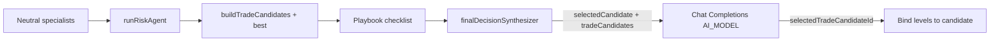
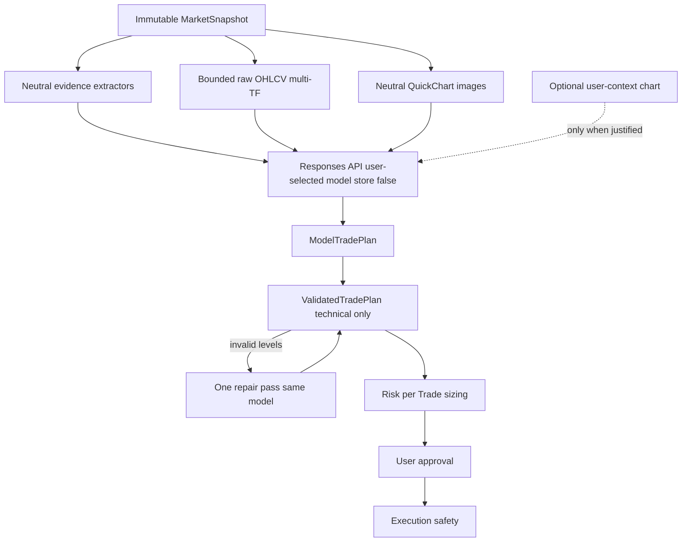

# Model-First Live Market Intelligence — Revised Plan

**Status:** Planning only. No coding, branch, PR, migration, or deploy until explicit approval.

**Delivery:** One isolated branch from `origin/main` with sequenced milestones; merge/deploy only when critical release gates are green.

**Safety invariants preserved:** authentication, tenant isolation, subscription, execution approval, order validation, MT5/EA safety, market-data freshness, broker reconciliation, idempotency, connection integrity.

---

## Explicit answers (before implementation)

| Question | Answer |
|----------|--------|
| Are the previously proposed five IDs (`gpt-5.6-sol` / `terra` / `luna` / `gpt-5.5` / `gpt-5.5-pro`) verified? | **Assumptions only.** Not confirmed API IDs. Do not hardcode or invent them. |
| How will the real five approved models be selected? | `GET /v1/models` under production key ∩ AiChart allowlist ∩ **capability probes** → up to five general-purpose trading-eligible models. Exact IDs recorded in the final report before selector finalization. |
| How will supported reasoning values be discovered? | Per-model capability probe + registry field `supportedReasoningValues`. Selector shows only those values. |
| Will High remain the default only when supported? | **Yes.** Preferred default when supported; never silently downgrade High→Low/Medium. |
| Will every trading Responses request use `store: false`? | **Yes**, unless a separately approved retention policy says otherwise (default: always false). Contract-tested. |
| Does `runRiskAgent` currently retain analytical authority? | **Yes, indirectly:** builds candidates, sets `selectedCandidate = best`, runs playbook/checklist, feeds preferred levels into the model. Direction is not rewritten to WAIT in code, but **anchoring is analytical authority**. |
| Which Risk responsibilities are removed / retained / moved? | See [runRiskAgent decomposition](#runriskagent-decomposition). |
| Will any candidate information still reach the model before its decision? | **No** on the live path after cutover. History/replay may still *read* old candidate metadata for display only. |
| Historical candidate records? | Retain for replay/statistics/deep links; new recs do not store candidate authority. |
| Neutral vs user-context images? | Neutral = QuickChart from snapshot, no overlays. User-context = separate labeled image only when drawings/annotations are required. |
| Old recommendation overlays excluded? | Neutral capture path passes empty overlays / no prior BUY-SELL drawings. |
| Visible TV unchanged? | Never change symbol/interval/viewport/drawings for capture; no MT5 for neutral decision images. |
| Platform TF chart-bound? | Primary = user chart; context TFs evidence only. |
| MCP host authority? | Host model decides; platform selector does not replace it; open requests may scan without candidate engines. |
| Critical evidence before coding / merge / deploy? | See [Release gates](#release-gates). |

---

## Verified vs unverified assumptions

**Verified in repo audit**

- Candidate-first path: `buildTradeCandidates` → `runRiskAgent` → `buildModelContext` sends `selectedCandidate` / `tradeCandidates` / `rejectedCandidateReasons`; `applyModelDecision` binds levels by `selectedTradeCandidateId` ([`finalDecisionSynthesizer.ts`](web/src/lib/agent/agents/finalDecisionSynthesizer.ts), [`riskAgent.ts`](web/src/lib/agent/agents/riskAgent.ts)).
- Raw candles excluded from final model JSON.
- GPT-5/o-series forced `reasoning_effort: "low"` in [`openaiCompat.ts`](web/src/lib/openaiCompat.ts).
- Single admin `AI_MODEL` via [`llm.ts`](web/src/lib/llm.ts); Chat Completions only; no Responses API.
- Trading path is text-only; offscreen PNG = QuickChart in [`chartSnapshot.ts`](web/src/lib/chartSnapshot.ts); MT5 preferred on some routes when EA online (must not use for neutral decision Vision).
- Composer attach: [`AgentChatInput.tsx`](web/src/components/agent/AgentChatInput.tsx).

**Unverified / must not ship as fact**

- Exact five model API IDs named in earlier drafts.
- That every model supports High/Medium/Low.
- That QuickChart alone is sufficient when the user refers to visible drawings (needs optional user-context capture).

---

## Current authority (as-is)

---

## Target architecture (to-be)

**No analytical Risk Agent between neutral evidence and the model.**

---

## Model registry and discovery

Do **not** hardcode or invent OpenAI model identifiers.

**Process**

1. Read official models available to the configured production API key (`GET /v1/models` or equivalent).
2. Intersect with a canonical AiChart server-side allowlist (reviewed general-purpose models only).
3. Run a bounded capability probe per candidate.
4. Include in the user selector only after probes pass.
5. Record exact verified API ID, display name, capabilities, availability.
6. Reject arbitrary browser-supplied model IDs; never expose the full unrestricted provider catalogue.
7. Never silently substitute models during a trading decision.

**Exclude:** audio-only, image-gen, embeddings, moderation, transcription, deprecated, specialist-unsuitable models.

**Release gate:** exact production model IDs reported before the user selector is finalized. Expose **up to five** approved available general-purpose models that meet trading requirements — IDs unknown until verification.

### Registry entry (server)

- API model ID, display name, availability, enabled/disabled
- Responses / Vision / Structured Outputs / reasoning / streaming / tools
- `supportedReasoningValues[]`
- context constraints, deprecation, cost tier (safe internal)
- `eligibleAsDefault`, `lastVerifiedAt`

Browser receives a **safe projection** only (no credentials, raw probe errors, pricing secrets).

Future model releases = edit/approve one registry, not many UI files. Do not auto-expose every new provider model.

### Capability probes (required for trading eligibility)

Each proposed model must prove: Responses API, text + multi-image, Structured Outputs (or approved schema path), reasoning behavior suitable for trading, supported reasoning values, sufficient context for multi-TF candles+images, streaming or approved response behavior, cancellation/timeouts.

### Default model policy (capability-based)

Highest-priority approved model that is available, Responses+Vision+Structured, supports preferred High reasoning, suitable latency/cost for normal paid use, not deprecated, not high-cost opt-in. **Pro / expensive models are never automatic default** without explicit product policy.

If saved user model unavailable: stop before provider call; explain; show alternatives; require explicit selection. No silent switch mid-request.

---

## Reasoning capability mapping

- Options derived from registry, not a fixed High/Medium/Low for every model.
- Show only supported values; High preferred default when supported.
- Only High supported → show fixed High (no fake Medium/Low).
- No adjustable reasoning → hide/disable selector with natural copy.
- Never send unsupported values; never silently downgrade High.
- Server validates every request against registry + model.
- Trading decision, chart analysis, repair pass = user-selected supported effort.
- Auxiliary tasks (titles, hooks, UI wording) may use lower internal effort **only** when explicitly separated from the trading call.
- **Remove** global forced-low in [`reasoningBody`](web/src/lib/openaiCompat.ts) from the canonical trading path. Test: High trading request reaches upstream as High when supported.

---

## Responses API adapter

One canonical server adapter (e.g. `web/src/lib/openaiResponses.ts`):

- text + multiple images; Structured Outputs; reasoning effort; streaming; cancel; total/first-token timeouts; image limits; usage; normalized errors
- **`store: false`** on all canonical trading / repair / Vision analysis requests (contract-tested)
- safe retry; **no silent model substitution**
- Prefer in-request image inputs; no permanent OpenAI file uploads unless unavoidable and approved
- Temporary local captures expire/delete per retention policy; never log base64, full private prompts, or API keys

Caller inventory: migrate trading-decision path first; keep Chat Completions only for proven non-trading callers until dependency-proof deletion.

AiChart DB remains authoritative for conversations, recommendations, runs, images, plans — not OpenAI-hosted response state.

---

## runRiskAgent decomposition

**Audit completely** in Milestone 0. After cutover, no pre-decision component (Risk Agent, playbook, checklist, quality gate) may recommend/reject direction, prioritize BUY/SELL, convert to WAIT, score setups for the model, provide preferred entry/SL/TP, or expose analytical pass/fail to the model.

| Responsibility (current) | Classification |
|--------------------------|----------------|
| Call structure/liquidity/S&D/MTF/news assembly | Split: keep **neutral evidence extractors** only |
| `buildTradeCandidates` / `best` / ranking | **Analytical authority — remove from live path** |
| `selectedCandidate` hint to model | **Remove** |
| Playbook checklist statuses to model | **Remove** (or convert to unlabeled neutral facts without pass/fail anchoring) |
| `validateTradeSetup` pre-model | **Move** to post-decision `ValidatedTradePlan` |
| Spread / account annotations that veto direction | **Remove** as veto; keep as neutral facts if objective |
| Execution authorization | **Preserve** post-decision / execution path |
| Historical recommendation enrichment | **Historical compatibility** |

Rename/split so remaining modules have unambiguous names (e.g. `buildNeutralMarketEvidence`, `validateTradePlanTechnically`). No hidden replacement candidate engine.

---

## Candidate migration strategy

**A — Remove from live decision authority immediately (cutover M4)**

- Candidate generation on live analytical request
- `selectedCandidate` / `tradeCandidates` / rejected directional reasons in model input
- `selectedTradeCandidateId` output
- Candidate-based binding of new recommendation levels

**B — Retain temporarily**

- Historical replay, old records, reporting, legacy display, migrations, compatibility tests

**C — Delete only after dependency proof**

- Unused builders, abandoned scores, dead ranking helpers, obsolete candidate-only tests

Do **not** delete [`buildTradeCandidates.ts`](web/src/lib/agent/trading/buildTradeCandidates.ts) in the first commit. Stop it from the live decision path first.

New recommendations must not depend on legacy candidate IDs; old records remain viewable.

---

## Vision: two sources

### 1. Neutral decision charts

- From immutable numeric snapshot via QuickChart / equivalent offscreen
- Candles, scales, approved neutral indicators; labeled symbol/TF/timestamps
- **No** prior recommendation lines, BUY/SELL labels, candidate IDs/scores, directional agent drawings, debug overlays
- Call buffers **directly** — never routes that prefer MT5 when EA online
- Never manipulate visible TradingView for multi-TF screenshots

### 2. User-context chart

- Only when request depends on user drawings, selected objects, visible annotations, or reviewing a specific recommendation
- Labeled **User-annotated chart context** — not verified market truth
- Visible TV capture only when user-specific annotations are genuinely required; do not change user symbol/TF/viewport/drawings for context TFs
- Numeric OHLCV + quotes remain source of truth for exact prices

`response_mode: "vision"` today is a prompt label only — do not rely on it.

---

## Platform vs MCP timeframe behavior

**Platform (chart-bound)**

- User-selected symbol + timeframe = primary execution TF
- Context TFs evidence only; Vision must not change visible chart
- Recommendation labeled with true selected TF
- Scope: `timeframeSelectionSource = user_selected_chart`

**MCP (opportunity-discovery)**

- Explicit symbol/TF constraints obeyed
- “Analyze the current chart” → chart context when available
- Open “best opportunity” → staged numeric screen (no BUY/SELL) → bounded Vision shortlist → **host model** decides
- Platform OpenAI selector does **not** replace Claude/ChatGPT/Cursor/etc.

---

## Model-first output + technical validation

Model generates: decision, activation (immediate/conditional/none), thesis, entry zone, preferred entry, invalidation, SL, TP1/TP2/(optional TP3), confirmation, path, alternative, confidence, timestamps, TF usage lists.

Validator checks only technical facts (precision, geometry side, freshness, broker min distance, market availability, sizing inputs, ownership, auth, duplicates, idempotency, connection). **Never** decides bullish/bearish, strategy win, or WAIT.

Repair: preserve direction → one bounded same-model pass with neutral technical errors → revalidate → if still invalid, keep opinion, withhold executable levels. No replacement candidate levels.

Risk per Trade: sizing only after valid SL.

---

## Milestone sequence (revised)

### M0 — Authority and dependency audit

Map candidates, `runRiskAgent`, every LLM caller, model config authorities, chart-capture paths, historical compatibility, recommendation persistence/replay. Produce deletion / retention / migration decisions. **No production behavior change.**

### M1 — Model registry + Responses foundation

Verified registry, capability probes, reasoning maps, Responses adapter with `store: false`, safe diagnostics. **No production cutover.**

### M2 — Immutable snapshot + neutral Vision

Raw candle envelopes, snapshot IDs/timestamps, clean multi-TF offscreen images, optional user-context chart, skew/freshness. Candidate path still live until M4.

### M3 — Model-first shadow comparison

Run new path in shadow; do not affect user decisions or execution; compare against candidate-first; record latency/schema/validator. No execution from shadow.

### M4 — Model-first production cutover

Strip candidate fields from live model I/O; stop candidate binding for new recs; disable analytical authority in Risk path; `ValidatedTradePlan` + one repair pass; preserve history.

### M5 — Composer controls + admin migration

User model selector + capability-dependent reasoning selector; account persistence; admin = API key + availability refresh + probe diagnostics only; deprecate `AI_MODEL` as competing authority (seed/fallback then remove). MCP host separation verified.

### M6 — Full validation, PR, merge, VPS

All tests + production-key verification + Vision + PG/Redis + browser; merge when gates green; deploy exact merge commit; healthz commit match; final report.

---

## Database and configuration migrations

- User prefs: preferred model ID + preferred reasoning effort (tenant-scoped, validated).
- Optional conversation metadata overrides if architecture safely allows.
- Migrate `AI_MODEL` once as seed/fallback/rollback; then remove as runtime authority.
- Admin UI: remove per-user model picker; keep encrypted key + refresh + probe status.
- Recommendation persistence: store model plan + validation/execution readiness; no new candidate-authority fields; keep reading old candidate metadata for history.

---

## Tests (additions beyond prior plan)

- Model discovery / probes / reject arbitrary IDs / no silent substitution
- Reasoning model-dependent; High upstream when selected; no global forced-low; no silent downgrade
- Privacy: `store: false`; no base64/keys/full prompts in logs; capture TTL
- Authority: no Risk/playbook/checklist/candidate fields in pre-decision model input; validator cannot flip or reverse direction
- Vision: neutral clean; user-context only when justified; TV unchanged; blank/stale rejected
- Compatibility: history/replay/statistics; new recs without candidate authority
- Platform TF binding; MCP scope + host-model separation
- Shadow harness then cutover regression

---

## Release gates (mandatory)

- Exact production-available model IDs verified + probes passed + reasoning mapped
- Responses contract + `store: false` verified
- Candidate fields absent from live decision input; hidden Risk analytical authority absent
- Raw candles + multi-TF Vision present; visible chart unchanged
- Validator cannot alter direction; one repair pass works
- Historical replay compatible; auth/subscription intact; key never exposed
- User selector verified in real browser; MCP host separation verified
- No critical test skipped

Do not merge or deploy while any critical gate is unproven.

---

## Rollback strategy

- Record base `origin/main` SHA before branch work.
- Feature flags / shadow mode (M3) allow abort before M4 cutover.
- Keep Chat Completions + candidate path code until M4 dependency-proof; M4 cutover behind ability to revert commit.
- Preserve env, DB, secrets, TradingView assets on VPS; deploy only exact merge commit.
- If post-deploy failure: redeploy previous known-good commit; `AI_MODEL` seed retained until M5 complete for emergency read-only understanding (not dual authority after M5).

---

## Production validation

- Verify models under **production** key (not only local).
- One bounded multi-TF Vision analysis; confirm TV state unchanged.
- Composer model + reasoning persistence; High reaches API when supported.
- Execution safeguards still block unsafe orders.
- `/api/healthz` (and MCP health) report exact deployed commit.

---

## Final report must additionally include

1. Exact verified model IDs under production key  
2. Probe pass/fail per model  
3. Supported reasoning values per model  
4. Actual default policy  
5. Proof High used where supported; unsupported never sent  
6. Proof `store: false`  
7. Temporary chart retention behavior  
8. Full `runRiskAgent` authority audit  
9. Candidate components retained vs removed from live  
10. Neutral vs user-context Vision sources + overlay exclusion proof  
11. MCP host-model separation proof  
12. Platform preference does not change MCP behavior  

Plus prior §38 confirmation bullets.

---

## Remaining risks

- Production account may expose fewer than five Vision-capable models → selector shows only what passes probes.
- QuickChart fidelity vs TradingView visuals for structure recognition — mitigate with raw OHLCV as price truth + optional user-context image.
- Shadow comparison (M3) may show large decision divergence — expected; do not force agreement.
- Latency/cost increase from High reasoning + multi-image — measure; do not force Low on trading path.
- Incomplete Risk Agent rename could leave a hidden veto — M0/M4 tests must prove absence in model input.

---

## Explicit non-goals

- Hardcoding unverified model IDs
- Showing fake High/Medium/Low for every model
- Immediate deletion of all candidate files in M0/M1
- Weakening execution/auth/tenant safety
- Using OpenAI-hosted response storage as AiChart’s store of record
- Replacing MCP host models with the platform OpenAI selector
