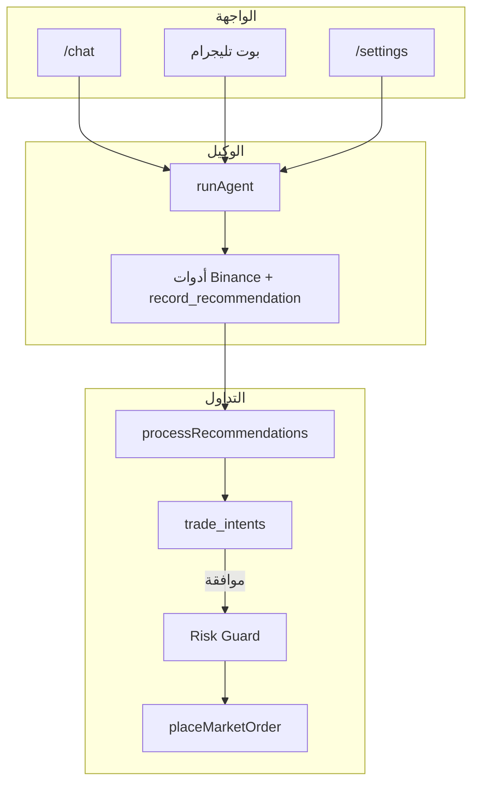

# AiChart — دليل المشروع الكامل

> هذا المستند مبني على **الملفات الفعلية** في المستودع (`web/src`, `web/package.json`, `infra/`, `docs/PLAN.md`) وليس على افتراضات خارج الكود.

---

## 1. ما هو AiChart؟

منصة تداول ذكية متعددة المستخدمين على **Binance Spot (أزواج USDT)**. كل مستخدم يتحدث مع **وكيل خبير** (Claude عبر Anthropic API) يحلّل السوق ويسجّل توصيات، ويمكن—حسب الإعدادات والصلاحيات—تحويل التوصيات إلى **صفقات** عبر Binance مع طبقة **Risk Guard** ثابتة في الكود.

الوصف الرسمي المختصر موجود في [`README.md`](../README.md) وخطة المراحل في [`docs/PLAN.md`](PLAN.md).

---

## 2. لغات البرمجة والتقنيات

### لغات البرمجة (من امتدادات الملفات و`package.json`)

| اللغة | الاستخدام في المشروع |
|--------|----------------------|
| **TypeScript** | التطبيق بالكامل: الواجهة، API، الوكيل، التنفيذ، تليجرام |
| **JavaScript (ESM)** | سكربتات النشر والهجرة: `web/scripts/*.mjs` |
| **SQL** | مخطط PostgreSQL/SQLite: `web/src/lib/db/pg.ts`, `web/scripts/pg-schema.sql` |
| **Bash** | نشر VPS: `infra/deploy-vps.sh` |
| **CSS** | `web/src/app/globals.css` + Tailwind |
| **Python** | اختبارات TestSprite فقط (`web/testsprite_tests/*.py`) — ليست جزءاً من التطبيق |

### إطار العمل والمكتبات الرئيسية (`web/package.json`)

| التقنية | الإصدار / الدور |
|---------|------------------|
| **Next.js** | 16.2.7 — App Router، صفحات Server/Client، API Routes |
| **React** | 19.2.4 — واجهة المستخدم |
| **TypeScript** | 5.x |
| **Tailwind CSS** | v4 — التنسيق |
| **PostgreSQL** | `pg` — الإنتاج عند وجود `DATABASE_URL` |
| **SQLite** | `better-sqlite3` — التطوير المحلي بدون `DATABASE_URL` |
| **Anthropic Claude** | عميل مخصص `web/src/lib/anthropic.ts` |
| **Binance** | REST API + `@binance/binance-cli` (قراءة فقط اختيارية) |
| **Telegram Bot API** | `web/src/lib/telegram.ts` |
| **Lightweight Charts** | شارت الشموع |
| **Zod** | التحقق من مدخلات API |
| **jose** | JWT للجلسات |
| **bcryptjs** | تجزئة كلمات المرور |
| **Zustand** | حالة المحادثة في الواجهة |

### اختيار قاعدة البيانات (`web/src/lib/db/index.ts`)

- إذا وُجد `DATABASE_URL` → **PostgreSQL**
- وإلا → **SQLite** عند المسار `DB_PATH` (افتراضي `data/aichart.db`)

---

## 3. هيكل المجلدات

```
AiChart/
├── docs/                    # توثيق (PLAN.md، هذا الملف)
├── infra/                   # PM2، Docker، deploy-vps.sh
└── web/                     # التطبيق الرئيسي
    ├── src/
    │   ├── app/             # صفحات Next.js + API
    │   ├── components/      # واجهات React
    │   ├── hooks/           # React hooks
    │   ├── lib/             # منطق الأعمال (وكيل، تنفيذ، DB…)
    │   └── stores/          # Zustand (محادثة)
    ├── scripts/             # نشر، هجرة PG، SSH
    └── public/              # أصول ثابتة
```

---

## 4. أقسام التطبيق والتنقل

### التبويبات الرئيسية (`web/src/components/AppShell.tsx`)

| القسم | المسار | الأيقونة |
|-------|--------|----------|
| المحادثة | `/chat` | MessageSquare |
| اللوحة | `/dashboard` | LayoutDashboard |
| الإشارات | `/signals/new` | TrendingUp |

### روابط إضافية

| القسم | المسار | المصدر |
|-------|--------|--------|
| الإعدادات | `/settings` | AppShell + MobileDrawer |
| الخطة / الرصيد | `/plan` | MobileDrawer |
| الأدمن | `/admin` | للمستخدمين `role === "admin"` |
| السوق / الشارت | `/market` | (غير في الشريط السفلي؛ صفحة مستقلة) |
| الصفقات | `/trades` | صفحة مستقلة |
| الإعداد الأولي | `/onboarding` | يُفرض قبل اللوحة للمستخدم العادي |

---

## 5. الصفحات (واجهة المستخدم)

كل صفحة في `web/src/app/**/page.tsx`:

| الصفحة | المسار | الوظيفة (من الكود) |
|--------|--------|---------------------|
| الرئيسية | `/` | `HomeHero` — صفحة هبوط |
| تسجيل الدخول | `/login` | `AuthForm` + زر تليجرام `TelegramLoginButton` |
| التسجيل | `/register` | إنشاء حساب |
| المحادثة | `/chat` | `ChatPageClient` / `ChatSquareClient` — دردشة الوكيل مع بث SSE |
| اللوحة | `/dashboard` | `DashboardClient` — ملخص الحساب؛ يتطلب `onboarding_done` |
| الإعداد الأولي | `/onboarding` | `OnboardingClient` — 4 خطوات: مستوى، Binance، إعدادات، تليجرام |
| الإعدادات | `/settings` | `SettingsClient` — تداول، Binance، تليجرام، مظهر |
| السوق | `/market` | `MarketClient` — شارت حي + بحث أزواج من Binance |
| إشارة جديدة | `/signals/new` | `SignalsWizardClient` — معالج 4 خطوات لتوليد خطة |
| الإشارات | `/signals` | قائمة/توجيه |
| الصفقات | `/trades` | سجل الصفقات والنوايا |
| الخطة | `/plan` | معلومات الرصيد/الحصة |
| **الأدمن** | | |
| نظرة عامة | `/admin` | `AdminOverview` — إحصائيات + Kill Switch عام |
| المستخدمون | `/admin/users` | إدارة المستخدمين |
| الحدود | `/admin/limits` | حدود التنفيذ والحصص لكل مستخدم |
| المفاتيح | `/admin/keys` | `platform_config` — مفاتيح API، تليجرام، Claude |
| الأمان | `/admin/security` | إعدادات أمنية |
| النظام | `/admin/system` | صحة النظام |
| الاستخدام | `/admin/usage` | استهلاك Claude |

---

## 6. واجهات API (`web/src/app/api/**/route.ts`)

### المصادقة

| المسار | الملف | الوظيفة |
|--------|-------|---------|
| `POST /api/auth/login` | `auth/login/route.ts` | دخول بالبريد/كلمة المرور |
| `POST /api/auth/register` | `auth/register/route.ts` | تسجيل |
| `POST /api/auth/logout` | `auth/logout/route.ts` | خروج |
| `POST /api/auth/telegram` | `auth/telegram/route.ts` | دخول/ربط عبر Telegram Login Widget |

### المحادثة والوكيل

| المسار | الوظيفة |
|--------|---------|
| `POST /api/chat` | تشغيل الوكيل (JSON أو SSE `stream: true`) — `chat/route.ts` |
| `GET /api/chat/status` | حالة تفعيل Claude |
| `GET/POST /api/conversations` | قائمة/إنشاء محادثات |
| `GET/DELETE /api/conversations/[id]` | محادثة واحدة |

### التداول والسوق

| المسار | الوظيفة |
|--------|---------|
| `GET /api/instruments` | أزواج USDT من Binance (`binanceSymbols.ts`) |
| `GET /api/market/klines` | شموع للشارت |
| `GET /api/recommendations` | توصيات المستخدم |
| `GET/POST /api/trades` | الصفقات |
| `GET /api/trades/intents` | نوايا التنفيذ |
| `PATCH /api/trades/intents/[id]` | موافقة/رفض من الويب |

### الإعدادات والحساب

| المسار | الوظيفة |
|--------|---------|
| `GET/PUT /api/settings` | `trading_settings` + `admin_limits` |
| `GET/POST /api/onboarding` | خطوات الإعداد الأولي |
| `GET /api/me` | المستخدم + الرصيد اليومي |
| `POST /api/binance/connect` | ربط مفاتيح Binance (مشفّرة) |
| `GET /api/binance/status` | حالة الربط |

### تليجرام

| المسار | الوظيفة |
|--------|---------|
| `POST /api/telegram/link` | رمز ربط الحساب |
| `POST /api/telegram/setup` | تحرير البوت لوكيل OpenClaw (إزالة الـ webhook) |

> محادثة البوت يديرها وكيل OpenClaw (انظر `agent/README.md`) — لا webhook في web.

### المهام المجدولة (Cron)

| المسار | الوظيفة |
|--------|---------|
| `POST /api/cron/daily-summary` | ملخص يومي لتليجرام (احتياطي — الوكيل يرسل ملخصه بنفسه) |

> المراقبة 24/7 انتقلت إلى heartbeat وكيل OpenClaw عبر `/api/agent/*`.

يُحمى Cron بـ `CRON_SECRET` (`web/src/lib/cronAuth.ts`).

### الأدمن

| المسار | الوظيفة |
|--------|---------|
| `/api/admin/users`, `/api/admin/limits`, `/api/admin/config`, `/api/admin/kill-switch`, `/api/admin/stats`, `/api/admin/usage`, `/api/admin/health` |

---

## 7. الإعدادات

### 7.1 إعدادات المستخدم — `trading_settings` (`web/src/lib/types.ts`, مخطط `pg.ts`)

| الحقل | القيم | المعنى |
|-------|-------|--------|
| `mode` | `advisory` \| `auto` | توصيات فقط vs تنفيذ تلقائي |
| `approval` | `manual` \| `delegate` | موافقة يدوية vs تفويض للوكيل |
| `experience` | `beginner` \| `expert` | أسلوب شرح الوكيل |
| `style` | `conservative` \| `balanced` \| `aggressive` | حساسية المراقبة 24/7 |
| `max_capital` | رقم | سقف رأس المال (USDT) |
| `per_trade_pct` | % | حجم كل صفقة من رأس المال |
| `max_open_trades` | عدد | أقصى صفقات مفتوحة |
| `daily_profit_target_pct` | % | إيقاف بعد هدف ربح يومي |
| `daily_loss_limit_pct` | % | إيقاف بعد خسارة يومية |
| `monthly_loss_limit_pct` | % | حد خسارة شهري |
| `allowed_assets` | JSON | `[]` = **جميع أزواج USDT** (مفتوح)؛ أو قائمة مثل `["BTCUSDT","SOLUSDT"]` — انظر `allowedAssets.ts` |
| `send_screenshot` | 0/1 | إرفاق شارت في تليجرام |
| `telegram_chat_id` | نص | معرّف دردشة تليجرام |
| `kill_switch` | 0/1 | إيقاف طارئ شخصي |
| `onboarding_done` | 0/1 | اكتمال الإعداد الأولي |

تُعدَّل من الواجهة عبر `SettingsClient.tsx` و`PUT /api/settings`.

### 7.2 حدود الأدمن — `admin_limits`

| الحقل | المعنى |
|-------|--------|
| `can_execute` | السماح بوضع `auto` والتنفيذ |
| `max_capital_cap` | سقف إداري لرأس المال |
| `max_open_trades_cap` | سقف الصفقات المفتوحة |
| `claude_quota` | حصة استدعاءات الوكيل يومياً (`claude_usage`) |

### 7.3 إعدادات المنصة — `platform_config` (لوحة `/admin/keys`)

تُقرأ عبر `platformConfig.ts`، منها على الأقل:

- `ANTHROPIC_API_KEY`, `ANTHROPIC_MODEL`
- `TELEGRAM_BOT_TOKEN`, `TELEGRAM_BOT_USERNAME`, `TELEGRAM_WEBHOOK_SECRET`
- `APP_URL`

### 7.4 متغيرات البيئة (`.env.example`)

`ENCRYPTION_KEY`, `APP_SECRET`, `ADMIN_EMAIL`, `ADMIN_PASSWORD`, `DATABASE_URL`, `DB_PATH`, `CRON_SECRET`, `ENABLE_BINANCE_CLI`, إلخ.

---

## 8. الوكيل (Expert Agent)

### 8.1 الملفات الأساسية

| الملف | الدور |
|-------|------|
| `lib/agent.ts` | حلقة الأدوات (tool-use loop) مع Claude |
| `lib/persona.ts` | System prompt بالعربية |
| `lib/userContext.ts` | سياق المستخدم الحقيقي من DB |
| `lib/anthropic.ts` | استدعاء Messages API |
| `lib/agentActivity.ts` | أحداث النشاط للواجهة |

### 8.2 كيف يعمل (من `runAgent` في `agent.ts`)

```
المستخدم يرسل رسالة
    ↓
بناء system prompt (persona + إعدادات + سياق حساب)
    ↓
حلقة حتى 6 خطوات (MAX_STEPS):
    Claude يرد → قد يطلب أدوات (tool_use)
    ↓
    تنفيذ الأداة (executeTool) → إرجاع tool_result
    ↓
    تكرار حتى stop_reason ≠ tool_use
    ↓
رد نهائي + قائمة recommendations المسجّلة
```

### 8.3 أدوات الوكيل (`TOOLS` في `agent.ts`)

| الأداة | الوظيفة |
|--------|---------|
| `resolve_symbol` | تحويل BTC → BTCUSDT |
| `get_market_snapshot` | RSI, MACD, SMA, اتجاه — Binance |
| `get_price` | سعر لحظي |
| `get_user_profile` | ملف المستخدم |
| `get_trades_summary` | صفقات ونوايا معلّقة |
| `get_recommendations_history` | آخر توصيات |
| `get_account_balances` | أرصدة Binance |
| `smart_money_signals` | Binance Web3 |
| `crypto_market_rank` | ترتيب/زخم السوق Web3 |
| `binance_cli` | (اختياري) قراءة موسّعة — `ENABLE_BINANCE_CLI=1` |
| **`record_recommendation`** | تسجيل توصية buy/sell/wait في DB |

الوكيل **لا ينفّذ صفقات مباشرة** — التعليمات في `persona.ts` تقصر التنفيذ على `record_recommendation` فقط.

### 8.4 مسارات تشغيل الوكيل

| المسار | الملف | ملاحظات |
|--------|-------|---------|
| محادثة الويب | `api/chat/route.ts` | دعم صورة + SSE؛ `processRecommendations` بعد الرد |
| تليجرام | وكيل OpenClaw | عبر Bridge API `/api/agent/*` (انظر `agent/`) |
| إشارة معالج | `api/signals/generate/route.ts` | تكلفة 5 من الحصة |
| مراقبة 24/7 | heartbeat وكيل OpenClaw | مسح رخيص عبر `/api/agent/market/scan` |

### 8.5 الحصة والاستخدام

- كل استدعاء ناجح يزيد `claude_usage` عبر `incrementUsage` (`store.ts`)
- يُرفض الطلب إذا `used >= claude_quota` (`wouldExceedQuota`)

---

## 9. كيف يحلّل الوكيل؟

1. **نص المستخدم** يمر عبر `sanitizeUserInput` (`security.ts`) ضد حقن التعليمات.
2. **صورة شارت** (ويب أو تليجرام): `validateChatImage` ثم تُرسل كـ base64 لـ Claude (`chatImage.ts`).
3. الوكيل يستدعي **`get_market_snapshot`** و/أو **`resolve_symbol`** قبل الرأي (`persona.ts`: «استخدم الأدوات قبل أي رأي فني»).
4. عند قرار واضح يستدعي **`record_recommendation`** مع:
   - `symbol`, `action`, `confidence`, `entry`, `stop_loss`, `take_profit`, `timeframe`
   - `rationale` + `factors` (3+ عوامل بأرقام)
5. **`attachChartToRecommendation`** (`recommendationChart.ts`) يبني URL شارت ويحفظه؛ في وضع `advisory` قد يُرسل إشعار تليجرام (ما لم تكن جلسة تليجرام — `telegramSession` في `agent.ts`).

### المراقبة الرخيصة بدون LLM (`monitor.ts`)

قبل استدعاء Claude في الـ cron:

- `scanSymbol` يبني `MarketSnapshot` ويحسب نقاط RSI/MACD/اتجاه/تغيّر 24س
- `scoreOpportunity` يُرجع مرشحاً فقط إذا تجاوزت النقاط عتبة `style` المستخدم

---

## 10. كيف تُؤخذ الصفقات؟

### 10.1 من التوصية إلى النية — `tradeFlow.ts`

```
record_recommendation → Recommendation في DB
    ↓
processRecommendations(userId, recommendations)
```

شروط إنشاء **trade intent** (`trade_intents`):

1. `limits.can_execute === 1` (موافقة الأدمن)
2. إما `mode === "auto"` أو `allowAdvisoryApproval` (مسار تليجرام فقط)
3. `action` = `buy` أو `sell` (ليس `wait`)

حجم الصفقة: `(effectiveCapital × per_trade_pct) / 100`

### 10.2 مسار الموافقة

| الوضع | السلوك |
|-------|--------|
| `auto` + `delegate` | intent بحالة `approved` → `executeIntent` فوراً |
| `auto` + `manual` أو تليجرام | intent `pending` + أزرار ✅/❌ في تليجرام |
| `advisory` + تليجرام | نفس أزرار الموافقة (`allowAdvisoryApproval: true`) |

### 10.3 التنفيذ — `execution.ts`

```
executeIntent(userId, intentId)
    ↓
evaluateTrade (riskGuard.ts) — بوابة إلزامية
    ↓
getBinanceCredentials (مفاتيح مفكوكة التشفير)
    ↓
getPrice + getSymbolFilters + placeMarketOrder
    ↓
recordTrade + updateIntentStatus → executed/failed
    ↓
notifyTradeResult (تليجرام)
```

### 10.4 Risk Guard (`riskGuard.ts`) — يمنع التنفيذ إذا:

- Kill Switch عام (`system_flags`) أو شخصي (`kill_switch`)
- لا صلاحية تنفيذ (`can_execute`)
- وضع `advisory` بدون موافقة صريحة (`explicitApproval` من تليجرام)
- الزوج خارج القائمة المخصّصة (عند عدم تفعيل السياسة المفتوحة — `allowedAssets.ts`)
- تجاوز رأس المال أو حجم الصفقة أو الصفقات المفتوحة
- بلغ حد الخسارة/الربح اليومي

---

## 11. بوت تليجرام

### 11.1 الملفات

| الملف | الدور |
|-------|------|
| `lib/telegram.ts` | إشعارات صادرة فقط (رسائل/صور/بطاقات) |
| `api/telegram/link/route.ts` | ربط الحساب |
| `lib/telegramAuth.ts` | التحقق من Telegram Login |
| وكيل OpenClaw (`agent/`) | محادثة البوت، الموافقات، الأوامر |

### 11.2 ربط الحساب

1. المستخدم يسجّل الدخول من الموقع (`TelegramLoginButton` + `/api/auth/telegram`)
2. أو يفتح `/start <code>` في البوت (`consumeLinkCode` في webhook)
3. يُحفظ `telegram_chat_id` في `trading_settings`

### 11.3 أنواع الرسائل في Webhook

| النوع | المعالجة |
|-------|----------|
| `/start` | ترحيب + ربط |
| أوامر `/status`, `/positions`, `/pnl`, `/pause`, `/resume`, `/help` | قائمة تفاعلية |
| نص عادي | `runTelegramAgentChat` → تحليل |
| صورة + caption | تحميل الصورة → تحليل شارت |
| `callback_query` | قوائم `menu:*` أو `approve:*` / `reject:*` |

### 11.4 أزرار القائمة (`telegramBotUi.ts`)

- 📊 الحالة · 📈 الصفقات · 💰 ربح اليوم · 🔄 تحديث
- ⏸️ إيقاف / ▶️ استئناف (يعدّل `kill_switch`)
- ◀️ رجوع → القائمة الرئيسية
- ✅ موافقة / ❌ رفض على بطاقة التوصية

### 11.5 الموافقة على صفقة من تليجرام

```
المستخدم يضغط approve:{intentId}
    ↓
updateIntentStatus → approved
    ↓
executeIntent
    ↓
تعديل الرسالة بنتيجة التنفيذ
```

---

## 12. الأزواج المفتوحة (تحديث تلقائي)

من `allowedAssets.ts` + `binanceSymbols.ts`:

- `allowed_assets = []` أو `["*"]` → **جميع أزواج USDT Spot** من Binance
- القائمة تُخزَّن في cache ساعة واحدة ثم تُحدَّث
- المراقبة 24/7 (`resolveAllowedAssets`) تفحص كل الأزواج مع **cooldown 4 ساعات** لكل زوج (`store.ts`: `COOLDOWN_HOURS = 4`)
- صفحة السوق تستخدم `/api/instruments` مع بحث

---

## 13. قاعدة البيانات — الجداول الرئيسية (`pg.ts`)

| الجدول | المحتوى |
|--------|---------|
| `users` | حسابات المستخدمين |
| `binance_accounts` | مفاتيح API مشفّرة |
| `trading_settings` | إعدادات التداول |
| `admin_limits` | حدود الأدمن |
| `recommendations` | توصيات الوكيل |
| `trade_intents` | نوايا تنفيذ |
| `trades` | صفقات منفّذة |
| `claude_usage` | استهلاك يومي |
| `conversations` / `chat_messages` | محادثات الوكيل |
| `scan_cooldowns` | تبريد المراقبة |
| `platform_config` | مفاتيح المنصة |
| `system_flags` | Kill Switch عام، إلخ |
| `audit_log` | سجل أحداث |
| `telegram_link_codes` | رموز ربط |

---

## 14. النشر

| الطريقة | الملف |
|---------|------|
| VPS تلقائي | `infra/deploy-vps.sh` |
| PM2 | `infra/pm2.ecosystem.config.cjs` |
| Docker | `infra/docker-compose.yml` |
| رفع يدوي | `web/scripts/vps-upload.mjs` + `ssh-remote.mjs` |

الإنتاج الحالي: **PostgreSQL** + PM2 `aichart-web` على المنفذ **3010** خلف Nginx.

---

## 15. مخطط تدفق شامل (مختصر)



---

## 16. مراجع ملفات سريعة

| الموضوع | المسار |
|---------|--------|
| تعريف الأنواع | `web/src/lib/types.ts` |
| تخزين البيانات | `web/src/lib/store.ts` |
| محادثات | `web/src/lib/conversations.ts` |
| Binance API | `web/src/lib/binance.ts` |
| إشعار الصفقات | `web/src/lib/notifyTrade.ts` |
| أمان المدخلات | `web/src/lib/security.ts` |
| تشفير الأسرار | `web/src/lib/crypto.ts` |
| ذاكرة post-mortem | `web/src/lib/tradeMemory.ts`, `tradePostMortem.ts` |
| لجنة الوكلاء | `web/src/lib/committee.ts` |
| مركز القيادة | `web/src/app/command/page.tsx` |

---

## 17. القدرات الذكية (Intelligence Suite)

| القدرة | الوصف | VPS |
|--------|--------|-----|
| **Post-mortem + pgvector** | بعد إغلاق كل صفقة يُولَّد درس + embedding في `trade_lessons` | `CREATE EXTENSION IF NOT EXISTS vector;` على PostgreSQL |
| **لجنة الوكلاء** | ثلاث شخصيات LLM قبل التنفيذ؛ veto من RiskOfficer | — |
| **رد صوتي** | `POST /api/agent/notify/voice` + `VOICE_RESPONSES_ENABLED` | OpenAI TTS (`OPENAI_API_KEY`) |
| **مركز القيادة** | `/command` — heatmap، whale bubbles، لجنة، ذاكرة | — |

SQLite محلياً يستخدم `embedding_json` + cosine خطي؛ الإنتاج على PostgreSQL + pgvector.

---

*آخر تحديث للمستند: مبني على شيفرة المستودع المحلي (يشمل Intelligence Suite، وكيل تليجرام، Risk Guard، PostgreSQL).*
