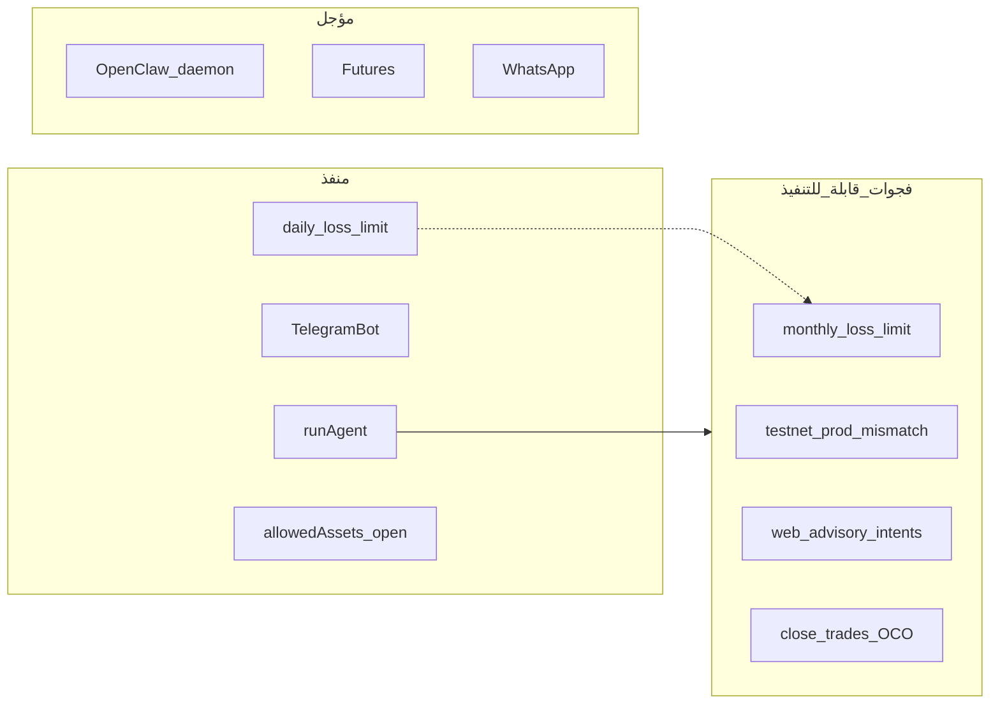

# AiChart — اقتراحات قابلة للتنفيذ

> تحليل فجوات بين **الخطة** ([`PLAN.md`](PLAN.md))، **التوثيق الفعلي** ([`PROJECT_AR.md`](PROJECT_AR.md))، و**الكود** (`web/src/`).  
> آخر مراجعة: 2026-06-09

---

## 1. مصدر هذا المستند

| المصدر | الحالة |
|--------|--------|
| [`Text Document جديد.txt`](../Text%20Document%20جديد.txt) | **فارغ** — لم تُستخرج منه اقتراحات |
| [`docs/PLAN.md`](PLAN.md) | متطلبات ورؤية المشروع |
| [`docs/PROJECT_AR.md`](PROJECT_AR.md) | ما هو مُنفَّذ فعلياً |
| فحص الكود | فجوات بين الإعدادات والسلوك |

إذا حصلت على اقتراحات من ذكاء اصطناعي آخر، ألصقها في [القسم 8 — اقتراحات خارجية](#8-اقتراحات-خارجية-للمراجعة-لاحقاً) أو في الملف النصي ثم أعد طلب المراجعة.

---

## 2. جدول ملخص

| # | الاقتراح | الأولوية | الجهد | الحالة | الملفات الرئيسية |
|---|----------|----------|-------|--------|------------------|
| 1 | تفعيل `monthly_loss_limit_pct` | عالية | صغير | غير مُطبَّق | `riskGuard.ts`, `store.ts` |
| 2 | توحيد بيئة Binance (testnet/prod) | عالية | صغير | خلل محتمل | `execution.ts`, `binance.ts` |
| 3 | خيار الموافقة في الإعدادات | عالية | صغير | UI ناقص | `SettingsClient.tsx` |
| 4 | موافقة صفقات من الويب في advisory | عالية | صغير | تليجرام فقط | `chat/route.ts`, `tradeFlow.ts` |
| 5 | موافقة/رفض داخل المحادثة | متوسطة | متوسط | `/trades` فقط | `ChatSquareClient.tsx` |
| 6 | تنبيه النوايا المعلّقة على اللوحة | متوسطة | صغير | جزئي | `DashboardClient.tsx` |
| 7 | تحديد نطاق المراقبة 24/7 | متوسطة | متوسط | يفحص كل الأزواج | `monitorRunner.ts` |
| 8 | جدولة Cron على VPS | متوسطة | تشغيلي | مثال موجود | `infra/crontab.example` |
| 9 | ربط `/market` بالتنقل | متوسطة | صغير | صفحة منفصلة | `AppShell.tsx` |
| 10 | إغلاق الصفقات + PnL | منخفضة | كبير | فتح فقط | `store.ts`, `execution.ts` |
| 11 | أوامر OCO لـ SL/TP | منخفضة | كبير | market فقط | `binance.ts`, `execution.ts` |
| 12 | Kill Switch يغلق المراكز | منخفضة | كبير | يمنع فتح جديد | `execution.ts`, webhook |
| 13 | حوار المبتدئ الكامل | منخفضة | متوسط | onboarding جزئي | `OnboardingClient.tsx` |
| 14 | إشعارات داخل الموقع | منخفضة | كبير | تليجرام فقط | DB + UI جديد |

**ترتيب التنفيذ المقترح عند البرمجة:** `2 → 1 → 3 → 4` ثم `5–9` ثم `10–14`.

---

## 3. ما هو مُنفَّذ بالفعل (لا يُعاد اقتراحه)

- وكيل Claude مع حلقة أدوات (`web/src/lib/agent.ts`) — 11 أداة بما فيها `record_recommendation`
- Risk Guard: kill switch، حد يومي، أصول مفتوحة من Binance (`allowedAssets.ts`)
- تليجرام: webhook، قائمة، تحليل نص/صورة، موافقة/رفض، زر رجوع
- PostgreSQL في الإنتاج + SQLite محلياً (`web/src/lib/db/index.ts`)
- معالج إشارات `/signals/new`، شارت `/market`، موافقة في `/trades`
- ملخص يومي API: `POST /api/cron/daily-summary`
- مراقبة 24/7: `POST /api/cron/monitor` + `monitorRunner.ts`
- توثيق شامل: [`PROJECT_AR.md`](PROJECT_AR.md)

---

## 4. اقتراحات قابلة للتنفيذ — بالتفصيل

### 4.1 Risk Guard والتنفيذ

#### #1 — تفعيل حد الخسارة الشهري

- **المشكلة:** الحقل `monthly_loss_limit_pct` موجود في `trading_settings` ([`pg.ts`](../web/src/lib/db/pg.ts)، [`types.ts`](../web/src/lib/types.ts)) ويُحفظ من الإعدادات، لكن [`riskGuard.ts`](../web/src/lib/riskGuard.ts) يفحص **الحد اليومي** فقط (`daily_loss_limit_pct`).
- **الحل المقترح:** إضافة `todayRealizedPnlPct` شهري (أو rolling 30 يوم) في `store.ts` وتمريره إلى `evaluateTrade`.
- **الجهد:** صغير (يوم واحد).

#### #2 — توحيد بيئة Binance عند التنفيذ

- **المشكلة:** في [`execution.ts`](../web/src/lib/execution.ts) السطران 141–142 يستدعيان `getPrice(intent.symbol, "prod")` و`getSymbolFilters(intent.symbol, "prod")` بينما `placeMarketOrder` يستخدم `creds.env` (غالباً `testnet`).
- **الخطر:** حساب كمية خاطئة أو رفض أمر على بيئة مختلفة.
- **الحل:** استبدال `"prod"` بـ `creds.env` في كل استدعاءات التسعير والفلاتر.
- **الجهد:** صغير.

#### #10 — دورة حياة الصفقة (إغلاق + PnL)

- **المشكلة:** [`recordTrade`](../web/src/lib/store.ts) يسجّل صفقة `status: open` فقط؛ لا مسار إغلاق واضح في الواجهة أو API.
- **الحل المقترح:** API `POST /api/trades/[id]/close`، تحديث `pnl` و`closed_at`، إشعار تليجرام.
- **الجهد:** كبير.

#### #11 — أوامر OCO لوقف الخسارة والهدف

- **المشكلة:** `stop_loss` و`take_profit` تُخزَّن في التوصية والنية لكن التنفيذ **أمر سوق فقط**.
- **الحل:** بعد الشراء، إرسال OCO أو stop-limit عبر Binance Spot API.
- **الجهد:** كبير (اختلاف قواعد الرموز).

#### #12 — Kill Switch يغلق المراكز المفتوحة

- **المرجع:** PLAN §5.د — خيار إغلاق كل الصفقات.
- **الوضع:** `kill_switch` يمنع صفقات **جديدة** فقط ([`riskGuard.ts`](../web/src/lib/riskGuard.ts)).
- **الجهد:** كبير (يحتاج #10 أولاً).

---

### 4.2 الوكيل والتحليل

#### #4 — موافقة الصفقات من الويب في وضع advisory

- **المشكلة:** [`telegramAgent.ts`](../web/src/lib/telegramAgent.ts) يمرّر `{ allowAdvisoryApproval: true }` إلى `processRecommendations`؛ [`chat/route.ts`](../web/src/app/api/chat/route.ts) لا يفعل ذلك — في `advisory` لا تُنشأ intents من المحادثة.
- **الحل:** نفس الخيار من الويب (أو دائماً عند `can_execute` مع موافقة يدوية).
- **الجهد:** صغير.

#### #13 — حوار المبتدئ الكامل

- **المرجع:** PLAN §4.3 — أسئلة المبلغ والهدف والخسارة ثم اقتراح إعدادات.
- **الوضع:** [`OnboardingClient.tsx`](../web/src/components/OnboardingClient.tsx) يغطي خطوات ثابتة دون حوار وكيل.
- **الجهد:** متوسط.

---

### 4.3 تليجرام

لا فجوات حرجة بعد آخر التحديثات (تحليل، موافقة، قائمة، رجوع). تحسينات مستقبلية مرتبطة بـ #8 (ملخص يومي مجدول) و#12 (إغلاق عند kill switch).

---

### 4.4 الواجهة وUX

#### #3 — خيار الموافقة في الإعدادات

- **المشكلة:** `approval` (`manual` | `delegate`) يُرسل في حفظ [`SettingsClient.tsx`](../web/src/components/SettingsClient.tsx) لكن **لا يوجد حقل في النموذج** — المستخدم يغيّره فقط أثناء [`OnboardingClient.tsx`](../web/src/components/OnboardingClient.tsx).
- **الحل:** إضافة `<select>` مماثل لخطوة الإعداد الأولي.
- **الجهد:** صغير.

#### #5 — أزرار موافقة/رفض داخل المحادثة

- **المرجع:** PLAN §7 — أزرار في الدردشة.
- **الوضع:** الموافقة في [`TradesClient.tsx`](../web/src/components/TradesClient.tsx) و`/api/trades/intents/[id]` فقط.
- **الحل:** بطاقة intent أسفل رد الوكيل مع أزرار عند وجود `intents` في استجابة `/api/chat`.
- **الجهد:** متوسط.

#### #6 — تنبيه النوايا المعلّقة على اللوحة

- **الوضع:** [`userContext.ts`](../web/src/lib/userContext.ts) يذكر العدد للوكيل؛ [`DashboardClient.tsx`](../web/src/components/DashboardClient.tsx) لا يبرزه.
- **الحل:** بطاقة «X صفقات بانتظار موافقتك» مع رابط `/trades`.
- **الجهد:** صغير.

#### #9 — ربط `/market` بالتنقل الرئيسي

- **الوضع:** الصفحة في [`market/page.tsx`](../web/src/app/market/page.tsx) غير مدرجة في [`AppShell.tsx`](../web/src/components/AppShell.tsx) أو [`MobileDrawer.tsx`](../web/src/components/ui/shell/MobileDrawer.tsx).
- **الحل:** تبويب «السوق» أو رابط في القائمة الجانبية.
- **الجهد:** صغير.

#### #14 — إشعارات داخل الموقع

- **المرجع:** PLAN §5.ه — إشعارات الموقع بجانب تليجرام.
- **الحل:** جدول `notifications` + bell في `AppHeader` + polling أو SSE.
- **الجهد:** كبير.

---

### 4.5 المراقبة 24/7 والـ Cron

#### #7 — تحديد نطاق المراقبة عند الأزواج المفتوحة

- **المشكلة:** [`monitorRunner.ts`](../web/src/lib/monitorRunner.ts) يستدعي `resolveAllowedAssets` → كل أزواج USDT من Binance (مئات الرموز) مع cooldown 4 ساعات لكل زوج ([`store.ts`](../web/src/lib/store.ts) `COOLDOWN_HOURS = 4`).
- **الحل المقترح:** عند السياسة المفتوحة، فحص Top 30–50 حسب حجم التداول 24س فقط؛ أو دفعات محدودة لكل دورة cron.
- **الجهد:** متوسط.

#### #8 — جدولة Cron على VPS

- **الوضع:** [`infra/crontab.example`](../infra/crontab.example) يعرّف:
  - `*/15 * * * *` → `POST /api/cron/monitor`
  - `0 20 * * *` → `POST /api/cron/daily-summary`
- **المطلوب:** التحقق من تفعيله على `aichart.lork.cloud` مع `CRON_SECRET` الصحيح.
- **الجهد:** تشغيلي (لا كود إلزامي).

---

### 4.6 البنية والنشر

- النشر الحالي: PM2 `aichart-web` + Nginx — انظر [`infra/deploy-vps.sh`](../infra/deploy-vps.sh).
- تحسين اختياري: سكربت نشر موحّد (git pull + build) بدل رفع ملفات يدوي (`vps-upload.mjs`).

---

## 5. اقتراحات غير قابلة للتنفيذ قريباً

| الاقتراح | السبب | المرجع |
|----------|--------|--------|
| **OpenClaw كـ daemon منفصل** | التنفيذ الفعلي: Claude مدمج في Next.js (`agent.ts`) — ترحيل معماري كبير | PLAN §3 |
| **Binance Futures** | خارج نطاق Spot الحالي | PLAN «ما بعد الإطلاق» |
| **واتساب** | غير مُنفَّذ؛ تليجرام هو القناة الحالية | PLAN §2، §8 |
| **باقات اشتراك آلية** | الأدمن يتحكم يدوياً بكل مستخدم | PLAN §2 |
| **أخبار عاجلة تلقائية** | مذكورة في PLAN §8 بدون كود | — |
| **Monorepo** (`apps/`, `agent/openclaw/`) | الهيكل الحالي `web/` فقط | PLAN §10 |
| **MT4/MT5، فوركس، أسهم** | خارج Binance Spot USDT | PLAN §301 |

---

## 6. مخطط الفجوات

---

## 7. مراحل التنفيذ المقترحة (عند طلب البرمجة)

### المرحلة أ — إصلاحات (أولوية عالية)

1. #2 توحيد بيئة Binance  
2. #1 حد الخسارة الشهري  
3. #3 خيار الموافقة في الإعدادات  
4. #4 موافقة advisory من الويب  

### المرحلة ب — تجربة المستخدم

5. #5 موافقة في المحادثة  
6. #6 تنبيه اللوحة  
7. #7 تحديد نطاق المراقبة  
8. #8 تفعيل Cron على VPS  
9. #9 ربط `/market` بالتنقل  

### المرحلة ج — عمق التداول

10. #10 إغلاق الصفقات  
11. #11 OCO  
12. #12 Kill Switch يغلق الكل  
13. #13 حوار المبتدئ  
14. #14 إشعارات الويب  

---

## 8. اقتراحات خارجية (للمراجعة لاحقاً)

الملف [`Text Document جديد.txt`](../Text%20Document%20جديد.txt) كان **فارغاً** عند إعداد هذا المستند.

عند الحصول على اقتراحات من أدوات ذكاء اصطناعي أخرى:

1. الصقها في الملف النصي أو في الجدول أدناه.
2. اطلب مراجعة جديدة لمطابقتها مع هذا المستند وتحديث الأولويات.

| التاريخ | المصدر | الاقتراح | قرار (قابل / مؤجل / مرفوض) | ملاحظة |
|---------|--------|----------|---------------------------|--------|
| — | — | *(لا اقتراحات خارجية بعد)* | — | — |

---

## 9. مراجع

- [`docs/PLAN.md`](PLAN.md) — الخطة الأصلية  
- [`docs/PROJECT_AR.md`](PROJECT_AR.md) — دليل المشروع الكامل  
- [`README.md`](../README.md) — التشغيل والنشر  
