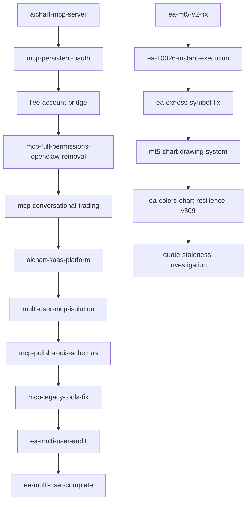
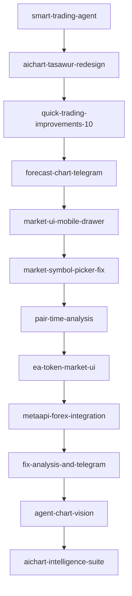

# أرشيف خطط AiChart المنفّذة

نسخ دائمة من خطط العمل التي وُضعت و**نُفّذت** (أو قُيّمت read-only) خلال تطوير MCP + EA + منصة SaaS.

| المجلد | المحتوى |
|--------|---------|
| [`*.md`](./) | ملخصات عربية — نتيجة التنفيذ + قائمة مهام |
| [`originals/`](./originals/) | النسخ الكاملة من `.cursor/plans/` (frontmatter + تفاصيل) |

**الخطة الرئيسية للمشروع:** [`docs/PLAN.md`](../PLAN.md)

---

## MCP + EA (19 خطة)

| # | الملف | النوع | الحالة |
|---|--------|--------|--------|
| 1 | [aichart-mcp-server.md](./aichart-mcp-server.md) | تنفيذ | منفّذ |
| 2 | [ea-mt5-v2-fix.md](./ea-mt5-v2-fix.md) | تنفيذ | EA v2 |
| 3 | [mcp-persistent-oauth.md](./mcp-persistent-oauth.md) | تنفيذ | JWT 365d |
| 4 | [live-account-bridge.md](./live-account-bridge.md) | تنفيذ | EA v3 + live |
| 5 | [mcp-full-permissions-openclaw-removal.md](./mcp-full-permissions-openclaw-removal.md) | تنفيذ | OpenClaw out |
| 6 | [ea-10026-instant-execution.md](./ea-10026-instant-execution.md) | تنفيذ | EA v3.01 |
| 7 | [ea-exness-symbol-fix.md](./ea-exness-symbol-fix.md) | تنفيذ | EA v3.05 |
| 8 | [mt5-chart-drawing-system.md](./mt5-chart-drawing-system.md) | تنفيذ | EA v3.07 |
| 9 | [ea-colors-chart-resilience-v309.md](./ea-colors-chart-resilience-v309.md) | تنفيذ | EA v3.09 |
| 10 | [mcp-conversational-trading.md](./mcp-conversational-trading.md) | تنفيذ | AGENTS.md |
| 11 | [user-approval-mcp-ea.md](./user-approval-mcp-ea.md) | تنفيذ | موافقة admin |
| 12 | [aichart-saas-platform.md](./aichart-saas-platform.md) | تنفيذ | هبوط + تسجيل |
| 13 | [telegram-mcp-credentials.md](./telegram-mcp-credentials.md) | تنفيذ | credentials |
| 14 | [multi-user-mcp-isolation.md](./multi-user-mcp-isolation.md) | تنفيذ | عزل MCP |
| 15 | [mcp-polish-redis-schemas.md](./mcp-polish-redis-schemas.md) | تنفيذ | Redis + schemas |
| 16 | [quote-staleness-investigation.md](./quote-staleness-investigation.md) | تنفيذ | EA v4.01 |
| 17 | [mcp-legacy-tools-fix.md](./mcp-legacy-tools-fix.md) | تنفيذ | forex snapshot |
| 18 | [ea-multi-user-audit.md](./ea-multi-user-audit.md) | تقييم | read-only |
| 19 | [ea-multi-user-complete.md](./ea-multi-user-complete.md) | تنفيذ | UNIQUE + Redis |

---

## منصة SaaS / Web (25 خطة)

| # | الملف | النوع | الحالة |
|---|--------|--------|--------|
| 20 | [smart-trading-agent.md](./smart-trading-agent.md) | تنفيذ | بث + ذاكرة + Square UI |
| 21 | [aichart-tasawur-redesign.md](./aichart-tasawur-redesign.md) | تنفيذ | Tasawur UX |
| 22 | [actionable-suggestions.md](./actionable-suggestions.md) | توثيق | SUGGESTIONS_FEASIBLE |
| 23 | [quick-trading-improvements-10.md](./quick-trading-improvements-10.md) | تنفيذ | مسح + انتظار |
| 24 | [aichart-completion-remaining.md](./aichart-completion-remaining.md) | تنفيذ | OCO + cron + تنبيهات |
| 25 | [forecast-chart-telegram.md](./forecast-chart-telegram.md) | تنفيذ | رسومات + تليجرام |
| 26 | [market-ui-mobile-drawer.md](./market-ui-mobile-drawer.md) | تنفيذ | واجهة السوق |
| 27 | [market-symbol-picker-fix.md](./market-symbol-picker-fix.md) | تنفيذ | SymbolPicker |
| 28 | [pair-time-analysis.md](./pair-time-analysis.md) | تنفيذ | زوج + إطار زمني |
| 29 | [ea-token-market-ui.md](./ea-token-market-ui.md) | تنفيذ | EA bridge + تبديل سوق |
| 30 | [metaapi-forex-integration.md](./metaapi-forex-integration.md) | تنفيذ | MetaApi موبايل |
| 31 | [fix-analysis-and-telegram.md](./fix-analysis-and-telegram.md) | تنفيذ | إشعارات + UI |
| 32 | [agent-chart-vision.md](./agent-chart-vision.md) | تنفيذ | تحليل بالرؤية |
| 33 | [complete-futures-gaps.md](./complete-futures-gaps.md) | تنفيذ | Futures + verify |
| 34 | [unified-bridge-console.md](./unified-bridge-console.md) | تنفيذ | مركز جسر |
| 35 | [aichart-intelligence-suite.md](./aichart-intelligence-suite.md) | تنفيذ | pgvector + لجنة |
| 36 | [agent-cost-optimization.md](./agent-cost-optimization.md) | تنفيذ | event-driven |
| 37 | [agent-demo-live-trading.md](./agent-demo-live-trading.md) | تنفيذ | demo/live |
| 38 | [agent-commands-telegram-ui.md](./agent-commands-telegram-ui.md) | تنفيذ | أوامر تليجرام |
| 39 | [agent-model-sync.md](./agent-model-sync.md) | تنفيذ | sync-model |
| 40 | [arabic-telegram-keyboard.md](./arabic-telegram-keyboard.md) | تنفيذ | لوحة عربية |
| 41 | [openclaw-ui-embed.md](./openclaw-ui-embed.md) | تنفيذ | /openclaw/ |
| 42 | [openclaw-ea-diagnostics.md](./openclaw-ea-diagnostics.md) | تنفيذ | تشخيص EA |
| 43 | [ea-forex-24-7-deploy.md](./ea-forex-24-7-deploy.md) | تنفيذ | VPS 24/7 |
| 44 | [mt5-native-chart-drawing.md](./mt5-native-chart-drawing.md) | تنفيذ | رسم MT5 أصلي |

---

## سلاسل مترابطة

### MCP + EA

### منصة Web

---

## سكربتات التحقق

| السكربت | الغرض |
|---------|--------|
| `infra/tmp-test-bridge-isolation.py` | عزل جسر الوكيل (مستخدمان) |
| `infra/tmp-test-ea-isolation.py` | عزل جسر EA |
| `infra/tmp-test-quote-freshness.py` | quoteAgeMs baseline |
| `infra/tmp-vps-bridge-test.sh` | فحص الجسر على VPS |
| `infra/tmp-vps-ea-isolation-test.sh` | فحص EA على VPS |
| `infra/tmp-vps-finish-multi-user.sh` | فحص شامل + بيئة |
| `infra/vps-fix-web-port.sh` | إصلاح 502 (PORT 3010) |

---

## نشر

معظم الخطط نُشرت على `72.60.83.140` (`/opt/aichart`) عبر **tarball** + `npm run build` + pm2 — وليس بالضرورة `git pull`.

---

## كيف تُحدَّث

1. بعد خطة جديدة: أضف ملخصاً هنا + انسخ الأصل إلى `originals/`.
2. حدّث قسم «نتيجة التنفيذ» إن تغيّر الإنتاج.
3. لا تعدّل ملفات `originals/` — هي لقطة تاريخية.
