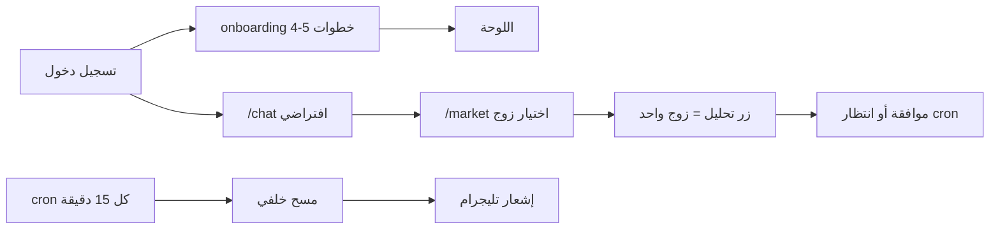
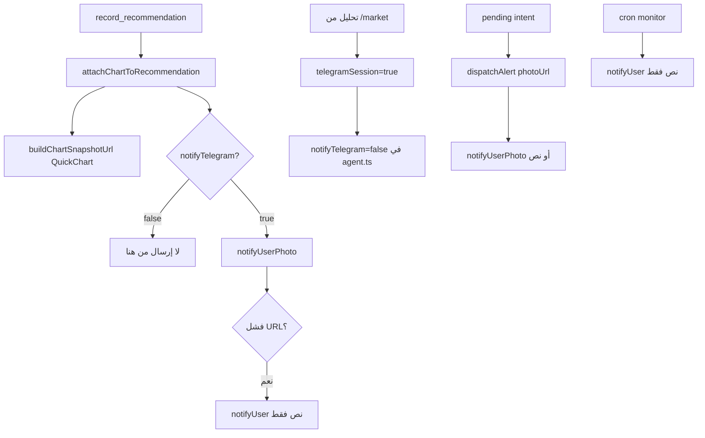
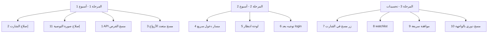

# تحليل AiChart و 10 اقتراحات لمسار «دخول → صفقة → انتظار»

## تحليل المشروع الحالي

**AiChart** منصة Next.js متعددة المستخدمين: وكيل Claude + Binance Spot (+ فوركس عبر MetaTrader/EA)، Risk Guard، تليجرام، ومراقبة دورية كل 15 دقيقة.

### ما يعمل اليوم (الأساس التقني موجود)

| القدرة | أين في الكود |
|--------|----------------|
| مسح فني رخيص لعدة أزواج (بدون Claude) | [`web/src/lib/monitor.ts`](web/src/lib/monitor.ts) `scanSymbol` + [`web/src/lib/monitorRunner.ts`](web/src/lib/monitorRunner.ts) |
| تحليل Claude لزوج واحد + رسم على الشارت | [`web/src/lib/marketAnalyze.ts`](web/src/lib/marketAnalyze.ts) + [`web/src/components/MarketClient.tsx`](web/src/components/MarketClient.tsx) |
| تنفيذ تلقائي عند `mode=auto` + `approval=delegate` | [`web/src/lib/tradeFlow.ts`](web/src/lib/tradeFlow.ts) |
| التحقق من صلاحية الفرصة قبل الموافقة | [`web/src/lib/opportunityCheck.ts`](web/src/lib/opportunityCheck.ts) |
| تنبيه نوايا معلّقة على اللوحة | [`web/src/components/DashboardClient.tsx`](web/src/components/DashboardClient.tsx) |

### رحلة المستخدم الحالية (لماذا لا يشعر بـ «دخول مباشر»)

**الفجوات الرئيسية مقابل طلبك:**

1. **لا يوجد زر «ابحث عن صفقة» في الواجهة** — المسح متعدد الأزواج يعمل فقط عبر [`POST /api/cron/monitor`](web/src/app/api/cron/monitor/route.ts) وليس من المستخدم.
2. **التحليل في الويب = زوج واحد** — `handleAnalyze` في [`MarketClient.tsx`](web/src/components/MarketClient.tsx) يمرّر `symbol` واحد فقط إلى [`/api/market/analyze`](web/src/app/api/market/analyze/route.ts).
3. **التوجيه بعد الدخول إلى المحادثة** — [`web/src/app/page.tsx`](web/src/app/page.tsx) يوجّه إلى `/chat` وليس إلى لوحة انتظار أو مسح فرص.
4. **الشارت** — [`PriceChart.tsx`](web/src/components/PriceChart.tsx) بدون `ResizeObserver` عند تغيّر الحاوية (ملء الشاشة/تخطيط RTL)، ورسالة فوركس «بانتظار EA» قد تُفسَر كعطل.
5. **Onboarding طويل** قبل أي «خذ صفقة وانتظر» — [`OnboardingClient.tsx`](web/src/components/OnboardingClient.tsx) يتطلب Binance + إعدادات + تليجرام قبل `onboarding_done`.
6. **التوصية تُرسل كنص فقط بدون صورة شارت** — انظر [#11](#11-إصلاح-إرسال-صورة-الشارت-مع-التوصية-أولوية-عالية) أدناه.

---

## 10 اقتراحات (إصلاحات + ميزات جديدة)

### 1. زر «ابحث عن صفقة الآن» (أولوية عالية)

**النوع:** ميزة جديدة  
**الفكرة:** زر بارز في اللوحة والشارت يشغّل مسحاً فورياً على أصول المستخدم (نفس منطق المراقبة لكن بأمر المستخدم).

**التنفيذ المقترح:**
- API جديد: `POST /api/opportunities/scan` يعيد قائمة `{ symbol, score, signals, snapshot }` من `scanSymbol` على `resolveMonitorAssets` ([`allowedAssets.ts`](web/src/lib/allowedAssets.ts) — حالياً حد 40 زوج عند السياسة المفتوحة).
- خيار `deep=true`: Claude يُستدعى **فقط** لأفضل 1–3 مرشّحين (مثل [`monitorRunner.ts`](web/src/lib/monitorRunner.ts)) ثم `processRecommendations`.
- واجهة: بطاقة في [`DashboardClient.tsx`](web/src/components/DashboardClient.tsx) + زر في [`ChartOverlayToolbar.tsx`](web/src/components/market/ChartOverlayToolbar.tsx).

**الجهد:** متوسط (2–3 أيام).

---

### 2. إصلاح مشاكل الرسم البياني (أولوية عالية)

**النوع:** إصلاح  
**المشاكل المرصودة في الكود:**

| المشكلة | السبب | الإصلاح |
|---------|--------|---------|
| شارت لا يتكيّف بعد ملء الشاشة | لا يوجد `ResizeObserver` / `chart.resize()` بعد fullscreen في [`PriceChart.tsx`](web/src/components/PriceChart.tsx) | ربط `ResizeObserver` على `containerRef` + `fitContent` بعد تغيير الحجم |
| رسائل خطأ فوركس مربِكة | EA غير متصل → `pending` في [`klines/route.ts`](web/src/app/api/market/klines/route.ts) | شارة حالة + رابط إعدادات MT + fallback MetaAPI إن مُفعّل |
| اختفاء/وميض الرسوم | `applyChartDrawings` يُعاد تشغيله مع `lastBarTime` و`livePrice` | تثبيت `lastBarTime` بعد أول تحميل كامل؛ تقليل إعادة رسم overlays |
| علامات توصيات بزمن خاطئ | `created_at + "Z"` في markers قد يفشل مع تنسيقات DB | توحيد parsing التاريخ |

**الجهد:** صغير–متوسط (1–2 يوم).

---

### 3. تحليل متعدد الأزواج وليس زوجاً واحداً (أولوية عالية)

**النوع:** تعديل + ميزة  
**الفكرة:** فصل «مسح سريع» (كود فقط، مجاني/رخيص) عن «تحليل عميق» (Claude).

- **مسح سريع:** يعرض جدول كل الأزواج المسموحة مع RSI/MACD/اتجاه — بدون استدعاء Claude.
- **تحليل عميق:** يُطبَّق على الزوج المختار من النتائج أو على أفضل N مرشّحين.
- توسيع [`/api/market/analyze`](web/src/app/api/market/analyze/route.ts) أو API المسح (#1) لدعم `symbols: string[]` مع حد حصة واضح.

**الجهد:** متوسط (مع #1).

---

### 4. مسار «دخول سريع — خذ صفقة وانتظر» (أولوية عالية)

**النوع:** ميزة UX  
**الفكرة:** مسار onboarding مختصر (أو خطوة نهائية في [`OnboardingClient.tsx`](web/src/components/OnboardingClient.tsx)):

- اختيار واحد: **«أريد أن يبحث الوكيل وينتظر الفرصة»**
- يضبط تلقائياً: `mode=auto`, `approval=delegate` (إن `can_execute`), `style` مناسب، ويفعّل `onboarding_done`
- يوجّه إلى **لوحة الانتظار** (#5) وليس `/chat`

**الجهد:** متوسط.

---

### 5. لوحة انتظار حية (Waiting Room) (أولوية عالية)

**النوع:** ميزة جديدة  
**محتوى اللوحة:**
- حالة: «الوكيل يراقب X زوج — آخر مسح …»
- صفقات مفتوحة + PnL حي (موجود جزئياً في [`DashboardAnalytics`](web/src/components/dashboard/DashboardAnalytics.tsx))
- نوايا معلّقة مع عدّاد TTL من [`opportunityCheck`](web/src/lib/opportunityCheck.ts) / `profileForInterval`
- آخر توصية + زر موافقة سريعة (يربط مع [`TradesClient`](web/src/components/TradesClient.tsx))

يمكن أن تكون تبويباً في `/dashboard` أو صفحة `/trade`.

**الجهد:** متوسط.

---

### 6. تغيير التوجيه بعد تسجيل الدخول (أولوية متوسطة)

**النوع:** تعديل  
**الحالي:** [`page.tsx`](web/src/app/page.tsx) → `/chat`  
**المقترح:** مستخدم مكتمل onboarding → `/dashboard` (أو `/trade`)؛ المحادثة تبقى في الشريط الجانبي.

**الجهد:** صغير (ساعات).

---

### 7. مسح سريع في شريط الشارت (منفصل عن «تحليل») (أولوية متوسطة)

**النوع:** ميزة  
**الفكرة:** زر ثانٍ بجانب «تحليل» في [`MarketTickerBar`](web/src/components/market/MarketTickerBar.tsx) / [`ChartOverlayToolbar`](web/src/components/market/ChartOverlayToolbar.tsx):

- **«مسح»** = كود فقط، لا يستهلك رصيد Claude
- **«تحليل»** = Claude كامل (التكلفة الحالية `MARKET_ANALYZE_COST = 3`)

يحل التباس المستخدم بين «أريد فرصة» و«أريد تحليل هذا الزوج».

**الجهد:** صغير–متوسط.

---

### 8. قائمة مراقبة مخصصة (Watchlist) (أولوية متوسطة)

**النوع:** ميزة  
**الفكرة:** في الإعدادات، حقل «أزواجي للمسح» (5–20 رمز) يُستخدم في:
- المسح اليدوي (#1)
- المراقبة 24/7 (بديل لـ Top 40 أو القائمة الكاملة)

حقل جديد في `trading_settings` أو توسيع `allowed_assets` JSON في [`allowedAssets.ts`](web/src/lib/allowedAssets.ts).

**الجهد:** متوسط.

---

### 9. إشعار فوري + موافقة بنقرة واحدة من اللوحة (أولوية متوسطة)

**النوع:** تحسين  
**الوضع:** إشعارات الويب موجودة ([`NotificationPanel`](web/src/components/NotificationPanel.tsx))؛ الموافقة في `/trades`.  
**المقترح:** عند نتيجة مسح/مراقبة:
- إشعار داخل الموقع + بطاقة intent على اللوحة مع أزرار موافقة/رفض (مثل ما في المحادثة/Telegram)
- إعادة فحص `validateOpportunity` قبل الموافقة + عرض «إعادة مسح» (منطق موجود في تليجرام: `rescan`)

**الجهد:** متوسط.

---

### 10. جدولة مسح تلقائي للمستخدم (Polling خفيف) (أولوية منخفضة–متوسطة)

**النوع:** ميزة  
**الفكرة:** بدلاً من انتظار cron 15 دقيقة فقط، خيار في الإعدادات: «مسح كل 5/15/30 دقيقة أثناء تسجيل الدخول» عبر:
- `setInterval` في الواجهة يستدعي `POST /api/opportunities/scan` (مسح كود فقط)
- أو SSE/WebSocket لحالة «أنا أنتظر»

**تحذير:** لا يستبدل cron للمستخدمين غير المتصلين؛ يكمّله.

**الجهد:** متوسط.

---

### 11. إصلاح إرسال صورة الشارت مع التوصية (أولوية عالية)

**النوع:** إصلاح (مُضاف بناءً على ملاحظتك)  
**المشكلة:** عند تسجيل توصية، المستخدم يتلقّى **نصاً فقط** على تليجرام (أو إشعار بدون صورة) رغم وجود مسار «سكرين شوت» في الكود.

**تحليل الجذور في الكود الحالي:**

| السبب | الملف | التفاصيل |
|--------|--------|----------|
| تحليل السوق من الويب يعطّل إشعار الصورة عند التسجيل | [`agent.ts`](web/src/lib/agent.ts) L400–403 + [`market/analyze/route.ts`](web/src/app/api/market/analyze/route.ts) L70 | `telegramSession: true` → `notifyTelegram = false` |
| المراقبة 24/7 نص فقط | [`monitorRunner.ts`](web/src/lib/monitorRunner.ts) L87–92 | `notifyUser` بدون `notifyUserPhoto` |
| فشل صامت لرابط الصورة | [`chartSnapshot.ts`](web/src/lib/chartSnapshot.ts) | `buildChartSnapshotUrl` يعيد `null` عند فشل klines أو &lt;10 شموع؛ لا يُرسل شيء |
| URL QuickChart طويل جداً | [`chartSnapshot.ts`](web/src/lib/chartSnapshot.ts) L237–238 | `encodeURIComponent(JSON)` قد يتجاوز حد تليجرام لـ `sendPhoto` بالرابط |
| fallback تلقائي إلى نص | [`telegram.ts`](web/src/lib/telegram.ts) L171–173 | عند فشل `sendPhoto` يُرسل `notifyUser(caption)` فقط |
| الصورة تعتمد على intent | [`tradeFlow.ts`](web/src/lib/tradeFlow.ts) L129–137 | `photoUrl` يُمرَّر فقط عند إنشاء intent معلّق؛ توصية `wait` أو advisory بدون تنفيذ = غالباً بدون صورة |
| لا خيار واضح في الإعدادات | [`SettingsClient.tsx`](web/src/components/SettingsClient.tsx) | `send_screenshot` يُحفظ لكن **لا يوجد toggle في الواجهة** |
| إشعار الويب بدون صورة | [`alerts.ts`](web/src/lib/alerts.ts) | `recordAlert` لا يخزّن `photoUrl`؛ [`NotificationPanel`](web/src/components/NotificationPanel.tsx) يعرض نصاً فقط |

**الحل المقترح:**

1. **مسار إشعار موحّد** `notifyRecommendation(userId, rec)` في [`recommendationChart.ts`](web/src/lib/recommendationChart.ts):
   - يبني الصورة (أو يستخدم `chart_image_url` المخزَّن)
   - يُرسل عبر تليجرام + `dispatchAlert` مع `photoUrl`
   - يُستدعى من: `record_recommendation`، `monitorRunner`، `marketAnalyze` (بعد التحليل)

2. **توليد صورة موثوق** بدل رابط QuickChart الطويل:
   - `POST https://quickchart.io/chart` → PNG ثنائي
   - رفع الملف إلى تليجرام بـ `multipart` (توسيع [`telegram.ts`](web/src/lib/telegram.ts) `sendPhotoBuffer`)
   - أو تخزين مؤقت على الخادم + رابط قصير `/api/chart-snapshot/[id]`

3. **إصلاح `telegramSession`**: فصل «جلسة تليجرام» عن «إرسال إشعار تليجرام للمستخدم» — تحليل الويب يجب أن يُرسل صورة إن `send_screenshot=1` و`telegram_chat_id` موجود.

4. **المراقبة**: استبدال `notifyUser` في [`monitorRunner.ts`](web/src/lib/monitorRunner.ts) بـ `notifyRecommendation` مع `resolveChartUrl`.

5. **الواجهة**: toggle «إرسال صورة الشارت مع التوصية» في الإعدادات + عرض `chart_image_url` في إشعارات الويب ولوحة الانتظار (#5).

6. **فوركس**: توسيع `buildChartSnapshotUrl` لدعم شموع EA/MetaAPI (حالياً crypto فقط عبر `getKlines`).

**الجهد:** متوسط (1–2 يوم) — يُنفَّذ مع المرحلة 1 لأنه يؤثر مباشرة على «خذ صفقة وانتظر».

---

## ترتيب تنفيذ مقترح

| المرحلة | الاقتراحات | النتيجة للمستخدم |
|---------|------------|------------------|
| 1 | #1, #2, #3, #11 | يضغط «ابحث عن صفقة» + يتلقّى توصية **بصورة شارت** على تليجرام/الموقع |
| 2 | #4, #5, #6 | يدخل → يختار «انتظر» → يرى لوحة انتظار واضحة |
| 3 | #7–#10 | تجربة يومية سلسة دون فتح عدة صفحات |

---

## ملاحظات تقنية مهمة

- **الحصة:** المسح الكودي رخيص؛ Claude يجب أن يبقى مربوطاً بـ `claude_quota` و`incrementUsage` كما في [`monitorRunner`](web/src/lib/monitorRunner.ts).
- **Cooldown:** المراقبة تستخدم `isOnCooldown` (4 ساعات لكل زوج) — المسح اليدوي قد يحتاج استثناء أو cooldown أقصر.
- **فوركس:** المسح الحالي في cron **crypto فقط** (`market: "crypto"` في monitorRunner) — لتوسيع الفوركس يحتاج `buildForexSnapshot` ومسح EA.
- **لا تُعاد اقتراح** ما نُفّذ في [`docs/SUGGESTIONS_FEASIBLE.md`](docs/SUGGESTIONS_FEASIBLE.md) (OCO، kill switch يغلق، إشعارات الويب، ربط `/market` بالتنقل، إلخ).

---

## ما الذي تختار تنفيذه أولاً؟

الخطة تفترض البدء بـ **#1 + #2 + #3 + #11** لأنها مباشرة تطابق أمثلتك (زر بحث صفقة، إصلاح الشارت، تحليل متعدد الأزواج، **صورة مع التوصية**). إذا رغبت بالتركيز على **تسريع الدخول** قبل المسح، ابدأ بـ **#4 + #5 + #6**.
