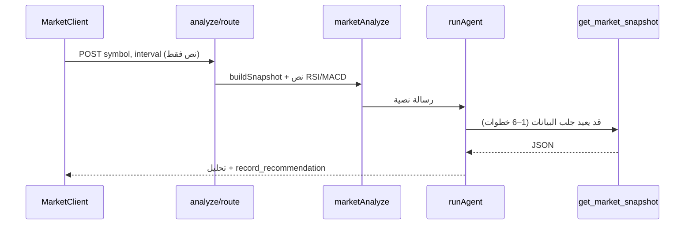
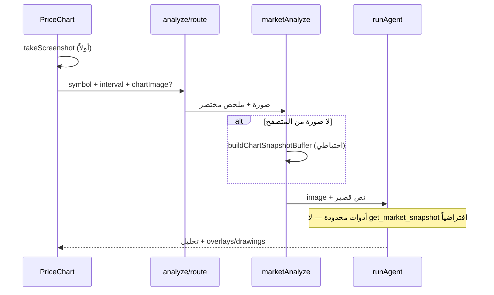

# تحليل بالرؤية: الوكيل يرى الشارت بدل البحث

## الوضع الحالي



- زر «تحليل» في [`web/src/components/MarketClient.tsx`](web/src/components/MarketClient.tsx) يرسل `{ symbol, interval, market }` فقط — **لا صورة**.
- [`web/src/lib/marketAnalyze.ts`](web/src/lib/marketAnalyze.ts) يبني prompt نصي من `buildSnapshot` ثم يستدعي `runAgent` بكل الأدوات ([`web/src/lib/agent.ts`](web/src/lib/agent.ts) — 15+ أداة).
- البنية التحتية **موجودة جزئياً**:
  - [`web/src/lib/anthropic.ts`](web/src/lib/anthropic.ts) يدعم `ContentBlock` من نوع `image` (base64).
  - [`web/src/lib/chatImage.ts`](web/src/lib/chatImage.ts) — `buildUserMessageContent(text, image)` مستخدم في الدردشة.
  - [`web/src/lib/chartSnapshot.ts`](web/src/lib/chartSnapshot.ts) — `buildChartSnapshotBuffer` (QuickChart PNG) للكريبتو.
- مشكلة UX: `handleAnalyze` يستدعي `clearChartLayers()` **قبل** التحليل — يمحو ما يراه المستخدم.

## الهدف



---

## المرحلة 1 — التقاط الشارت من المتصفح

### 1.1 `PriceChart` — تصدير لقطة

في [`web/src/components/PriceChart.tsx`](web/src/components/PriceChart.tsx):

- إضافة `forwardRef` + `useImperativeHandle` مع `capturePng(): Promise<ChatImagePayload | null>`.
- استخدام `chartRef.current.takeScreenshot()` (lightweight-charts v5).
- تحويل الناتج إلى base64 PNG + التحقق عبر `validateChatImage` من [`web/src/lib/chatImage.ts`](web/src/lib/chatImage.ts).
- التعامل مع حالة «الشارت لم يُحمّل بعد» → إرجاع `null` (يُفعَّل الاحتياطي).

### 1.2 `MarketClient` — إرسال الصورة

في [`web/src/components/MarketClient.tsx`](web/src/components/MarketClient.tsx):

- ref على `PriceChart`.
- **إزالة** `clearChartLayers()` من بداية `handleAnalyze` (أو نقله بعد التقاط الصورة).
- قبل `fetch("/api/market/analyze")`: `const image = await chartRef.capturePng()`.
- إضافة `image?: { media_type, data }` إلى body الطلب.

---

## المرحلة 2 — احتياطي الخادم + ربط الوكيل

### 2.1 توسيع `chartSnapshot` للفوركس

[`web/src/lib/chartSnapshot.ts`](web/src/lib/chartSnapshot.ts) يستخدم `getKlines` (Binance فقط).

- إضافة `buildChartSnapshotBufferForMarket(userId, symbol, interval, market)`:
  - **crypto** → المسار الحالي.
  - **forex** → شموع من `getEaCandles` ([`web/src/lib/eaStore.ts`](web/src/lib/eaStore.ts)) كما في [`web/src/lib/market.ts`](web/src/lib/market.ts) `buildForexSnapshot`.

### 2.2 `marketAnalyze` — رسالة مرئية

في [`web/src/lib/marketAnalyze.ts`](web/src/lib/marketAnalyze.ts):

```typescript
// 1) validate client image OR build server buffer
// 2) buildUserMessageContent(prompt, chartImage)
// 3) runAgent(..., [{ role: "user", content: blocks }], { mode: "chart_analyze" })
```

- **Prompt أقصر** عند وجود صورة: «حلّل الشارت المرفق لـ {symbol} · {interval}» + سطر F&G/سياق مختصر (بدون تكرار كل RSI في النص).
- الاحتفاظ بـ `snapshotSummaryLines` في `contextSummary` للواجهة فقط.

### 2.3 `analyze/route` — قبول الصورة

في [`web/src/app/api/market/analyze/route.ts`](web/src/app/api/market/analyze/route.ts):

- حقل Zod اختياري `image: { media_type, data }` — إعادة استخدام `validateChatImage`.
- تمرير `chartImage` إلى `runMarketAnalyze`.

### 2.4 وضع تحليل بأدوات محدودة

في [`web/src/lib/agent.ts`](web/src/lib/agent.ts):

- `RunAgentOptions.mode?: "default" | "chart_analyze"`.
- عند `chart_analyze`:
  - **TOOLS** فرعية: `record_recommendation`, `get_market_context` (اختياري: `get_price` للفوركس).
  - **بدون** `get_market_snapshot`, `resolve_symbol`, `binance_cli`, إلخ.
  - `MAX_STEPS = 2` (تحليل → تسجيل توصية).
- لاحقة system في [`web/src/lib/persona.ts`](web/src/lib/persona.ts) أو suffix في `runAgent`:

> «صورة الشارت مرفقة — اعتمد عليها أساساً. لا تستدع get_market_snapshot. استخدم record_recommendation عند buy/sell/wait.»

(يتعارض مع السطر الحالي «استخدم الأدوات قبل أي رأي فني» — يُستثنى في وضع `chart_analyze`.)

---

## المرحلة 3 — تكلفة الرصيد و feedback

- زيادة [`MARKET_ANALYZE_COST`](web/src/lib/marketAnalyze.ts) من 3 إلى **4–5** (صورة ≈ +1500 token input).
- في `MarketRecPanel` / toast: «تم التحليل من الشارت» (اختياري، سطر صغير).
- إذا فشل التقاطان (client + server): fallback للمسار النصي الحالي مع تحذير في UI.

---

## ملفات رئيسية

| ملف | التغيير |
|-----|---------|
| [`PriceChart.tsx`](web/src/components/PriceChart.tsx) | `capturePng()` |
| [`MarketClient.tsx`](web/src/components/MarketClient.tsx) | التقاط + إرسال، عدم مسح الطبقات مبكراً |
| [`market/analyze/route.ts`](web/src/app/api/market/analyze/route.ts) | قبول `image` |
| [`marketAnalyze.ts`](web/src/lib/marketAnalyze.ts) | vision-first + fallback |
| [`chartSnapshot.ts`](web/src/lib/chartSnapshot.ts) | دعم forex |
| [`agent.ts`](web/src/lib/agent.ts) | `chart_analyze` mode + tools subset |
| [`persona.ts`](web/src/lib/persona.ts) | تعليمات رؤية الشارت |
| [`chatImage.ts`](web/src/lib/chatImage.ts) | (إعادة استخدام — لا تغيير كبير) |

**خارج النطاق الآن:** مسح الفرص العميق (`opportunityScan`) — يبقى نصي؛ يمكن لاحقاً إرفاق لقطة لأفضل مرشّح.

---

## التحقق

1. **كريبتو 1h:** تحليل → الوكيل لا يستدعي `get_market_snapshot` في activity feed؛ يرى صورة ويُسجّل توصية.
2. **فوركس + EA متصل:** لقطة عميل أو احتياطي EA candles.
3. **فشل QuickChart / offline:** fallback نصي + رسالة للمستخدم.
4. **طبقات على الشارت** (overlays قديمة): تظهر في لقطة العميل ولا تُمسح قبل التقاط.
5. `tsc` + `npm run build`.
