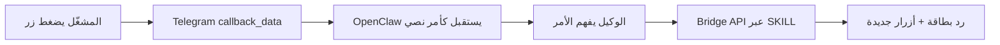
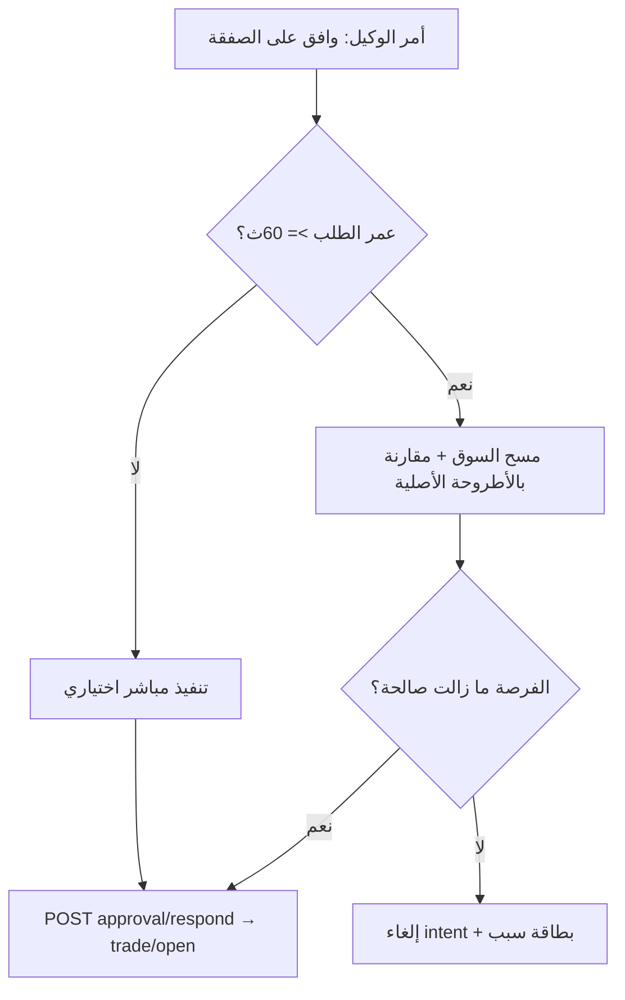
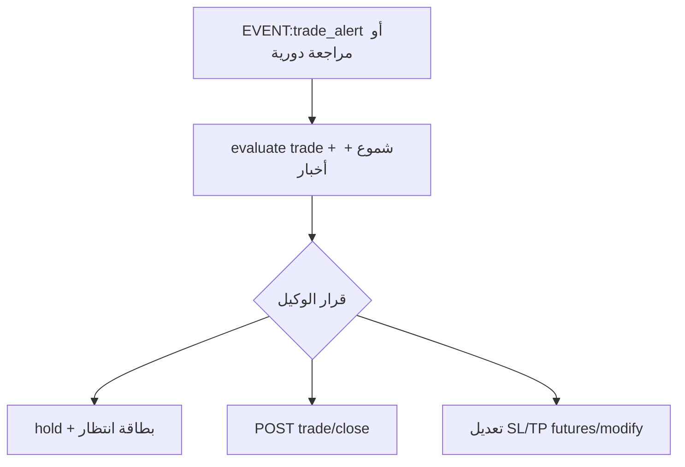

# خطة: أوامر الوكيل + بطاقات تيليجرام + صرف طبيعي

## قرار معماري (بناءً على توضيحك)



- **كل زر = أمر للوكيل** (مثل «اعرض الرصيد»، «حلّل EURUSD»، «موافق») — الوكيل يقرر ويستدعي الـ APIs.
- **لا أزرار URL** للقوائم أو الموافقة (إلغاء نمط [`approvalFlow.ts`](web/src/lib/approvalFlow.ts) الحالي للتنقل؛ الاستثناء الوحيد إن بقي رابط خارجي للوحة الويب).
- **شكل البطاقة** من مثال OTC (خطوط، إيموجي، حقول) — **بدون** منطق OTC (لا وقت انتهاء ثوانٍ، لا أزواج OTC).

---

## المرحلة 1 — إرجاع الصرف الطبيعي (كل المزودين)

| الملف | التعديل |
|-------|---------|
| [`web/src/lib/anthropic.ts`](web/src/lib/anthropic.ts) | رفع/إلغاء سقف `ROUTINE_MAX_TOKENS` (4096) — جعل `clampMaxTokens` يحترم قيمة الممرّر أو سقف عالٍ (مثلاً 16384) لكل المزودين عبر `llm.ts` |
| [`web/src/lib/openaiCompat.ts`](web/src/lib/openaiCompat.ts) | رفع الافتراضي من 1500 إلى قيمة أعلى أو بدون سقف صارم |
| [`web/src/lib/agent.ts`](web/src/lib/agent.ts) | تمرير `maxTokens` أعلى؛ رفع `maxSteps` من 6 إن لزم |
| [`web/src/lib/conversations.ts`](web/src/lib/conversations.ts) | رفع `MAX_MESSAGES_LOAD` (40 → 80 أو configurable) |
| [`web/src/lib/openclawModelSync.ts`](web/src/lib/openclawModelSync.ts) + [`agent/scripts/sync-model.sh`](agent/scripts/sync-model.sh) | إزالة/تخفيف `contextPruning` إن طلبت «صرف طبيعي»؛ إضافة `maxTokens` عالٍ في `params` لكل مزود |
| [`web/src/lib/store.ts`](web/src/lib/store.ts) + مسارات chat/signals/analyze | `claude_quota = 0` = غير محدود (موجود) — ضبط افتراضي المستخدمين أو تعطيل الفحص عند `AICHART_SINGLE_USER=1` لكل المسارات |
| مسارات بقيم منخفضة | [`committee.ts`](web/src/lib/committee.ts) 900، [`tradePostMortem.ts`](web/src/lib/tradePostMortem.ts) 600 — رفع لتتماشى مع «بدون حدود» |

**ملاحظة:** إلغاء الحدود يزيد التكلفة — مقصود حسب طلبك.

---

## المرحلة 2 — Skills «جبارة» + سياق الحساب

### ملفات المعرفة
- [`agent/workspace/skills/aichart-trading/SKILL.md`](agent/workspace/skills/aichart-trading/SKILL.md) — توسيع كبير:
  - **جدول أوامر الأزرار** (`cmd:*`) وما يفعله الوكيل لكل أمر
  - **إدارة الصفقة المفتوحة** (انظر المرحلة 3)
  - **رافعة مالية / سبريد** — متى يفحص وكيف يبلّغ
  - أمثلة curl لكل سيناريو (موافقة، إغلاق، تحليل، ديمو/حقيقي)
- [`agent/workspace/AGENTS.md`](agent/workspace/AGENTS.md) — قواعد صريحة:
  - قبل أي صفقة: اقرأ `accountProfile` من risk/status
  - بعد الفتح: سجّل أطروحة + شروط الخروج الديناميكية
  - الأزرار لا تنفّذ — **أنت** تنفّذ بعد فهم الأمر
- [`agent/workspace/SOUL.md`](agent/workspace/SOUL.md) — أسلوب الرد: **بطاقة بفاصل `─────────────────`** + حقول 🔹 + المنصة والحساب؛ **التحليل مختصر — لا فقرات طويلة في تيليجرام**

### API جديد/موسّع (الوكيل يستدعيها — ليس الأزرار)
| Endpoint | الغرض |
|----------|--------|
| توسيع [`GET /api/agent/risk/status`](web/src/app/api/agent/risk/status/route.ts) | `accountProfile`: `{ hasLeverage, leverage, marginMode, hasSpread, spreadPips, spreadPct, marketType, platform, accountLogin, accountCurrency, accountType }` — `accountType`: `حقيقي` \| `ديمو` من executionEnv |
| توسيع [`GET /api/agent/ea/diagnostics`](web/src/app/api/agent/ea/diagnostics/route.ts) | `spreadPips`, `spreadPct` عند وجود symbol |
| **جديد** `GET /api/agent/trade/evaluate?trade_id=` | لقطة: سعر حي، شموع قصيرة، PnL غير محقق، أخبار/سياق — يغذي قرار الوكيل |
| **جديد** `POST /api/agent/trade/exit-decision` | الوكيل يسجّل قرار: `hold` \| `close` \| `adjust_sl` + السبب (audit) |

### كود مساعد
- [`web/src/lib/spread.ts`](web/src/lib/spread.ts) (جديد) — حساب سبريد من bid/ask (فوركس + كربتو)
- [`web/src/lib/accountProfile.ts`](web/src/lib/accountProfile.ts) (جديد) — تجميع رافعة/سبريد/بيئة

---

## المرحلة 3 — إدارة الصفقة: الوكيل يقرر التوقف أو الانتظار

**ليس كود يغلق تلقائياً** — الوكيل يحلل ويقرر (auto و approval بعد الفتح).

### إعادة التحقق عند الموافقة المتأخرة (وضع `approval`)

عند تحليل السوق والاتفاق على صفقة → `pending` + أزرار موافقة/رفض. **إذا ضغط المشغّل موافقة بعد دقيقة أو أكثر** لا يُنفَّذ فوراً — يُعاد فحص الفرصة أولاً:



**معايير «الفرصة ما زالت موجودة»** (كود + الوكيل):
| فحص | رفض إن |
|-----|--------|
| السعر الحي | انحرف عن نقطة الدخول > حد (مثلاً 0.5% كربتو / X pips فوركس) |
| `monitor.ts` score | أقل من عتبة `style` أو إشارات انقلبت (MACD/RSI عكس الاتجاه) |
| SL/TP | لم يعد منطقياً مع السعر الحالي |
| Risk Guard | يرفض اليوم (حد خسارة، kill switch، env) |
| عمر الطلب | > 30 دقيقة → إلغاء تلقائي «انتهت صلاحية الطلب» |

**عند الإلغاء** — بطاقة بالشكل المعتمد:
```
─────────────────
❌ تم إلغاء الصفقة
🔹 زوج التداول: EURUSD
🔹 السبب: [نص واضح — مثال: انعكاس MACD · السعر تجاوز نقطة الدخول]
المنصة: MT4
الحساب: 123456
نوع الحساب: ديمو
─────────────────
```

| الملف | التعديل |
|-------|---------|
| **جديد** [`web/src/lib/intentRevalidate.ts`](web/src/lib/intentRevalidate.ts) | `revalidatePendingIntent(intentId)` → `{ valid, reasonAr, snapshot }` |
| [`web/src/lib/approvalFlow.ts`](web/src/lib/approvalFlow.ts) | قبل `executeIntent`: إن `age >= 60s` استدعِ revalidate؛ إن `!valid` → `cancelled` + بطاقة إلغاء |
| [`web/src/app/api/agent/approval/respond/route.ts`](web/src/app/api/agent/approval/respond/route.ts) | نفس المنطق عند موافقة الوكيل عبر API |
| [`agent/workspace/AGENTS.md`](agent/workspace/AGENTS.md) | في `approval`: عند أمر «موافق» بعد انتظار → `GET market/scan` أو `evaluate` ثم قرّر؛ لا `trade/open` إن الفرصة ضاعت |
| [`agent/workspace/skills/aichart-trading/SKILL.md`](agent/workspace/skills/aichart-trading/SKILL.md) | سيناريو موافقة متأخرة + أمثلة curl + نصوص أسباب الإلغاء |
| [`web/src/lib/telegramCards.ts`](web/src/lib/telegramCards.ts) | `cancelledTradeCard({ symbol, reason, platform, account })` |

**ثابت:** `APPROVAL_REVALIDATE_AFTER_SEC = 60` (قابل للضبط في `platform_config` لاحقاً).



| الملف | التعديل |
|-------|---------|
| [`web/src/lib/monitorRunner.ts`](web/src/lib/monitorRunner.ts) | عند `trade_alert`: تفاصيل أغنى (PnL، رافعة، سبريد) في `wakeAgentViaTelegram` |
| [`web/src/lib/agentWake.ts`](web/src/lib/agentWake.ts) | نوع حدث جديد `position_review` + تعليمات: «حلّل الشموع والأخبار ثم قرّر hold/close» |
| [`agent/workspace/AGENTS.md`](agent/workspace/AGENTS.md) | قسم **إدارة المركز المفتوح**: معايير خروج على ربح/خسارة، لا إغلاق عشوائي، وثّق السبب |
| [`web/src/lib/tradeWatch.ts`](web/src/lib/tradeWatch.ts) | تنبيهات أذكى (اقتراب TP/SL + تغيّر زخم RSI) — تُرسل كحدث للوكيل لا إغلاق مباشر |

---

## المرحلة 4 — بطاقات تيليجرام + أزرار أوامر (الشكل فقط)

### قوالب البطاقات (الشكل المعتمد)

ملف جديد [`web/src/lib/telegramCards.ts`](web/src/lib/telegramCards.ts) — **قالب HTML موحّد** لكل البطاقات:

```
─────────────────
🔹 زوج التداول: EURUSD
🔹 المبلغ: 100 دولار
🔹 الاستراتيجية: balanced 🟡
🔹 البيئة: ديمو · الرافعة: 3x
🔹 السبريد: 1.2 نقطة
المنصة: MT4
الحساب: 123456
نوع الحساب: ديمو
─────────────────
```

**قواعد الشكل (إلزامية):**
- فاصل علوي/سفلي: `─────────────────` (17 شرطة — ليس خطاً أطول)
- المبلغ بصيغة **«X دولار»** (أو عملة الحساب من `account_currency`) — تجنّب `USDT` في واجهة تيليجرام إلا للكربتو صراحة
- حقلا **المنصة** و**الحساب** و**نوع الحساب** في كل بطاقة صفقة/تحليل/رصيد/نتيجة/موافقة عند توفر البيانات:
  - **نوع الحساب:** `حقيقي` أو `ديمو` — من `executionEnv` / `risk/status` (`preference` + `binance.env` + `mt5.tradeMode`)
  - فوركس/EA: من `ea/diagnostics` → `platform` (MT4/MT5) + `account_login`
  - كربتو Binance: `المنصة: Binance` + معرّف مختصر أو «Spot/Futures»
  - إن غير متصل: `المنصة: —` · `الحساب: —` · `نوع الحساب: —`
- أسطر المنصة / الحساب / نوع الحساب **بدون** إيموجي 🔹 (نص عادي كما في المثال)

ثابت في الكود: `CARD_SEPARATOR = "─────────────────"` ودالة `formatCard(fields[])`.

أنواع البطاقات: `sessionStartCard`, `tradeResultCard`, `analysisCard`, `balanceCard`, `approvalCard`, `menuCard` — **نفس الهيكل والفواصل**؛ لا استثناءات في الشكل.

### بطاقة التحليل (`analysisCard`) — مختصرة وسريعة القراءة

**نفس قالب البطاقة** (ليست فقرة طويلة ولا نسخة ثنائية اللغة AR/EN كما في [`recommendationCard`](web/src/lib/telegram.ts) الحالي). هدفها: قراءة في **3–5 ثوانٍ** على الهاتف.

**مثال معتمد:**
```
─────────────────
📊 تحليل EURUSD
🔹 الاتجاه: شراء 🟢 · الثقة: 78%
🔹 الدخول: 1.0842 · SL: 1.0810 · TP: 1.0890
🔹 الإشارات: RSI تشبّع بيعي · MACD صعودي
🔹 المبلغ المقترح: 100 دولار
🔹 الاستراتيجية: balanced 🟡
🔹 البيئة: ديمو · الرافعة: 3x · السبريد: 1.2 نقطة
المنصة: MT4
الحساب: 123456
نوع الحساب: حقيقي
─────────────────
```

**قواعد الاختصار (إلزامية للوكيل والكود):**
| قاعدة | التفاصيل |
|-------|----------|
| سطر عنوان واحد | `📊 تحليل {symbol}` — بدون فقرة تمهيدية |
| حقول 🔹 فقط | كل معلومة = سطر واحد؛ **حد أقصى 8 أسطر 🔹** قبل المنصة/الحساب/نوع الحساب |
| الإشارات | سطر واحد مفصول بـ ` · ` (3 إشارات كحد أقصى) |
| الملخص (`rationale`) | **لا يُدرج** في البطاقة — يبقى في السجل/الذاكرة؛ إن لزم سطر واحد ≤ 60 حرف |
| ثنائية اللغة | **إلغاء** في البطاقات — عربي فقط (أو لغة المشغّل لاحقاً) |
| الشارت | صورة منفصلة **فوق** البطاقة إن وُجدت — النص يبقى مختصراً |
| بعد التحليل | أزرار: موافق · رفض · زوج آخر · القائمة |

استبدال [`recommendationCard`](web/src/lib/telegram.ts) و[`approvalCard`](web/src/lib/telegram.ts) بـ `analysisCard` / `approvalCard` من `telegramCards.ts` بنفس الأسلوب المختصر.

مصدر البيانات لـ المنصة/الحساب: يُضاف إلى [`accountProfile.ts`](web/src/lib/accountProfile.ts) ويُعرض في `risk/status` و`portfolio`.

### بروتوكول الأزرار (أوامر — ليس API)
ملف جديد [`web/src/lib/telegramCommands.ts`](web/src/lib/telegramCommands.ts) — خريطة `callback_data` → نص الأمر الذي يصل للوكيل:

| callback_data | الأمر للوكيل (مثال) |
|---------------|---------------------|
| `cmd:home` | «القائمة الرئيسية» |
| `cmd:balance` | «اعرض الرصيد والمحفظة» |
| `cmd:trades` | «اعرض الصفقات المفتوحة» |
| `cmd:settings` | «اعرض الإعدادات والوضع الحالي» |
| `cmd:market:crypto` | «حوّل السوق النشط إلى كربتو» |
| `cmd:market:forex` | «حوّل السوق النشط إلى فوركس» |
| `cmd:env:demo` | «فعّل وضع الديمو» |
| `cmd:env:live` | «فعّل الوضع الحقيقي» |
| `cmd:analyze:pick` | «أريد تحليل زوج — اعرض قائمة الرموز» |
| `cmd:approve:{id}` | «وافق على الصفقة المعلقة رقم {id}» — **إن مرّ >60ث أعد تحليل السوق أولاً**؛ نفّذ فقط إن الفرصة باقية وإلا أرسل بطاقة إلغاء بالسبب |
| `cmd:reject:{id}` | «ارفض الصفقة المعلقة رقم {id}» |
| `cmd:back` / `cmd:next` | تنقل السياق |

**التنفيذ في OpenClaw** (ليس في web API):
- توثيق في SKILL: عند استلام `callback_query` أو نص يبدأ بـ `[CMD:...]` → حوّله لسياق المحادثة ونفّذ عبر curl.
- إن لزم: سكربت خفيف في [`agent/scripts/telegram-cmd-bridge.sh`](agent/scripts/telegram-cmd-bridge.sh) يترجم callback إلى رسالة user للجلسة.

### إرسال البطاقات من المنصة
- [`web/src/lib/telegram.ts`](web/src/lib/telegram.ts) — استخدام `telegramCards` + أزرار `callback_data` فقط (إزالة URL من الموافقة تدريجياً)
- [`web/src/lib/approvalFlow.ts`](web/src/lib/approvalFlow.ts) — `buildApprovalButtons` → `cmd:approve:{id}` / `cmd:reject:{id}`
- [`web/src/lib/notifyTrade.ts`](web/src/lib/notifyTrade.ts) — بطاقة نتيجة بأسلوب OTC + أزرار «كمّل؟» / «الصفقات» / «القائمة»

### حالات الأزرار (state machine في الوكيل)
جدول في SKILL يحدد **أي أزرار تظهر تحت كل بطاقة**:

| السياق | أزرار افتراضية |
|--------|----------------|
| القائمة الرئيسية | تحليل زوج · اختيار عملة · فوركس/كربتو · الصفقات · الرصيد · الإعدادات · ديمو/حقيقي |
| بعد تحليل (pending) | موافق · رفض · زوج آخر · القائمة — **الموافقة بعد دقيقة = إعادة تحليل تلقائية** |
| صفقة مفتوحة | مراجعة · إغلاق · القائمة |
| بعد ربح/خسارة | كمّل؟ · الصفقات · الرصيد · القائمة |

الوكيل يختار الأزرار عند الرد (OpenClaw يرسل `reply_markup`) — المنصة توفّر المساعدات فقط.

### محادثة نصية
- تبقى كما هي: النص الحر يذهب لـ OpenClaw مباشرة.
- **الافتراضي عند `/start` أو أول رسالة:** بطاقة ترحيب + لوحة أزرار رئيسية (الوكيل يرسلها).

---

## المرحلة 5 — نشر واختبار

1. `npm run build` في `web/`
2. VPS: `sync-workspace.sh` + `sync-model.sh` + `pm2 restart`
3. إعادة إدخال مفاتيح `/admin/keys` إن لزم (بعد استعادة VPS)
4. اختبار يدوي: كل زر → يظهر في سجل الوكيل كأمر → الوكيل ينفّذ API → بطاقة رد

---

## خارج النطاق (حسب توضيحك)

- تداول OTC بوقت انتهاء ثوانٍ
- أزرار تفتح روابط API أو تنفّذ صفقات بدون مرور الوكيل
- تغيير اختيار النموذج من لوحة الأدمن (يبقى كما هو)

---

## ترتيب التنفيذ المقترح

1. الصرف الطبيعي (سريع، منخفض المخاطر)
2. accountProfile + spread + evaluate APIs
3. Skills/AGENTS (إدارة صفقة + أوامر أزرار)
4. telegramCards + telegramCommands + تحويل الموافقة لأزرار أوامر
5. نشر VPS + اختبار تيليجرام
