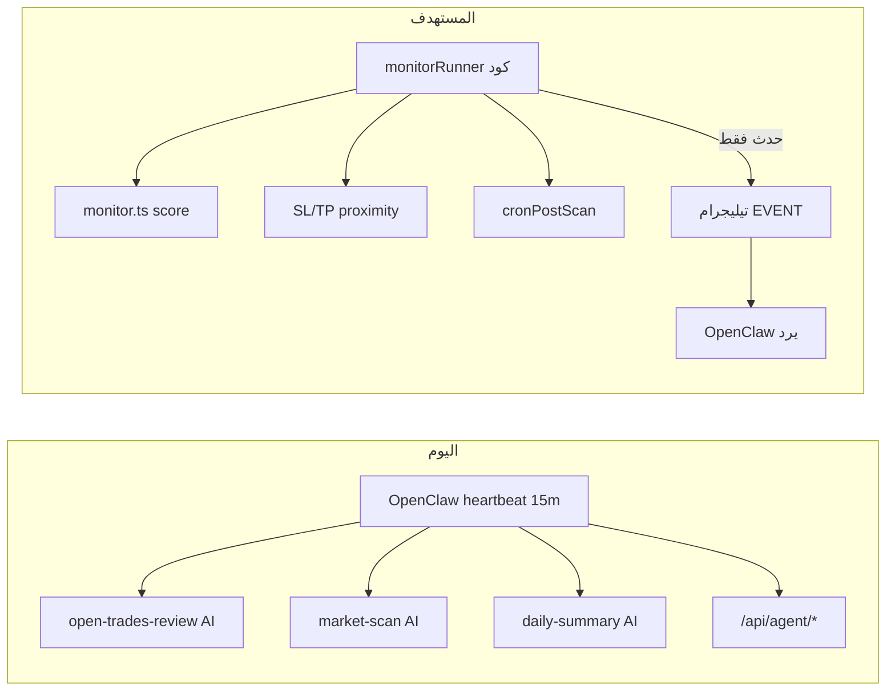

# خطة تحسين تكلفة وكيل OpenClaw — المرحلة 1 (فحص + خطة)

## ملخص التشخيص

المشكلة ليست عطلاً في AiChart بل **استهلاك مفرط لـ Anthropic** بسبب:
- **Heartbeat OpenClaw** كل `15m` يشغّل 3 مهام AI دورية ([`agent/workspace/HEARTBEAT.md`](agent/workspace/HEARTBEAT.md)) ≈ **96 نداء/يوم** حتى بلا أحداث.
- جلسة تيليجرام على VPS وصلت **~6.4 MB trajectory** — كل رسالة تعيد سياقاً ضخماً (rate limit 50K TPM).
- [`monitor.ts`](web/src/lib/monitor.ts) **ليس runner** — مجرد scoring (~96 سطر). التنسيق الفعلي اليوم = heartbeat فقط ([`infra/aichart.cron`](infra/aichart.cron) يعلّق أن cron المراقبة أُلغي لصالح heartbeat).
- [`opportunityScan.ts`](web/src/lib/opportunityScan.ts) يمسح بالكود لكن `deep:true` يستدعي **web `runAgent`** (LLM) — غير مفعّل على VPS حالياً.

---

## أ) جدول مقارنة: مهام النبض vs التغطية الحالية

| مهمة النبض (HEARTBEAT.md) | التفاصيل | مغطاة في monitor.ts / الكود اليوم؟ | ملاحظة |
|---|---|---|---|
| **open-trades-review** (15m) | `GET /api/agent/portfolio` | **لا** | لا يوجد polling دوري |
| | `POST /api/agent/maintenance` (OCO + auto-TP) | **جزئياً** | [`cronPostScan.ts`](web/src/lib/cronPostScan.ts) موجود لكن **غير مجدول** على VPS |
| | مقارنة الأطروحة بالذاكرة وإغلاق عند انكسارها | **لا** | قرار AI فقط — يُستدعى الوكيل عند حدث حرج |
| | تنبيه اقتراب حد الخسارة اليومي | **لا** | [`riskGuard.ts`](web/src/lib/riskGuard.ts) يمنع صفقات جديدة فقط |
| **market-scan** (30m) | `GET /api/agent/risk/status` | **لا** | — |
| | `POST /api/agent/market/scan` (كود فقط) | **نعم** | نفس منطق [`monitor.ts`](web/src/lib/monitor.ts) عبر [`/api/agent/market/scan`](web/src/app/api/agent/market/scan/route.ts) |
| | تحليل عميق + توصية + شارت + تنفيذ حسب الوضع | **لا** | heartbeat يفعلها بـ AI؛ يُستبدل بإيقاظ عند مرشح |
| | منع تكرار توصية 4 ساعات | **جزئياً** | cooldown في [`store.ts`](web/src/lib/store.ts) + `opportunityScan` فقط |
| | `ea/diagnostics` قبل فوركس | **لا** | يُضاف كشرط كود قبل إيقاظ الوكيل |
| **daily-summary** (24h) | ملخص أداء + صفقات | **جزئياً** | [`dailySummary.ts`](web/src/lib/dailySummary.ts) + cron `20:00 UTC` — **بدون AI** |
| | تحديث `MEMORY.md` + `memory/` | **لا** | يحتاج إيقاظ AI **مرة/يوم** فقط عند الإرسال |
| **تعليمات عامة** | فحص Kill Switch قبل تنفيذ | **جزئياً** | APIs تفحص؛ لا polling |
| | `HEARTBEAT_OK` صامت | **N/A** | يُستبدل بعدم إيقاظ الوكيل أصلاً |

**خلاصة الفجوات الحرجة قبل إلغاء النبض:**
1. مراقبة الصفقات المفتوحة (SL/TP proximity + صيانة OCO) — **إلزامية**
2. مسح السوق الدوري بالكود + إيقاظ عند مرشح — **مطلوب**
3. تنبيه حد الخسارة اليومي — **مطلوب**
4. الملخص اليومي + ذاكرة — **cron كود + إيقاظ AI يومي واحد**

**شبكة أمان (حسب طلبك):** إن فشل تغطية (1) لـ MT5/forex بشكل موثوق → إبقاء heartbeat معزول `every: 1h` بدل الإلغاء الكامل.

---

## ب) ما يقرأه كل ملف اليوم (المرحلة 1)

### [`agent/workspace/HEARTBEAT.md`](agent/workspace/HEARTBEAT.md)
ثلاث مهام YAML:
- `open-trades-review` — كل **15m**
- `market-scan` — كل **30m**
- `daily-summary` — كل **24h**

### [`web/src/lib/monitor.ts`](web/src/lib/monitor.ts)
- `scoreOpportunity` / `scanSymbol` / `scanForexSymbol` — RSI, MACD, trend, change24h
- **لا** runner، **لا** polling، **لا** إيقاظ وكيل

### [`web/src/lib/opportunityScan.ts`](web/src/lib/opportunityScan.ts) + [`/api/cron/monitor`](web/src/app/api/cron/monitor/route.ts)
- مسح متعدد الرموز + cooldown
- `deep:true` → `runAgent` (ويب، ليس OpenClaw) — **معطّل عملياً** على VPS

### [`web/src/lib/cronPostScan.ts`](web/src/lib/cronPostScan.ts)
- `syncOcoFills` + `scanOpenTradesForTakeProfit` (Binance، عتبة USD فقط)
- يُستدعى من heartbeat عبر `/api/agent/maintenance` — **ليس مجدولاً**

### [`agent/scripts/sync-model.sh`](agent/scripts/sync-model.sh) + [`openclawModelSync.ts`](web/src/lib/openclawModelSync.ts)
يكتبان فقط:
- `agents.defaults.model.primary` ← من `/api/agent/model` (لوحة الأدمن) **لا نلمس هذا المنطق**
- `thinkingDefault: "off"`
- `models[ref].params.cacheRetention: "long"`
- تسجيل `models.providers.anthropic.models[]`

**لا يكتبان:** `contextPruning`، تعطيل `heartbeat` — تُضبط يدوياً عبر [`infra/vps-instructions-deploy.sh`](infra/vps-instructions-deploy.sh) (`heartbeat: 15m`)

### [`web/src/lib/anthropic.ts`](web/src/lib/anthropic.ts)
- **cache_control موجود:** `cachedSystem`, `cachedTools`, `cachedMessages` (آخر رسالة)
- **max_tokens:** افتراضي **1500** (أقل من 4096 المطلوب)
- **لا يُلمس** `getAnthropicModel()` — يأتي من [`platformConfig.ts`](web/src/lib/platformConfig.ts)

### ملفات المعرفة (حجم اليوم)
| ملف | بايت |
|-----|------|
| AGENTS.md | 7,579 |
| SKILL.md | 9,402 |
| SOUL.md | 2,418 |
| HEARTBEAT.md | 2,279 |
| **المجموع ~26KB** | ≈ 7K توكن/نداء |

---

## ج) خطة التعديلات ملفاً بملف (بعد موافقتك)

### المرحلة 2 — سد الفجوات (كود خالص)

| ملف | التعديل |
|-----|---------|
| **جديد** [`web/src/lib/monitorRunner.ts`](web/src/lib/monitorRunner.ts) | Orchestrator دوري: لكل مستخدم نشط يشغّل فحوصات الكود ويُرجع `events[]` |
| [`web/src/lib/monitor.ts`](web/src/lib/monitor.ts) | إضافة `checkSlTpProximity(trade, price, pct=1.5)` و helpers للفوركس عبر EA positions |
| **جديد** [`web/src/lib/tradeWatch.ts`](web/src/lib/tradeWatch.ts) | جلب أسعار (Binance + forex-price)، مقارنة SL/TP، تنبيه حد الخسارة اليومي من `risk/status` |
| [`web/src/lib/cronPostScan.ts`](web/src/lib/cronPostScan.ts) | توسيع ليشمل MT5 عند الحاجة؛ يُستدعى من runner كل 5–10 دقائق |
| **جديد** [`web/src/lib/agentWake.ts`](web/src/lib/agentWake.ts) | `wakeAgentViaTelegram(event)` — رسالة منظّمة `[EVENT:...]` للمشغّل (اختيارك) |
| **جديد** [`web/src/app/api/cron/event-monitor/route.ts`](web/src/app/api/cron/event-monitor/route.ts) | `POST` محمي بـ CRON_SECRET → `runMonitorCycle()` → إيقاظ فقط عند أحداث |
| [`infra/aichart.cron`](infra/aichart.cron) | `*/10 * * * *` → event-monitor؛ الإبقاء على daily-summary |
| [`web/src/lib/dailySummary.ts`](web/src/lib/dailySummary.ts) | بعد الإرسال الكودي → `wakeAgentViaTelegram(EVENT:daily_memory)` مرة/يوم |

**قواعد الإيقاظ (تيليجرام):**
- `EVENT:market_candidate` — مرشح من المسح + diagnostics OK للفوركس
- `EVENT:trade_alert` — اقتراب SL/TP أو OCO fill
- `EVENT:daily_loss_warn` — اقتراب `daily_loss_limit_pct`
- `EVENT:daily_memory` — تحديث MEMORY بعد الملخص

### المرحلة 3 — إلغاء النبض

| ملف | التعديل |
|-----|---------|
| [`agent/scripts/sync-model.sh`](agent/scripts/sync-model.sh) | إضافة `contextPruning: { mode: "cache-ttl" }` + **حذف/تعطيل** `agents.defaults.heartbeat` (التحقق من صيغة OpenClaw: `enabled: false` أو إزالة الكتلة) — **بدون تغيير منطق primary** |
| [`web/src/lib/openclawModelSync.ts`](web/src/lib/openclawModelSync.ts) | نفس إعدادات heartbeat/contextPruning في `patchOpenClawModelConfig` (مزامنة تلقائية من لوحة الأدمن) |
| [`agent/workspace/HEARTBEAT.md`](agent/workspace/HEARTBEAT.md) | استبدال بتوثيق Event-Driven + جدول أنواع الأحداث |
| [`infra/vps-instructions-deploy.sh`](infra/vps-instructions-deploy.sh) | إزالة `heartbeat: 15m` من القالب الافتراضي |
| [`agent/README.md`](agent/README.md) | تحديث قسم التكلفة ليعكس النظام الجديد |

**شبكة أمان:** إن MT5 SL/TP غير موثوق → `heartbeat: { every: "1h", isolatedSession: true }` في sync-model فقط كـ fallback.

### المرحلة 4 — Prompt Caching

| ملف | التعديل |
|-----|---------|
| [`agent/scripts/sync-model.sh`](agent/scripts/sync-model.sh) | ضمان `contextPruning` + `cacheRetention: "long"` (موجود جزئياً) |
| [`web/src/lib/anthropic.ts`](web/src/lib/anthropic.ts) | فصل system إلى بلوك ثابت (cached) + متغير (بدون cache)؛ رفع `maxTokens` الافتراضي إلى **2048** مع سقف **4096** لمسارات الروتين |
| [`web/src/lib/agent.ts`](web/src/lib/agent.ts) | تمرير `maxTokens` أقل للمسارات الروتينية في حلقة الأدوات |

**ملاحظة:** OpenClaw caching يُضبط عبر `sync-model` — لا تغيير على اختيار النموذج.

### المرحلة 5 — اختصار المعرفة (~40%)

| ملف | الهدف |
|-----|--------|
| [`agent/workspace/AGENTS.md`](agent/workspace/AGENTS.md) | إزالة تكرار، نقاط مختصرة — **كل قواعد التداول/الأمان تبقى** |
| [`agent/workspace/SOUL.md`](agent/workspace/SOUL.md) | اختصار الصياغة |
| [`agent/workspace/skills/aichart-trading/SKILL.md`](agent/workspace/skills/aichart-trading/SKILL.md) | دمج أمثلة curl المكررة، الإبقاء على كل endpoints |
| [`agent/workspace/HEARTBEAT.md`](agent/workspace/HEARTBEAT.md) | توثيق أحداث (بعد المرحلة 3) |
| **لا حذف** | `MEMORY.md`, `memory/` |

### المرحلة 6 — التحقق والنشر

- `npm run build` في `web/`
- VPS: `bash agent/scripts/sync-workspace.sh` + `sync-model.sh` + `pm2 restart aichart-web aichart-agent`
- تثبيت cron جديد من `infra/aichart.cron`
- مسح جلسة تيليجرام الثقيلة على VPS (اختياري لكن موصى به فوراً)

---

## التوفير المتوقع (تقديري)

| البند | قبل | بعد |
|-------|-----|-----|
| نداءات AI دورية/يوم | ~96 heartbeat + رسائل المستخدم | ~0 heartbeat + 5–15 حدث/يوم + تفاعل المستخدم |
| توكنز/نداء (سياق) | 50K–100K+ (جلسة ثقيلة) | ~7–15K ثابت + متغير صغير |
| تكلفة النداء (مع long cache) | ~$0.50 | ~$0.05–0.12 للأحداث؛ ~$0.02–0.08 للردود البسيطة |
| توفير يومي تقديري | — | **80–95%** من تكلفة المراقبة الدورية |

---

## قيود مُلتزم بها

- **لا تعديل** على `ANTHROPIC_MODEL` / `primary` / `/admin/keys` model picker
- **لا إلغاء نبض** قبل اكتمال مراقبة الصفقات في monitorRunner
- **لا تغيير** Risk Guard أو منطق التداول — نقل المراقبة إلى كود فقط
- exec approvals: **allowlist + ask on-miss** (لا منع كامل)

---

## انتظر موافقتك

هذه المرحلة 1 فقط — **لم يُعدَّل أي ملف**.

بعد موافقتك الصريحة نبدأ **المرحلة 2** ثم بالترتيب حتى 6، مع إبلاغك عند إتمام كل مرحلة.
