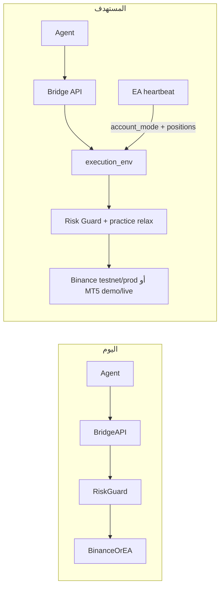
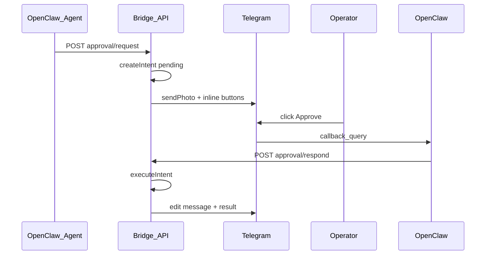

# صلاحيات الوكيل: ديمو/حقيقي + عرض الصفقات + صفقات تجريبية

## الوضع الحالي (الفجوات)

| المطلوب | اليوم |
|---------|--------|
| عرض الصفقات المفتوحة عند طلبك | `GET /api/agent/portfolio` يعرض صفقات **AiChart DB** فقط — لا مراكز MT5 الحية ولا تفصيل جاهز للرد |
| معرفة ديمو vs حقيقي | Binance: `portfolio.binance.env` (testnet/prod) — **غير مُلخّص في risk/status**؛ MT5: **لا يُرسل** نوع الحساب من EA |
| التبديل ديمو ↔ حقيقي | Binance: صف واحد فقط في `binance_accounts` — التبديل يستبدل المفاتيح؛ MT5: التبديل = تسجيل دخول حساب آخر على التيرمينال |
| صفقة على حركة بسيطة في الديمو | قواعد الوكيل: ثقة ≥75% + مسح مرشحين — **لا استثناء للديمو** |
| صفقة تجريبية عند طلبك | `approved_by_user` يتجاوز وضع approval/direct فقط؛ **Risk Guard** ما زال يمنع (هدف ربح يومي، حد صفقات، إلخ) |
| موافقة بأزرار تيليجرام | [`tradeFlow.ts`](web/src/lib/tradeFlow.ts) يذكر صراحةً أن أزرار `callback` **أُزيلت** مع webhook القديم — اليوم الموافقة تتطلب كتابة «نفّذ/وافق» في محادثة OpenClaw |



---

## 1) طبقة `execution_env` موحّدة

**ملف جديد:** [`web/src/lib/executionEnv.ts`](web/src/lib/executionEnv.ts)

يحسب لكل مستخدم:

```ts
type ExecutionEnv = "demo" | "live";

interface ExecutionEnvSnapshot {
  preference: ExecutionEnv;      // ما يريده المشغّل (إعداد)
  crypto: { connected: boolean; actual: "testnet"|"prod"|null; resolved: ExecutionEnv };
  forex: { connected: boolean; actual: "demo"|"live"|null; resolved: ExecutionEnv };
  mismatch: boolean;             // preference ≠ actual للسوق النشط
  activeMarket: MarketType;
}
```

**مصادر الحقيقة:**
- **Crypto:** `binance_accounts` — بعد تعديل المخطط (القسم 2)
- **Forex:** حقل جديد `account_trade_mode` من heartbeat EA (`demo` | `live` | `contest`)

**إعداد جديد** في `trading_settings`:
- `execution_env_preference TEXT DEFAULT 'demo'` — يُضاف في [`web/src/lib/db/sqlite.ts`](web/src/lib/db/sqlite.ts) و [`web/src/lib/db/pg.ts`](web/src/lib/db/pg.ts) + [`web/src/lib/types.ts`](web/src/lib/types.ts)

**توسيع:**
- [`web/src/app/api/agent/risk/status/route.ts`](web/src/app/api/agent/risk/status/route.ts) — يُرجع كتلة `executionEnv` كاملة
- [`web/src/app/api/agent/portfolio/route.ts`](web/src/app/api/agent/portfolio/route.ts) — نفس الملخص + `openPositions` (القسم 3)

---

## 2) التبديل بين ديمو وحقيقي (Binance + MT5)

### Binance — مفاتيح منفصلة لكل بيئة

**تغيير مخطط** `binance_accounts`: المفتاح الأساسي `(user_id, env)` بدل `user_id` فقط — يسمح بحفظ **testnet و prod معاً**.

**تحديث** [`web/src/lib/store.ts`](web/src/lib/store.ts):
- `getBinanceCredentials(userId, env?)` — يستخدم `execution_env_preference` أو `active_binance_env`
- `saveBinanceAccount` — upsert حسب `env`
- `listBinanceAccounts(userId)` — للواجهة والوكيل

**Bridge جديد للوكيل:**
- `GET /api/agent/execution/env` — لقطة `ExecutionEnvSnapshot`
- `POST /api/agent/execution/env` — body: `{ "preference": "demo"|"live" }`
  - يحدّث `execution_env_preference`
  - إن وُجدت مفاتيح للبيئة المطلوبة → يفعّلها
  - إن لم تُربط → `ok: false` مع رسالة: «اربط مفاتيح testnet/prod من الإعدادات أولاً»
- `POST /api/agent/binance/connect` (bridge mirror لـ [`web/src/app/api/binance/connect/route.ts`](web/src/app/api/binance/connect/route.ts)) — لربط مفاتيح بيئة محددة دون جلسة متصفح

### MT5 — التبديل عبر التيرمينال + تحقق تلقائي

**EA** [`ea/mt5/AiChartBridge.mq5`](ea/mt5/AiChartBridge.mq5) v1.03:
- في `BuildHeartbeat()` أضف:
  - `account.trade_mode`: `demo` | `live` (من `ACCOUNT_TRADE_MODE`)
  - `positions[]`: المراكز المفتوحة (ticket, symbol, side, lots, sl, tp, profit)

**خادم:** [`web/src/app/api/ea/heartbeat/route.ts`](web/src/app/api/ea/heartbeat/route.ts) + [`web/src/lib/eaStore.ts`](web/src/lib/eaStore.ts):
- أعمدة: `account_trade_mode`, `positions_json`
- عند `POST /api/agent/execution/env` مع `preference: demo` والـ EA يُبلّغ `live` → **لا يُنفّذ صفقة live** حتى يبدّل المشغّل حساب MT5 (الوكيل يشرح ذلك صراحة)

---

## 3) عرض الصفقات المفتوحة عند طلبك

**Endpoint جديد:** `GET /api/agent/trades/open`

يرجع:

```json
{
  "executionEnv": { ... },
  "aichartTrades": [ /* من listOpenTrades */ ],
  "brokerPositions": {
    "mt5": [ /* من آخر heartbeat positions_json */ ],
    "binance": null
  },
  "summary_ar": "نص جاهز للنسخ في تيليجرام"
}
```

- `summary_ar` يُبنى في الخادم (رمز، اتجاه، حجم، SL/TP، بيئة ديمو/حقيقي) — الوكيل ينسخه عند «ورّيني الصفقات المفتوحة».
- **توثيق الوكيل:** [`agent/workspace/skills/aichart-trading/SKILL.md`](agent/workspace/skills/aichart-trading/SKILL.md) + [`agent/workspace/AGENTS.md`](agent/workspace/AGENTS.md):
  - عند أي طلب صريح لعرض الصفقات → `GET /api/agent/trades/open` (وليس portfolio فقط)
  - اذكر دائماً: بيئة الحساب (ديمو/حقيقي) + مصدر كل صفقة (AiChart vs مركز MT5 مباشر)

---

## 4) صفقات الديمو وصفقات التجربة عند طلبك

### أ) `practice` في فتح الصفقة

**توسيع** [`web/src/app/api/agent/trade/open/route.ts`](web/src/app/api/agent/trade/open/route.ts):

```ts
practice: z.boolean().default(false)  // صفقة تجريبية بموافقة المشغّل
```

يمرّر إلى `executeIntent` → `evaluateTrade` عبر `RiskContext`:

```ts
practiceMode?: boolean;
resolvedEnv?: ExecutionEnv;
```

### ب) تخفيف Risk Guard في الديمو/التجربة

**تحديث** [`web/src/lib/riskGuard.ts`](web/src/lib/riskGuard.ts) — عند `practiceMode === true` **أو** `resolvedEnv === "demo"`:

| القيد | سلوك جديد |
|--------|-----------|
| وضع approval/direct | يُتجاوز إذا `practice` أو `approved_by_user` |
| هدف الربح اليومي (نسبة/USDT) | **لا يمنع** في الديمو |
| حد الخسارة اليومي/الشهري | يبقى مفعّلاً (حماية) |
| Kill Switch / master kill | يبقى مفعّلاً دائماً |
| `can_execute` من الأدمن | يبقى — إن أردت تجربة كاملة، فعّله من لوحة الأدمن |
| تطابق `execution_env_preference` مع الحساب الفعلي | **يمنع** تنفيذ live عندما preference=demo |

**لا يُضاف** تجاوز لـ Kill Switch أو الأصول غير المسموحة.

### ج) قواعد سلوك الوكيل (ليست API)

**تحديث** [`agent/workspace/SOUL.md`](agent/workspace/SOUL.md) و `AGENTS.md`:

| السياق | القاعدة الجديدة |
|--------|-----------------|
| `executionEnv.resolved === "demo"` | ثقة ≥ **50%** تكفي؛ **لا يشترط** مرشح في `market/scan` |
| طلب صريح: «جرّب صفقة» / «نفّذ تجريب» | **`POST /api/agent/approval/request`** أولاً (أزرار ✅/❌) — لا `trade/open` قبل الموافقة إلا بعد ضغط الزر أو أمر نصي صريح جداً |
| قبل أي صفقة | `GET /api/agent/execution/env` — اذكر للمشغّل: ديمو أم حقيقي |
| تبديل البيئة | `POST /api/agent/execution/env` ثم أعد التحقق |

### د) لجنة التداول

في [`web/src/app/api/agent/recommendation/route.ts`](web/src/app/api/agent/recommendation/route.ts): عند `demo` + `practice` لا تُحسب `committee` كحاجز للتنفيذ (أو `autoBlocked: false` صريح في الرد).

---

## 5) موافقة بأزرار تيليجرام (بدل كتابة «وافق»)

### المشكلة التقنية

- **OpenClaw** يملك webhook تيليجرام ([`web/src/app/api/telegram/setup/route.ts`](web/src/app/api/telegram/setup/route.ts) يحذف webhook المنصة).
- المنصة ترسل **إشعارات صادرة** فقط عبر [`web/src/lib/telegram.ts`](web/src/lib/telegram.ts) — `dispatchAlert` يدعم `buttons` لكن [`approvalCard`](web/src/lib/telegram.ts) اليوم يطلب الموافقة **نصياً**.
- ضغط زر `callback_data` يصل إلى **OpenClaw** وليس المنصة — نحتاج جسراً للمعالجة.



### أ) طبقة الموافقة في المنصة

**ملف جديد:** [`web/src/lib/approvalFlow.ts`](web/src/lib/approvalFlow.ts)

- أنواع الطلب: `trade` · `practice` · `env_switch` · `kill_switch` · `mode_change`
- `createApprovalRequest()` → ينشئ `trade_intent` بحالة `pending` (أو سجل `approval_requests` خفيف إن لزم)
- `buildApprovalButtons(intentId, kind)` — أزرار ثنائية اللغة

**توسيع** [`web/src/lib/telegram.ts`](web/src/lib/telegram.ts):

```ts
export type InlineButton =
  | { text: string; callback_data: string }
  | { text: string; url: string };  // fallback مضمون بدون webhook
```

**Bridge endpoints جديدة:**

| Endpoint | الغرض |
|----------|--------|
| `POST /api/agent/approval/request` | إنشاء طلب + إرسال بطاقة + أزرار لتيليجرام |
| `GET /api/agent/approval/pending` | ما بانتظار موافقتك (للرد عند «شو المعلّق؟») |
| `POST /api/agent/approval/respond` | `{ intent_id, action: approve\|reject }` — للوكيل أو جسر OpenClaw |

**روابط موقّعة (تعمل دائماً):**

- `GET /api/telegram/act?action=approve&intent=123&sig=…&exp=…`
- HMAC بـ `APP_SECRET`، صلاحية 30 دقيقة، استخدام لمرة واحدة
- أزرار من نوع `url` في تيليجرام — **لا تعتمد على callback webhook**
- صفحة HTML بسيطة: «تم التنفيذ» / «تم الرفض»

**إعادة تفعيل الأزرار في المسار القديم:**

- [`web/src/lib/tradeFlow.ts`](web/src/lib/tradeFlow.ts) — عند `pending` مرّر `approvalButtons()` إلى `dispatchAlert({ buttons })`
- تحديث نص `approvalCard` — «اضغط ✅ أو ❌ أدناه» بدل «اطلب من الوكيل نفّذ»

### ب) جسر OpenClaw لـ `callback_data` (تحسين UX اختياري)

إن ضُبط في `~/.openclaw/openclaw.json` hook يمرّر `callback_query` التي تبدأ بـ `ac:` إلى:

```bash
curl -sf -X POST -H "Authorization: Bearer $AICHART_SERVICE_TOKEN" \
  -d '{"intent_id":123,"action":"approve"}' \
  "$AICHART_API_URL/api/agent/approval/respond"
```

**توثيق:** [`docs/TELEGRAM_APPROVAL_BUTTONS.md`](docs/TELEGRAM_APPROVAL_BUTTONS.md) + مقطع في [`agent/README.md`](agent/README.md).

> الأولوية: **أزرار URL الموقّعة** (تعمل فوراً) ثم callback عبر OpenClaw إن وُجدت نقطة ربط في الإصدار المثبّت.

### ج) متى أزرار vs متى نص — قواعد الوكيل

**تحديث إلزامي** في [`agent/workspace/AGENTS.md`](agent/workspace/AGENTS.md) و [`agent/workspace/skills/aichart-trading/SKILL.md`](agent/workspace/skills/aichart-trading/SKILL.md):

| الموقف | الأزرار | النص الحر |
|--------|---------|-----------|
| وضع `approval` + توصية/صفقة تريد تنفيذها | **نعم** — `POST approval/request` ثم انتظر | لا تفترض موافقة من النقاش العام |
| صفقة `practice` / تجربة قدرة الوكيل | **نعم** — أزرار «✅ تجربة» / «❌ إلغاء» | |
| تبديل ديمو ↔ حقيقي | **نعم** — «ديمو» / «حقيقي» / «إلغاء» | |
| تفعيل Kill Switch أو إغلاق الكل | **نعم** — تأكيد مزدوج | |
| تحليل، شارت، سؤال عام، ملخص | **لا** | محادثة عادية |
| وضع `auto` + شروط مستوفاة | **لا** | نفّذ وأبلغ بنص |
| أمر صريح واضح: «نفّذ الآن EURUSD 0.01 لوت» | **لا** (اختياري) | `approved_by_user: true` مباشرة |
| نقاش غامض: «ممكن ندخل؟» | **نعم** | لا تُنفّذ قبل زر أو صياغة صريحة جداً |

**قاعدة ذهبية:** إن كان القرار **ينفّذ مالاً حقيقياً أو يغيّر إعداداً** → أزرار افتراضياً. إن كان **معلوماتياً** → نص فقط.

**بعد الموافقة بالزر:** المنصة تنفّذ تلقائياً — الوكيل **لا يعيد** طلب «اكتب وافق». يُبلّغ بنتيجة التنفيذ فقط.

**بعد الرفض بالزر:** يُعلِم المشغّل ولا يُعيد طرح نفس الصفقة خلال 4 ساعات.

### د) ربط مع قسم الديمو/التجربة

- طلب «جرّب صفقة» في الديمو → `approval/request` مع `kind: practice` و `practice: true` في الـ payload
- عند الموافقة بالزر → `executeIntent` مع `explicitApproval: true` + `practiceMode: true`
- يُلغى شرط كتابة «موافق» من [`agent/workspace/AGENTS.md`](agent/workspace/AGENTS.md) (السطر الحالي عن «نفّذ، وافق»)

---

## 6) واجهة الإعدادات (اختياري لكن مُوصى به)

توسيع [`web/src/components/SettingsClient.tsx`](web/src/components/SettingsClient.tsx):
- مبدّل «بيئة التنفيذ المفضّلة: تجريبي / حقيقي»
- عرض حالة التطابق (Binance + MT5)
- ربط منفصل لمفاتيح testnet و prod

---

## 7) نشر

1. Migration DB على VPS
2. Compile EA v1.03 على Windows
3. `bash agent/scripts/sync-workspace.sh` + build + pm2 restart
4. اختبار يدوي:
   - «ورّيني الصفقات» → يرد بملخص + بيئة الحساب
   - «حوّل للديمو» → أزرار تأكيد ثم تبديل preference
   - توصية في وضع approval → رسالة تيليجرام بأزرار ✅/❌ **بدون** كتابة «وافق»
   - ضغط ✅ → تنفيذ تلقائي + تعديل الرسالة
   - «جرّب صفقة EURUSD» على ديمو → أزرار تجربة ثم تنفيذ `practice: true`

---

## ملاحظات مهمة

- **MT5:** التبديل الفعلي بين ديمو وحقيقي يبقى بتسجيل الدخول على التيرمينال — المنصة **تكتشف** و**تمنع** التنفيذ على بيئة خاطئة، ولا «تسجّل دخول» عن بُعد.
- **Binance:** Testnet و Live يحتاجان عادةً **مفتاحين مختلفين** — الخطة تدعم حفظ الاثنين والتبديل بينهما من الوكيل.
- **الأمان:** صفقات `practice` على حساب **live** ممكنة تقنياً بموافقتك — الوكيل يُنبّه صراحةً قبل التنفيذ إذا `resolved === "live"`.
