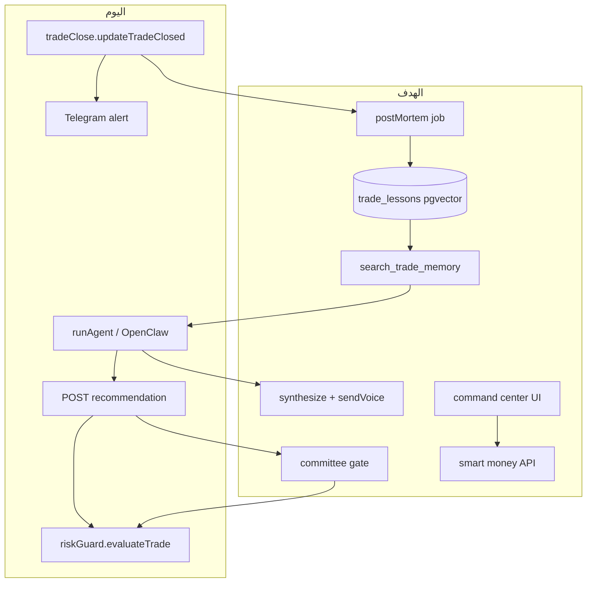
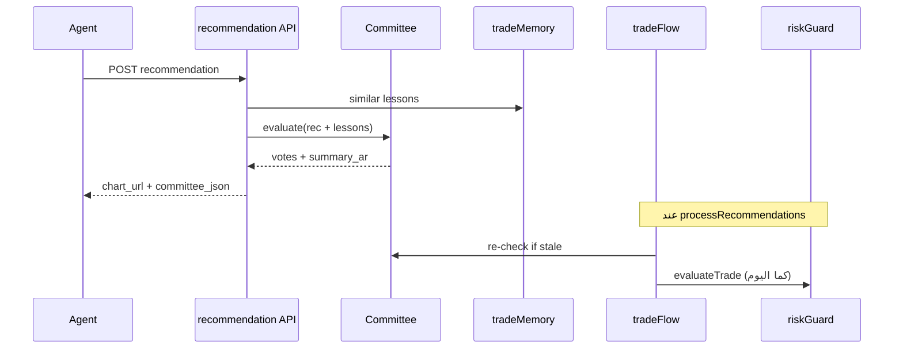
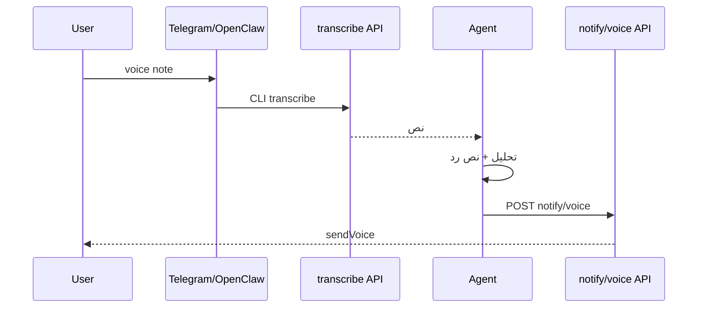
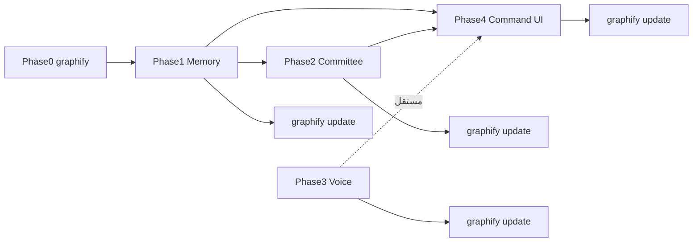

# خطة القدرات الذكية الأربع — AiChart

## الوضع الحالي (نقطة الانطلاق)

| القدرة | الموجود | الناقص |
|--------|---------|--------|
| إغلاق الصفقة + PnL | [`web/src/lib/tradeClose.ts`](web/src/lib/tradeClose.ts) يستدعي `updateTradeClosed` و`dispatchAlert` | لا تحليل «لماذا نجحت/فشلت» |
| الذاكرة | ملفات OpenClaw: `MEMORY.md` + `memory/YYYY-MM-DD.md` ([`agent/workspace/AGENTS.md`](agent/workspace/AGENTS.md)) | لا بحث دلالي، لا ربط بصفقة مغلقة |
| قرار التداول | وكيل واحد + [`riskGuard.ts`](web/src/lib/riskGuard.ts) (قواعد صلبة) | لا «لجنة» متعددة الشخصيات |
| بيانات السوق | [`marketContext.ts`](web/src/lib/marketContext.ts)، [`binanceWeb3.ts`](web/src/lib/binanceWeb3.ts) | لا واجهة heatmap / whale bubbles |
| الصوت | STT عبر [`/api/agent/transcribe`](web/src/app/api/agent/transcribe/route.ts) + OpenClaw CLI | لا TTS ولا `sendVoice` |



---

## الخطوة 0 — graphify (إلزامي قبل أي تنفيذ)

**قبل كتابة سطر كود واحد** — حسب قاعدة المشروع [`.cursor/rules/graphify.mdc`](.cursor/rules/graphify.mdc):

### 0.1 استكشاف السياق (قراءة فقط)

```powershell
py -m graphify query "trade close post-mortem memory embedding pgvector"
py -m graphify query "agent recommendation committee risk guard trade flow"
py -m graphify path "tradeClose" "agent.ts"
py -m graphify explain "riskGuard"
```

راجع النتائج ثم — إن وُجد — [`graphify-out/wiki/index.md`](graphify-out/wiki/index.md) و[`graphify-out/GRAPH_REPORT.md`](graphify-out/GRAPH_REPORT.md) للمراجعة المعمارية الواسعة.

### 0.2 إعادة بناء الرسم إن كان قديماً

إن لم يكن `graphify-out/graph.json` محدثاً بعد تغييرات MT5 الأخيرة:

```powershell
py -m graphify web/src --exclude vendor --no-viz
py -m graphify cluster-only web/src --no-viz
```

### 0.3 بعد كل مرحلة تنفيذ

```powershell
py -m graphify update web/src
```

يُشغَّل **فور انتهاء كل مرحلة** (AST فقط، بدون تكلفة API) — وليس فقط عند النشر النهائي.

**معيار القبول:** `graphify query` يعيد عقد `tradeClose`، `agent.ts`، `riskGuard`، `tradeFlow` قبل بدء المرحلة 1؛ و`graphify update` يُشغَّل بعد كل دفعة تعديلات.

---

## المرحلة 1 — ذاكرة ما بعد الصفقة (Post-Mortem + pgvector)

**الهدف:** بعد كل إغلاق صفقة، يُولَّد «درس» مُهيكل ويُخزَّن مع embedding؛ عند تحليل مشابه يُسترجَع تلقائياً.

### 1.1 مخطط البيانات

جدول جديد `trade_lessons` (SQLite + PostgreSQL):

- `id`, `user_id`, `trade_id`, `recommendation_id` (nullable عبر intent)
- `symbol`, `market`, `timeframe`, `pattern_name`
- `outcome` (`win` | `loss` | `breakeven`), `pnl`, `pnl_pct`
- `entry_context_json` — لقطة فنية عند الدخول (RSI، اتجاه، SL/TP)
- `lesson_ar` — نص الدرس (2–4 جمل)
- `tags_json` — مثل `["early_entry","btc","h1"]`
- `embedding vector(1536)` — pgvector؛ SQLite: عمود `embedding_json` + بحث brute-force محلي (حجم صغير)
- `created_at`

تفعيل `CREATE EXTENSION vector` على VPS في [`web/src/lib/db/pg.ts`](web/src/lib/db/pg.ts).

### 1.2 محرك Post-Mortem

ملف جديد [`web/src/lib/tradePostMortem.ts`](web/src/lib/tradePostMortem.ts):

1. يجمع سياق الصفقة: `getTrade` → `intent_id` → recommendation + `context_json` المحفوظ
2. يستدعي Claude (أو النموذج الحالي) ببرومبت ثابت: «حلّل لماذا نجحت/فشلت، ما الخطأ السلوكي، ماذا تفعل المرة القادمة»
3. يولّد embedding عبر OpenRouter/OpenAI-compatible endpoint (نفس مفتاح OpenRouter الموجود)
4. يحفظ في `trade_lessons`

**خطاف التشغيل:** استدعاء غير حاجز من كل مسارات الإغلاق في [`tradeClose.ts`](web/src/lib/tradeClose.ts) بعد `updateTradeClosed` الناجح (`closeOpenTrade`, `syncOcoFills`, `scanOpenTradesForTakeProfit`, `closeAllOpenTrades`). استخدم `void runTradePostMortem(...).catch(log)` حتى لا يبطئ الإغلاق.

### 1.3 استرجاع الذاكرة للوكيل

- مكتبة [`web/src/lib/tradeMemory.ts`](web/src/lib/tradeMemory.ts): `searchSimilarLessons(userId, { symbol, pattern, snapshot })` — cosine على pgvector
- أداة جديدة في [`web/src/lib/agent.ts`](web/src/lib/agent.ts): `search_trade_memory`
- Bridge API: `GET /api/agent/memory/lessons?symbol=BTCUSDT&limit=3`
- حقن تلقائي: في [`marketAnalyze.ts`](web/src/lib/marketAnalyze.ts) و`POST /api/agent/recommendation` — أضف فقرة «دروس مشابهة» للبرومبت إن وُجدت نتائج (score > 0.75)
- تحديث [`agent/workspace/skills/aichart-trading/SKILL.md`](agent/workspace/skills/aichart-trading/SKILL.md) و`AGENTS.md`: «قبل توصية، استدعِ memory/lessons واذكر الدرس صراحة إن وُجد»

**معيار القبول:** إغلاق صفقة BTC → يظهر سجل في `trade_lessons`؛ توصية لاحقة على BTC/H1 تُرجع درساً مشابهاً في الرد.

---

## المرحلة 2 — لجنة الوكلاء (Multi-Agent Committee)

**الهدف:** قبل تحويل توصية إلى intent/تنفيذ، ثلاثة آراء منفصلة؛ **مدير المخاطر يملك حق النقض (veto)**.

### 2.1 التصميم

ملف [`web/src/lib/committee.ts`](web/src/lib/committee.ts) — **ليس بديلاً لـ riskGuard** بل طبقة LLM فوقه:

| الشخصية | الدور | مصادر البيانات |
|---------|-------|----------------|
| Aggressive | فرص سريعة، ثقة عالية | snapshot، smart money |
| RiskOfficer | رفض صفقات خطرة | risk/status، دروس الذاكرة، حدود اليوم |
| Macro | سياق أخبار/مزاج | `fetchMarketContext`, fear/greed |

تنفيذ MVP: **استدعاء واحد structured** (JSON بثلاثة كتل) لتقليل التكلفة؛ كل كتلة: `{ vote: approve\|reject\|wait, confidence, rationale_ar }`.

قواعد الإجماع (قابلة للإعداد لاحقاً في `trading_settings`):

- `RiskOfficer.vote === reject` → **حظر التنفيذ** (يُحوَّل action إلى `wait` أو يُرفض intent)
- التنفيذ التلقائي في `auto` يتطلب: Aggressive أو Macro = approve **و** RiskOfficer ≠ reject
- في `approval`: اللجنة تُرفق بالتوصية للمشغّل دون حظر إلزامي (إلا veto المخاطر إن فُعِّل `committee_strict=1`)

### 2.2 نقاط الدمج



- توسيع [`Recommendation`](web/src/lib/types.ts): `committee_json`, `memory_refs_json`
- [`web/src/app/api/agent/recommendation/route.ts`](web/src/app/api/agent/recommendation/route.ts): تشغيل اللجنة بعد الحفظ
- [`web/src/lib/tradeFlow.ts`](web/src/lib/tradeFlow.ts): قبل `createIntent` — رفض إن veto
- واجهة: بطاقة لجنة في [`MarketRecPanel.tsx`](web/src/components/market/MarketRecPanel.tsx) ورسالة Telegram تلخص الأصوات الثلاثة

**معيار القبول:** توصية عدوانية على أصل فيه درس خسارة مشابه → RiskOfficer يرفض → لا intent في `auto`.

---

## المرحلة 3 — الرد الصوتي (TTS + Telegram)

**الهدف:** المشغّل يرسل رسالة صوتية (موجود STT) ويستقبل رداً صوتياً عند الطلب.

### 3.1 البنية

| المكوّن | الملف المقترح |
|---------|---------------|
| TTS | [`web/src/lib/openrouter.ts`](web/src/lib/openrouter.ts) — `synthesizeSpeech(text, voice?)` عبر نموذج صوتي من OpenRouter (أو fallback: OpenAI `tts-1`) |
| إرسال صوت | [`web/src/lib/telegram.ts`](web/src/lib/telegram.ts) — `sendVoice(chatId, oggBuffer)` |
| Bridge | `POST /api/agent/notify/voice` — `{ text, userId? }` → يولّد OGG/MP3 ويرسل عبر `notifyUserVoice` |
| إعدادات | [`platformConfig.ts`](web/src/lib/platformConfig.ts): `OPENROUTER_TTS_MODEL`, `VOICE_RESPONSES_ENABLED` |
| الوكيل | تحديث SKILL: «عند طلب صوتي صريح ("رد عليّ بصوت") استدعِ notify/voice بعد النص» |

OpenClaw يبقى يدير المحادثة؛ المنصة ترسل الصوت كـ push منفصل (مثل الإشعارات الحالية) لتجنب تعقيد webhook.

### 3.2 تدفق Telegram



**معيار القبول:** «ما رأيك في ETH؟» صوتياً → نص + ملف صوتي عربي على Telegram خلال <30ث.

---

## المرحلة 4 — مركز القيادة البصري (Visual Command Center)

**الهدف:** صفحة `/command` — heatmap أداء + تدفق أموال ذكية كفقاعات حية (MVP «بلومبرج مصغّر»).

### 4.1 الصفحة والبيانات

- مسار جديد: [`web/src/app/command/page.tsx`](web/src/app/command/page.tsx) + [`CommandCenterClient.tsx`](web/src/components/command/CommandCenterClient.tsx)
- رابط في [`AppShell.tsx`](web/src/components/AppShell.tsx)
- APIs:
  - `GET /api/command/heatmap` — يدمج [`buildSymbolPerformance`](web/src/lib/analytics.ts) + `/api/market/tickers` لتلوين الخلايا (PnL تاريخي + تغير 24س)
  - `GET /api/command/flow` — يغلّف `smartMoneySignals` + `crypto_market_rank(smart-money-inflow)` مع cache 30ث

### 4.2 المكوّنات البصرية (MVP)

1. **HeatmapGrid** — شبكة رموز المستخدم المسموحة؛ لون الخلية = أداء تاريخي، حدود = تغير لحظي
2. **WhaleBubbles** — canvas/React: كل صفقة كبيرة = فقاعة (حجم = notional، لون = buy/sell)، تتلاشى بعد 8ث (بيانات mock→live من Web3)
3. **MacroTicker** — شريط أخبار من `marketContext` + fear/greed
4. **CommitteeFeed** — آخر قرارات اللجنة (من المرحلة 2)
5. **MemoryHighlights** — آخر 3 دروس (من المرحلة 1)

لا حاجة لمكتبة 3D في MVP؛ Canvas 2D + Tailwind يكفيان ([`ckm-ui-styling`](C:\Users\ALALMIA\.agents\skills\ckm-ui-styling\SKILL.md) للاتساق).

**معيار القبول:** فتح `/command` يعرض heatmap حي + فقاعات تظهر عند وصول إشارات smart money.

---

## ترتيب التنفيذ والتبعيات



| المرحلة | الجهد التقريبي | يعتمد على |
|---------|----------------|-----------|
| 0 graphify | ~15 دقيقة | — (أول خطوة دائماً) |
| 1 Post-Mortem | 3–4 أيام | المرحلة 0 + pgvector على VPS |
| 2 Committee | 2–3 أيام | المرحلة 1 |
| 3 Voice TTS | 1–2 يوم | OpenRouter TTS model |
| 4 Command Center | 4–5 أيام | 1 + 2 للبيانات الغنية |

**الإجمالي:** ~2–3 أسابيع عمل مركّز.

---

## نشر VPS (بعد كل مرحلة)

1. **`py -m graphify update web/src`** — محلياً قبل commit (يُحدّث `graphify-out/`)
2. `CREATE EXTENSION IF NOT EXISTS vector` على PostgreSQL
3. `git pull` + `npm run build` في `web/`
4. `agent/scripts/sync-workspace.sh` لتحديث SKILL/AGENTS
5. اختبار E2E: إغلاق صفقة → درس → توصية تذكره → لجنة → صوت → `/command`

---

## مخاطر وتخفيف

- **تكلفة LLM:** Post-mortem + لجنة = نداءات إضافية → تشغيل post-mortem async فقط؛ لجنة structured-call واحد؛ cache لـ market context
- **pgvector على SQLite محلي:** fallback `embedding_json` + بحث خطي (كافٍ للتطوير)
- **Whale data:** Binance Web3 قد يتأخر → عرض «آخر تحديث» + stale badge
- **TTS عربي:** اختبار نماذج OpenRouter مبكراً؛ fallback نص إن فشل التوليد

---

## خارج النطاق (هذه الخطة)

- تغيير OpenClaw ليرد صوتياً داخل نفس رسالة Telegram بدون Bridge
- Order book L2 حقيقي (يتطلب بيانات منصة مدفوعة) — MVP يستخدم smart money كبديل «تدفق»
- إعادة تدريب نماذج مخصصة
