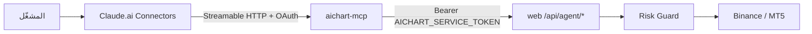
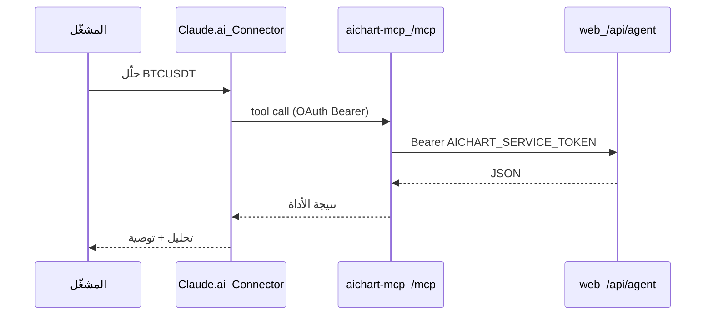

# خطة AiChart MCP — التداول من Claude Connectors

## الهدف

استبدال دور OpenClaw كـ **واجهة محادثة + أدوات تداول** عبر:



OpenClaw يُوقَف لاحقاً؛ المنصة (`web`) تبقى مصدر التنفيذ والحماية — **لا تغيير في Risk Guard**.

---

## قرارات التصميم

| القرار | الاختيار | السبب |
|--------|----------|-------|
| مكان الكود | مجلد جديد [`mcp/`](mcp/) | فصل عن Next.js؛ عملية مستقلة على pm2 |
| النقل | **Streamable HTTP** فقط | مطلوب لـ Claude.ai Connectors (ليس stdio) |
| المصادقة | **OAuth 2.1 + PKCE** (minimal DCR) | Claude **لا يدعم** Bearer ثابت في Connectors؛ `none` خطر على تداول حقيقي |
| Bridge auth | إعادة استخدام [`AICHART_SERVICE_TOKEN`](web/src/lib/agentAuth.ts) داخلياً | MCP = proxy آمن؛ Claude لا يرى التوكن |
| OpenClaw | إيقاف تشغيل + توثيق | لا حذف كود فوري — [`agent/`](agent/) يبقى أرشيفاً |

**قيود بعد إيقاف OpenClaw** (يُوثَّق صراحة):
- لا بوت Telegram تفاعلي (المنصة ترسل إشعارات outbound فقط)
- `[EVENT:…]` من [`agentWake.ts`](web/src/lib/agentWake.ts) لن يُعالَج تلقائياً — التداول يصبح **من شات Claude** عند طلبك

---

## هيكل المشروع الجديد

```
mcp/
  package.json              # @modelcontextprotocol/sdk, express/hono, jose
  tsconfig.json
  src/
    index.ts                # bootstrap HTTP server
    config.ts               # env validation
    bridge/
      client.ts             # fetch → AICHART_API_URL + service token
    server/
      mcpServer.ts          # McpServer + tool registration
      transport.ts          # Streamable HTTP handler
    auth/
      oauth.ts              # auth code + PKCE + token endpoint
      protectedResource.ts  # RFC 9728 /.well-known/oauth-protected-resource
      login.ts              # صفحة دخول بسيطة (admin email/password)
    tools/
      risk.ts               # get_risk_status, set_mode, kill_switch
      market.ts             # snapshot, price, context, scan
      portfolio.ts          # portfolio, open_trades
      trade.ts              # open, close, evaluate, exit_decision
      recommendation.ts     # create_recommendation, lessons
      execution.ts          # get/set execution env
      approval.ts           # request/respond approval
  README.md                 # ربط Claude + env vars
```

---

## أدوات MCP (MVP — تغطي 90% من سيناريو الشات)

كل أداة = wrapper typed يستدعي Bridge API الموجود؛ schemas مأخوذة من zod في routes مثل [`trade/open/route.ts`](web/src/app/api/agent/trade/open/route.ts) و[`recommendation/route.ts`](web/src/app/api/agent/recommendation/route.ts).

| أداة MCP | Bridge endpoint |
|----------|-----------------|
| `get_risk_status` | `GET /api/agent/risk/status` |
| `get_market_snapshot` | `GET /api/agent/market/snapshot` |
| `get_market_price` | `GET /api/agent/market/price` |
| `get_market_context` | `GET /api/agent/market/context` |
| `scan_market` | `POST /api/agent/market/scan` |
| `get_portfolio` | `GET /api/agent/portfolio` |
| `get_open_trades` | `GET /api/agent/trades/open` |
| `get_trade_lessons` | `GET /api/agent/memory/lessons` |
| `create_recommendation` | `POST /api/agent/recommendation` |
| `open_trade` | `POST /api/agent/trade/open` |
| `close_trade` | `POST /api/agent/trade/close` |
| `evaluate_trade` | `GET /api/agent/trade/evaluate` |
| `record_exit_decision` | `POST /api/agent/trade/exit-decision` |
| `request_approval` | `POST /api/agent/approval/request` |
| `respond_approval` | `POST /api/agent/approval/respond` |
| `get_execution_env` | `GET /api/agent/execution/env` |
| `set_execution_env` | `POST /api/agent/execution/env` |
| `set_trading_mode` | `POST /api/agent/mode` |
| `set_kill_switch` | `POST /api/agent/kill-switch` |

**مرحلة لاحقة (اختياري):** futures, EA diagnostics, binance-capture (payloads كبيرة).

**MCP Resource (اختياري مفيد):** `aichart://trading-rules` — نص مختصر من [`AGENTS.md`](agent/workspace/AGENTS.md) ليقرأه Claude قبل التداول.

---

## المصادقة (OAuth 2.1 minimal)

Claude Connectors تتوقع:

1. طلب بدون token → `401` + `WWW-Authenticate: Bearer resource_metadata="https://…/.well-known/oauth-protected-resource"`
2. metadata يشير لـ authorization server على نفس origin
3. تدفق authorization code + **PKCE S256**
4. DCR endpoint بسيط (`POST /oauth/register`) لـ Claude

**تحقق الهوية:** صفحة login تتحقق من **حساب admin** عبر endpoint داخلي جديد خفيف في web:

- `POST /api/admin/mcp-auth/verify` — admin-only، يتحقق email/password (نفس bcrypt في DB)
- أو قراءة مباشرة من DB عبر shared secret `MCP_AUTH_SECRET` بين العمليتين

**Tokens:** JWT قصير العمر (1h) + refresh؛ MCP يتحقق من JWT قبل تمرير الطلب لـ Bridge.

> **بديل مؤقت للاختبار فقط:** `MCP_AUTH_MODE=none` + nginx IP allowlist — **لا يُستخدم في الإنتاج** مع تداول حقيقي.

---

## النشر على VPS

### 1. عملية pm2 جديدة

ملف [`infra/aichart-mcp.sh`](infra/aichart-mcp.sh) (مشابه لـ [`infra/aichart-agent.sh`](infra/aichart-agent.sh)):

```bash
# env من web/.env
AICHART_API_URL=http://127.0.0.1:3010
AICHART_SERVICE_TOKEN=...
MCP_PORT=8787
MCP_PUBLIC_URL=https://aichart.lork.cloud/mcp
MCP_AUTH_SECRET=...   # openssl rand -hex 32
```

### 2. nginx

ملف جديد [`infra/nginx/aichart-mcp.conf`](infra/nginx/aichart-mcp.conf) — include داخل vhost `aichart.lork.cloud`:

```nginx
location ^~ /mcp {
    proxy_pass http://127.0.0.1:8787;
    proxy_http_version 1.1;
    proxy_set_header Host $host;
    proxy_set_header X-Forwarded-Proto $scheme;
    proxy_read_timeout 300;
}
location ^~ /.well-known/oauth-protected-resource {
    proxy_pass http://127.0.0.1:8787;
}
location ^~ /oauth/ {
    proxy_pass http://127.0.0.1:8787;
}
```

### 3. docker-compose (اختياري)

إضافة service `mcp` في [`infra/docker-compose.yml`](infra/docker-compose.yml) بجانب `web` — للبيئات Docker فقط؛ VPS الحالي يستخدم pm2.

### 4. سكربت نشر

[`infra/vps-mcp-deploy.sh`](infra/vps-mcp-deploy.sh): build → pm2 start/restart → nginx reload → smoke test.

---

## ربط Claude.ai — واجهة Add custom connector (BETA)

هذا **بالضبط** المكان الذي تضع فيه عنوان MCP (كما في لقطة الشاشة):

**المسار:** `claude.ai` → **Customize** → **Connectors** → **Add custom connector** (BETA)  
**URL الصفحة:** `claude.ai/customize/connectors?modal=add-custom-connector`

### ماذا تملأ في كل حقل

| حقل الواجهة | القيمة | ملاحظة |
|-------------|--------|--------|
| **Name** | `AiChart Trading` (أو أي اسم) | للتمييز فقط — لا يؤثر على الاتصال |
| **Remote MCP server URL** | `https://aichart.lork.cloud/mcp` | **هذا هو عنوان MCP** — endpoint واحد Streamable HTTP |
| **OAuth Client ID** (Advanced — optional) | اتركه فارغاً في MVP | Claude يسجّل العميل تلقائياً (DCR) عند أول اتصال |
| **OAuth Client Secret** (Advanced — optional) | اتركه فارغاً في MVP | نفس السبب — لا حاجة إلا إذا فعّلنا pre-registration لاحقاً |

### ما **لا** تضعه في Remote MCP server URL

- **لا** `AICHART_SERVICE_TOKEN` — هذا سرّ داخلي بين MCP Server و Bridge API فقط
- **لا** `?token=…` أو `?apiKey=…` — Claude ومواصفة MCP **تمنع** التوكن في الرابط
- **لا** `localhost` — Claude.ai يحتاج HTTPS عاماً
- **لا** `/api/agent/…` — Claude يتصل بـ **MCP Server** (`/mcp`) وليس Bridge API مباشرة



### بعد الضغط على Add

1. Claude يتصل بـ `https://aichart.lork.cloud/mcp`
2. إن لم يكن مصادقاً → `401` → يفتح **OAuth** (نافذة/redirect)
3. تسجّل دخول **admin AiChart** (email/password) في صفحة login التي يبنيها MCP Server
4. بعد الموافقة → الأدوات (`get_risk_status`, `open_trade`, …) تظهر في الشات

دليل عربي مفصّل: [`docs/MCP_CLAUDE_SETUP.md`](docs/MCP_CLAUDE_SETUP.md) — **يُرفق لقطات من نفس الواجهة**.

**System prompt مقترح** (Claude Project instructions):

> قبل أي صفقة: استدعِ `get_risk_status`. قبل رأي فني: `get_market_snapshot`. نفّذ فقط إذا Risk Guard يسمح. في وضع approval اطلب موافقة صريحة في الشات قبل `open_trade`.

---

## إيقاف OpenClaw

دليل [`docs/OPENCLAW_DECOMMISSION.md`](docs/OPENCLAW_DECOMMISSION.md):

```bash
pm2 stop aichart-agent
pm2 delete aichart-agent   # اختياري
pm2 save
```

- [`web/src/app/api/telegram/setup/route.ts`](web/src/app/api/telegram/setup/route.ts): يبقى — webhook مُزال مسبقاً؛ إشعارات outbound تعمل
- تحديث [`README.md`](README.md) و[`agent/README.md`](agent/README.md) — MCP هو المسار الجديد
- **لا حذف** [`OpenClawConsoleClient.tsx`](web/src/components/agent/OpenClawConsoleClient.tsx) في MVP — إخفاء أو تعليم deprecated لاحقاً

---

## متغيرات البيئة الجديدة

إضافة إلى [`web/.env.example`](web/.env.example) (توثيق فقط — القيم لـ mcp process):

| المتغير | الغرض |
|---------|-------|
| `MCP_PORT` | منفذ MCP (8787) |
| `MCP_PUBLIC_URL` | URL عام لـ Claude |
| `MCP_AUTH_SECRET` | توقيع JWT OAuth |
| `MCP_AUTH_MODE` | `oauth` (افتراضي) أو `none` للتطوير |

---

## الاختبار

1. **محلي:** `cd mcp && npm run dev` — curl على `/mcp` health
2. **Bridge:** `get_risk_status` يرجع JSON من [`risk/status`](web/src/app/api/agent/risk/status/route.ts)
3. **OAuth:** محاكاة 401 → metadata → authorize → token
4. **VPS:** `bash infra/vps-mcp-deploy.sh` ثم ربط Claude
5. **E2E:** من Claude — تحليل → توصية → (demo) فتح صفقة

---

## المخاطر والتخفيف

| الخطر | التخفيف |
|-------|---------|
| MCP عام بدون auth | OAuth إلزامي في prod |
| Claude ينفّذ صفقة بالخطأ | Risk Guard + `approved_by_user` في وضع direct |
| فقدان Telegram التفاعلي | موثّق؛ إشعارات فقط |
| OAuth معقد | minimal single-user issuer؛ لا Keycloak |

---

## ما لن يُنفَّذ في هذه المرحلة

- إعادة توجيه `[EVENT:…]` إلى Claude API (مشروع منفصل)
- حذف كود OpenClaw من الواجهة
- futures/EA tools الكاملة (phase 2)
- stdio transport (لم تطلبه — Claude.ai فقط)
