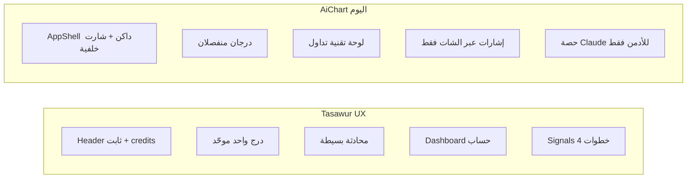
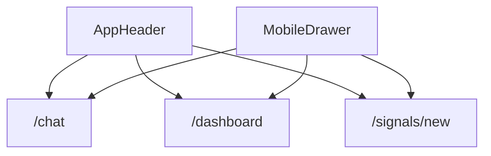

# خطة تطوير AiChart — مقارنة Tasawur وإعادة النظر

## 1. الوضع الحالي vs المنافس

### ما يمتلكه AiChart اليوم (قوي تقنياً)
- وكيل Claude مع **11 أداة** (سوق، محفظة، توصيات، Web3، تنفيذ Binance)
- بث حي SSE + ذاكرة محادثات + شارت Binance
- مراقب 24/7 + تليجرام (أوامر + موافقة صفقات)
- Risk Guard + kill switch + لوحة أدمن

### ما يقدّمه Tasawur ويفتقده AiChart (تجربة المستخدم)



| الميزة | Tasawur | AiChart |
|--------|---------|---------|
| تصميم موبايل | كريمي، بسيط، بطاقات ناعمة | داكن amber، `ChartBackground`، كثافة عالية |
| التنقل | Chat / Dashboard / Signals + درج واحد | 5 روابط + درج محادثات منفصل |
| الرصيد | `0 cr` في الهيدر والدرج | موجود في API لكن **غير معروض** |
| الإشارات | معالج 4 خطوات (أداة → أسلوب → مخاطر → تأكيد) | لا يوجد `/signals` |
| المحادثة | تحية بالاسم + pills دائمة + موديل ظاهر | pills عند الترحيب فقط |
| الأسواق | ذهب/فوركس/كريبتو | Binance + Finnhub (قرارك: **Binance فقط**) |
| الاشتراك | بطاقة Plan + Subscribe | أدمن يدوي فقط (حسب [PLAN.md](docs/PLAN.md)) |

**الخلاصة:** المحرك الخلفي لـ AiChart أقوى في التنفيذ والمراقبة؛ الفجوة الأساسية في **المنتج المرئي** — واجهة موبايل، إشارات موجّهة، وشفافية الرصيد.

---

## 2. إعادة نظر على الأدوات (Binance فقط)

### الإبقاء (جوهر المشروع)
| الأداة | السبب |
|--------|-------|
| `get_market_snapshot` / `get_price` | تحليل فني كامل عبر Binance klines |
| `get_user_profile` / `get_trades_summary` / `get_recommendations_history` | سياق شخصي للوكيل |
| `get_account_balances` | ربط محفظة المستخدم |
| `record_recommendation` | حفظ الخطة/التوصية |
| `smart_money_signals` / `crypto_market_rank` | ميزة تمايز (Web3 مجاني) |
| `binance_cli` (اختياري) | قراءة موسّعة من Binance |

### الإزالة / التبسيط
- **Finnhub** في [`web/src/lib/markets/`](web/src/lib/markets/) — إزالة `finnhub.ts` وتبسيط [`resolve.ts`](web/src/lib/markets/resolve.ts) ليقبل فقط أزواج `*USDT` من Binance
- **`resolve_symbol`** → يصبح `resolve_crypto_pair` مع كتالوج من `exchangeInfo`
- مفتاح `FINNHUB_API_KEY` من [`platformConfig.ts`](web/src/lib/platformConfig.ts) ولوحة الأدمن

### إضافات مطلوبة للمنتج
- **`GET /api/instruments`** — قائمة أزواج USDT من Binance مع بحث وفلتر (DeFi/Layer1/… اختياري لاحقاً)
- **`POST /api/signals/generate`** — معالج الإشارات يستدعي `runAgent()` بسياق مُهيكَل (رمز، أسلوب، مخاطر، رأس مال)
- **توحيد الحصة** — تطبيق `claude_quota` على تليجرام أيضاً ([`telegramAgent.ts`](web/src/lib/telegramAgent.ts) اليوم يتجاوزها)

### نظام الرصيد (Credits)
الحالي: عدّاد يومي مسطح (`claude_usage.count`). المقترح للواجهة الشبيهة بـ Tasawur:

| الإجراء | التكلفة المقترحة |
|---------|------------------|
| دورة محادثة | 1 |
| توليد خطة إشارة | 5 |
| مراقب تلقائي | لا يُخصم من واجهة المستخدم (تكلفة منصة) |

تنفيذ تدريجي: **المرحلة 1** عرض `remaining = limit - used` في UI؛ **المرحلة 2** عمود `action_type` في `claude_usage` أو جدول `credit_ledger` للتكاليف المرجّحة.

---

## 3. نظام التصميم — فاتح + داكن (قرارك)

### ثيم فاتح (Tasawur-like) — افتراضي على الموبايل
تحديث [`globals.css`](web/src/app/globals.css) و[`layout.tsx`](web/src/app/layout.tsx):

```css
/* Light (جديد) */
--background: #F2EFE9;      /* كريمي */
--card: #FAF8F4;
--foreground: #1A1A1A;
--primary: #1A1A1A;        /* أزرار سوداء */
--accent: #B8956B;         /* ذهبي للـ breadcrumbs */
--radius: 1.25rem;         /* زوايا ناعمة */
```

- خط **serif** للعناوين والأرقام الكبيرة (مثلاً `Fraunces` أو `Playfair Display`)
- خط **sans** للواجهة (Cairo الحالي مناسب للعربية)
- إزالة `ChartBackground` من الشاشات الرئيسية؛ الإبقاء على الشارت **عند الطلب** فقط
- مكوّنات مشتركة جديدة: `AppHeader`, `MobileDrawer`, `SurfaceCard`, `PillButton`, `StepIndicator`

### ثيم داكن (محسّن)
- الإبقاء على palette الحالية مع تخفيف الظلال والكثافة
- نفس المكوّنات — تبديل عبر `class="dark"` + زر في الإعدادات
- تخزين التفضيل في `localStorage` + احترام `prefers-color-scheme`

### قواعد موبايل ثابتة (مثل Tasawur)
```
┌─────────────────────────┐
│ Header ثابت (قائمة | شعار | رصيد) │
├─────────────────────────┤
│                                                         │
│   محتوى قابل للتمرير فقط                                │
│                                                         │
├─────────────────────────┤
│ Footer ثابت (Back | Next) — للمعالج والمحادثة          │
└─────────────────────────┘
```

---

## 4. هيكلة التنقل الجديدة

استبدال التنقل الحالي في [`AppShell.tsx`](web/src/components/AppShell.tsx):

| التبويب | المسار | المحتوى |
|---------|--------|---------|
| المحادثة | `/chat` | واجهة بسيطة بدون شريطين جانبيين على الديسكتوب |
| اللوحة | `/dashboard` | بروفايل + رصيد + حالة الحساب |
| الإشارات | `/signals` | معالج 4 خطوات (جديد) |

**الدرج الموحّد** (يحل محل الدرجين الحاليين):
- تبويبات علوية: محادثة | لوحة | إشارات
- + محادثة جديدة | الخطة | الإعدادات
- قائمة المحادثات
- بطاقة الرصيد السفلية (`X رصيد متبقّي`)
- بروفايل المستخدم

الصفحات `/market` و`/trades` تبقى — تُفتح من اللوحة أو الشارت داخل المحادثة، وليس في الشريط الرئيسي (تقليل التعقيد).



---

## 5. صفحات الواجهة — تفاصيل التنفيذ

### أ) المحادثة [`ChatSquareClient.tsx`](web/src/components/ChatSquareClient.tsx)
- تحية ديناميكية: «مساء الخير، {الاسم}»
- صندوق إدخال كبير مستدير + pills دائمة أسفله (تحليل شارت، نظرة اليوم، فحص مخاطر…)
- عرض الموديل الحالي (قراءة فقط من `/api/chat/status`)
- سطر: `1 رصيد لكل رسالة • X متبقّي`
- إخفاء `AgentActivityFeed` افتراضياً على الموبايل (قابل للتوسيع)
- الشارت: overlay ملء الشاشة عند الطلب (موجود — يُبسَّط التصميم)

### ب) اللوحة [`DashboardClient.tsx`](web/src/components/DashboardClient.tsx)
إعادة بناء كـ **حساب المستخدم** وليس لوحة تقنية:
- بطاقة بروفايل (اسم، تليجرام، حالة الخطة)
- 3 بطاقات إحصاء: متبقّي / مُستهلك اليوم / إجمالي
- زر «تواصل للاشتراك» (رابط تليجرام أو صفحة Plan بسيطة)
- روابط ثانوية: ربط Binance، الصفقات، kill switch

### ج) الإعدادات [`SettingsClient.tsx`](web/src/components/SettingsClient.tsx)
- بطاقات ناعمة مثل Tasawur (Profile | Subscription | Sign out)
- قسم المظهر: فاتح / داكن / تلقائي
- الإبقاء على أقسام Binance وتليجرام والمخاطر

### د) معالج الإشارات (جديد) `web/src/app/signals/`
| الخطوة | المحتوى (Binance فقط) |
|--------|------------------------|
| 01 الأداة | شبكة 2 أعمدة + بحث + فلتر All/USDT pairs |
| 02 الأسلوب | Scalp (15m) / Swing (4h) |
| 03 المخاطر | slider نسبة المخاطرة + رأس مال ($500/$1k/…) + Tight/Balanced/Wide |
| 04 التأكيد | ملخص + ملاحظات + «توليد الخطة» (~5 رصيد) |

النتيجة: توصية محفوظة + عرض في المحادثة أو `/market`.

---

## 6. خطة التنفيذ المرحلية

### المرحلة A — أساس التصميم والتنقل (أسبوع 1)
- نظام ثيم فاتح/داكن + خطوط serif
- `AppHeader` + `MobileDrawer` موحّد
- شارة الرصيد من `/api/me` + تحديث بعد كل محادثة
- تبسيط `/chat` على الموبايل (header/footer ثابتان)

**ملفات محورية:** `globals.css`, `layout.tsx`, `AppShell.tsx`, مكوّنات `ui/shell/*`

### المرحلة B — لوحة الحساب والإعدادات (أسبوع 1–2)
- إعادة بناء Dashboard كبطاقات حساب
- إعادة تصميم Settings ببطاقات Tasawur-like
- صفحة Plan بسيطة (حالة الاشتراك من `users.status` + `admin_limits`)

### المرحلة C — معالج الإشارات (أسبوع 2)
- `GET /api/instruments`
- `POST /api/signals/generate`
- صفحات `/signals/new` مع `StepIndicator` + footer ثابت
- خصم 5 من الحصة (أو عدّاد منفصل)

### المرحلة D — تبسيط Backend (أسبوع 2–3)
- إزالة Finnhub وتقييد الأدوات لـ Binance
- حصة تليجرام = حصة الويب
- تحديث `persona.ts` و`docs/PLAN.md`

### المرحلة E — صقل وتجربة (أسبوع 3)
- Landing [`HomeHero.tsx`](web/src/components/HomeHero.tsx) بنفس الهوية
- اختبار موبايل (375px–430px)
- إزالة [`Nav.tsx`](web/src/components/Nav.tsx) الميت وتفعيل [`agent-plan.tsx`](web/src/components/ui/agent-plan.tsx) في المعالج

---

## 7. ما نؤجّله (خارج النطاق الآن)
- اشتراكات Stripe آلية (قرار #10 في PLAN.md)
- Futures Binance
- OpenClaw daemon منفصل (الوكيل in-process يعمل اليوم)
- ذهب/فوركس (خارج Binance)

---

## 8. معايير النجاح
- على موبايل 390px: شاشة واحدة واضحة، بدون درجين متداخلين
- الرصيد ظاهر في الهيدر والدرج والمحادثة
- إنشاء خطة إشارة في أقل من 4 نقرات بعد اختيار الرمز
- تبديل فاتح/داكن يعمل فوراً
- `npm run build` ناجح + لا اعتماد على Finnhub
