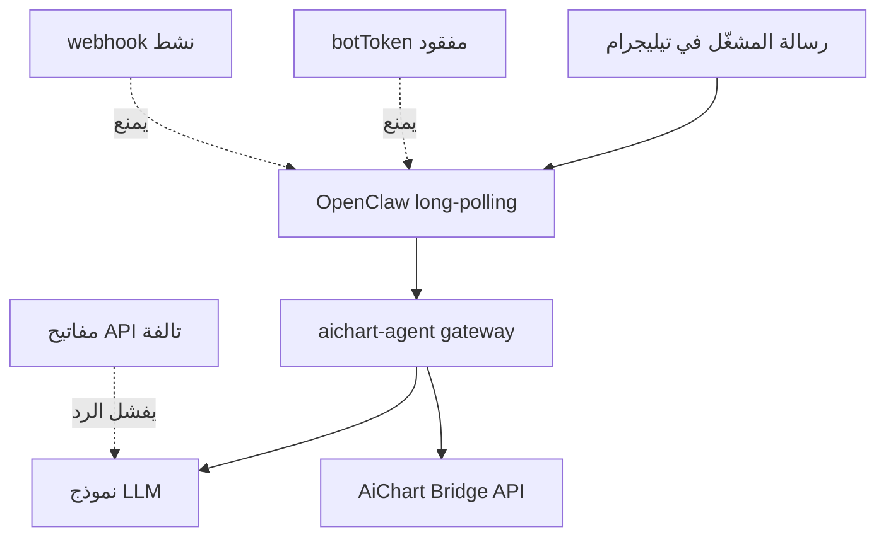

# إصلاح ربط البوت + أوامر عربية + Reply Keyboard

## لماذا البوت لا يرد؟ (أسباب شائعة بعد استعادة VPS)

| السبب | العرض | الإصلاح |
|-------|--------|---------|
| `aichart-agent` متوقف أو يعيد التشغيل | لا رد أبداً | `pm2 restart aichart-agent` + فحص error log |
| `botToken` مفقود في `openclaw.json` | OpenClaw لا يستطلع تيليجرام | مزامنة التوكن من لوحة `/admin/keys` → `channels.telegram.botToken` |
| مفاتيح API مشفّرة بمفتاح قديم | gateway يعمل لكن النموذج يفشل صامتاً | إعادة إدخال المفاتيح من `/admin/keys` |
| webhook نشط على البوت | تعارض مع polling | `deleteWebhook` + `url` فارغ في `getWebhookInfo` |
| `telegram_id` غير مربوط بالأدمن | إشعارات لا تصل؛ قد يمنع pairing | [`vps-link-telegram-admin.sh`](infra/vps-link-telegram-admin.sh) |
| `dmPolicy` / pairing | رسالة DM تُتجاهل حتى الموافقة | ضبط `allowFrom` أو إكمال `/pair` |
| توكن البوت في DB ≠ توكن في openclaw.json | getMe يعمل لتوكن ويفشل للآخر | سكربت مزامنة موحّد |



## المرحلة 0 — إصلاح ربط البوت (قبل القائمة العربية)

### سكربت مزامنة التوكن

ملف جديد [`agent/scripts/sync-telegram-bot.sh`](agent/scripts/sync-telegram-bot.sh):
- يقرأ `TELEGRAM_BOT_TOKEN` من `platform_config` (نفس فك [`infra/aichart-agent.sh`](infra/aichart-agent.sh) — فك التشفير بـ `ENCRYPTION_KEY`)
- يكتب في `/root/.openclaw/openclaw.json`:
  - `channels.telegram.enabled = true`
  - `channels.telegram.botToken = <token>`
  - `channels.telegram.dmPolicy = "open"` (أو `allowFrom` بمعرّف المشغّل إن لزم أمان أشد)
- يتحقق `getMe` — يفشل بخطأ واضح إن التوكن غير صالح

### توسيع reconnect

[`infra/vps-openclaw-telegram-reconnect.sh`](infra/vps-openclaw-telegram-reconnect.sh):
1. استدعاء `sync-telegram-bot.sh` **أولاً**
2. `deleteWebhook` (يجب `url: ""`)
3. `telegram-setup-ar-commands.sh`
4. `pm2 stop` → انتظار 3ث → `pm2 start aichart-agent --update-env`

### سكربت تشخيص شامل

ملف جديد [`infra/vps-telegram-bot-health.sh`](infra/vps-telegram-bot-health.sh) (يجمع [`vps-openclaw-telegram-check.sh`](infra/vps-openclaw-telegram-check.sh) + [`vps-agent-check.sh`](infra/vps-agent-check.sh)):
- `pm2` — `aichart-agent` + `aichart-web` = online
- `getMe` على توكن openclaw.json
- `getWebhookInfo` — `url` فارغ
- `curl` Bridge — `GET /api/agent/risk/status` = 200
- `telegram_id` + `telegram_chat_id` للأدمن في PostgreSQL
- آخر 30 سطر من `aichart-agent-error.log`
- يطبع **سبب محتمل** + أمر إصلاح مقترح

### ربط حساب المشغّل

على VPS (معرّف تيليجرام من لقطة الشاشة أو حسابك):
```bash
bash infra/vps-link-telegram-admin.sh <TELEGRAM_USER_ID>
```

### تذكير يدوي إن لزم

إن فشل `getMe` أو Bridge 401 — أعد إدخال المفاتيح من `https://aichart.lork.cloud/admin/keys` ثم أعد تشغيل:
```bash
bash agent/scripts/sync-telegram-bot.sh
pm2 restart aichart-agent aichart-web
```

**معيار نجاح المرحلة 0:** إرسال «مرحبا» للبوت → رد خلال 30 ثانية (قبل تطبيق القائمة العربية).

---

## المرحلة 1 — أوامر OpenClaw مخصّصة بالعربي

تعديل [`agent/scripts/sync-model.sh`](agent/scripts/sync-model.sh) و[`web/src/lib/openclawModelSync.ts`](web/src/lib/openclawModelSync.ts) — **بعد** مزامنة botToken:

```json
"channels": {
  "telegram": {
    "commands": { "native": false, "nativeSkills": false },
    "customCommands": [
      { "command": "qaima",   "description": "القائمة الرئيسية" },
      { "command": "tahil",   "description": "تحليل زوج" },
      { "command": "rased",   "description": "الرصيد والمحفظة" },
      { "command": "safaqat", "description": "الصفقات المفتوحة" },
      { "command": "iadadat", "description": "الإعدادات والوضع الحالي" },
      { "command": "crypto",  "description": "السوق: كربتو" },
      { "command": "forex",   "description": "السوق: فوركس" },
      { "command": "demo",    "description": "تفعيل وضع الديمو" },
      { "command": "live",    "description": "تفعيل الوضع الحقيقي" }
    ],
    "capabilities": { "inlineButtons": "dm" }
  }
}
```

سكربت [`agent/scripts/telegram-setup-ar-commands.sh`](agent/scripts/telegram-setup-ar-commands.sh): `deleteMyCommands` + `setMyCommands` بالقائمة العربية.

مصدر واحد: [`web/src/lib/telegramCommands.ts`](web/src/lib/telegramCommands.ts) — `arabicBotCommands()`.

**قيود تيليجرام:** اسم الأمر لاتيني (`/rased`)؛ الوصف عربي في قائمة `/`.

---

## المرحلة 2 — لوحة Reply Keyboard عربية

| صف Reply Keyboard | أمر / | فعل الوكيل |
|-------------------|-------|------------|
| `📊 تحليل زوج` | `/tahil` | تحليل + قائمة رموز |
| `💰 الرصيد` | `/rased` | portfolio |
| `📈 الصفقات` | `/safaqat` | trades/open |
| `⚙️ الإعدادات` | `/iadadat` | risk/status |
| `🪙 كربتو` / `💱 فوركس` | `/crypto` / `/forex` | تبديل السوق |
| `🧪 ديمو` / `🔴 حقيقي` | `/demo` / `/live` | تبديل البيئة |

- [`telegram.ts`](web/src/lib/telegram.ts) — `sendMessageWithReplyKeyboard`
- [`web/src/app/api/agent/telegram/menu/route.ts`](web/src/app/api/agent/telegram/menu/route.ts) — ترحيب + لوحة عند `/start`

---

## المرحلة 3 — سلوك الوكيل

تحديث [`AGENTS.md`](agent/workspace/AGENTS.md), [`SOUL.md`](agent/workspace/SOUL.md), [`SKILL.md`](agent/workspace/skills/aichart-trading/SKILL.md) — جدول: زر لوحة / أمر `/` / `cmd:*` → نفس الفعل.

---

## المرحلة 4 — النشر والتحقق

```bash
cd /opt/aichart && git pull
cd web && npm run build
bash infra/vps-telegram-bot-health.sh          # تشخيص قبل
bash agent/scripts/sync-telegram-bot.sh        # ربط التوكن
bash agent/scripts/sync-workspace.sh
bash agent/scripts/sync-model.sh
bash agent/scripts/telegram-setup-ar-commands.sh
bash infra/vps-openclaw-telegram-reconnect.sh
bash infra/vps-link-telegram-admin.sh <ID>   # إن لم يكن مربوطاً
pm2 restart aichart-web aichart-agent
bash infra/vps-telegram-bot-health.sh          # تشخيص بعد
```

**اختبار نهائي (بالترتيب):**
1. «مرحبا» → رد الوكيل (الربط يعمل)
2. `/` → قائمة عربية بدون `/help` الإنجليزي
3. `/start` → بطاقة + Reply Keyboard
4. `💰 الرصيد` أو `/rased` → بطاقة محفظة

---

## ملاحظات

- المرحلة 0 **إلزامية** — بدونها القائمة العربية لن تُختبر.
- `POST /api/telegram/setup` (أدمن) يزيل webhook للويب — لا تُعيد تفعيل webhook على نفس البوت.
- Reply Keyboard تُرسل من AiChart؛ الردود الواردة عبر OpenClaw polling — لا تعارض بعد `deleteWebhook`.
