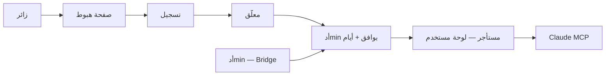

# AiChart — منصة SaaS

## النموذج (باختصار)



| طبقة | الوظيفة |
|------|---------|
| **هبوط** | تسويق SaaS + مزايا + CTA تسجيل |
| **تسجيل** | username · whatsapp · email · password (أو Telegram) |
| **Tenant** | مستخدم واحد = حساب معزول · صلاحية زمنية · MCP + اتصالات |
| **Operator** | أدmin واحد · Bridge · موافقة/تجديد · بدون حد عدد مستخدمين |

**موجود اليوم:** `AICHART_SINGLE_USER=0`، `access_expires_at`، `/awaiting-approval`، موافقة من `/console/platform?tab=users`.

**ينقص:** حقول profile، لوحة tenant منفصلة، هبوط طويل، توحيد Telegram → awaiting فقط.

---

## 1) قاعدة البيانات + تسجيل

إضافة في [`sqlite.ts`](web/src/lib/db/sqlite.ts) و [`pg.ts`](web/src/lib/db/pg.ts):

| عمود | النوع | قواعد |
|------|--------|--------|
| `username` | TEXT | UNIQUE nullable — Telegram قد يُكمِل لاحقاً |
| `whatsapp_e164` | TEXT | UNIQUE nullable |

تحديث [`types.ts`](web/src/lib/types.ts) — `UserRow` / `PublicUser` / `AdminUserView`.

---

## 2) التسجيل بالبريد

- [`register/route.ts`](web/src/app/api/auth/register/route.ts): `username`, `whatsapp`, `email`, `password`
- [`phone.ts`](web/src/lib/phone.ts) + `libphonenumber-js` — E.164، افتراضي `SA` (+966)
- [`PhoneInput.tsx`](web/src/components/PhoneInput.tsx) + توسيع [`AuthForm`](web/src/components/AuthForm.tsx) في `mode=register`
- **الدخول:** بريد + كلمة مرور فقط؛ Telegram ثانوي

---

## 3) Telegram — انتظار الموافقة فقط

تعديلات صريحة (حتى لو جزء موجود):

**[`upsertTelegramUser`](web/src/lib/store.ts):**
- مستخدم جديد: `status=pending`، `access_expires_at=NULL` — **دون** تفعيل تلقائي
- حفظ `@telegram_username` في `username` إن وُجد (اختياري)

**[`telegram/route.ts`](web/src/app/api/auth/telegram/route.ts):**
```ts
if (!hasPlatformAccess(user)) redirect = "/awaiting-approval";
// إزالة: else if (isNew || !onboardingDone) → /onboarding
else redirect = "/console"; // لوحة المستخدم الجديدة
```

**[`TelegramLoginButton`](web/src/components/TelegramLoginButton.tsx):** احترام `redirect` من API دائماً.

**[`awaiting-approval`](web/src/app/awaiting-approval/page.tsx):** رسالة خاصة لمن سجّل عبر Telegram («تم ربط تليجرام — بانتظار موافقة الأدmin»).

**بعد الموافقة — Telegram بدون whatsapp/email حقيقي:**
- بطاقة «أكمل ملفك» في لوحة المستخدم: إضافة واتساب (اختياري) — **بدون** حظر MCP إن وُافق الأدmin

---

## 4) لوحة تحكم المستخدم الجديدة (MCP-centric)

### فصل الأدوار في [`console/layout.tsx`](web/src/app/console/layout.tsx)

```ts
if (user.role === "admin") return <BridgeShell …>; // Bridge الحالي
return <UserShell …>;                              // جديد
```

### هيكل جديد

| ملف | الغرض |
|-----|--------|
| [`userNav.ts`](web/src/components/user/userNav.ts) | تنقل مبسّط |
| [`UserShell.tsx`](web/src/components/user/UserShell.tsx) | Shell عربي للمستخدم |
| [`UserHomeClient.tsx`](web/src/components/user/UserHomeClient.tsx) | الصفحة الرئيسية |

### تنقل المستخدم (`userNav`)

| الرابط | المحتوى |
|--------|---------|
| `/console` | **الرئيسية** — حالة الحساب، صلاحية حتى، رابط MCP |
| `/console/mcp` | دليل ربط Claude Connectors (من [`MCP_CLAUDE_SETUP.md`](docs/MCP_CLAUDE_SETUP.md)) |
| `/console/connect` | Binance + EA + Telegram (إعادة استخدام [`ConnectSection`](web/src/components/bridge/sections/ConnectSection.tsx) مُبسَّط) |
| `/console/trades` | صفقاتي (قراءة — [`ActiveTradesTable`](web/src/components/bridge/ActiveTradesTable.tsx)) |
| `/console/account` | الملف: username، whatsapp، email، Telegram |

**يُخفى عن المستخدم:** `/console/risk` (حدود/Kill Switch)، `/console/platform` (مفاتيح/MCP admin)، `AdminOverview`، إحصائيات المنصة.

### الصفحة الرئيسية `/console` (مستخدم)

بطاقات:
1. **حالة الحساب** — مفعّل / ينتهي في `access_expires_at`
2. **Claude MCP** — خطوات + `MCP_PUBLIC_URL` + زر «افتح Claude Connectors»
3. **الاتصالات** — Binance / MT5 / Telegram (ملخص + روابط)
4. **EA** — زر تحميل `.ex5` (إن `hasPlatformAccess`)
5. **أكمل ملفك** — إن `username` أو `whatsapp` ناقص (Telegram)

### الأدmin — بدون تغيير جوهري

- نفس [`BridgeShell`](web/src/components/bridge/BridgeShell.tsx) + [`bridgeNav.ts`](web/src/components/bridge/bridgeNav.ts)
- تبويب **المستخدمون** للموافقة (موجود)
- `/login` → `ADMIN_EMAIL` + كلمة المرور

### إلغاء/تجاوز onboarding القديم

- [`onboarding/page.tsx`](web/src/app/onboarding/page.tsx): redirect مباشر إلى `/console` للمستخدم المُوافَق (أو دمج خطوات Binance في `/console/connect`)
- [`OnboardingClient`](web/src/components/OnboardingClient.tsx): لا يُستخدم للمستخدم الجديد (يُبقى للأدmin إن لزم)

---

## 5) صفحة هبوط احترافية طويلة

استبدال [`HomeHero`](web/src/components/HomeHero.tsx) بهيكل modular في `web/src/components/landing/`.

### [`page.tsx`](web/src/app/page.tsx)

- زائر غير مسجّل → `<LandingPage />`
- مسجّل:
  - بدون صلاحية → `/awaiting-approval`
  - `admin` → `/console` (Bridge)
  - مستخدم مُوافَق → `/console` (UserShell)

### هيكل الملفات

```
web/src/components/landing/
  LandingPage.tsx          # تجميع الأقسام + scroll
  LandingNav.tsx           # شريط علوي sticky: logo، دخول، تسجيل
  LandingHero.tsx          # عنوان + CTA + معاينة شارت حي
  LandingFeatures.tsx      # شبكة مزايا (6–8 بطاقات)
  LandingHowItWorks.tsx    # 4 خطوات
  LandingIntegrations.tsx  # Binance · MT5/EA · Claude MCP · Telegram
  LandingSecurity.tsx      # Risk Guard · موافقة أدmin · صلاحية زمنية
  LandingAccess.tsx        # نموذج الوصول: تسجيل → موافقة → MCP
  LandingFaq.tsx           # أسئلة شائعة (accordion)
  LandingCta.tsx           # CTA أخير
  LandingFooter.tsx        # روابط + disclaimer
  landingContent.ts        # نصوص عربية مركزية (سهل التعديل)
```

### أقسام الصفحة (scroll طويل)

| # | القسم | رسالة SaaS |
|---|--------|------------|
| 1 | Hero | «منصة تداول SaaS — Claude MCP + Binance + MT5» |
| 2 | Features | MCP · Risk Guard · EA · Telegram · ديمو/حقيقي |
| 3 | How | سجّل → موافقة → اربط Claude → تداول |
| 4 | Integrations | Claude · Binance · MT5 · Telegram |
| 5 | Trust | موافقة أدmin · صلاحية 30 يوم · حدود مخاطر |
| 6 | Access | «SaaS — التفعيل بعد الموافقة» (بدون pricing وهمي) |
| 7 | FAQ + CTA + Footer | أسئلة + «ابدأ مجاناً» → `/register` |

### التصميم

- RTL عربي، tokens موجودة (`primary`, `SurfaceCard`, `btn`)
- **بدون** مكتبة UI جديدة — Tailwind + مكوّنات [`ui/shell`](web/src/components/ui/shell) الحالية
- scroll سلس + `id` anchors في Nav (المزايا، كيف يعمل، الأسئلة)
- responsive: mobile-first، grid يتكدس
- **لا** وعود «ربح مضمون» — نبرة احترافية تعليمية

### إعادة استخدام

- الهيرو الحالي [`VercelV0Chat`](web/src/components/ui/v0-ai-chat.tsx) **اختياري** داخل Hero كـ «جرب اسأل» → `/register` (كما [`HomeHero`](web/src/components/HomeHero.tsx) اليوم)
- حذف/أرشفة `HomeHero.tsx` بعد الاستبدال

---

## 6) عرض البيانات

- [`AdminUsersTable`](web/src/components/admin/AdminUsersTable.tsx): username، whatsapp، مصدر التسجيل (بريد/Telegram)
- [`displayName`](web/src/lib/displayName.ts): `username` → Telegram handle → email

---

## 6) ما لا يُغيَّر

- موافقة الأدmin + `access_expires_at` (30 يوم افتراضي)
- MCP OAuth + EA download gated
- `/api/agent/*` + Risk Guard
- bootstrap admin

---

## 8) التحقق

1. `/` — صفحة هبوط طويلة، scroll، CTA → `/register`
2. تسجيل بريد → awaiting → موافقة → **لوحة مستخدم جديدة**
3. Telegram → awaiting فقط → موافقة → لوحة مستخدم
4. أدmin: Bridge + `/login` بنفس البريد/كلمة المرور
5. mobile: الأقسام تتراص بشكل صحيح

```powershell
py -m graphify update web/src
```
