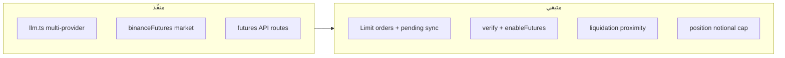

# إكمال المتبقي — Binance Futures + أمان المفتاح

## نقطة البداية

الفرع `v0/smart-agent-plan-25062a1b` **مُدمَج** في `origin/main` (PR #26). نسختك المحلية متأخرة — **أول خطوة: `git pull origin main`**.

ما يعمل اليوم (~80%): `llm.ts` متعدد المزودين، `binanceFutures.ts`، adapter للـ market، مسارات `futures/positions|modify|orders`، Risk Guard أساسي، تحذير سحب عند الربط.



---

## 1. أوامر Limit في Futures (MT5-style)

**المشكلة:** [`placeFuturesLimitOrder`](web/src/lib/binanceFutures.ts) موجود لكن غير موصول؛ عمود `order_type` في DB لا يُملأ.

**التصميم (الافتراضي):** Limit → `pending_entry` → cron يضع SL/TP بعد التعبئة.

### Schema و API

- [`web/src/app/api/agent/trade/open/route.ts`](web/src/app/api/agent/trade/open/route.ts):
  - `order_type: z.enum(["market","limit"]).default("market")`
  - `limit_price: z.number().positive().optional()` — مطلوب عند `order_type=limit`
  - `.refine`: limit فقط مع `market_type=futures`
- [`web/src/lib/store.ts`](web/src/lib/store.ts): تمرير `order_type`, `limit_price` في `createIntent` و `recordTrade`
- هجرة DB في [`sqlite.ts`](web/src/lib/db/sqlite.ts) + [`pg.ts`](web/src/lib/db/pg.ts):
  - `trade_intents.order_type`, `trade_intents.limit_price`
  - `trades.limit_price` (اختياري للتقارير)
- [`web/src/lib/types.ts`](web/src/lib/types.ts): حقول `order_type`, `limit_price` على `TradeIntent` و `Trade`

### Adapter

[`web/src/lib/brokers/binanceFuturesAdapter.ts`](web/src/lib/brokers/binanceFuturesAdapter.ts):

| order_type | السلوك |
|------------|--------|
| `market` | كما هو الآن: market → SL/TP فوراً |
| `limit` | `placeFuturesLimitOrder` → `recordTrade` بـ `status: "pending_entry"`, `order_type: "limit"` — **بدون** SL/TP حتى التعبئة |

### مزامنة التعبئة

[`web/src/lib/binanceFutures.ts`](web/src/lib/binanceFutures.ts): إضافة `getFuturesOrder(symbol, orderId)`.

[`web/src/lib/tradeClose.ts`](web/src/lib/tradeClose.ts): دالة جديدة `syncFuturesLimitFills(userId)`:
1. جلب trades بـ `status='pending_entry'` و `market_type='futures'`
2. إن ظهر مركز على الرمز أو `order.status === FILLED` → تحديث qty/avg_price → وضع SL/TP من intent → `status='open'`
3. إن أُلغي الأمر → `status='cancelled'` + إشعار

[`web/src/lib/cronPostScan.ts`](web/src/lib/cronPostScan.ts): استدعاء `syncFuturesLimitFills` بجانب `syncFuturesClosures`.

[`web/src/lib/store.ts`](web/src/lib/store.ts): `listPendingEntryTrades(userId)` + دعم status `pending_entry` / `cancelled` في COUNTs إن لزم.

---

## 2. Risk Guard — سقف حجم المركز

[`web/src/lib/riskGuard.ts`](web/src/lib/riskGuard.ts) — داخل كتلة `marketType === "futures"`:

```typescript
const leverage = proposed.leverage ?? 1;
const positionNotional = proposed.notional * leverage;
if (positionNotional > effectiveCapital + 1e-8)
  return deny(`حجم المركز (${positionNotional.toFixed(2)} USDT) يتجاوز سقف رأس المال (${effectiveCapital.toFixed(2)}).`);
```

- `notional` = الهامش (كما هو)
- السقوف الحالية على الهامش تبقى
- الفحص الجديد: **margin × leverage ≤ effectiveCapital**

---

## 3. فحص صلاحيات Binance (verify + enableFutures)

### دالة مشتركة

ملف جديد [`web/src/lib/binanceVerify.ts`](web/src/lib/binanceVerify.ts):

```typescript
export function buildBinancePermissionReport(summary, restrictions, futuresRequired?)
```

يرجع:
- `enableSpotAndMarginTrading` ✓/✗
- `enableFutures` ✓/✗ (مطلوب إن `futuresRequired`)
- `enableWithdrawals` → تحذير أحمر
- `ipRestrict` → نصيحة
- `ok: boolean`, `blockReason?`

### Endpoints

| المسار | التغيير |
|--------|---------|
| [`/api/binance/connect`](web/src/app/api/binance/connect/route.ts) | استخدام `buildBinancePermissionReport`؛ **رفض الربط** إن `!canTrade` (كما هو) |
| [`/api/binance/status`](web/src/app/api/binance/status/route.ts) | GET يعيد `restrictions` + `permissionReport` (إعادة فحص حي) |
| **جديد** [`/api/binance/verify/route.ts`](web/src/app/api/binance/verify/route.ts) | GET للمستخدم + GET/POST للوكيل عبر [`/api/agent/binance/connect`](web/src/app/api/agent/binance/connect/route.ts) pattern — بدون حفظ مفاتيح |
| [`/api/agent/trade/open`](web/src/app/api/agent/trade/open/route.ts) | قبل التنفيذ: إن `market_type=futures` + prod → رفض إن `!restrictions.enableFutures` |

### الواجهة

[`web/src/components/SettingsClient.tsx`](web/src/components/SettingsClient.tsx) — `BinanceCard`:
- بعد الربط: بطاقة checklist (Spot ✓, Futures ✓/✗, Withdrawals ⚠, IP ✓/نصيحة)
- زر «إعادة فحص الصلاحيات» → `GET /api/binance/status`
- عرض `withdrawWarning` و `ipRestrictionAdvice` بشكل دائم (ليس toast فقط)

---

## 4. تنبيه اقتراب التصفية (<10%)

[`web/src/lib/tradeWatch.ts`](web/src/lib/tradeWatch.ts): `watchFuturesLiquidationProximity(userId)`:
- يعمل فقط إن `settings.futures_enabled`
- `getFuturesPositions` من [`binanceFutures.ts`](web/src/lib/binanceFutures.ts)
- لكل مركز: `distancePct = |markPrice - liquidationPrice| / markPrice * 100`
- إن `< 10%` → `TradeWatchAlert` مع تفاصيل long/short + leverage + liquidationPrice

[`web/src/lib/monitorRunner.ts`](web/src/lib/monitorRunner.ts):
- دمج alerts في `collectTradeWatchAlerts` أو استدعاء منفصل
- إرسال `[EVENT:trade_alert]` (نفس القناة — الوكيل يراجع positions)

[`agent/workspace/HEARTBEAT.md`](agent/workspace/HEARTBEAT.md): سطر يوضح أن `trade_alert` يشمل اقتراب التصفية في Futures.

[`agent/workspace/skills/aichart-trading/SKILL.md`](agent/workspace/skills/aichart-trading/SKILL.md):
- توثيق `order_type` / `limit_price`
- `GET /api/binance/verify` للوكيل
- قاعدة: عند `trade_alert` + futures → `GET /api/agent/futures/positions`

---

## 5. تحسينات ثانوية (ضمن النطاق)

| البند | الملف | ملاحظة |
|-------|-------|--------|
| `order_type` في execution | [`execution.ts`](web/src/lib/execution.ts) | تمرير لـ Risk Guard إن limit يحتاج SL |
| admin health | [`/api/admin/health`](web/src/app/api/admin/health/route.ts) | `llm: isLLMConfigured()` بدل `anthropic` |
| graphify | بعد التعديلات | `py -m graphify update web/src` |

**خارج النطاق (مقصود):** لا سحب، لا auto-routing لكل crypto→futures (يبقى `market_type` صريحاً)، لا إعادة تسمية `ClaudeModelPicker`.

---

## 6. التحقق

```powershell
cd web; npm run build
# أو: npx tsc --noEmit
```

**اختبار يدوي testnet** (Binance Futures testnet):
1. ربط مفتاح → verify يظهر Spot/Futures/Withdrawals
2. تفعيل futures في الإعدادات
3. Market long + short برافعة 3x + SL/TP
4. Limit entry → pending → fill → SL/TP تلقائي
5. `futures/modify` + `trade/close`
6. محاكاة قرب تصفية → `trade_alert` في cron

---

## ترتيب التنفيذ

1. `git pull` + Risk Guard position cap (سريع)
2. `binanceVerify.ts` + status/verify + UI checklist + block futures
3. Liquidation proximity في tradeWatch/monitorRunner
4. Limit orders: schema → adapter → sync → cron
5. SKILL.md + HEARTBEAT + build
