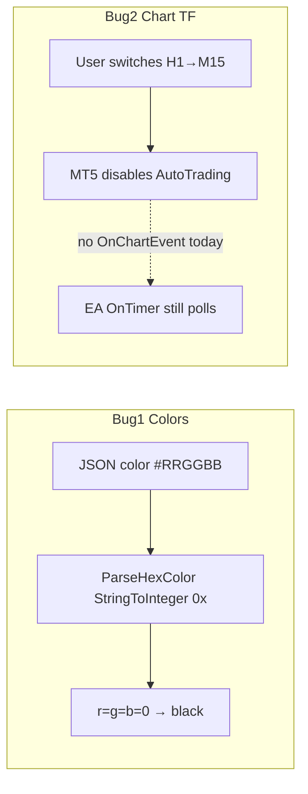

# AiChartBridge v3.09 — Colors + Chart Resilience

## الوضع الحالي



| موضوع | [`ea/mt5/AiChartBridge.mq5`](ea/mt5/AiChartBridge.mq5) اليوم |
|-------|----------------------------------------------------------------|
| ألوان | `ParseHexColor()` L1637–1643: `StringToInteger("0x" + …)` — **غير موثوق في MQL5** → غالباً 0 → أسود |
| ترتيب bytes | `(b<<16)\|(g<<8)\|r` — يبدّل R/B حتى لو نجح parsing |
| Chart switch | `ChartSetSymbolPeriod` **محذوف** في v3.08 ✓ |
| Timer | `EventSetMillisecondTimer` + `OnTimer()` → `PollCommands()` ✓ |
| OnDeinit bug | `EventKillTimer()` فقط — **لا يوقف** millisecond timer |
| Fill | `OBJPROP_BACK=true` على `rectangle/zone` فقط (L1881) |

---

## Bug #1 — إصلاح Hex Color (الأولوية القصوى)

**استبدال** `ParseHexColor()` بـ `HexToColor()` + `HexCharToLong()` كما في البرومبت:

```mql5
color HexToColor(string hex, color fallback = clrRed)
{
   if(StringGetCharacter(hex, 0) == '#') hex = StringSubstr(hex, 1);
   if(StringLen(hex) != 6) return fallback;
   long r = HexCharToLong(StringSubstr(hex, 0, 2));
   long g = HexCharToLong(StringSubstr(hex, 2, 2));
   long b = HexCharToLong(StringSubstr(hex, 4, 2));
   return (color)RGB(r, g, b);  // أو (r<<16)|(g<<8)|b
}
```

**تغييرات:**
- حذف `ParseHexColor`؛ استبدال كل الاستدعاءات في `DrawMt5Object` / `ApplyObjectLabel` بـ `HexToColor(hex, DRAW_COLOR_DEFAULT)`
- إصلاح تعليق `DRAW_COLOR_DEFAULT` (L1635: comment يقول `#3A86FF` لكن القيمة `C'255,134,58'`)
- **Gate اختبار** (Print في OnInit debug أو تعليقات ثابتة):
  - `#E24B4A` → أحمر، `#22C55E` → أخضر، `#FF0000` → أحمر، `#378ADD` → أزرق، `#FFFFFF` → أبيض

**ملاحظة:** `HexCharToLong` يستخدم `StringToUpper` على **hex digits فقط** — لا على symbols (Exness rule محفوظ).

---

## Bug #2 — EA بعد تغيير الإطار (heartbeat فقط)

**ما لا يمكن فعله:** MT5 **لا يسمح** بإعادة تفعيل AutoTrading برمجياً بعد `CHARTEVENT_CHART_CHANGE`. المستخدم يضغط زر AutoTrading يدوياً.

**ما تم إصلاحه سابقاً (v3.08):** حذف `WaitForChartSymbolPeriod` / `ChartSetSymbolPeriod` — **gate:** `grep ChartSetSymbolPeriod ea/mt5/*.mq5` → فارغ.

**إضافات v3.09:**

### A) `OnChartEvent` — جديد

```mql5
void OnChartEvent(const int id, const long& lparam,
                  const double& dparam, const string& sparam)
{
   if(id != CHARTEVENT_CHART_CHANGE) return;
   Print("AiChartBridge: chart symbol/period changed — re-enable AutoTrading if disabled.");
   g_last_hb_time = 0;  // force immediate heartbeat
   SendHeartbeat();
}
```

- **لا** `EventSetTimer(1)` إضافي — `EventSetMillisecondTimer` موجود ويكفي
- `PollCommands` / `draw_and_capture` **لا تتحقق** من `MQL_TRADE_ALLOWED` — EA يبقى يستجيب للرسم حتى لو AutoTrading معطّل

### B) إصلاح `OnDeinit`

```mql5
EventKillMillisecondTimer();  // بدل EventKillTimer() فقط
```

### C) توثيق للمستخدم

- [`ea/mt5/CHANGELOG.md`](ea/mt5/CHANGELOG.md) v3.09
- [`agent/workspace/EA_TROUBLESHOOTING.md`](agent/workspace/EA_TROUBLESHOOTING.md): قسم «تغيير الإطار يعطّل AutoTrading» — EA يستمر في heartbeat/رسم؛ إعادة تفعيل الزر يدوياً للصفقات
- [`ea/shared/api-contract.json`](ea/shared/api-contract.json): `interval` = iTime coords فقط (موجود)

---

## Bug #3 — Fill خلف الشموع

**Helper جديد** `ApplyFillStyle(name, fillClr, bool doFill)`:

```mql5
if(doFill) {
   ObjectSetInteger(0, name, OBJPROP_FILL, true);
   ObjectSetInteger(0, name, OBJPROP_BGCOLOR, fillClr);
}
ObjectSetInteger(0, name, OBJPROP_BACK, true);  // دائماً للأشكال المملوءة
```

**تطبيق على:**
- `rectangle` / `zone` (موجود — refactor إلى helper)
- `triangle` عند `fill=true`
- `ellipse` عند `fill=true`
- legacy `histogram_band` → rectangle + fill

---

## إصدار + نشر + اختبار

| خطوة | تفاصيل |
|------|--------|
| Bump | `#property version` + `EA_VERSION` → **3.09** |
| Compile | MetaEditor → 0 errors → `AiChartBridge.ex5` |
| VPS | tarball `ea/mt5/*` → `/opt/aichart` (web لا يحتاج rebuild) |
| MT5 | reattach EA v3.09 |
| Test colors | `draw_and_capture` payload: `price_line` `#22C55E`, `zone` `#6366f1` fill — verify visible colors in PNG |
| Test TF | غيّر شارت H1→M15 يدوياً → Experts: OnChartEvent log + heartbeat restored؛ `GET /api/agent/ea/query-terminal` → `ea_version: 3.09`, `mql_trade_allowed` reflects state |
| Test poll | [`infra/tmp-test-chart-draw.py`](infra/tmp-test-chart-draw.py) — 202→200 PNG |

---

## ملخص الملفات

| ملف | عمل |
|-----|-----|
| [`ea/mt5/AiChartBridge.mq5`](ea/mt5/AiChartBridge.mq5) | `HexToColor`, `OnChartEvent`, `ApplyFillStyle`, `OnDeinit` fix |
| [`ea/mt5/CHANGELOG.md`](ea/mt5/CHANGELOG.md) | v3.09 entry |
| [`agent/workspace/EA_TROUBLESHOOTING.md`](agent/workspace/EA_TROUBLESHOOTING.md) | AutoTrading + chart TF |
| [`ea/shared/api-contract.json`](ea/shared/api-contract.json) | (اختياري) note عن color format `#RRGGBB` |

**خارج النطاق:** تغييرات web — الألوان تُرسل كـ `#hex` بالفعل من [`chartDrawings.ts`](web/src/lib/chartDrawings.ts).
