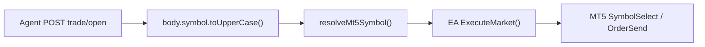

# AiChartBridge — خطة إصلاح Exness + التنفيذ

## تشخيص الوضع الحالي



| Bug | في EA v3.04 | في الجسر (web) |
|-----|-------------|----------------|
| #1 Case sensitivity | **لا يوجد** `StringToUpper` في [`ea/mt5/AiChartBridge.mq5`](ea/mt5/AiChartBridge.mq5) — يمرّر `sym` كما وصل | **المشكلة هنا:** [`trade/open/route.ts`](web/src/app/api/agent/trade/open/route.ts) L155، [`mt5SymbolMap.ts`](web/src/lib/mt5SymbolMap.ts) L31–37، [`markets/resolve.ts`](web/src/lib/markets/resolve.ts) L39 |
| #2 Filling mode | `ResolveFillingMode` + `AppendDealFillCandidates` | — |
| #3 Tick price | `SendMarketDealDirect` يمرّر `tick.ask/bid` | — |
| #4 SymbolSelect | `WaitForLiveQuotes` قبل كل أمر | — |
| #5 No normalization | EA يحترم الرمز الوارد | `resolveMt5Symbol` **يرجع uppercase** |
| #6 Log symbols | غير موجود | — |

**Heartbeat يحفظ الحالة الصحيحة:** `BuildSymbols()` يستخدم `SymbolName(i, true)` ويرسل `"EURUSDm"` كما هو. المشكلة عند **إرسال الأمر للـ EA**.

---

## الجزء 1 — إصلاح الجسر (حرج لـ Exness)

### 1.1 إعادة كتابة [`web/src/lib/mt5SymbolMap.ts`](web/src/lib/mt5SymbolMap.ts)

- إضافة `getEaSymbolList(userId)` — قائمة الرموز **بحالتها الأصلية** من heartbeat.
- استبدال `getEaSymbolSet` (uppercase keys) بـ map case-insensitive → canonical broker symbol.
- منطق `resolveMt5Symbol`:

```typescript
// 1) تطابق حرفي (exact)
// 2) تطابق case-insensitive → إرجاع spec.symbol الأصلي (EURUSDm وليس EURUSDM)
// 3) تطابق canonical base للفوركس: أول 6 أحرف (EURUSD ← EURUSDm, XAUUSDm, EURUSD.)
// 4) aliases الكrypto كما هي، مع إرجاع الحالة من heartbeat
// 5) null + رسالة تشخيصية تتضمن أول N رموز متاحة
```

دالة مساعدة مقترحة:

```typescript
function forexCanonicalKey(symbol: string): string {
  const alnum = symbol.replace(/[^A-Za-z0-9]/g, "");
  return alnum.length >= 6 ? alnum.slice(0, 6).toUpperCase() : alnum.toUpperCase();
}
```

هذا يربط `EURUSD` (من الوكيل) بـ `EURUSDm` (Exness) مع الحفاظ على `m` الصغيرة.

### 1.2 [`web/src/app/api/agent/trade/open/route.ts`](web/src/app/api/agent/trade/open/route.ts)

- **crypto:** استمر في `toUpperCase()` (Binance يتطلب BTCUSDT).
- **forex:** لا تُحوّل الرمز إلى uppercase؛ استخدم `trim()` فقط، أو `resolveForex()` المحفوظ للحالة.

```typescript
symbol: market === "forex"
  ? body.symbol.trim().replace(/[\s/_-]+/g, "")
  : body.symbol.toUpperCase(),
```

### 1.3 [`web/src/lib/markets/resolve.ts`](web/src/lib/markets/resolve.ts)

- في `resolveForex`: أزل `.toUpperCase()` على السطر 39 — احفظ حالة اللاحقة (`m`, `.`, `_i`).
- أبقِ `displayName` منطقي (مثلاً EUR/USD فقط للأزواج السداسية بدون لاحقة).

### 1.4 نقاط ثانوية (لا تكسر التنفيذ لكن تحسّن التشخيص)

- [`eaAdapter.ts`](web/src/lib/brokers/eaAdapter.ts): عند فشل `resolveMt5Symbol`، أضف قائمة رموز heartbeat في رسالة الخطأ (كما يطلب Bug #5).
- [`diagnostics/route.ts`](web/src/app/api/agent/ea/diagnostics/route.ts): احفظ `querySymbol` بالحالة الأصلية في الرد؛ البحث يبقى case-insensitive.

**لا حاجة لنشر VPS** إذا كان الاختبار محلياً؛ للإنتاج: deploy `aichart-web` بعد merge.

---

## الجزء 2 — EA v3.05 (تلميع + تشخيص)

الملف: [`ea/mt5/AiChartBridge.mq5`](ea/mt5/AiChartBridge.mq5)

### 2.1 Bug #6 — `LogAvailableSymbols()` في `OnInit`

```mql5
void LogAvailableSymbols() {
  string symbols = "Market Watch symbols: ";
  int total = SymbolsTotal(true);
  for(int i = 0; i < total; i++) {
    if(i > 0) symbols += ", ";
    symbols += SymbolName(i, true);
  }
  Print(symbols);
}
```

استدعِها بعد `PreWarmSymbols()` في `OnInit`.

### 2.2 Bug #5 — `IsSymbolValid` + رسائل أوضح

```mql5
string GetMarketWatchSymbols() { /* comma-separated, max ~20 for ack */ }

bool IsSymbolValid(string symbol) {
  return SymbolInfoInteger(symbol, SYMBOL_SELECT) ||
         SymbolSelect(symbol, true);
}
```

في `ExecuteMarket` (L932–935):

```mql5
if(!IsSymbolValid(sym)) {
  AckCommand(id, "failed", 0, 0, 0,
    "symbol not found: " + sym + " | Available: " + GetMarketWatchSymbols());
  return;
}
```

### 2.3 Bug #4 — Sleep(200) صريح

في `ExecuteMarket` بعد `SymbolSelect`/`IsSymbolValid`:

```mql5
Sleep(200);  // انتظار اشتراك tick
```

قبل `WaitForLiveQuotes` (أو داخلها في المحاولة الأولى).

### 2.4 Bump version

- `#property version "3.05"`
- `EA_VERSION = "3.05"`
- رسائل Print في OnInit
- إدخال في [`ea/mt5/CHANGELOG.md`](ea/mt5/CHANGELOG.md)
- قسم Exness `*m` suffix في [`agent/workspace/EA_TROUBLESHOOTING.md`](agent/workspace/EA_TROUBLESHOOTING.md)

### 2.5 Compile + deploy EA

```powershell
& "C:\Program Files\MetaTrader 5\metaeditor64.exe" /compile:"...\ea\mt5\AiChartBridge.mq5"
# نسخ .ex5 إلى MQL5\Experts\
# إزالة EA من الشارت وإعادة attach — MT5 لا يحمّل hot-reload
```

---

## الجزء 3 — خطة الاختبار

### Gate checks

1. `GET /api/agent/ea/query-terminal` → `ea_version: "3.05"`
2. `online: true`, `heartbeatFresh: true`
3. `POST /api/agent/execution/env` يطابق حساب MT5 (demo/live)

### أزواج Exness (بالترتيب)

| API symbol | المتوقع في EA payload |
|------------|----------------------|
| EURUSD | EURUSDm |
| GBPUSD | GBPUSDm |
| USDJPY | USDJPYm |
| XAUUSD | XAUUSDm |
| USDCHF | USDCHFm |
| USDCAD | USDCADm |
| AUDUSD | AUDUSDm |

```bash
GET /api/agent/ea/diagnostics?symbol=EURUSDm
POST /api/agent/trade/open  # demo, SL/TP, approved_by_user
```

### نتائج متوقعة

| retcode | المعنى | الإجراء |
|---------|--------|---------|
| ack + ticket | نجاح | — |
| `symbol not found: EURUSDM` | الجسر لم يُصلَح | deploy web |
| `10030 Unsupported filling mode` | EA قديم | reattach v3.05 |
| `AutoTrading disabled by server` | قيد الوسيط | حساب/وسيط آخر |
| Risk Guard demo/live mismatch | sync execution env | `POST execution/env` |

---

## ملخص الملفات

| ملف | تغيير |
|-----|-------|
| [`web/src/lib/mt5SymbolMap.ts`](web/src/lib/mt5SymbolMap.ts) | case-preserving + canonical base match |
| [`web/src/app/api/agent/trade/open/route.ts`](web/src/app/api/agent/trade/open/route.ts) | no uppercase for forex |
| [`web/src/lib/markets/resolve.ts`](web/src/lib/markets/resolve.ts) | preserve suffix case |
| [`web/src/lib/brokers/eaAdapter.ts`](web/src/lib/brokers/eaAdapter.ts) | richer symbol-not-found error |
| [`ea/mt5/AiChartBridge.mq5`](ea/mt5/AiChartBridge.mq5) | v3.05 logging + validation |
| [`ea/mt5/CHANGELOG.md`](ea/mt5/CHANGELOG.md) | v3.05 entry |
| [`agent/workspace/EA_TROUBLESHOOTING.md`](agent/workspace/EA_TROUBLESHOOTING.md) | Exness case docs |

**لا تغييرات مطلوبة** في منطق filling/tick الموجود في v3.04 إلا إذا ظهر regresion في الاختبار.
