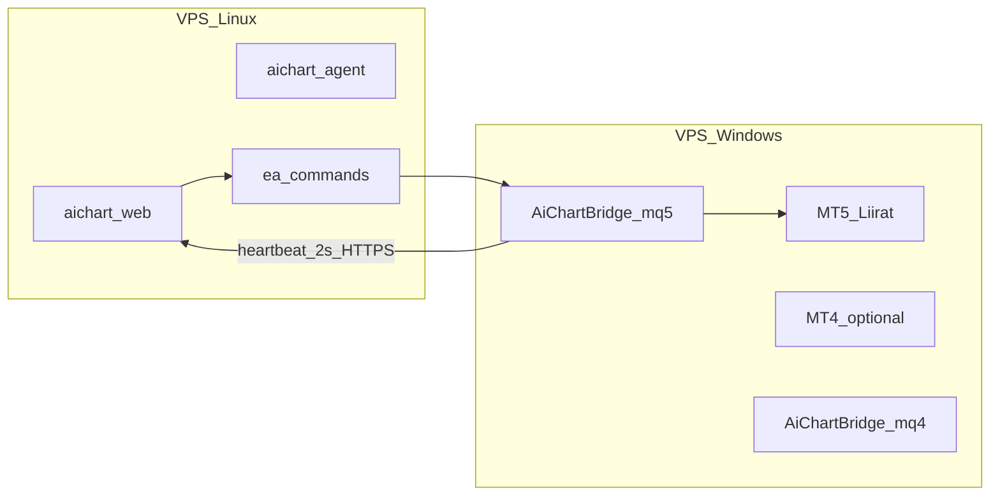
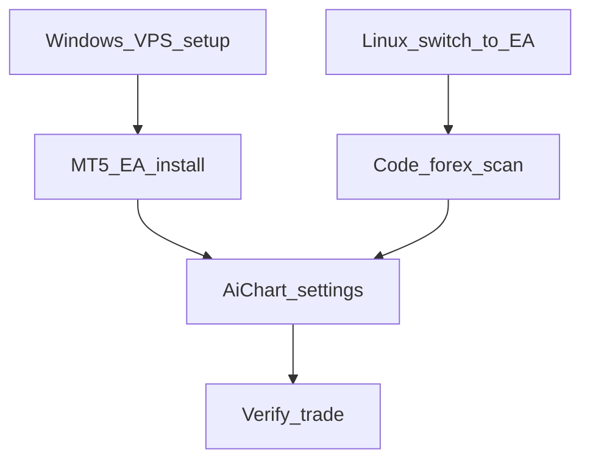

# خطة تنفيذ جسر EA (Linux + Windows VPS)

## الوضع الحالي

- VPS Linux (`72.60.83.140`): `aichart-web` + `aichart-agent` يعملان؛ `MT5_BRIDGE_URL` مفعّل → وضع **mt5local**.
- حاوية `infra-mt5-1` **healthy** لكن `/connect` يفشل بـ `IPC timeout (-10005)` — Wine لا يدعم قناة IPC بين Python و`terminal64.exe`.
- المستخدم يريد **24/7** ويدعم **MT4 و MT5**.

## قيد مهم في الكود الحالي

[`web/src/lib/eaStore.ts`](web/src/lib/eaStore.ts) يسمح بـ **اتصال EA واحد لكل مستخدم** (`UNIQUE user_id`) مع حقل `platform` = `mt4` **أو** `mt5` — وليس الاثنين معاً بنفس الرمز.

**الاستراتيجية المقترحة:**
- **المرحلة 1:** MT5 + Liirat-Live (التداول الفعلي)
- **المرحلة 2 (اختياري):** MT4 على نفس Windows أو VPS ثانٍ — يتطلب إما تبديل المنصة في الإعدادات أو توسيع الكود لاحقاً (اتصالان لكل مستخدم)

---

## المرحلة 1 — VPS Linux: التحويل إلى وضع EA

**الملفات:** [`web/.env`](web/.env) على السيرفر، [`web/src/lib/brokers/forexBackend.ts`](web/src/lib/brokers/forexBackend.ts)

| الإجراء | التفاصيل |
|---------|----------|
| ضبط `.env` | `FOREX_BACKEND=ea` · **تعطيل** `MT5_BRIDGE_URL` و`MT5_BRIDGE_TOKEN` (تعليق أو حذف) |
| إعادة التشغيل | `pm2 restart aichart-web` |
| تحرير RAM | `docker compose -f /opt/aichart/infra/docker-compose.yml stop mt5` (~1.5GB) |
| التحقق | الإعدادات تعرض [`EaConnectCard`](web/src/components/settings/EaConnectCard.tsx) بدل [`MtConnectCard`](web/src/components/settings/MtConnectCard.tsx) |

**سكربت جديد مقترح:** [`infra/vps-switch-forex-ea.sh`](infra/vps-switch-forex-ea.sh) — يعدّل `.env` بأمان، يوقف حاوية mt5، يعيد تشغيل web، ويطبع checklist.

**تحديث توثيق:** إضافة `FOREX_BACKEND=ea` إلى [`web/.env.example`](web/.env.example) مع شرح الأولوية في [`forexBackend.ts`](web/src/lib/brokers/forexBackend.ts).

**ملاحظة في** [`infra/mt5/README.md`](infra/mt5/README.md): MT5 Local على Linux/Wine **غير موصى به** حتى حل IPC؛ الإبقاء على الكود للمستقبل (Windows VM).

---

## المرحلة 2 — VPS Windows: الاختيار والإعداد من الصفر

**وثيقة جديدة:** [`docs/EA_WINDOWS_VPS.md`](docs/EA_WINDOWS_VPS.md)

### 2.1 اختيار VPS Windows

| المعيار | التوصية |
|---------|---------|
| النظام | Windows Server 2022 (أو Windows 10/11 Pro) |
| المنطقة | **أوروبا** (Frankfurt / Amsterdam) — قرب وسيط Liirat |
| المواصفات | 2 vCPU · **4 GB RAM** (MT5 وحده ~2GB؛ MT4+MT5 معاً يحتاج 4GB) |
| مزودون شائعون | Contabo · OVH · Hetzner (Windows) · AWS EC2 Windows |

### 2.2 إعداد Windows 24/7

- تعطيل Sleep/Hibernate (خطة طاقة High Performance)
- RDP للإدارة فقط؛ MT5 يعمل في الخلفية
- **Task Scheduler** (اختياري): إعادة تشغيل `terminal64.exe` / `terminal.exe` عند التعطل
- جدار ناري: لا حاجة لفتح منافذ واردة — EA يتصل **صادراً** إلى `https://aichart.lork.cloud`

### 2.3 تثبيت MetaTrader

**MT5 (أولوية — Liirat):**
1. تحميل MT5 من وسيط Liirat (ليس المثبّت العام فقط إن وُجد نسخة الوسيط)
2. تسجيل دخول: حسابك + سيرفر `Liirat-Live`
3. حفظ كلمة المرور في MT5

**MT4 (لاحقاً — نفس VPS أو منفصل):**
1. تثبيت MT4 من الوسيط
2. نفس خطوات EA مع [`ea/mt4/AiChartBridge.mq4`](ea/mt4/AiChartBridge.mq4)
3. MT4 يتطلب إضافة `https://aichart.lork.cloud` في WebRequest

---

## المرحلة 3 — تثبيت EA على Windows

مرجع: [`ea/README.md`](ea/README.md) · [`docs/EA_BRIDGE.md`](docs/EA_BRIDGE.md)

| خطوة | MT5 | MT4 |
|------|-----|-----|
| نسخ EA | `MQL5/Experts/AiChartBridge.mq5` | `MQL4/Experts/AiChartBridge.mq4` |
| Compile | MetaEditor → F7 | نفس الشيء |
| Inputs | `ApiBase=https://aichart.lork.cloud` · `EaToken=<من الإعدادات>` · `StreamSymbol=EURUSD` · `HeartbeatSeconds=1` (اختياري لتقليل التأخير) | نفس القيم |
| WebRequest | غالباً غير مطلوب في MT5 | **مطلوب** — إضافة URL |
| AutoTrading | ON (الزر الأخضر) | ON |

**توليد الرمز:** الإعدادات → الربط والتكامل → توليد رمز EA (يُعرض مرة واحدة).

---

## المرحلة 4 — تعديلات الكود (فوركس 24/7 تلقائي)

المشكلة: مسح الوكيل الحالي **كريبتو فقط** — [`agent/workspace/HEARTBEAT.md`](agent/workspace/HEARTBEAT.md) يستدعي `POST /api/agent/market/scan` الذي يستخدم `scanSymbol` فقط في [`web/src/app/api/agent/market/scan/route.ts`](web/src/app/api/agent/market/scan/route.ts).

بينما مسح الفوركس موجود في [`web/src/lib/opportunityScan.ts`](web/src/lib/opportunityScan.ts) عبر `scanForexSymbol` ويعتمد على شموع EA من [`buildForexSnapshot`](web/src/lib/market.ts).

### التعديلات المطلوبة

1. **`/api/agent/market/scan`** — دعم `market: "forex"` أو قراءة `settings.active_market` واستدعاء `scanForexSymbol` + `resolveScanAssetsForMarket` (نفس منطق `opportunityScan.ts`).

2. **`HEARTBEAT.md`** — تحديث مهمة `market-scan`:
   - إذا `active_market=forex`: مسح أزواج الفوركس من `allowed_assets`
   - إذا `crypto`: السلوك الحالي
   - أو مهمة منفصلة `forex-market-scan` كل 30m

3. **(اختياري)** تقليل `HeartbeatSeconds` الافتراضي من 2 إلى 1 في [`ea/mt5/AiChartBridge.mq5`](ea/mt5/AiChartBridge.mq5) و[`ea/mt4/AiChartBridge.mq4`](ea/mt4/AiChartBridge.mq4).

4. **دفع إصلاحات MT5 المحلية** (shim/entrypoint/Dockerfile) إلى `main` — اختياري؛ الحاوية ستُوقف.

---

## المرحلة 5 — ضبط AiChart للتداول

في لوحة الإعدادات ([`SettingsClient`](web/src/components/SettingsClient.tsx)):

| الإعداد | القيمة المقترحة |
|---------|-----------------|
| `active_market` | `forex` |
| `allowed_assets` | أزواج Liirat (مثل EURUSD — بالضبط كما في Market Watch) |
| `mode` | `auto` أو `approval` حسب تفضيلك |
| `analysis_interval` | `1h` أو `15m` |

تأكد أن EA يبث `StreamSymbol` مطابقاً لزوج في المسح.

---

## المرحلة 6 — التحقق (Checklist)

| # | الاختبار | النجاح المتوقع |
|---|----------|----------------|
| 1 | الإعدادات → EA | حالة **online** (نقطة ذهبية) |
| 2 | `GET /api/ea/status` | `connected: true` |
| 3 | شارت السوق (فوركس) | شموع تظهر من EA |
| 4 | تنفيذ تجريبي | intent → أمر في `ea_commands` → ack خلال ~1–4 ث |
| 5 | سجلات Windows | EA يطبع بدون أخطاء WebRequest |
| 6 | انقطاع 30+ ث | المنصة ترفض الأوامر (سلوك متوقع) |

---

## MT4 + MT5 معاً (طلبك)

| الخيار | الوصف | جهد |
|--------|--------|-----|
| **A (موصى به الآن)** | MT5 فقط للتداول؛ MT4 لاحقاً عند الحاجة | منخفض — لا تغيير schema |
| **B** | MT4 و MT5 على نفس Windows، **منصة واحدة نشطة** في AiChart (تبديل + تدوير رمز) | متوسط — تشغيلي فقط |
| **C (مستقبلي)** | اتصالان EA لكل مستخدم (`ea_connections` multi-row) | عالي — تغيير DB + UI + routing |

**التوصية:** نفّذ **A** أولاً حتى يعمل Liirat-Live؛ ثم نقرر **C** إن احتجت التداول من المنصتين بالتوازي.

---

## ترتيب التنفيذ

1. Linux: `FOREX_BACKEND=ea` + إيقاف mt5
2. بالتوازي: شراء/إعداد VPS Windows
3. كود: agent forex scan + HEARTBEAT + `.env.example` + سكربت deploy
4. Windows: MT5 + EA + Liirat login
5. AiChart: رمز EA + إعدادات فوركس
6. اختبار end-to-end

**تقدير الوقت:** Linux ~30 دقيقة · Windows VPS ~2–4 ساعات (أول مرة) · كود ~1–2 ساعة · اختبار ~30 دقيقة.
