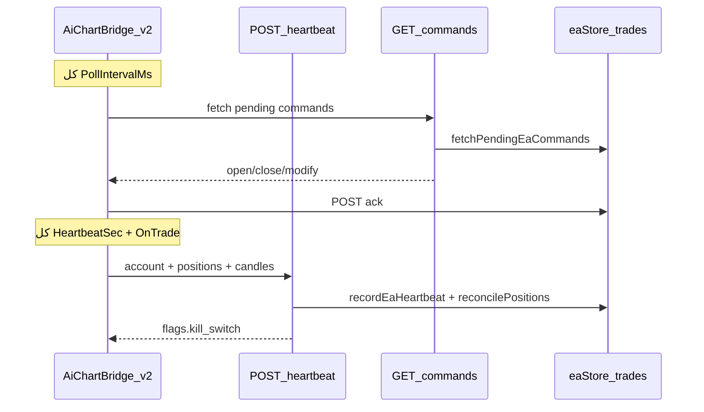

# خطة إصلاح EA MT5 + Backend (AiChart v2.0)

## تشخيص الوضع الحالي

الملف الرئيسي: [`ea/mt5/AiChartBridge.mq5`](ea/mt5/AiChartBridge.mq5) (v1.03).

| المشكلة | السبب الجذري في الكود |
|---------|----------------------|
| Offline / لا heartbeat | `OnTimer` يعتمد على `WebRequest`؛ عند الفشل يخرج بصمت (`return` بدون إعادة محاولة). لا heartbeat فوري في `OnInit`. |
| retcode 10026/10027 | `ExecuteMarket` يستدعي `trade.Buy/Sell` مرة واحدة بدون فحص bid/ask ولا retry. |
| صفقات MT5 غير مسجّلة | الـ heartbeat يرسل `positions` ويخزّنها في `positions_json`، لكن **لا يُنشئ** صفوفاً في `trades`. [`openTradesSummary`](web/src/lib/openTradesSummary.ts) يعرضها كـ «MT5 مباشرة» منفصلة عن `aichartTrades`. |
| adjust_sl لا يُطبَّق | [`exit-decision/route.ts`](web/src/app/api/agent/trade/exit-decision/route.ts) يسجّل audit فقط. `modify_sl_tp` موجود في [`types.ts`](web/src/lib/types.ts) والعقد لكن **غير مُنفَّذ** في EA ولا يُنشأ من backend. |
| Kill Switch بلا إشعار EA | [`kill-switch/route.ts`](web/src/app/api/agent/kill-switch/route.ts) يحدّث DB ويستدعي `closeAllOpenTrades` — الذي **يتجاهل** `broker === "mt_ea"` (يحاول Binance فقط). |
| صفقة بدون SL | EA يمرّر `sl=0` إلى MT5؛ backend [`eaAdapter`](web/src/lib/brokers/eaAdapter.ts) يعتمد على `normalizeMt5Stops` بدون رفض صريح. |
| modify / close عن بُعد | EA يدعم `close_position` لكن backend **لا يُنشئ** أمر `close_position` أبداً. |



## قرار معماري: توسيع العقد الحالي (لا endpoints جديدة)

مواصفاتك تذكر `POST /api/ea/sync-positions` و`GET /api/ea/commands` و`POST /api/ea/error`. في المشروع:

- **المزامنة:** positions مُضمّنة أصلاً في [`POST /api/ea/heartbeat`](web/src/app/api/ea/heartbeat/route.ts) — نضيف **reconciliation** في الـ handler بدل endpoint منفصل.
- **Polling:** [`GET /api/ea/commands`](web/src/app/api/ea/commands/route.ts) **موجود** — نفعّله في EA بمؤقت سريع (1s) بينما heartbeat بطيء (30s).
- **الأخطاء:** [`POST /api/ea/commands/{id}/ack`](web/src/app/api/ea/commands/[id]/ack/route.ts) مع `status: failed` + `result.error` — كافٍ. نُحسّن رسائل EA بـ `formatMt5TradeError` على backend.

**تنبيه Heartbeat 30s:** [`EA_HEARTBEAT_TIMEOUT_MS = 30_000`](web/src/lib/eaStore.ts) يعني أن نبضة واحدة فائتة = offline. مع `HeartbeatSec=30` يجب رفع timeout إلى **~90_000ms** (3× الفترة).

**تسمية Token:** نُبقي `EaToken` (الاسم الحالي في UI) ونضيف تعليقاً أنه يقابل `ApiKey` في مواصفاتك — لا نكسر إعدادات المستخدمين.

---

## الجزء 1 — EA v2.0 ([`ea/mt5/AiChartBridge.mq5`](ea/mt5/AiChartBridge.mq5))

### Inputs جديدة (مع الإبقاء على الموجود)

```mql5
input int     HeartbeatSec    = 30;    // كان HeartbeatSeconds=1
input int     PollIntervalMs  = 1000;
input bool    AllowNoSL       = false;
input int     MaxRetries      = 3;
input int     RetryDelayMs    = 500;
input bool    AutoSync        = true;
```

- `#property version "2.00"`
- مؤقتان: `EventSetTimer(HeartbeatSec)` + `EventSetMillisecondTimer(PollIntervalMs)`
- `OnTimer` → heartbeat فقط
- `OnTimer` millisecond → `PollCommands()` عبر `GET /api/ea/commands` + `HttpGet` جديد
- **لا** معالجة commands من رد heartbeat (تجنّب double-fetch)

### FIX 1 — Heartbeat resilience

- `// FIX: 1` — heartbeat فوري في `OnInit`
- `// FIX: 1` — عدّاد `g_hb_failures`؛ log واضح عند `WebRequest` failure؛ استمرار المحاولة (لا `return` نهائي)
- `// FIX: 1` — `OnTradeTransaction`: إذا `AutoSync`، debounce 2s ثم heartbeat إضافي

### FIX 2 — Off quotes (10026)

- `// FIX: 2` — `bool HasLiveQuotes(string sym)`: `SymbolInfoDouble(SYMBOL_BID/ASK) > 0` + `SYMBOL_TRADE_MODE != DISABLED`
- رفض قبل `OrderSend` برسالة `"off quotes: no live bid/ask for " + sym`
- **لا retry** على 10026 بعد فشل pre-check

### FIX 3 — Broker busy (10027) + requote (10004)

- `// FIX: 3` — `ExecuteWithRetry(MqlTradeRequest&, MqlTradeResult&)` أو wrapper حول `CTrade`
- retry فقط لـ 10027 و10004 (حتى `MaxRetries`، `Sleep(RetryDelayMs)`)
- refresh السعر (`SymbolInfoDouble`) قبل كل محاولة

### FIX 4 — مزامنة فورية عند تغيير البوزيشن

- `// FIX: 4` — `OnTradeTransaction` + `AutoSync` → heartbeat فوري (positions تُرسل ضمن `BuildPositions()` الموجود)
- Backend يكمّل التسجيل (الجزء 2)

### FIX 5 — modify_sl_tp

- `// FIX: 5` — handler جديد في `HandleCommand`:

```mql5
else if(type == "modify_sl_tp") {
   long ticket = (long)PayloadNum(payload, obj, "ticket");
   double sl = PayloadNum(payload, obj, "stop_loss");
   double tp = PayloadNum(payload, obj, "take_profit");
   ModifyPosition(id, ticket, sl, tp);
}
```

- `ModifyPosition`: `PositionSelectByTicket` → `trade.PositionModify(ticket, sl, tp)` مع retry

### FIX 6 — Kill Switch

- `// FIX: 6` — parse `flags.kill_switch` / `kill_switch` من رد heartbeat
- عند `active=true`: `g_trading_halted=true`، log + `Print` واضح
- إذا `close_open_trades=true`: `CloseAllPositions()` ثم ack داخلي
- رفض `open_market` أثناء halt (ack failed: `"kill switch active"`)
- عند `active=false`: استئناف

### FIX 7 — SL إلزامي

- `// FIX: 7` — في `ExecuteMarket`: إذا `!AllowNoSL && sl <= 0` → ack failed `"stop_loss required"`

### تحسينات إضافية (لا كسر)

- `ClosePosition` / `ExecuteMarket`: استخدام retry wrapper
- `HttpGet` للـ polling (نفس headers كـ `HttpPost`)
- تحديث [`ea/shared/api-contract.json`](ea/shared/api-contract.json): v2 inputs، `flags` في heartbeat response، `modify_sl_tp` payload

### CHANGELOG

- ملف جديد [`ea/mt5/CHANGELOG.md`](ea/mt5/CHANGELOG.md) يdocument كل FIX 1–7

### MT4

- [`ea/mt4/AiChartBridge.mq4`](ea/mt4/AiChartBridge.mq4): **خارج النطاق الأول** (لا draw_and_capture أصلاً). يمكن port لاحقاً إن طُلب.

---

## الجزء 2 — Backend (ضروري لإكمال المشاكل 4–6)

### 2a. مزامنة البوزيشنز → `aichartTrades`

ملف جديد [`web/src/lib/eaPositionSync.ts`](web/src/lib/eaPositionSync.ts):

- `reconcileEaPositions(userId, positions: EaBrokerPosition[])`
- **Import:** لكل ticket في heartbeat بدون trade مفتوح (`order_id = ticket`, `broker = mt_ea`) → `recordTrade` مع `intent_id: null`, `status: open`, qty/lots/side من EA
- **Close detection:** trade مفتوح `mt_ea` + ticket غير موجود في positions → `updateTradeClosed` (pnl من آخر profit معروف أو 0)
- استدعاء من [`heartbeat/route.ts`](web/src/app/api/ea/heartbeat/route.ts) بعد `recordEaHeartbeat`

### 2b. إغلاق صفقات mt_ea

في [`web/src/lib/tradeClose.ts`](web/src/lib/tradeClose.ts):

- `closeMt5EaTrade(trade)` — `createEaCommand({ command_type: "close_position", payload: { ticket } })` + poll ack (نفس منطق [`eaAdapter`](web/src/lib/brokers/eaAdapter.ts))
- `closeOpenTrade`: فرع `trade.broker === "mt_ea"` قبل Binance
- `closeAllOpenTrades`: دعم `mt_ea` + queue `close_position` لكل ticket في `positions_json` غير المسجّلة (صفقات يدوية)

استخراج helper مشترك: `waitForEaCommandAck(commandId)` في [`web/src/lib/eaCommandWait.ts`](web/src/lib/eaCommandWait.ts) (يُستخدم من eaAdapter + tradeClose).

### 2c. adjust_sl → modify_sl_tp

في [`exit-decision/route.ts`](web/src/app/api/agent/trade/exit-decision/route.ts):

- عند `decision === "adjust_sl"` + `new_stop_loss`:
  - `getTrade` → ticket من `order_id`
  - `createEaCommand({ command_type: "modify_sl_tp", payload: { ticket, stop_loss, take_profit? } })`
  - poll ack + رد JSON يتضمن `ea_command_id` ونتيجة التنفيذ

(اختياري لاحقاً: endpoint `POST /api/agent/trade/modify` — ليس ضرورياً للإصلاح)

### 2d. Kill Switch → EA

في [`heartbeat/route.ts`](web/src/app/api/ea/heartbeat/route.ts):

```typescript
const settings = await getSettings(conn.user_id);
return NextResponse.json({
  ok: true,
  server_time: ...,
  flags: {
    kill_switch: settings.kill_switch === 1,
    close_open_trades: false, // true فقط pulse واحد بعد تفعيل
  },
  commands: [...],
});
```

- في [`kill-switch/route.ts`](web/src/app/api/agent/kill-switch/route.ts): عند `on && close_open_trades`:
  - queue `close_position` لكل ticket (من trades + positions_json)
  - set flag مؤقت `ea_kill_close_pending` (system_flags أو column) ل pulse واحد `close_open_trades: true` في heartbeat
- `closeAllOpenTrades` يستدعي مسار mt_ea الجديد

### 2e. Timeout + رفض SL في backend

- [`eaStore.ts`](web/src/lib/eaStore.ts): `EA_HEARTBEAT_TIMEOUT_MS = 90_000`
- [`eaAdapter.ts`](web/src/lib/brokers/eaAdapter.ts): رفض `open_market` إذا `stops.stop_loss` null/0 قبل queue

### 2f. توثيق

- تحديث [`ea/README.md`](ea/README.md) و[`docs/EA_BRIDGE.md`](docs/EA_BRIDGE.md) إن وُجد: v2 inputs، polling، kill_switch flags

---

## خطة الاختبار (بعد التنفيذ)

| الاختبار | التحقق |
|---------|--------|
| Online خلال 30s | `GET /api/ea/status` أو diagnostics → `online: true` |
| صفقة يدوية MT5 | تظهر في `GET /api/agent/trades/open` ضمن AiChart (ليس فقط MT5 مباشرة) |
| close_trade | `POST /api/agent/trade/close` → ticket يُغلق على MT5 + ack |
| adjust_sl | `POST /api/agent/trade/exit-decision` → SL يتغير على MT5 |
| بدون SL | `AllowNoSL=false` → ack failed؛ backend يرفض intent بدون SL |
| Kill Switch | تفعيل + `close_open_trades` → EA يغلق + log؛ منصة تمنع أوامر جديدة |
| انقطاع شبكة | إيقاف/تشغيل → EA يعود online بعد أول heartbeat ناجح |

**Compile:** MetaEditor F7 على Windows — هدف zero errors؛ warnings قليلة مقبولة إن كانت من MQL standard library.

---

## ترتيب التنفيذ المقترح

1. Backend helpers (`eaCommandWait`, `eaPositionSync`, timeout)
2. Backend wiring (tradeClose mt_ea, exit-decision, kill-switch flags)
3. EA v2.0 (polling + fixes 1–7)
4. api-contract + CHANGELOG + docs
5. `py -m graphify update web/src` بعد تعديلات TS

## مخاطر / ملاحظات

- **Double command fetch:** EA v2 يجلب commands من GET فقط؛ heartbeat للحالة + flags.
- **Idempotency:** `g_last_acked` يبقى؛ قد نحتاج `g_acked_ids[]` صغير إذا تعددت الأوامر في نفس الدورة — مراجعة أثناء التنفيذ.
- **صفقات يدوية imported:** `intent_id=null` — الوكيل يستطيع إغلاقها عبر `trade/close` بعد ربط `order_id=ticket`.
- **لا commit/push** إلا بطلب صريح منك.
