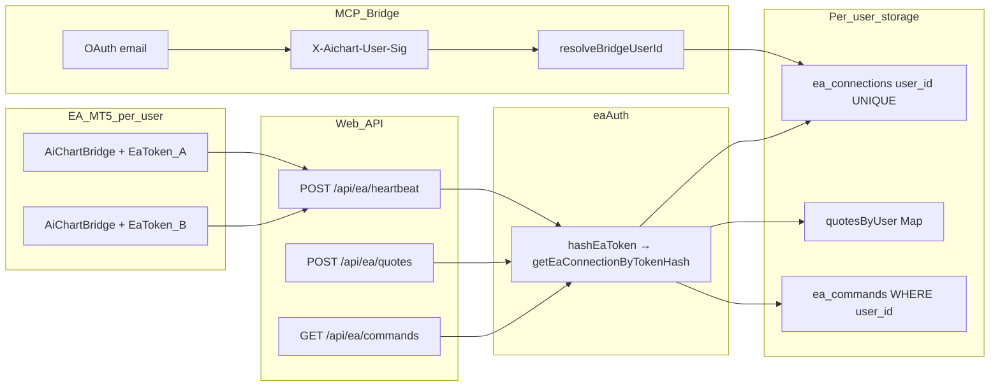

# تقييم جاهزية تعدد المستخدمين — جسر EA

## ملخص تنفيذي

**الحكم العام:** البنية **ليست** «مبنية لمستخدم واحد» — مسار EA مصمم أصلاً لعزل `user_id` في DB والذاكرة وطابور الأوامر. ما اختبرته اليوم (حساب واحد) يعكس **تشغيلاً** وليس **تصميماً**.

**نسبة العمل المتبقي للوصول لتعدد مستخدمين «كامل»:** تقريباً **15–25%** — ليس إعادة هيكلة هوية، بل:
- التحقق التشغيلي بمستخدمين حقيقيين (سكربت [`infra/tmp-test-bridge-isolation.py`](infra/tmp-test-bridge-isolation.py) موجود)
- ضمان `AICHART_SINGLE_USER` غير مفعّل في الإنتاج
- (اختياري للتوسع) cache مشترك للـ quotes إذا زادت instances عن 1
- (اختياري) UNIQUE على `token_hash` في `ea_connections`



---

## 1) ربط الهوية — EA → مستخدم

### POST `/api/ea/heartbeat` + `recordEaHeartbeat`

**🟢 جاهز لتعدد المستخدمين**

- المصادقة: [`requireEaConnection`](web/src/lib/eaAuth.ts) (سطر 33–43) — Bearer/`X-EA-Token` → `hashEaToken` → `getEaConnectionByTokenHash` → صف `EaConnection` يحمل `user_id`.
- الكتابة: [`heartbeat/route.ts`](web/src/app/api/ea/heartbeat/route.ts) (44–58) يستدعي `recordEaHeartbeat(conn.user_id, ...)`.
- DB: [`recordEaHeartbeat`](web/src/lib/eaStore.ts) (177–207) — `UPDATE ea_connections ... WHERE user_id = ?`.
- مواضع/شموع: `reconcileEaPositions(conn.user_id, ...)` و `saveEaCandles(conn.user_id, ...)`.

### POST `/api/ea/quotes` + `updateEaLiveQuotes`

**🟢 جاهز**

- [`quotes/route.ts`](web/src/app/api/ea/quotes/route.ts) (24–26): `requireEaConnection` ثم `updateEaLiveQuotes(conn.user_id, ...)`.

### جدول `ea_connections`

**🟢 جاهز (مع قيد تصميمي)**

- Schema: [`pg.ts`](web/src/lib/db/pg.ts) (129–150) — `user_id NOT NULL` + **`UNIQUE INDEX idx_ea_connections_user ON (user_id)`** → **مستخدم واحد = جسر EA واحد** (تدوير التوكن يستبدل نفس الصف).
- `token_hash` مفهرس لكن **ليس UNIQUE** عالمياً — lookup في [`getEaConnectionByTokenHash`](web/src/lib/eaStore.ts) (118–124). عملياً التوكن عشوائي (`ea_` + 48 hex) فلا تعارض؛ لكن **🟡 جزئي** من ناحية hardening: لا يمنع theoretically صفين بنفس hash.

### التوكن: لكل مستخدم أم عام؟

**🟢 لكل مستخدم**

- توليد: [`generateEaToken`](web/src/lib/eaAuth.ts) (15–17) — `ea_<randomBytes(24)>`.
- API: [`POST /api/ea/token`](web/src/app/api/ea/token/route.ts) (18–25) — `requirePlatformAccess()` → `upsertEaConnection(user.id, ...)`.
- **ليس** توken نظام عام؛ توken EA ≠ `AICHART_SERVICE_TOKEN` (الأخير لـ MCP فقط).

### رسالتان من جسرين مختلفين في نفس اللحظة

**🟢 يفرّق بشكل صحيح**

- كل طلب EA يُحلّ إلى `conn.user_id` مستقل.
- heartbeat يحدّث صف DB منفصل per user.
- quotes تكتب في [`quotesByUser`](web/src/lib/eaLiveState.ts) (47–64) — `Map<userId, Map<symbol, quote>>` — **لا overwrite بين مستخدمين**.
- events: [`pushEaEvent(conn.user_id, ...)`](web/src/app/api/ea/event/route.ts) (17–19).

---

## 2) العزل عند القراءة

### `eaLiveState` (ذاكرة الأسعار)

**🟢 مفهرسة بـ `user_id`**

- [`quotesByUser = new Map<number, Map<string, EaLiveQuote>>`](web/src/lib/eaLiveState.ts) (47–64, 82–104).
- `resolveLiveForexMid(userId, symbol, ...)` (197–215) يقرأ من map ذلك المستخدم فقط.

**🟡 جزئي — قيد نشر (ليس تسريب بيانات)**

- التعليق في الملف (13): «single VPS process». مع [`pm2 instances: 1`](infra/pm2.ecosystem.config.cjs) — OK حالياً.
- إذا شغّلت web بعدة instances بدون sticky/redis، quotes قد «تبدو قديمة» لأن POST quotes وGET قد يذهبان لعمليات مختلف — **ليس خلط user A مع user B**، بل **فقدان cache محلي**.

### `get_ea_live_quotes` / `get_trade_readiness` / `get_mt5_status` / `query_mt5_terminal`

| المسار | العزل | الدليل |
|--------|--------|--------|
| `GET /api/agent/ea/live-quotes` | 🟢 | [`withBridge` → `buildEaLiveQuotesSummary(userId)`](web/src/app/api/agent/ea/live-quotes/route.ts) (6–9) |
| `GET /api/agent/trade/readiness` | 🟢 | [`buildTradeReadiness({ userId })`](web/src/app/api/agent/trade/readiness/route.ts) (28–34)؛ EA checks تستخدم `getEaConnection(userId)` ([`tradeReadiness.ts`](web/src/lib/bridge/tradeReadiness.ts) 389–400) |
| `GET /api/agent/mt/status` | 🟢 | [`resolveBridgeUserId` → `getMtConnectionStatus(userId)`](web/src/app/api/agent/mt/status/route.ts) (9–10)؛ فرع EA يقرأ `getEaConnectionMeta(userId)` ([`mtConnectFlow.ts`](web/src/lib/mtConnectFlow.ts) 158–177) |
| `query_mt5_terminal` | 🟢 | [`queueEaCommandAndWait(userId, ...)`](web/src/app/api/agent/ea/query-terminal/route.ts) (9–11) |

**MCP → user scoping:** [`BridgeClient.fromAuthInfo`](mcp/src/bridge/client.ts) (32–42) يأخذ email من OAuth؛ كل طلب يضيف `X-Aichart-User-Email` + HMAC ([`client.ts`](mcp/src/bridge/client.ts) 51–54) → [`resolveBridgeUserId`](web/src/lib/agentAuth.ts) (133–176).

**🟡 legacy path:** إذا `AICHART_SINGLE_USER=1` ([`agentAuth.ts`](web/src/lib/agentAuth.ts) 27–30, 136–139) — **كل** طلبات MCP تُ forced إلى `resolveAgentUserId()` (admin/ENV) → **🔴 سلوك single-user**. الإنتاج multi-user يتطلب **عدم** تفعيل هذا الـ flag.

### debounce النبضات (3 نبضات)

**🟢 لكل مستخدم منفصل**

- [`eaDebounceState = new Map<number, EaDebounceState>`](web/src/lib/eaStore.ts) (26, 66–80).
- `getEaOnlineState(userId, ...)` (84–94)؛ `resetEaHeartbeatDebounce(userId)` عند heartbeat (105–107, 181).

---

## 3) التنفيذ والمخاطر

### `open_trade` → الجسر الصحيح

**🟢 جاهز**

```text
resolveBridgeUserId(req)                    [trade/open/route.ts:120]
  → createIntent(userId, ...)               [store]
  → executeIntent(userId, intentId)         [execution.ts:71-85]
    → getIntent + intent.user_id !== userId guard [86-88]
    → eaAdapter.placeOrder(userId, ...)     [execution.ts:176]
      → getEaConnection(userId)             [eaAdapter.ts:61]
      → createEaCommand(userId, ...)        [eaStore.ts:269-283]
```

- EA يسحب الأوامر: [`fetchPendingEaCommands(conn.user_id)`](web/src/app/api/ea/commands/route.ts) (9–10) — `WHERE user_id = ?`.
- ACK: [`ack/route.ts`](web/src/app/api/ea/commands/[id]/ack/route.ts) (25–28) — 404 إذا `existing.user_id !== conn.user_id`؛ update `WHERE id = ? AND user_id = ?` ([`ackEaCommand`](web/src/lib/eaStore.ts) 339–342).

**لا** مسار «أمر واحد لكل النظام» — الأمر مربوط بـ `user_id` ويُنفّذ فقط على EA الذي يحمل توken ذلك المستخدم.

### Risk Guard

**🟢 محسوب per-user (إعدادات + PnL + صفقات)**

- [`executeIntent`](web/src/lib/execution.ts) (99–144): `getSettings(userId)`, `getLimits(userId)`, `countOpenTrades(userId)`, `todayRealizedPnlPct(userId, ...)`, `monthRealizedPnlPct(userId, ...)`.
- [`getSettings` / `getLimits`](web/src/lib/store.ts) (48–70): `WHERE user_id = ?`.
- [`buildTradeReadiness`](web/src/lib/bridge/tradeReadiness.ts) (331–348): نفس العزل.

**🟡 جزئي — kill switch عام**

- [`isMasterKillOn()`](web/src/lib/store.ts) (989–990) — flag **`master_kill` واحد للمنصّة** (يُستخدم في execution + readiness). هذا **عزل مقصود على مستوى المنصّة** وليس تسريب بيانات؛ لكنه يوقف الجميع معاً.
- kill switch **للمستخدم**: `settings.kill_switch` per user — 🟢.

### Idempotency

**🟢 معزول per-user**

- Schema: `PRIMARY KEY (user_id, key)` ([`pg.ts`](web/src/lib/db/pg.ts) 570–576).
- [`getIdempotencyResult(userId, key)`](web/src/lib/bridge/idempotency.ts) (30–33)؛ `open_trade` يمرّر `userId` ([`trade/open/route.ts`](web/src/app/api/agent/trade/open/route.ts) 127–128, 103–109).

---

## 4) التوken — EA والمنصّة

### `AiChartBridge.mq5`

**🟢 per-terminal (per-user في الممارسة)**

- [`input string EaToken`](ea/mt5/AiChartBridge.mq5) (15) — يُلصق في خصائص EA على MT5.
- HTTP headers: (1634–1635, 2270–2271) `Authorization: Bearer` + `X-EA-Token`.
- **لا** `user_id` في EA — الهوية = التوken فقط (نموذج صحيح).

### من أين يحصل المستخدم على التوken؟

**🟢 واجهة per-user**

- [`EaConnectCard`](web/src/components/settings/EaConnectCard.tsx) (34): `POST /api/ea/token` → يعرض التوken مرة واحدة للنسخ.
- تحميل EA: `/api/ea/download` (ملف عام؛ **العزل بالتوken** لا بالملف).

---

## جدول الحكم السريع

| البند | الحكم |
|-------|--------|
| 1) ربط هوية EA (heartbeat/quotes/DB) | 🟢 |
| 1) توken EA | 🟢 per-user |
| 1) جسران متزامnan | 🟢 |
| 2) eaLiveState | 🟢 (+ 🟡 multi-instance) |
| 2) قراءات MCP/agent | 🟢 (+ 🟡 إذا SINGLE_USER=1) |
| 2) debounce | 🟢 |
| 3) open_trade routing | 🟢 |
| 3) Risk Guard caps/PnL | 🟢 |
| 3) master_kill | 🟡 عام (منصّة) |
| 3) idempotency | 🟢 |
| 4) EA + UI token | 🟢 |

---

## ما **ليس** جاهزاً / قيود تصميم

1. **🟡 جسر EA واحد لكل user** — `UNIQUE(user_id)` يمنع مستخدمين من ربط MT5 على جهازين بتوkenين مختلفين concurrently؛ التدوير يلغي التوken القديم ([`upsertEaConnection`](web/src/lib/eaStore.ts) 137–141).
2. **🟡 quotes in-memory** — يحتاج Redis/shared cache إذا `instances > 1`.
3. **🟡 `AICHART_SINGLE_USER=1`** — يعيد سلوك مستخدم واحد لكل MCP.
4. **🟡 `master_kill`** — إيقاف شامل (مقصود غالباً للمشغّل).
5. **اختبار إنتاج** — VPS حالياً يظهر user id=2 فقط online؛ لم يُتحقق end-to-end بمستخدمين EA متزامنين (السكربت جاهز لكن يحتاج `BRIDGE_TEST_USER_A/B`).

---

## الحكم العام (النسبة)

| التصنيف | التقدير |
|---------|---------|
| **موجود أصلاً + تعديلات بسيطة** | ~75–85% |
| **عمل متبقي (تشغيل + hardening)** | ~15–25% |

**الخلاصة:** مسار الهوية **مبني على `user_id` من التوken حتى التنفيذ** — ليس «إعادة هيكلة كاملة». العمل المتبقي: التحقق بمستخدمين حقيقيين، ضبط env (لا SINGLE_USER)، و(حسب التوسع) cache مشترك للـ quotes + UNIQUE على `token_hash` + توثيق «جسر واحد لكل حساب AiChart».

**لا ينصح** بافتراض «النظام single-user» — الافتراض الضمني في الكود هو **multi-user**؛ تجربة اليوم reflect عدد مستخدمين EA متصلين = 1.
