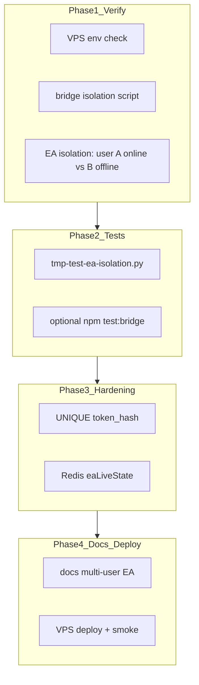

# خطة إكمال جاهزية تعدد المستخدمين — جسر EA

## السياق

التدقيق السابق خلّص أن **~75–85% جاهز بالفعل** (عزل `user_id` في DB + MCP + أوامر EA). المتبقي: **تحقق إنتاجي** + **hardening** (اخترت full_hardening) + **اختبار EA**.

### توضيح سؤال «جسر EA ثانٍ» (ببساطة)

| الوضع | ماذا يعني | هل يكفي للتحقق؟ |
|-------|-----------|-----------------|
| **Minimum** | مستخدم A لديه EA متصل؛ مستخدم B **بدون** EA | نعم — نتأكد B يرى «غير متصل» وA يرى بياناته فقط |
| **Ideal** | مستخدمان + MT5 على جهازين (أو VPS Windows ثانٍ) + توken مختلف لكل واحد | الأفضل — يثبت عدم خلط quotes/heartbeat تحت حمل حقيقي |

**الخطة تبدأ بـ Minimum** (لا يتطلب MT5 ثانٍ) وتضيف خطوات Ideal كاختيارية.



---

## Phase 1 — تحقق تشغيلي (بدون تعديل كود)

### 1.1 فحص بيئة VPS

على `72.60.83.140` / `/opt/aichart`:

| المتغير | المطلوب | الملف |
|---------|---------|-------|
| `AICHART_SINGLE_USER` | `0` | [`web/.env`](web/.env) |
| `FOREX_BACKEND` | `ea` | نفس الملف |
| `AICHART_SERVICE_TOKEN` | ≥16 حرف | MCP + web |
| `REDIS_URL` | مفعّل قبل Phase 3 | [`web/.env.example`](web/.env.example) سطر 78 |
| PM2 `instances` | `1` حالياً (OK) | [`infra/pm2.ecosystem.config.cjs`](infra/pm2.ecosystem.config.cjs) |

استخدم السكربت الموجود [`infra/tmp-vps-bridge-test.sh`](infra/tmp-vps-bridge-test.sh) — يطبع `SINGLE_USER=` ويشغّل [`infra/tmp-test-bridge-isolation.py`](infra/tmp-test-bridge-isolation.py).

**معايير PASS:**
- بدون `X-Aichart-User-Email` → **400**
- توقيع مزوّر → **403**
- مستخدمان A/B → **200** لكليهما على `/api/agent/risk/status`

### 1.2 تحضير مستخدم B (إن لم يوجد)

1. تسجيل مستخدم من `/signup` أو إنشاء من `/console/platform?tab=users`
2. موافقة admin على `platform_access`
3. **لا** تولّد EA token لـ B في هذه المرحلة (Minimum test)

### 1.3 اختبار EA minimum (يدوي أو SQL)

**المستخدم A** (admin / EA متصل): عبر MCP أو curl bridge:
- `GET /api/agent/mt/status` → `backend: ea`, `online: true`
- `GET /api/agent/ea/diagnostics?symbol=EURUSD`
- `GET /api/agent/ea/live-quotes?symbol=EURUSD`

**المستخدم B** (بدون EA):
- نفس المسارات → `connected: false` / `online: false` / quotes فارغة
- **لا** تظهر `balance`/`login`/`broker` الخاصة بـ A

تحقق DB (postgres):

```sql
SELECT user_id, status, account_login, last_heartbeat_at FROM ea_connections;
```

يجب صف **واحد** لكل `user_id` (قيد `UNIQUE(user_id)`).

---

## Phase 2 — سكربت اختبار EA موسّع

### 2.1 ملف جديد: `infra/tmp-test-ea-isolation.py`

يوسّع [`infra/tmp-test-bridge-isolation.py`](infra/tmp-test-bridge-isolation.py) بفحوص EA-specific:

| # | الفحص | PASS |
|---|--------|------|
| 1 | A: `/api/agent/mt/status` | `data.backend === 'ea'` |
| 2 | B: `/api/agent/mt/status` | `connected/online === false` |
| 3 | A: `/api/agent/ea/live-quotes` | quotes أو heartbeat fallback |
| 4 | B: `/api/agent/ea/live-quotes` | `count === 0` أو كلها stale بدون login A |
| 5 | A vs B: `/api/agent/trade/readiness?market=forex&symbol=EURUSD` | blockers مختلفة (A قد `ready`, B `EA_OFFLINE`) |
| 6 | A vs B: `/api/agent/ea/diagnostics` | B لا يرى `account_login` لـ A |

متغيرات env (نفس نمط السكربت الحالي):

- `AICHART_API_URL`, `AICHART_SERVICE_TOKEN`
- `BRIDGE_TEST_USER_A` — email مستخدم **لديه EA**
- `BRIDGE_TEST_USER_B` — email مستخدم **بدون EA**

### 2.2 wrapper VPS: `infra/tmp-vps-ea-isolation-test.sh`

نسخة من [`infra/tmp-vps-bridge-test.sh`](infra/tmp-vps-bridge-test.sh) تشغّل السكربت الجديد + تطبع آخر heartbeat من DB.

### 2.3 (اختياري Ideal) مستخدمان + EA

إذا أُعد MT5 ثانٍ:
1. User B → Console → EA → `POST /api/ea/token` → لصق في `EaToken` على MT5 B
2. إعادة تشغيل السكربت — يتوقع `online: true` لكليهما و `account_login` **مختلف**

---

## Phase 3 — Hardening (كود)

### 3.1 UNIQUE على `token_hash`

**الملفات:**
- [`web/src/lib/db/pg.ts`](web/src/lib/db/pg.ts) — بعد `CREATE INDEX idx_ea_connections_token` أضف migration idempotent:

```sql
CREATE UNIQUE INDEX IF NOT EXISTS idx_ea_connections_token_unique ON ea_connections (token_hash);
```

- [`web/src/lib/db/sqlite.ts`](web/src/lib/db/sqlite.ts) — نفس الفهرس
- دالة migrate في `initDb` تتعامل مع صفوف مكررة نادرة (log + fail safe)

**لماذا:** [`getEaConnectionByTokenHash`](web/src/lib/eaStore.ts) يفترض توكن → مستخدم واحد؛ UNIQUE يفرض ذلك على DB.

### 3.2 Redis لـ `eaLiveState`

**المشكلة:** [`quotesByUser`](web/src/lib/eaLiveState.ts) in-memory فقط — مع `instances > 1` POST quotes وGET قد يفترقان بين عمليات PM2.

**النهج:** إعادة استخدام [`getBridgeKvStore()`](web/src/lib/bridge/store.ts) (نفس Redis bridge cache):

| عملية | السلوك |
|--------|--------|
| `updateEaLiveQuotes` | تحديث memory + `SET ea:quotes:{userId}` JSON blob, TTL ~120s |
| `getEaLiveQuotes` / `getEaLiveQuote` | memory أولاً؛ إن فارغ و`REDIS_URL` → hydrate من Redis |
| بدون Redis | سلوك حالي (memory فقط) — لا breaking change |

**تغيير API:** تحويل getters إلى `async` — المستدعون:
- [`web/src/app/api/ea/quotes/route.ts`](web/src/app/api/ea/quotes/route.ts) — `await updateEaLiveQuotes`
- [`web/src/lib/bridge/forexPreflight.ts`](web/src/lib/bridge/forexPreflight.ts)
- [`web/src/lib/markets/forexPrice.ts`](web/src/lib/markets/forexPrice.ts)
- [`web/src/app/api/agent/live/account/route.ts`](web/src/app/api/agent/live/account/route.ts)
- [`buildEaLiveQuotesSummary`](web/src/lib/eaLiveState.ts) — already async

**اختبارات:** توسيع [`web/src/lib/bridge/__tests__/liveQuotesFreshness.test.ts`](web/src/lib/bridge/__tests__/liveQuotesFreshness.test.ts) + mock KV store.

**Redis على VPS:** تأكد `redis-server` يعمل و`REDIS_URL=redis://127.0.0.1:6379/0` في `web/.env` قبل deploy.

### 3.3 (صغير) UNIQUE migration + upsert safety

في [`upsertEaConnection`](web/src/lib/eaStore.ts): عند تدوير token، الصف القديم يُستبدل عبر `ON CONFLICT(user_id)` — لا تغيير مطلوب؛ فقط document أن token القديم يُبطل فوراً.

---

## Phase 4 — توثيق ونشر

### 4.1 توثيق

أضف قسم **«تعدد المستخدمين + EA»** في [`docs/EA_WINDOWS_VPS.md`](docs/EA_WINDOWS_VPS.md) أو [`docs/MCP_CLAUDE_SETUP.md`](docs/MCP_CLAUDE_SETUP.md):

- توken **لكل مستخدم** من Console → EA
- **جسر واحد لكل حساب AiChart** (`UNIQUE user_id`)
- `AICHART_SINGLE_USER=0` إلزامي للإنتاج
- مسار onboarding: signup → approval → token → MT5 → smoke script

### 4.2 نشر

1. `npm run test:bridge` محلياً
2. tarball deploy (web/src + infra scripts)
3. على VPS: migration تلقائي عند restart web
4. تشغيل:
   - `bash infra/tmp-vps-bridge-test.sh`
   - `bash infra/tmp-vps-ea-isolation-test.sh`
   - [`infra/tmp-vps-smoke-all.py`](infra/tmp-vps-smoke-all.py)

### 4.3 (اختياري) PM2 scale test

بعد Redis: رفع `aichart-web` إلى `instances: 2` مؤقتاً → إرسال quotes من EA → GET live-quotes من bridge — يجب أن تبقى الأسعار fresh (يثبت Redis path).

---

## ترتيب التنفيذ المقترح

1. **Phase 1** — ساعة واحدة، بدون deploy
2. **Phase 2** — سكربت الاختبار (~1–2 ساعة كود)
3. **Phase 3.1** — UNIQUE migration (~30 دقيقة)
4. **Phase 3.2** — Redis eaLiveState (~3–4 ساعات — async refactor + tests)
5. **Phase 4** — docs + deploy + smoke

---

## معايير «تم الإكمال»

- [ ] `AICHART_SINGLE_USER=0` مؤكد على VPS
- [ ] `tmp-test-bridge-isolation.py` — ALL PASS
- [ ] `tmp-test-ea-isolation.py` — ALL PASS (minimum: A online, B offline)
- [ ] `UNIQUE(token_hash)` مطبّق في pg + sqlite
- [ ] `eaLiveState` يقرأ/يكتب Redis عند `REDIS_URL`
- [ ] `npm run test:bridge` PASS
- [ ] توثيق onboarding multi-user EA

---

## ما **خارج** النطاق (تأجيل)

- **عدة جسور EA لنفس المستخدم** (MT5 على جهازين) — يتعارض مع `UNIQUE(user_id)`؛ يحتاج قرار منتج
- **master_kill** عام — مقصود للمشغّل؛ لا تغيير
- quote-staleness / confidence gate — مؤكّدة؛ فقط نتحقق من عزل user_id (Phase 2)
