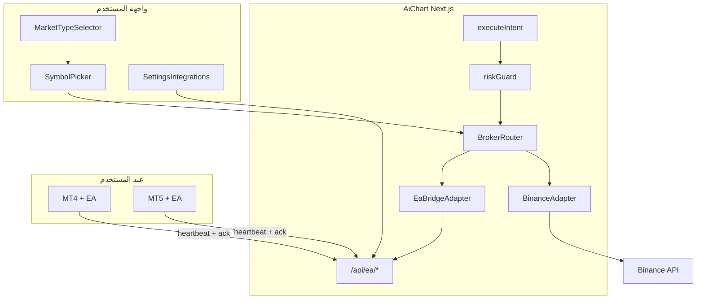
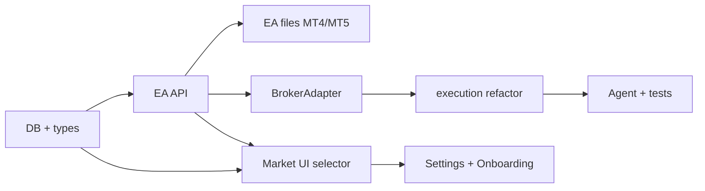

# خطة EA + Token وتبديل كريبتو / فوركس

## القرارات المعتمدة

- **MT4 و MT5 معاً** من المرحلة الأولى (ملفان EA بنفس عقد API).
- **وضع مزدوج:** المستخدم يربط Binance + EA معاً، ويختار السوق **النشط** من الواجهة (`crypto` | `forex`).
- **بدون MetaApi** — مناسب لسوريا (لا KYC/دفع لطرف ثالث).
- **Binance يبقى كما هو** — لا كسر للمسار الحالي.

---

## المعمارية المستهدفة



---

## المرحلة 1 — طبقة الأسواق والبيانات

### 1.1 توسيع أنواع السوق

تحديث [`web/src/lib/markets/types.ts`](web/src/lib/markets/types.ts):

```ts
export type MarketType = "crypto" | "forex";
export type BrokerKind = "binance" | "mt_ea";
export type MtPlatform = "mt4" | "mt5";
```

- [`web/src/lib/markets/resolve.ts`](web/src/lib/markets/resolve.ts): فصل منطق التطبيع — `BTC` → `BTCUSDT` للكريبتو، `EUR/USD` → `EURUSD` للفوركس.
- [`web/src/lib/markets/index.ts`](web/src/lib/markets/index.ts): `getUnifiedSnapshot(query, market, interval)` يوجّه حسب السوق.

### 1.2 قائمة أزواج الفوركس

ملف جديد [`web/src/lib/markets/forexInstruments.ts`](web/src/lib/markets/forexInstruments.ts):
- قائمة ثابتة للأزواج الشائعة (majors + XAUUSD + indices شائعة).
- دمج رموز إضافية من آخر heartbeat للمستخدم (`ea_symbols`).

### 1.3 تفضيل السوق النشط

إضافة عمود في `trading_settings`:

| عمود | النوع | الافتراضي |
|------|-------|-----------|
| `active_market` | TEXT | `'crypto'` |

تحديث [`web/src/lib/store.ts`](web/src/lib/store.ts), [`web/scripts/pg-schema.sql`](web/scripts/pg-schema.sql), [`web/src/lib/db/sqlite.ts`](web/src/lib/db/sqlite.ts), [`web/src/lib/types.ts`](web/src/lib/types.ts), [`web/src/app/api/settings/route.ts`](web/src/app/api/settings/route.ts).

### 1.4 الأصول المسموحة لكل سوق

توسيع `allowed_assets` إلى JSON منظم (مع ترحيل للقيم القديمة):

```json
{ "crypto": ["*"], "forex": ["EURUSD", "XAUUSD", "GBPUSD"] }
```

- [`web/src/lib/allowedAssets.ts`](web/src/lib/allowedAssets.ts): دوال `parseMarketAssets()`, `isSymbolAllowed(symbol, market)`.
- [`web/src/lib/riskGuard.ts`](web/src/lib/riskGuard.ts): فحص السوق + الرمز؛ دعم `volume` (notional USDT أو lots).

---

## المرحلة 2 — قاعدة البيانات وربط EA

### 2.1 جداول جديدة

**`ea_connections`** (حساب MT لكل مستخدم — يدعم MT4/MT5):

| عمود | ملاحظة |
|------|--------|
| `id` | PK |
| `user_id` | FK |
| `platform` | `mt4` \| `mt5` |
| `token_hash` | SHA-256 للرمز (لا تخزين plain) |
| `label` | اسم اختياري |
| `broker_name` | من heartbeat |
| `account_login` | رقم الحساب (غير سري) |
| `last_heartbeat_at` | |
| `status` | `online` \| `offline` \| `revoked` |
| `symbol_specs_json` | مواصفات الرموز (lot step, min lot…) |

**`ea_commands`** (طابور التنفيذ):

| عمود | ملاحظة |
|------|--------|
| `id`, `user_id`, `intent_id` | |
| `command_type` | `open_market`, `close_position`, `modify_sl_tp` |
| `payload_json` | symbol, side, lots, sl, tp |
| `status` | `pending` \| `sent` \| `acked` \| `failed` \| `expired` |
| `result_json`, `expires_at` | |

**`ea_market_cache`** (شموع/أسعار من EA):

| عمود | ملاحظة |
|------|--------|
| `user_id`, `symbol`, `interval` | |
| `candles_json`, `updated_at` | |

**`trade_intents` / `trades`:** إضافة `market` (`crypto`|`forex`) و `broker` (`binance`|`mt_ea`).

### 2.2 مصادقة EA

ملف [`web/src/lib/eaAuth.ts`](web/src/lib/eaAuth.ts):
- `Authorization: Bearer <ea_token>` — منفصل عن JWT المستخدم.
- التحقق من hash + `status !== revoked`.
- Rate limit خفيف per token.

---

## المرحلة 3 — API الـ EA

| Method | Route | الوظيفة |
|--------|-------|---------|
| POST | `/api/ea/heartbeat` | رصيد، equity، مراكز، أسعار، رموز متاحة، شموع الرمز النشط |
| GET | `/api/ea/commands` | EA يجلب أوامر `pending` (polling كل 1–3 ث) |
| POST | `/api/ea/commands/[id]/ack` | تأكيد تنفيذ + ticket/سعر/خطأ |
| POST | `/api/ea/token` | المستخدم يولّد/يعيد توليد token (جلسة ويب) |
| DELETE | `/api/ea/token` | إلغاء الربط |
| GET | `/api/ea/status` | حالة الاتصال للواجهة |

ملفات تحت [`web/src/app/api/ea/`](web/src/app/api/ea/).

**قاعدة قبل التنفيذ:** في [`web/src/lib/execution.ts`](web/src/lib/execution.ts) — إذا `market === forex` وآخر heartbeat أقدم من 30 ثانية → رفض: «الربط غير متصل».

---

## المرحلة 4 — BrokerAdapter والتنفيذ

### 4.1 واجهة موحّدة

ملف جديد [`web/src/lib/brokers/types.ts`](web/src/lib/brokers/types.ts):

```ts
interface BrokerAdapter {
  kind: BrokerKind;
  isConnected(userId: number): Promise<boolean>;
  getQuote(userId, symbol, market): Promise<Quote>;
  placeOrder(userId, intent): Promise<OrderResult>;
}
```

### 4.2 المحولان

- [`web/src/lib/brokers/binanceAdapter.ts`](web/src/lib/brokers/binanceAdapter.ts) — نقل المنطق الحالي من [`execution.ts`](web/src/lib/execution.ts) + [`binance.ts`](web/src/lib/binance.ts).
- [`web/src/lib/brokers/eaAdapter.ts`](web/src/lib/brokers/eaAdapter.ts) — يُنشئ `ea_commands` وينتظر ack (async مع timeout 30s) أو يُكمل فور إنشاء الأمر مع إشعار لاحق.

### 4.3 تحويل الحجم للفوركس

ملف [`web/src/lib/brokers/lotSizing.ts`](web/src/lib/brokers/lotSizing.ts):
- من `per_trade_pct` × `max_capital` → lots باستخدام `symbol_specs` من heartbeat (contract size, tick value, min/step lot).
- fallback آمن: رفض الصفقة إن لم تتوفر المواصفات.

### 4.4 تعديل المسار الحالي

[`web/src/lib/execution.ts`](web/src/lib/execution.ts) يصبح:

```
evaluateTrade → pick adapter(intent.market) → adapter.placeOrder
```

[`web/src/lib/tradeFlow.ts`](web/src/lib/tradeFlow.ts): تمرير `market` من التوصية/السياق النشط.

---

## المرحلة 5 — بيانات السوق والشارت للفوركس

### 5.1 Klines موحّد

تحديث [`web/src/app/api/market/klines/route.ts`](web/src/app/api/market/klines/route.ts):

- `?market=crypto` → Binance (كما هو).
- `?market=forex` → قراءة من `ea_market_cache`؛ إن فارغ → إرسال أمر `fetch_candles` للـ EA عبر commands.

### 5.2 Tickers وأسعار حية

- كريبتو: [`useBinanceLivePrice.ts`](web/src/hooks/useBinanceLivePrice.ts) (بدون تغيير جوهري).
- فوركس: hook جديد `useEaLivePrice.ts` — polling `/api/ea/status` أو SSE خفيف للأسعار من cache.

### 5.3 تحليل AI

تحديث [`web/src/app/api/market/analyze/route.ts`](web/src/app/api/market/analyze/route.ts) و[`web/src/lib/marketAnalyze.ts`](web/src/lib/marketAnalyze.ts) لقبول `market` وتمرير سياق الفوركس (spread, pip, lots) للوكيل.

### 5.4 Instruments API

تحديث [`web/src/app/api/instruments/route.ts`](web/src/app/api/instruments/route.ts):

- `?market=crypto` → Binance.
- `?market=forex` → `forexInstruments` + رموز المستخدم من EA.

---

## المرحلة 6 — إعادة تصميم الواجهة

### 6.1 مكوّن تبديل السوق (العنصر المركزي)

ملف جديد [`web/src/components/market/MarketTypeSelector.tsx`](web/src/components/market/MarketTypeSelector.tsx):
- Segmented control: **كريبتو** | **فوركس**
- يحفظ في `active_market` (API + localStorage للسرعة)
- يظهر في: شريط الشارت، وربما الـ sidebar

### 6.2 صفحة الشارت [`MarketClient.tsx`](web/src/components/MarketClient.tsx)

- state `market: MarketType` يتحكم بكل التدفق.
- عند التبديل: تغيير الرمز الافتراضي (`BTCUSDT` ↔ `EURUSD`)، إعادة جلب instruments، إعادة ربط live price hook.
- [`ChartOverlayToolbar.tsx`](web/src/components/market/ChartOverlayToolbar.tsx): إضافة `MarketTypeSelector` بجانب SymbolPicker.
- [`SymbolPicker.tsx`](web/src/components/market/SymbolPicker.tsx): نصوص ديناميكية («ابحث عن زوج USDT» vs «ابحث عن زوج فوركس»)، عرض quote مناسب.
- [`PriceChart.tsx`](web/src/components/PriceChart.tsx): تمرير `market` لـ klines API.

**حالة الربط:** شارة في الشارت:
- كريبتو: Binance متصل / غير متصل
- فوركس: EA online (آخر heartbeat) / offline — مع رابط للإعدادات

### 6.3 الإعدادات [`SettingsClient.tsx`](web/src/components/SettingsClient.tsx)

تبويب **الربط والتكامل** يُعاد تنظيمه:

```
┌─────────────────────────────────────┐
│  أسواقي المتصلة                      │
├─────────────────┬───────────────────┤
│  Binance        │  MetaTrader EA    │
│  [متصل/غير متصل] │  MT4 + MT5        │
│  API keys       │  Token + تعليمات  │
│                 │  تحميل EA         │
│                 │  حالة: online     │
└─────────────────┴───────────────────┘
```

ملف جديد [`web/src/components/settings/EaConnectCard.tsx`](web/src/components/settings/EaConnectCard.tsx):
- توليد token (عرض مرة واحدة)
- خطوات: تثبيت EA → لصق Token → تفعيل AutoTrading
- روابط تحميل `.ex4` و `.ex5` من [`ea/`](ea/)
- اختيار المنصة المستخدمة (MT4/MT5) للعرض

[`TradingCard`](web/src/components/SettingsClient.tsx): قسم **الأصول المسموحة** يصبح تبويبين فرعيين (كريبتو / فوركس).

### 6.4 Onboarding [`OnboardingClient.tsx`](web/src/components/OnboardingClient.tsx)

- خطوة Binance تبقى.
- خطوة جديدة اختيارية: **ربط فوركس (EA)** — يمكن تخطيها.
- ملخص النهاية يعرض السوقين.

### 6.5 Dashboard وNav

- [`DashboardClient`](web/src/components/DashboardClient.tsx): بطاقتا حالة (Binance + EA).
- تحديث نصوص [`Nav.tsx`](web/src/components/Nav.tsx) إن لزم.

### 6.6 الوكيل والدردشة

- [`web/src/lib/agent.ts`](web/src/lib/agent.ts) و[`userContext.ts`](web/src/lib/userContext.ts): تمرير `active_market` + حالة الربطين في سياق الوكيل.
- توصيات الوكيل تتضمن `market` لمسار التنفيذ الصحيح.

---

## المرحلة 7 — ملفات EA (MT4 + MT5)

مجلد جديد [`ea/`](ea/) في جذر المستودع:

```
ea/
  README.md              # تعليمات عربية + مخطط API
  mt4/AiChartBridge.mq4
  mt5/AiChartBridge.mq5
  shared/api-contract.json
```

**عقد API موحّد (MQL4/MQL5):**

1. **OnInit:** قراءة Token + Base URL من مدخلات EA.
2. **OnTimer (كل 2 ث):** `POST /api/ea/heartbeat` — JSON: balance, positions, quotes, symbol_specs, candles للرمز النشط.
3. **بعد heartbeat:** `GET /api/ea/commands` → تنفيذ → `POST ack`.
4. **تنفيذ `open_market`:** `OrderSend` + إرفاق SL/TP.
5. **Idempotency:** تجاهل `command_id` المُنفَّذ مسبقاً (ملف محلي أو متغير static).

**قيود MQL4:** `WebRequest` يحتاج إضافة URL في Tools → Options → Expert Advisors.

---

## المرحلة 8 — اختبار وتوثيق

| اختبار | التوقع |
|--------|--------|
| تبديل كريبتو ↔ فوركس | شارت + picker يتغيران |
| Binance بدون EA | كريبتو يعمل كما قبل |
| EA demo MT5 | heartbeat + تنفيذ صفقة يدوية |
| EA offline | رفض تنفيذ مع رسالة واضحة |
| Risk Guard | lots/notional + allowed per market |
| تليجرام موافقة | يعمل لكلا السوقين |

تحديث [`docs/PLAN.md`](docs/PLAN.md) وملف [`docs/EA_BRIDGE.md`](docs/EA_BRIDGE.md) جديد.

---

## ترتيب التنفيذ المقترح



**MVP قابل للنشر:** بعد P1–P6 + EA MT5 — MT4 يُختبر بالتوازي؛ الكريبتو لا يتأثر.

---

## مخاطر ومعالجتها

| المخاطر | المعالجة |
|---------|----------|
| EA غير متصل | heartbeat gate + شارة UI + إشعار تليجرام |
| تأخر التنفيذ 1–5 ث | توقعات واضحة في UI؛ ليس للـ scalping |
| اختلاف رموز الوسطاء | `symbol_specs` + mapping في resolve |
| شموع فوركس من EA | cache + أمر fetch عند فتح الشارت |
| Postgres/SQLite drift | تحديث كلا المخططين مع migration في store |

---

## خارج النطاق (هذه الخطة)

- MetaApi أو أي SaaS خارجي
- Binance Futures
- استضافة MT على سيرفر AiChart (Windows VPS)
- تداول متزامن على سوقين في صفقة واحدة
