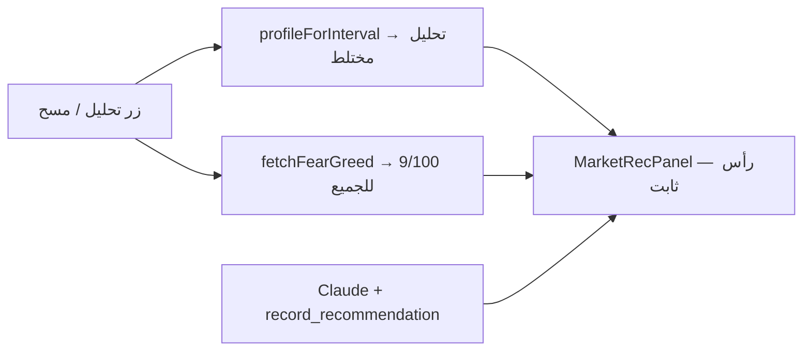
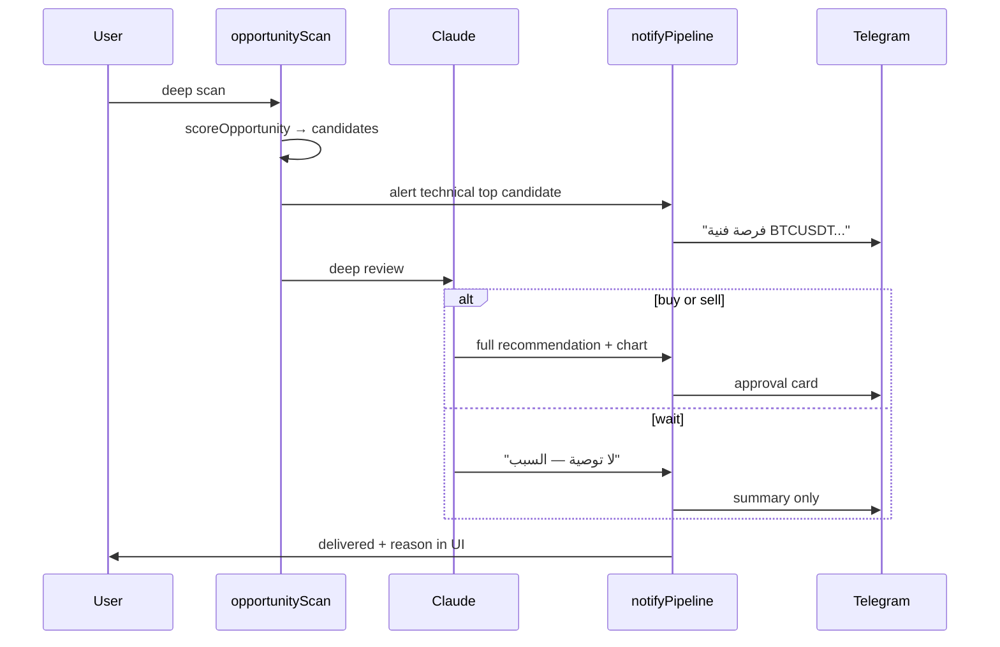

# إصلاح التحليل وإشعارات تليجرام

## تشخيص المشكلة (من الكود الحالي)

### 1. «تحليل مختلط» + «مزاج السوق: 9/100» — ليس بالضرورة خطأ

| ما يراه المستخدم | السبب في الكود |
|------------------|----------------|
| **تحليل مختلط** | تسمية ملف التحليل لإطار `1h`/`4h` في [`web/src/lib/analysisProfile.ts`](web/src/lib/analysisProfile.ts) (`SWING.labelAr = "تحليل مختلط"`) — تظهر **دائماً** على إطار ساعة |
| **مزاج السوق: 9/100** | مؤشر **Fear & Greed العام** (للسوق ككل) من [`web/src/lib/marketContext.ts`](web/src/lib/marketContext.ts) — **نفس الرقم لكل الأزواج** |
| **سيناريو تنبؤي — ليس ضماناً** | نص ثابت في [`web/src/components/market/MarketRecPanel.tsx`](web/src/components/market/MarketRecPanel.tsx) و[`analysisProfile.ts`](web/src/lib/analysisProfile.ts) |
| **«الآن أسجّل التوصية…»** | سلوك الوكيل عند استدعاء `record_recommendation` — ليس قالب UI |

**النتيجة:** عند تحليل 20 زوجاً على `1h`، **رأس اللوحة يبدو متطابقاً** حتى لو النص التحليلي يختلف — وهذا يُربك المستخدم.

### 2. تليجرام لا يصل رغم «وجود فرصة» (مسح عميق + تليجرام مربوط)

المسار في [`web/src/lib/opportunityScan.ts`](web/src/lib/opportunityScan.ts):

1. **مسح فني رخيص** (`scoreOpportunity`) → يملأ `candidates[]` — **لا يُرسل تليجرام أبداً**
2. **مسح عميق** (`deep: true`) → الوكيل يُسأل: «هل فرصة حقيقية؟ سجّل توصية **أو انتظر**»
3. إشعار تليجرام يُرسل **فقط** إذا `action === buy | sell` عبر [`notifyRecommendation`](web/src/lib/recommendationChart.ts)

**الفجوة الحرجة:** المستخدم يرى «فرصة» (إشارات RSI/MACD) لكن الوكيل غالباً يسجّل **`wait`** → **لا إشعار** رغم المسح العميق.

مسارات إشعار متعارضة إضافية:

| المسار | متى يُرسل | مشكلة |
|--------|-----------|--------|
| `record_recommendation` + `attachChart` | وضع `advisory` فقط | [`agent.ts`](web/src/lib/agent.ts) |
| `processRecommendations` → `dispatchAlert` | `can_execute=1` + نية `pending` | يُحجب بـ `alert_signals` / `alert_min_confidence` |
| `marketAnalyze` → `telegramSent` | `intents.pending` | **يُعلَم true حتى لو `dispatchAlert` لم يُسلّم** ([`marketAnalyze.ts`](web/src/lib/marketAnalyze.ts) L127) |
| تحليل الشارت | `telegramSession: true` في [`analyze/route.ts`](web/src/app/api/market/analyze/route.ts) | يعطّل إشعار `record_recommendation` ويعتمد على مسار النوايا فقط |

**أخطاء تليجرام تُبتلع:** [`notifyUser`](web/src/lib/telegram.ts) يطبع `console.error` فقط — لا feedback للمستخدم.

---

## خطة الإصلاح (3 مراحل)

### المرحلة A — إشعارات تليجرام (أولوية عالية)

**A1. توحيد بوابة الإرسال**

- إنشاء [`web/src/lib/notifyPipeline.ts`](web/src/lib/notifyPipeline.ts) (أو توسيع [`alerts.ts`](web/src/lib/alerts.ts)):
  - دالة واحدة `deliverSignal(userId, payload)` تطبّق: `alerts_enabled`, `alert_signals`, `alert_min_confidence`, `telegram_chat_id`, `isTelegramConfigured()`
  - تُرجع `{ delivered: boolean; reason?: string }` (مثل: `confidence_below_threshold`, `telegram_not_linked`, `bot_not_configured`)
- استبدال الاستدعاءات المباشرة المتفرقة في:
  - [`opportunityScan.ts`](web/src/lib/opportunityScan.ts)
  - [`recommendationChart.ts`](web/src/lib/recommendationChart.ts) (`notifyRecommendation`)
  - [`tradeFlow.ts`](web/src/lib/tradeFlow.ts)
  - [`marketAnalyze.ts`](web/src/lib/marketAnalyze.ts)

**A2. إشعار عند اكتشاف فرصة فنية (مسح عميق)**

في [`opportunityScan.ts`](web/src/lib/opportunityScan.ts) بعد ترتيب `candidates`:

- إذا `deep && candidates.length > 0`:
  - **قبل** أو **بالتوازي** مع الوكيل: أرسل تنبيهاً خفيفاً لأفضل مرشح (رمز + نقاط + الإشارات) — «فرصة فنية — جارٍ التحليل العميق»
  - بعد الوكيل:
    - `buy/sell` → بطاقة توصية كاملة + أزرار موافقة (إن `can_execute`)
    - `wait` → رسالة «لا توصية تنفيذية الآن» + ملخص الفرصة الفنية (لا صمت)

**A3. إصلاح `telegramSent` المضلّل**

- [`marketAnalyze.ts`](web/src/lib/marketAnalyze.ts): `telegramSent = result.delivered` من البوابة الموحّدة، وليس مجرد `intents.pending`
- [`MarketClient.tsx`](web/src/components/MarketClient.tsx): toast يعرض السبب عند الفشل («لم يُرسل — أدنى الثقة 70%»)

**A4. إصلاح تحليل الشارت**

- في [`analyze/route.ts`](web/src/app/api/market/analyze/route.ts): `telegramSession: false` (أو إزالة القمع) حتى `record_recommendation` يُرسل في وضع `advisory`
- أو: بعد التحليل، استدعاء `deliverSignal` صراحةً لكل `buy/sell`

**A5. feedback في الواجهة**

- [`OpportunityScanCard.tsx`](web/src/components/dashboard/OpportunityScanCard.tsx): سطر «تليجرام: أُرسل / لم يُرسل — السبب»
- ربط بـ [`SettingsClient`](web/src/components/SettingsClient.tsx) سجل التنبيهات (`delivered`) — موجود لكن المستخدم لا يراه بعد المسح

---

### المرحلة B — تحسين تجربة التحليل (أولوية متوسطة)

**B1. تمييز السياق في اللوحة**

في [`MarketRecPanel.tsx`](web/src/components/market/MarketRecPanel.tsx) + [`marketContext.ts`](web/src/lib/marketContext.ts):

- عرض **«مؤشر الخوف والطمع (عام): 9/100»** بدل «مزاج السوق» — لتجنب انطباع أن 9/100 خاص بـ BTC
- إضافة سطر **خاص بالرمز** من الـ snapshot: RSI، اتجاه، تغيّر 24س (من [`buildSnapshot`](web/src/lib/market.ts))
- إظهار `symbol` + `interval` في رأس اللوحة

**B2. تسميات أوضح لملفات التحليل**

في [`analysisProfile.ts`](web/src/lib/analysisProfile.ts):

- `SWING.labelAr`: «تحليل متوسط المدى (1h–4h)» بدل «مختلط»
- tooltip قصير يشرح الفرق بين لحظي / متوسط / شامل

**B3. سياق أغنى (اختياري للمنصة)**

- إضافة `CRYPTOPANIC_API_KEY` إلى [`platformConfig.ts`](web/src/lib/platformConfig.ts) — بدونه العناوين فارغة واللوحة تعرض F&G فقط ([`marketContext.ts`](web/src/lib/marketContext.ts) L46–47)

**B4. تقوية prompt المسح العميق**

في [`opportunityScan.ts`](web/src/lib/opportunityScan.ts) L198–202:

- عند `score >= threshold`: «الإشارات الفنية قوية — **يجب** تسجيل buy أو sell مع مستويات، أو wait مع تبرير صريح لماذا ترفض الإشارات»
- تمرير `factors` من الإشارات الفنية إلى `record_recommendation`

---

### المرحلة C — تشخيص وموثوقية (أولوية منخفضة)

**C1.** endpoint [`/api/alerts/test`](web/src/app/api/alerts/test/route.ts) — يرسل رسالة تجريبية ويُرجع `delivered + reason`

**C2.** تسجيل `reason` في `alert_log` (عمود `fail_reason` اختياري) — SQLite + PG migration

**C3.** مراجعة [`WaitingRoom`](web/src/components/dashboard/WaitingRoom.tsx) polling (`deep: false`) — إما إشعار خفيف أو توضيح «المراقبة التلقائية لا ترسل تليجرام»

---

## تدفق مستهدف بعد الإصلاح

---

## التحقق (Test plan)

1. **تليجرام مربوط + مسح عميق + مرشح فني:** يصل على الأقل تنبيه «فرصة فنية» ثم رسالة نهائية (توصية أو «انتظر»)
2. **تحليل شارت buy/sell:** toast يطابق `alert_log.delivered`
3. **تعطيل `alert_signals`:** UI يقول «لم يُرسل — التنبيهات معطّلة» وليس «أُرسل»
4. **`alert_min_confidence=70` + توصية 60%:** لا إرسال + سبب واضح
5. **تحليل زوجين مختلفين على 1h:** رأس اللوحة يُظهر الرمز + F&G مُوسَم «عام» + RSI/اتجاه مختلفين

---

## ملفات رئيسية للتعديل

| ملف | التغيير |
|-----|---------|
| [`web/src/lib/opportunityScan.ts`](web/src/lib/opportunityScan.ts) | إشعار مرحلتين + prompt أقوى |
| [`web/src/lib/alerts.ts`](web/src/lib/alerts.ts) | بوابة موحّدة + `reason` |
| [`web/src/lib/marketAnalyze.ts`](web/src/lib/marketAnalyze.ts) | `telegramSent` صحيح |
| [`web/src/app/api/market/analyze/route.ts`](web/src/app/api/market/analyze/route.ts) | `telegramSession` |
| [`web/src/components/market/MarketRecPanel.tsx`](web/src/components/market/MarketRecPanel.tsx) | سياق أوضح per-symbol |
| [`web/src/components/dashboard/OpportunityScanCard.tsx`](web/src/components/dashboard/OpportunityScanCard.tsx) | حالة التسليم |
| [`web/src/lib/marketContext.ts`](web/src/lib/marketContext.ts) | تسمية F&G «عام» |
| [`web/src/lib/analysisProfile.ts`](web/src/lib/analysisProfile.ts) | تسميات أوضح |
