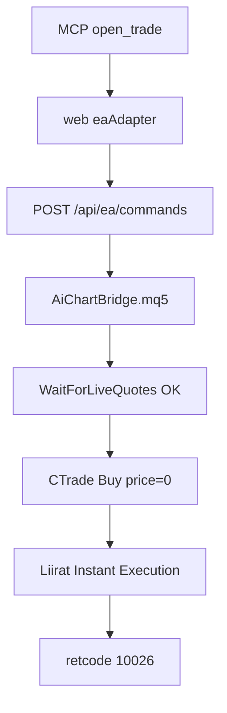
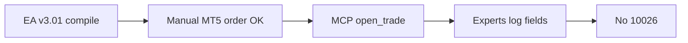

# إصلاح EA retcode 10026 — Instant Execution + Filling Mode

## التشخيص (مقارنة التقرير بالكود الحالي)

التقرير صحيح في جوهره: **الاتصال والأسعار تعمل**، والمشكلة في **بناء أمر التداول**.

الـ EA v3 في [`ea/mt5/AiChartBridge.mq5`](ea/mt5/AiChartBridge.mq5) يطبّق بالفعل:
- `SymbolSelect` + `WaitForLiveQuotes()` قبل التنفيذ
- `SetDeviationInPoints(20)` وإعادة محاولة 10026

لكن **الفجوات الحرجة** التي تفسّر 10026 رغم `quoteAgeMs ≈ 59ms`:

```437:454:ea/mt5/AiChartBridge.mq5
bool TryMarketOrder(string sym, string side, double lots, double sl, double tp, uint &retcode)
{
   ...
   trade.SetDeviationInPoints(20);
   if(side == "buy")
      ok = trade.Buy(lots, sym, 0.0, sl, tp, "AiChart");  // price = 0
   else
      ok = trade.Sell(lots, sym, 0.0, sl, tp, "AiChart");
```

| الفجوة | التأثير على Liirat (Instant Execution) |
|--------|----------------------------------------|
| **لا `SetTypeFilling()`** | CTrade قد يستخدم filling غير مدعوم (غالباً 10030، لكن بعض الوسطاء يرفضون بشكل غير متوقع) |
| **`price = 0.0` في Buy/Sell** | على `SYMBOL_TRADE_EXECUTION_INSTANT` يُشترط سعر tick حي لحظ الإرسال — 0 يسبب 10026 |
| **لا قراءة `SYMBOL_TRADE_EXECUTION`** | لا يُميّز بين Instant vs Market execution |
| **Pending: `ORDER_FILLING_RETURN` ثابت** في stop_limit فقط | باقي pending عبر CTrade بدون filling صريح |
| **لا logging لحقول الطلب** | صعب التأكد من السبب في Experts tab |



**ملاحظة مهمة:** الـ EA يُجمَّع ويُرفَق على **MT5 محلي (Windows)** — لا يُنشر عبر VPS. بعد التعديل: Compile → Reattach → اختبار.

---

## الحل المقترح (EA v3.01)

### 1. دوال مساعدة جديدة في [`ea/mt5/AiChartBridge.mq5`](ea/mt5/AiChartBridge.mq5)

إضافة دوال مركزية (قبل `TryMarketOrder`):

- **`ResolveFillingMode(string sym)`** — يقرأ `SYMBOL_FILLING_MODE` ويختار IOC → FOK → RETURN (كما في تقريرك).
- **`ConfigureTradeForSymbol(string sym)`** — يستدعي:
  - `trade.SetTypeFilling(ResolveFillingMode(sym))`
  - `trade.SetDeviationInPoints(...)` — على الأقل 20، أو `stops_level + هامش` إن كان أكبر
- **`GetFreshTick(string sym, MqlTick &tick)`** — `SymbolInfoTick` فور الإرسال مع fallback `SYMBOL_BID/ASK`
- **`LogTradeRequest(string context, ...)`** — `Print` لـ symbol, side, price, deviation, filling, execution mode, sl/tp, retcode

### 2. إعادة كتابة `TryMarketOrder` (المسار الحرج)

**قبل كل محاولة** (داخل حلقة retry):
1. `ConfigureTradeForSymbol(sym)`
2. `GetFreshTick(sym, tick)`
3. قراءة `SYMBOL_TRADE_EXECUTION`:
   - **`SYMBOL_TRADE_EXECUTION_INSTANT` أو `EXCHANGE`:** تمرير سعر صريح:
     - buy → `tick.ask`
     - sell → `tick.bid`
   - **`SYMBOL_TRADE_EXECUTION_MARKET`:** يمكن الإبقاء على `price=0` أو tick حي (كلاهما مقبول)
4. استدعاء `trade.Buy/Sell(lots, sym, price, sl, tp, "AiChart")`
5. عند الفشل: log كامل + retry لـ 10004/10026/10027

**بديل أكثر تحكّماً (موصى به إن استمر 10026):** مسار `SendMarketDeal()` بـ `MqlTradeRequest` + `OrderSend` مباشرة مع نفس الحقول — يسهّل logging ويُزيل سلوك CTrade الداخلي.

### 3. تحديث `ExecutePending`

- استدعاء `ConfigureTradeForSymbol(sym)` قبل أي pending
- لـ `stop_limit`: استبدال `ORDER_FILLING_RETURN` الثابت بـ `ResolveFillingMode(sym)`
- تطبيع `price` حسب `SYMBOL_DIGITS` و`SYMBOL_TRADE_TICK_SIZE`
- إضافة retry لـ 10026/10004 في pending (حالياً لا يوجد retry لـ pending market path)

### 4. تشخيص عن بُعد (heartbeat + query_terminal)

توسيع `BuildSymbols()` و/أو `QueryTerminal()` لإرسال:
- `trade_execution` (instant/market/exchange)
- `filling_mode` (bitmask أو ioc/fok/return)
- `spread_points`

يسمح لـ MCP بـ `get_ea_diagnostics` / `query_mt5_terminal` برؤية سبب 10026 **بدون** فتح Experts tab.

ملفات backend اختيارية خفيفة:
- [`web/src/lib/eaStore.ts`](web/src/lib/eaStore.ts) — parse الحقول الجديدة
- [`ea/shared/api-contract.json`](ea/shared/api-contract.json) — توثيق الحقول

### 5. توثيق وأخطاء أوضح

- [`agent/workspace/EA_TROUBLESHOOTING.md`](agent/workspace/EA_TROUBLESHOOTING.md) — قسم جديد:
  - «10026 + quotesOk + quoteAgeMs < 5000» → Instant Execution / filling / price=0
  - خطوة تحقق: صفقة يدوية market على نفس الرمز
- [`web/src/lib/brokers/mt5Retcode.ts`](web/src/lib/brokers/mt5Retcode.ts) — رسالة 10026 أوضح عندما diagnostics تُظهر quotes حية

### 6. CHANGELOG

- [`ea/mt5/CHANGELOG.md`](ea/mt5/CHANGELOG.md) — **v3.01**: instant execution price, auto filling, trade request logging

**خارج النطاق:** [`ea/mt4/AiChartBridge.mq4`](ea/mt4/AiChartBridge.mq4) — API مختلف (`OrderSend` كلاسيكي)؛ يُعالج لاحقاً إن ظهر نفس retcode.

---

## خطة التحقق (بعد Compile على MT5)

1. **Experts tab:** تأكد `AiChartBridge MT5 v3.01 started`
2. **يدوي:** market buy 0.01 EURUSD — يجب أن ينجح (baseline)
3. **MCP:** `query_mt5_terminal` — يظهر `trade_execution` + `filling_mode`
4. **MCP:** `open_trade` صغير EURUSD demo — يجب ack بدون `retcode 10026`
5. **Pending:** `open_pending` stop صغير — يجب ack أو retcode واضح (10015 وليس 10026)
6. **Logs:** قبل كل OrderSend تظهر سطور `AiChartBridge: ORDER ... price=... filling=... deviation=...`



---

## مخاطر / ملاحظات

- إن **فشل التداول اليدوي** أيضاً → المشكلة عند Liirat/الحساب وليس EA (كما في EA_TROUBLESHOOTING).
- إن ظهر **10016** بعد إصلاح 10026 → مشكلة SL/TP (`normalizeMt5Stops` في [`web/src/lib/brokers/eaAdapter.ts`](web/src/lib/brokers/eaAdapter.ts)) — مسار منفصل.
- لا حاجة لنشر VPS لهذا الإصلاح؛ فقط commit + pull اختياري للتوثيق.
