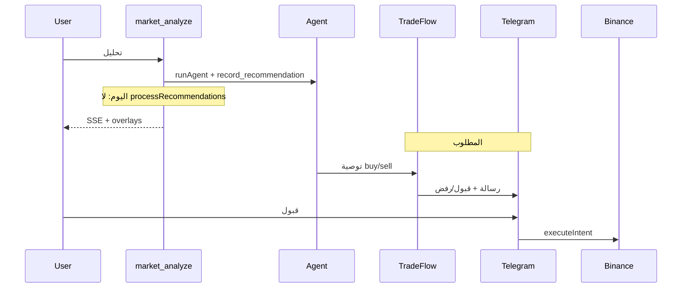
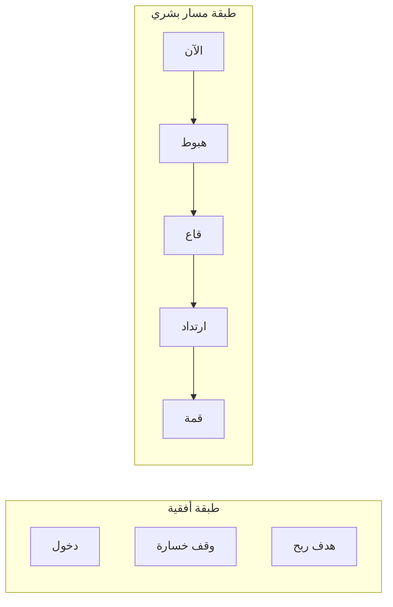
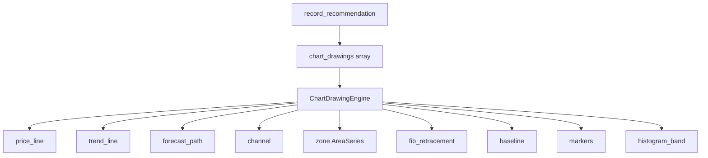
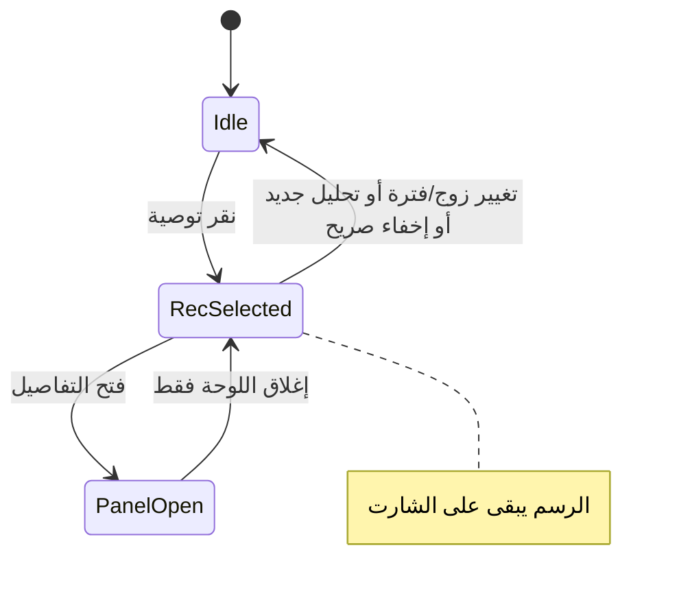
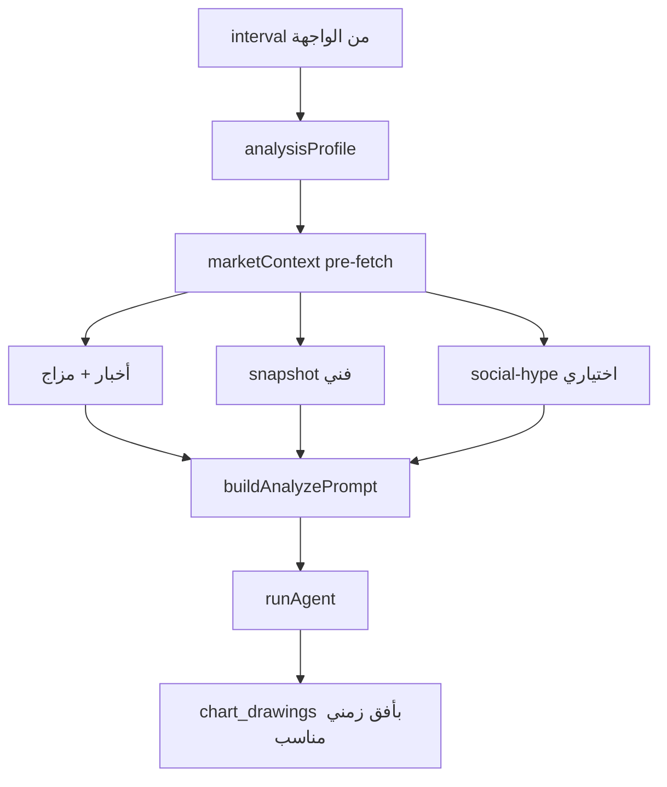
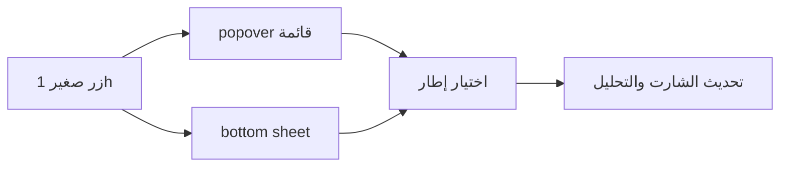
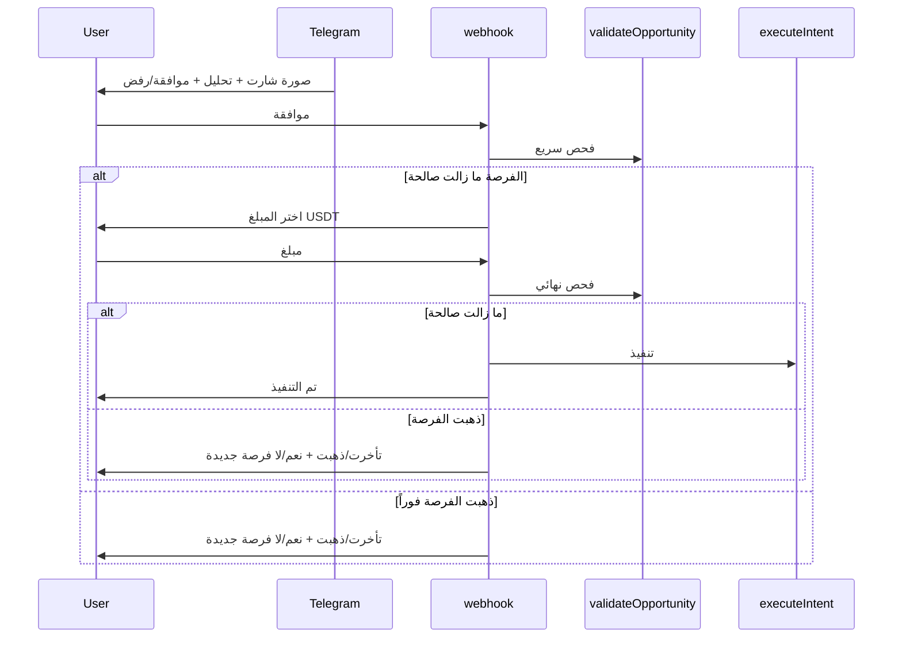

# مسار تنبؤي على الشارت + تليجرام قبول/رفض

## الوضع الحالي

| القدرة | الحالة |
|--------|--------|
| تحليل السوق | [`/api/market/analyze`](web/src/app/api/market/analyze/route.ts) يستدعي `runAgent` + `record_recommendation` |
| رسم على الشارت | خطوط أفقية فقط (دخول/SL/TP) عبر [`chartOverlays.ts`](web/src/lib/chartOverlays.ts) و [`PriceChart.tsx`](web/src/components/PriceChart.tsx) |
| تليجرام قبول/رفض | **موجود** في [`tradeFlow.ts`](web/src/lib/tradeFlow.ts) + [`webhook/route.ts`](web/src/app/api/telegram/webhook/route.ts) — يُستخدم من **المحادثة** وليس من تحليل السوق |
| إشعار تليجرام بسيط | `record_recommendation` يرسل بطاقة توصية **بدون أزرار** في وضع advisory |



---

## الفرق: خطوط أفقية vs رسم المتداول البشري

اليوم الشارت يرسم **خطوط أفقية فقط** (`createPriceLine`) — مناسبة لمستويات الدخول ووقف الخسارة والدعم الثابت، لكنها **لا تصف مسار السعر المتوقع** (هبوط ثم صعود، حرف W، قناة مائلة).

الحل: **طبقتان منفصلتان** على نفس الشارت:

| الطبقة | الغرض | تقنية الرسم |
|--------|--------|-------------|
| **استراتيجية** (موجودة) | دخول / SL / TP / دعم-مقاومة أفقي | `createPriceLine` على شموع |
| **سيناريو تنبؤي** (جديدة) | مسار يتحرك بزمن **وسعر** معاً — مثل قلم المتداول | `LineSeries` متعدد النقاط + علامات عند القمم/القيعان |



### كيف يبدو «الرسم البشري» تقنياً

1. **خط متعرج واحد (Polyline)**  
   - سلسلة `LineSeries` بلون كهرماني متقطع (`#f59e0b`, `lineStyle: dashed`).  
   - النقطة الأولى = **إغلاق آخر شمعة** (اتصال سلس بالماضي).  
   - النقاط التالية في **المستقبل** (`bars_ahead`: 1، 3، 5، 8…) بأسعار **مختلفة** — كل قطعة مائلة، ليست أفقية.

2. **نقاط التحول (Pivots)**  
   - عند كل قمة/قاع محلي: `marker` سهم + تسمية («قاع W»، «قمة»، «كسر»).  
   - هذا ما يجعل النمط مقروءاً مثل رسم يدوي على TradingView.

3. **خطوط اتجاه مائلة (اختياري، يزيد الواقعية)**  
   - `LineSeries` قصيرة من نقمتين (خط اتجاه هابط) أو من قاعين (خط دعم مائل) — ليست `priceLine` أفقية.  
   - الوكيل يمرّر `trend_lines: [{ from, to }]` بنفس بنية النقاط.

4. **منطقة توقع (اختياري)**  
   - `AreaSeries` شفافة بين مسارين (أعلى/أدنى سيناريو) = «ممر» السعر المتوقع.

5. **ما لا نستخدمه في المرحلة الأولى**  
   - رسم حر Bezier/SVG يدوي فوق الكانفس — صعب مزامنته مع التكبير/التمرير.  
   - كفاية **8–15 نقطة** في المسار لتقريب أي شكل (W، M، V، Head & Shoulders).

### قواعد يفرضها الوكيل (لتجنب «أفقي فقط»)

في `record_recommendation` / prompt التحليل:

- `forecast_path`: **6–15 نقطة**، `bars_ahead` متزايد دائماً.  
- بين كل نقطتين متتاليتين: فرق سعر ≥ **0.3%** (لا مسارات مسطحة).  
- يصف صراحة: «هبوط إلى X ثم ارتداد إلى Y» — لا يكتفي بمستوى سعر واحد.  
- `pattern_name`: اسم النمط بالعربية (قاع W، قمة مزدوجة، قناة صاعدة…).  
- مثال BTC هابط:

```json
{
  "pattern_name": "قاع W متوقع",
  "forecast_path": [
    { "bars_ahead": 0, "price": 61200 },
    { "bars_ahead": 2, "price": 60500 },
    { "bars_ahead": 4, "price": 59800 },
    { "bars_ahead": 6, "price": 60400 },
    { "bars_ahead": 8, "price": 59200 },
    { "bars_ahead": 12, "price": 61800 }
  ]
}
```

هذا يُنتج خطاً **ينزل ويصعد** — وليس خطاً أفقياً.

---

## الجزء 1: محرك رسم شامل — كل الأدوات حسب الثقة

### مبدأ التصميم

- الوكيل يُرجع مصفوفة **`chart_drawings`** — كل عنصر = أداة رسم واحدة مع **`confidence`** خاصة بها (0–100).
- المحرك [`ChartDrawingEngine`](web/src/lib/chartDrawings.ts) يطبّق **جميع الأنواع** المدعومة في `lightweight-charts` **بدون استثناء**؛ لا يُستخدم نوع واحد فقط.
- **نوع الرسم ووضوحه** يتدرّج حسب الثقة:
  - ثقة عالية → خط **صلب** (`Solid`)، `lineWidth` أكبر، ألوان كاملة
  - ثقة متوسطة → خط **متقطع** (`Dashed`)
  - ثقة منخفضة → **منقط** (`Dotted`) + `opacity` ~40%
- إذا كانت ثقة التوصية الإجمالية `< 55` أو `action === wait`: لا `forecast_path` ولا قنوات — فقط مستويات باهتة إن لزم.

### جدول أنواع الرسم (كلها مُفعّلة)

| النوع | API في lightweight-charts | متى يستخدمه الوكيل |
|--------|---------------------------|---------------------|
| `price_line` | `createPriceLine` على الشموع | دخول، SL، TP، دعم/مقاومة أفقي — **ثقة ≥ 60** |
| `trend_line` | `LineSeries` بقطعتين (من→إلى) | خط اتجاه مائل بين قمتين/قاعين — **ثقة ≥ 65** |
| `forecast_path` | `LineSeries` متعدد النقاط | مسار تنبؤي W/M/V — **ثقة ≥ 70** |
| `channel` | `LineSeries` علوي + سفلي متوازيان | قناة سعر متوقعة — **ثقة ≥ 75** |
| `zone` | `AreaSeries` بين سعرين أو مسارين | منطقة عرض/تجميع/تصحيح — **ثقة ≥ 70** |
| `fib_retracement` | عدة `createPriceLine` عند نسب فيب | تصحيح من قمة→قاع — **ثقة ≥ 80** |
| `baseline` | `BaselineSeries` | فوق/تحت خط أساس (مثلاً VWAP تقريبي) — **ثقة ≥ 75** |
| `marker` | `createSeriesMarkers` | قمم، قيعان، كسر، إشارة شراء/بيع — **ثقة ≥ 55** |
| `histogram_band` | `HistogramSeries` شفاف | شريط حجم متوقع/زخم (اختياري بصري) — **ثقة ≥ 65** |



### قواعد الثقة — ماذا يرسم الوكيل

| ثقة التوصية | الأدوات الإلزامية | الأدوات الاختيارية |
|-------------|-------------------|---------------------|
| **≥ 85%** | `forecast_path` + `price_line`(دخول/SL/TP) + `marker`(pivots) | `channel`, `fib_retracement`, `trend_line`, `zone` |
| **70–84%** | `forecast_path` + `price_line`(دخول/SL/TP) + `trend_line` واحد | `marker`, `zone` |
| **55–69%** | `trend_line` + `price_line`(دعم/مقاومة فقط) + `marker` واحد | `forecast_path` متقطع خفيف إن وُجد سيناريو |
| **< 55% أو wait** | لا مسار تنبؤي | `price_line` باهت للدعم/مقاومة فقط أو لا رسم |

كل عنصر في `chart_drawings` يحمل `confidence` خاصاً؛ المحرك يطبّق `styleForConfidence(conf)` على السماكة والنمط والشفافية.

### 1.1 توسيع بيانات التوصية

- حقل `chart_drawings_json` (TEXT) في `recommendations` — يحل محل/يُكمّل `forecast_json`.
- أنواع في [`chartDrawings.ts`](web/src/lib/chartDrawings.ts):

```ts
export type DrawingType =
  | "price_line" | "trend_line" | "forecast_path" | "channel"
  | "zone" | "fib_retracement" | "baseline" | "marker" | "histogram_band";

export interface ChartPoint { barsAhead: number; price: number; time?: number }

export interface ChartDrawing {
  type: DrawingType;
  confidence: number;       // 0-100 لهذا العنصر
  label?: string;
  color?: string;           // اختياري؛ الافتراضي من الثقة
  points: ChartPoint[];     // 1 نقطة لـ price_line، 2 لـ trend_line، 6+ لـ forecast_path، إلخ
  meta?: Record<string, unknown>; // fib: { high, low }, zone: { top, bottom }, channel: { upper[], lower[] }
}
```

### 1.2 توسيع أداة الوكيل `record_recommendation`

في [`agent.ts`](web/src/lib/agent.ts):
- حقل **`chart_drawings`**: مصفوفة من جميع الأنواع أعلاه (وليس `forecast_path` منفرداً).
- `pattern_name` يبقى للتسمية البشرية.
- التحقق على الخادم [`validateChartDrawings`](web/src/lib/chartDrawings.ts):
  - رفض `forecast_path` مسطح
  - رفض أدوات لا تطابق عتبة ثقة التوصية
  - فرض وجود `price_line` لـ SL عند `buy`/`sell` بثقة ≥ 70

تحديث [`persona.ts`](web/src/lib/persona.ts) و [`buildAnalyzePrompt`](web/src/app/api/market/analyze/route.ts):
- «استخدم **جميع** أنواع الرسم المناسبة للتحليل — لا تقتصر على خطوط أفقية»
- «اختر نوع كل رسم حسب **ثقة** ذلك المستوى/النمط»
- disclaimer: تنبؤ تعليمي

### 1.3 محرك الرسم `ChartDrawingEngine`

ملف جديد [`chartDrawings.ts`](web/src/lib/chartDrawings.ts) + تعديل [`PriceChart.tsx`](web/src/components/PriceChart.tsx):

- prop واحد: `drawings?: ChartDrawing[]` (يستبدل/يُدمج مع `overlays` القديمة تدريجياً)
- المحرك يُنشئ series/ref لكل نوع ويُنظّف عند التغيير
- `styleForConfidence(c)`: `{ lineWidth: 1|2|3, lineStyle: Solid|Dashed|Dotted, opacity }`
- **هامش مستقبلي** على محور الزمن عند وجود `forecast_path` أو `channel`
- الإبقاء على `overlays` الحالية كـ fallback حتى اكتمال الترحيل

### 1.4 واجهة السوق

في [`MarketClient.tsx`](web/src/components/MarketClient.tsx):
- SSE `done` يُرجع `drawings: ChartDrawing[]`
- شارة: `pattern_name` + أعلى ثقة مستخدمة في الرسم
- تنبيه: «سيناريو تنبؤي — ليس ضماناً»
- وسيلة إيضاح صغيرة (legend): أيقونة لكل نوع رسم ظاهر على الشارت

### 1.5 إصلاح موبايل: الرسم يختفي عند إغلاق التوصية

**السبب الحالي** في [`MarketClient.tsx`](web/src/components/MarketClient.tsx) سطر `closePanel`:

```ts
setOverlays([]);  // يمسح الرسم عند إغلاق الـ bottom sheet
setSelectedRec(null);
```

إغلاق اللوحة على الموبايل (زر X أو النقر على الخلفية في [`MarketRecPanel`](web/src/components/market/MarketRecPanel.tsx)) يستدعي `closePanel` فيُزال الرسم من الشارت — سلوك غير مرغوب.

**الحل الذكي: فصل «اللوحة» عن «طبقة الشارت»**



| حدث | اللوحة | الرسم على الشارت | التوصية المحددة |
|-----|--------|-------------------|-----------------|
| إغلاق bottom sheet / X | تُغلق | **يبقى** | تبقى مميزة في الشريط السفلي |
| نقر توصية أخرى | تُحدَّث | يُستبدل بالجديد | تتغير |
| تغيير symbol / interval | تُغلق | **يُمسح** | تُلغى |
| تحليل AI جديد | تحليل | يُستبدل | تُلغى اختيار التوصية القديمة |
| زر «إخفاء الرسم» على الشارت (جديد) | — | يُمسح | تُلغى |

**تنفيذ مقترح:**

1. **`closePanel()`** — يغيّر فقط `recDetailOpen` / `analysisOpen` إلى `false` **بدون** `setOverlays([])` ولا `setSelectedRec(null)` عند إغلاق تفاصيل توصية.
2. **`chartLayers` state** منفصل (أو الإبقاء على `overlays` + `drawings` لاحقاً) يُعبَّأ عند `selectRecommendation` / اكتمال التحليل ولا يُمسح بإغلاق اللوحة.
3. **`clearChartLayers()`** دالة مركزية تُستدعى فقط عند: تغيير الزوج، تغيير الفترة، تحليل جديد، أو زر إخفاء صريح.
4. **زر صغير على الشارت** (أعلى اليسار قرب أدوات الرسم): «إخفاء الرسم» / أيقونة `EyeOff` — يظهر فقط عندما `chartLayers.length > 0`؛ مهم على الموبايل حيث لا توجد لوحة جانبية دائمة.
5. **تمييز بصري**: بطاقة التوصية النشطة في الشريط السفلي تبقى مميزة (`border-primary`) حتى بعد إغلاق اللوحة — المستخدم يفهم أن الرسم مرتبط بها.
6. **إعادة فتح**: النقر مجدداً على نفس التوصية يفتح اللوحة دون إعادة حساب الطبقات (موجودة مسبقاً).

**ملفات:** [`MarketClient.tsx`](web/src/components/MarketClient.tsx)، اختياري [`ChartOverlayToolbar.tsx`](web/src/components/market/ChartOverlayToolbar.tsx) لزر الإخفاء.

يمكن تنفيذ **1.5 بشكل مستقل** فوراً (إصلاح سريع) قبل محرك الرسم الكامل — لا يتعارض مع بقية الخطة.

### 1.6 تحليل ورسم ذكي حسب الإطار الزمني (أخبار + فني)

**الوضع الحالي:** [`buildAnalyzePrompt`](web/src/app/api/market/analyze/route.ts) يطلب «تحليل فني» فقط ويمرّر `snap.summary` (RSI/SMA/اتجاه). **لا يوجد** جلب أخبار في المشروع (مذكور في [`SUGGESTIONS_FEASIBLE.md`](docs/SUGGESTIONS_FEASIBLE.md) كفجوة). الأدوات المتاحة: `get_market_snapshot`، `crypto_market_rank` (مزاج/رواج)، `smart_money_signals`.

**المبدأ:** الإطار المختار في [`MarketIntervalTabs`](web/src/components/market/MarketIntervalTabs.tsx) (`15m` … `1w`) يحدّد **ملف تحليل** — ماذا يُجلب تلقائياً، وما وزن الأخبار مقابل الشارت، وكم يمتد المسار التنبؤي على الشارت.



#### ثلاث فئات إطار (مُعتمد من المستخدم)

| الفئة | الإطارات | تركيز التحليل | وزن تقريبي | مصادر إلزامية |
|--------|----------|---------------|------------|----------------|
| **لحظي / سكالب** | `15m` | شارت + زخم لحظي؛ الأخبار **داعمة فقط** إن كانت عاجلة | فني **75%** · سياق **25%** | snapshot + آخر 3 عناوين ذات صلة |
| **سوينغ** | `1h`, `4h` | **مختلط**: نمط الشارت + أخبار/مزاج السوق | فني **55%** · سياق **45%** | snapshot + أخبار 24–48س + Fear&Greed |
| **موضع / استثمار** | `1d`, `1w` | **سياق شامل**: أخبار، ماكرو، أحداث، ثم تأكيد فني | سياق **65%** · فني **35%** | أخبار 7–14 يوم + مزاج + snapshot إطار أعلى (`1d` عند `1w`) |

قواعد إضافية:
- على `1d`/`1w`: الوكيل **يجب** ذكر 2+ عوامل غير فنية في `factors` (خبر، حدث، مزاج سوق، تدفّق).
- على `15m`: لا يُبنى قرار على خبر قديم؛ الخبر العاجل فقط يُرفع الثقة أو يُخفّضها.
- عند تعارض خبر قوي مع شارت ضعيف: `wait` أو ثقة منخفضة + disclaimer.

#### طبقة `marketContext` (جديدة)

ملف [`web/src/lib/marketContext.ts`](web/src/lib/marketContext.ts):

```ts
export type AnalysisTier = "intraday" | "swing" | "position";

export interface AnalysisProfile {
  tier: AnalysisTier;
  labelAr: string;           // "تحليل لحظي" | "مختلط" | "تحليل شامل"
  newsLookbackHours: number;
  taWeight: number;          // 0-1
  contextWeight: number;
  forecastBarsMin: number;   // لـ chart_drawings
  forecastBarsMax: number;
  requireNewsFactors: number; // أقل عدد عوامل أخبار في factors
}

export interface MarketContext {
  headlines: { title: string; source: string; publishedAt: string }[];
  fearGreed?: { value: number; label: string };
  socialHype?: string;       // من crypto_market_rank إن وُجد
  macroNote?: string;        // ملخص قصير (BTC dominance، أحداث أسبوعية)
}
```

**مصادر الأخبار (مرحلة 1 — بدون اشتراكات مدفوعة):**
1. **CryptoPanic** public feed (عناوين مفلترة بالرمز، مثلاً BTC/ETH) — مفتاح اختياري `CRYPTOPANIC_API_KEY`
2. **Alternative.me** Fear & Greed Index (مجاني)
3. **إعادة استخدام** `crypto_market_rank` → `social-hype` للرمز عند توفره
4. fallback: تحليل بدون أخبار مع تنبيه «لم تُجلب أخبار — اعتماد فني فقط»

#### `analysisProfile.ts`

```ts
export function profileForInterval(interval: string): AnalysisProfile;
// 15m → intraday, 1h|4h → swing, 1d|1w → position
```

#### تعديل مسار التحليل

في [`market/analyze/route.ts`](web/src/app/api/market/analyze/route.ts):
1. `const profile = profileForInterval(interval)`
2. `const context = await fetchMarketContext(symbol, profile)` — **قبل** `runAgent` (تكلفة ثابتة، لا يعتمد على الوكيل)
3. `buildAnalyzePrompt(symbol, interval, snap, profile, context)` — تعليمات عربية صريحة حسب الفئة
4. SSE `meta`: `{ analysisTier, profileLabel }` للواجهة
5. SSE `done`: `contextSummary` (3 عناوين أبرز) للعرض في لوحة التحليل

مثال تعليمات لـ `1d`:
> «الإطار يومي — ابدأ بالأخبار والسياق الكلي لآخر 7 أيام، ثم أكّد بالتحليل الفني على 1d. لا تُصدر توصية من الشارت وحده. المسار التنبؤي 5–10 أيام أماماً.»

مثال لـ `15m`:
> «الإطار 15 دقيقة — اعتمد على الزخم والشارت؛ الأخبار فقط إن كانت خلال الساعتين الماضيتين. مسار تنبؤي 8–15 شمعة.»

#### الرسم يتبع الإطار

في قواعد `chart_drawings` / `validateChartDrawings`:
- `forecast_path.bars_ahead` ضمن `[forecastBarsMin, forecastBarsMax]` من `profileForInterval`
- `1w`: نقاط أسبوعية (bars_ahead: 1, 2, 4, 8…) وليس دقائق
- `1d`/`1w`: يُسمح بـ `zone` و`channel` أوسع؛ `15m` يُفضّل `trend_line` + `forecast_path` قصير

#### واجهة السوق

في [`MarketClient.tsx`](web/src/components/MarketClient.tsx) / [`MarketRecPanel`](web/src/components/market/MarketRecPanel.tsx):
- شارة أثناء/بعد التحليل: «تحليل شامل · 1d» أو «مختلط · 4h»
- قسم «سياق السوق»: 3 عناوين + Fear&Greed
- disclaimer حسب الفئة

#### أداة وكيل جديدة (اختياري لكن موصى به)

`get_market_context` في [`agent.ts`](web/src/lib/agent.ts) — نفس `fetchMarketContext` لاستخدامها من المحادثة أيضاً، مع `interval` في المدخلات.

#### توسيع `record_recommendation`

- حقل `context_factors: string[]` أو دمج في `factors` مع بادئة `[خبر]` / `[فني]`
- حفظ `analysis_tier` و `context_json` في DB للمراجعة لاحقاً

### 1.7 منتقي الإطار الزمني — أوقات أكثر حتى الدقيقة + واجهة مضغوطة

**الوضع الحالي:** [`MarketIntervalTabs`](web/src/components/market/MarketIntervalTabs.tsx) يعرض 5 أزرار ظاهرة (`15m` … `1w`) داخل [`ChartOverlayToolbar`](web/src/components/market/ChartOverlayToolbar.tsx). الخادم يدعم [`1m, 5m, 15m, 1h, 4h, 1d, 1w`](web/src/lib/market.ts) لكن **1m و 5m غير معروضين** في الواجهة.

**المطلوب (من المستخدم):**
- إضافة **أوقات أكثر وصولاً إلى 1m** (دقيقة)
- **لا** نعرض كل الأوقات كأيقونات/أزرار دائمة — **زر صغير واحد** يعرض الإطار الحالي
- عند الضغط: **ديسكتوب** → قائمة منبثقة (popover/dropdown)
- **موبايل** → نفس الزر لكن القائمة **bottom sheet من أسفل الشاشة** (مثل [`MarketRecPanel`](web/src/components/market/MarketRecPanel.tsx))



#### قائمة الإطارات المقترحة (Binance Spot)

ثابت مشترك [`web/src/lib/intervals.ts`](web/src/lib/intervals.ts):

```ts
export const MARKET_INTERVALS = [
  "1m", "3m", "5m", "15m", "30m",
  "1h", "2h", "4h", "6h", "12h",
  "1d", "3d", "1w",
] as const;
```

- تحديث `ALLOWED_INTERVALS` في [`market.ts`](web/src/lib/market.ts) و [`/api/market/klines`](web/src/app/api/market/klines) و [`analysisProfile`](web/src/lib/analysisProfile.ts) ليشمل الجديد
- توسيع فئة **intraday** في 1.6: `1m`, `3m`, `5m`, `30m` → نفس قواعد 15m (فني 75%)

#### مكوّن جديد `IntervalPicker`

يحل محل `MarketIntervalTabs` في شريط الشارت:

| جزء | الوصف |
|-----|--------|
| **Trigger** | زر مضغوط `h-8` — أيقونة `Clock` + نص الإطار الحالي (`1h`) — بدون صف أزرار |
| **Desktop** (`lg+`) | `Popover` أو قائمة مطلقة تحت الزر — شبكة أو قائمة عمودية مرتبة من الأصغر للأكبر |
| **Mobile** (`<lg`) | overlay `bg-black/40` + لوحة `fixed inset-x-0 bottom-0 max-h-[45dvh] rounded-t-2xl` — scroll lock للجسم |
| **اختيار** | نقرة على إطار → `onChange(iv)` → إغلاق اللوحة |
| **a11y** | `aria-haspopup="listbox"`, `aria-expanded`, تسمية «الإطار الزمني» |

**تصنيف بصري اختياري داخل القائمة** (مجموعات بعناوين صغيرة):
- لحظي: 1m–30m
- سوينغ: 1h–12h
- طويل: 1d–1w

#### ملفات التعديل

- جديد: [`IntervalPicker.tsx`](web/src/components/market/IntervalPicker.tsx)
- [`ChartOverlayToolbar.tsx`](web/src/components/market/ChartOverlayToolbar.tsx) — استبدال `MarketIntervalTabs` بـ `IntervalPicker`
- حذف/إبقاء [`MarketIntervalTabs.tsx`](web/src/components/market/MarketIntervalTabs.tsx) كـ wrapper رفيع أو إزالته
- (اختياري لاحقاً) توحيد [`chart-preview-panel.tsx`](web/src/components/ui/chart-preview-panel.tsx) لنفس المنتقي

#### سلوك بعد تغيير الإطار

- الإبقاء على `useEffect([symbol, interval])` في [`MarketClient`](web/src/components/MarketClient.tsx) لمسح الرسم عند التغيير (يرتبط بـ 1.5 `clearChartLayers`)
- WebSocket السعر الحي لا يتأثر — يبقى على الزوج فقط

---

## الجزء 2: تليجرام قبول/رفض بعد التحليل

### 2.1 ربط تحليل السوق بـ `processRecommendations`

في [`market/analyze/route.ts`](web/src/app/api/market/analyze/route.ts) بعد `runAgent` (مسار SSE وغير SSE):

```ts
const result = await runAgent(
  { userId, settings, telegramSession: true }, // يمنع إشعار advisory المكرر
  ...
);
const intents = await processRecommendations(user.id, result.recommendations, {
  allowAdvisoryApproval: true,
});
```

- `telegramSession: true` يستخدم الآلية الموجودة في [`agent.ts:320`](web/src/lib/agent.ts) لمنع رسالة توصية مزدوجة.
- `allowAdvisoryApproval: true` — نفس سلوك [`chat/route.ts`](web/src/app/api/chat/route.ts).

### 2.2 شروط التنفيذ (تنفيذ Binance عند القبول)

يعمل المسار الحالي في [`tradeFlow.ts`](web/src/lib/tradeFlow.ts) عند:
- `limits.can_execute === 1`
- توصية `buy` أو `sell`
- `telegram_chat_id` مربوط + `alert_signals` مفعّل
- وضع `auto` أو `allowAdvisoryApproval`

**اليوم:** زر «موافقة» ينفّذ فوراً بحجم `per_trade_pct` ثابت — **بدون** تحقق من السعر الحي ولا اختيار مبلغ.

### 2.3 لقطة شارت مع التحليل والرسم (إلزامي)

**الوضع الحالي:** [`chartImage.ts`](web/src/lib/chartImage.ts) يولّد خط إغلاق بسيط عبر QuickChart — **بدون** entry/SL/TP ولا مسار تنبؤي. [`tradeFlow.ts`](web/src/lib/tradeFlow.ts) يرسل الصورة إن `send_screenshot === 1`.

**المطلوب:** عند إرسال التوصية على تليجرام تُرفق **صورة شارت كاملة** مع:
- شموع/خط السعر للإطار المختار
- خطوط الدخول / وقف الخسارة / الهدف
- المسار التنبؤي وعلامات النمط (من `chart_drawings_json`)
- عنوان: `BTCUSDT · 4h · قاع W متوقع`

**تنفيذ:** ملف [`chartSnapshot.ts`](web/src/lib/chartSnapshot.ts) يوسّع `buildChartImageUrl`:
- مدخلات: `symbol`, `interval`, `overlays`, `drawings`, `patternName`
- QuickChart: datasets متعددة (شموع + مسار تنبؤي) + `annotation` أفقية لـ entry/SL/TP
- يُستدعى من [`recommendationChart.ts`](web/src/lib/recommendationChart.ts) و [`tradeFlow.ts`](web/src/lib/tradeFlow.ts) **قبل** `dispatchAlert`
- يُحفظ URL في `recommendations.chart_image_url` لعدم إعادة التوليد

**نص الرسالة (caption):** `approvalCard` + ملخص التحليل (`rationale` + أهم 3 `factors`) + اسم النمط — الصورة تحمل الرسم، النص يحمل الشرح.

### 2.4 تدفق تليجرام متعدد الخطوات (موافقة → مبلغ → تحقق → تنفيذ)



**تغيير سلوك زر الموافقة:** لا يُنفّذ مباشرة — ينتقل إلى خطوة **اختيار المبلغ** (حتى لو رد المستخدم سريعاً).

#### خطوة المبلغ (من تليجرام)

أزرار inline بعد الموافقة:
- `افتراضي · X USDT` (من `per_trade_pct × max_capital`)
- `50% · Y` / `75% · Z` / `100% · W` من رأس المال الفعّال
- `مبلغ مخصص` → يطلب كتابة رقم USDT في رسالة نصية

تخزين حالة المحادثة: جدول [`telegram_pending`](web/src/lib/db/) أو حقول على `trade_intents`:
- `telegram_step`: `awaiting_amount` | `awaiting_custom_amount`
- `telegram_message_id` لتحديث نفس الرسالة

عند اختيار المبلغ: تحديث `intent.notional` ثم التحقق النهائي ثم التنفيذ.

حدود: المبلغ ≤ `max_capital` و ≤ `max_capital_cap` (الأدمن) — رفض واضح إن تجاوز.

### 2.5 التحقق من الفرصة `validateOpportunity` (ذكي)

ملف جديد [`opportunityCheck.ts`](web/src/lib/opportunityCheck.ts):

```ts
export type OpportunityVerdict =
  | "valid"
  | "late_entry"      // السعر تجاوز منطقة الدخول
  | "stopped_out"     // لمس وقف الخسارة
  | "target_hit"      // لمس الهدف — فاتتك
  | "invalidated"     // خرج من حدود الرسم/القناة
  | "expired";        // تجاوز TTL للإطار

export interface OpportunityCheck {
  verdict: OpportunityVerdict;
  livePrice: number;
  messageAr: string;
  canExecute: boolean;
}
```

**قواعد التحقق (حسب `side` و `timeframe`):**

| الحالة | شراء | بيع |
|--------|------|-----|
| **late_entry** | السعر > entry + هامش (مثلاً 0.5% على 15m، 1.5% على 1d) | السعر < entry − هامش |
| **stopped_out** | السعر ≤ stop_loss | السعر ≥ stop_loss |
| **target_hit** | السعر ≥ take_profit (اختياري: لا تنفيذ لكن أخبر) | السعر ≤ take_profit |
| **invalidated** | السعر خارج نطاق `forecast_path` / `channel` المحفوظ | نفس الشيء |
| **expired** | intent أقدم من TTL: 15m→30د، 1h→2س، 4h→8س، 1d→24س، 1w→72س | |

- `canExecute === true` فقط عند `verdict === "valid"`.
- يُستدعى **مرتين**: عند الموافقة (فحص سريع) وعند اختيار المبلغ (فحص نهائي قبل `executeIntent`).

#### بطاقة «تأخرت / ذهبت الفرصة»

عند `!canExecute` — [`staleOpportunityCard`](web/src/lib/telegram.ts):

> «تأخرت بالرد أو تجاوز السعر حدود التحليل والرسم. الفرصة لم تعد كما وُصفت.»
> السعر عند الإرسال: X · السعر الآن: Y · السبب: …

أزرار:
- `🔍 نعم · ابحث عن فرصة جديدة` → `rescan:yes:{intentId}`
- `لا شكراً` → `rescan:no:{intentId}`

**عند «نعم» (مُعتمد):** خطوة تأكيد قبل التحليل — رسالة: «سيُخصم ~3 رصيد — هل تتابع؟» مع أزرار `تأكيد البحث` / `إلغاء`. عند التأكيد فقط: استدعاء [`/api/market/analyze`](web/src/app/api/market/analyze/route.ts) لنفس `symbol` + `timeframe` → توصية جديدة + صورة + بطاقة موافقة. intent القديم → `expired`.

**عند «لا»:** `updateIntentStatus(expired)` + رسالة إغلاق مهذّبة.

### 2.6 تعديل webhook

في [`webhook/route.ts`](web/src/app/api/telegram/webhook/route.ts):

| callback | السلوك الجديد |
|----------|----------------|
| `approve:{id}` | فحص فرصة → مبلغ أو بطاقة تأخر |
| `reject:{id}` | كما هو |
| `amount:{id}:{usdt}` | تحديث notional → فحص → تنفيذ أو تأخر |
| `amount_custom:{id}` | `awaiting_custom_amount` + طلب رقم |
| `rescan:yes:{id}` | رسالة تأكيد خصم الرصيد |
| `rescan:confirm:{id}` | تحليل جديد بعد التأكيد |
| `rescan:no:{id}` | إغلاق |

في `handleMessage`: إن `telegram_step === awaiting_custom_amount` → parse رقم USDT → نفس مسار `amount`.

### 2.7 تحسين نص البطاقة

في [`telegram.ts`](web/src/lib/telegram.ts) — `approvalCard`:
- اسم النمط + ملخص الرسم
- السعر عند التحليل + وقت الإرسال
- تذكير: «اختر المبلغ بعد الموافقة»

### 2.8 استجابة API للواجهة

إرجاع في حدث SSE `done`:
- `intents: ProcessedIntent[]`
- `drawings: ChartDrawing[]`
- `telegramSent: boolean` (هل أُرسلت بطاقة موافقة)

تحديث [`MarketClient`](web/src/components/MarketClient.tsx): toast عند نجاح الإرسال — «أُرسلت التوصية إلى تليجرام»

---

## الجزء 3: التحقق

- `npm run build`
- سيناريو يدوي:
  1. تحليل BTCUSDT على `15m` → تركيز فني + مسار قصير
  2. نفس الزوج على `1d` → سياق أخبار + مسار أطول
  3. تليجرام: **صورة شارت** فيها entry/SL/TP + مسار تنبؤي + نص التحليل
  4. موافقة → اختيار مبلغ USDT → تنفيذ
  5. محاكاة تأخر: انتظر حتى يتجاوز السعر الدخول → موافقة → رسالة «تأخرت» + نعم/لا فرصة جديدة
  6. «نعم» → تحليل جديد + توصية جديدة
  7. رفض → intent مرفوض
  8. موبايل: إغلاق توصية → الرسم يبقى
  9. زر إطار زمني صغير → bottom sheet على موبايل → اختيار 1m يحدّث الشارت

---

## ملاحظات تقنية

- **التنبؤ**: يولّده Claude من التحليل الفني وليس نموذج ML — يُعرض كسيناريو تعليمي مع disclaimer.
- **جميع أدوات الرسم**: المحرك يطبّق كل نوع مدعوم في المكتبة؛ الوكيل يختار الأنواع ولا يُقيّد بخط أفقي واحد.
- **الثقة تحكم المظهر**: نفس النوع قد يظهر صلباً (ثقة عالية) أو باهتاً متقطعاً (ثقة منخفضة).
- **لا تكرار تليجرام**: `telegramSession: true` + `processRecommendations` فقط لـ buy/sell.
- **النطاق**: الرسم الشامل مرتبط بتحليل السوق؛ بث السعر الحي (WebSocket) يبقى منفصلاً.
- **الفرصة ليست أبدية**: التحقق قبل كل تنفيذ؛ التأخر يُعالج بشفافية وليس بتنفيذ أعمى.
- **المبلغ من تليجرام**: إلزامي في وضع الموافقة اليدوية — الافتراضي يبقى `per_trade_pct` كخيار سريع.
- **لقطة الشارت**: يجب أن تعكس الرسم المحفوظ وقت التحليل وليس خطاً عاماً فقط.
