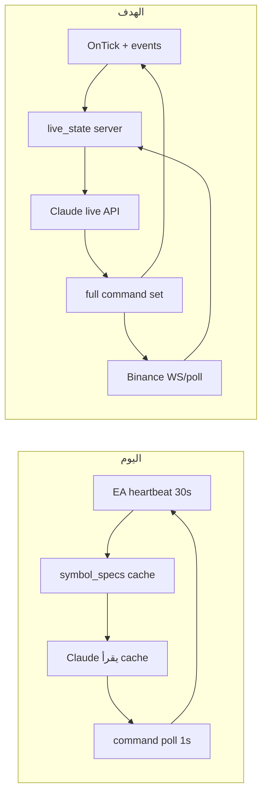

# جسر بث مباشر — تحكم Claude كامل ضمن Risk Guard

## الهدف

Claude يرى **نفس ما تراه أنت** في MT5/Binance (أسعار حية، مراكز، هامش، أوامر معلّقة) وينفّذ **كل ما تستطيع فعله يدوياً** — رسم، تحليل، فتح/إغلاق/تعديل، مراجعة — عبر MCP، مع بقاء **Risk Guard وKill Switch** كسقف أمان (حسب اختيارك).

---

## الوضع الحالي vs المطلوب

| القدرة | أنت (MT5/Binance) | Claude اليوم |
|--------|-------------------|--------------|
| أسعار لحظية | OnTick / شاشة | bid/ask من heartbeat **كل 30ث** ([`forexPrice()`](web/src/lib/markets/index.ts)) |
| كل رموز Market Watch | نعم | max 40 رمز + شموع **رمز واحد** (`StreamSymbol`) |
| فتح market | نعم | نعم — لكن `HasLiveQuotes` فوري بدون انتظار ticks |
| أوامر معلّقة limit/stop | نعم | **غير مدعوم** |
| إغلاق جزئي | نعم | **غير مدعوم** |
| رسم + screenshot | نعم | EA يدعم `draw_and_capture` — **غير موجود في MCP tools** |
| diagnostics EA | نعم | API موجود [`/api/agent/ea/diagnostics`](web/src/app/api/agent/ea/diagnostics/route.ts) — **غير في MCP** |
| Binance futures modify | نعم | API موجود — **غير في MCP** ([`futures/modify`](web/src/app/api/agent/futures/modify/route.ts)) |
| بث أحداث (صفقة فُتحت/أُغلقت) | فوري | reconcile على heartbeat 30ث فقط |

**الخلاصة:** Claude يعمل على **لقطة قديمة** و**مجموعة أوامر محدودة** — ليس «تحكّم حرفي» بالحساب.

---

## المعمارية المقترحة

### 1) طبقة البث المباشر (Live State)

**MT5 EA v3** — [`ea/mt5/AiChartBridge.mq5`](ea/mt5/AiChartBridge.mq5):

| قناة | تردد | محتوى |
|------|------|--------|
| `POST /api/ea/quotes` | **1–2ث** (OnTick مجمّع) | bid/ask/spread + `tick_time` لكل رمز مشترك |
| `POST /api/ea/heartbeat` | 30ث | حساب، مراكز، specs، شموع |
| `POST /api/ea/event` | **فوري** (OnTradeTransaction) | deal/position/order change |
| `GET /api/ea/commands` | 1ث | أوامر (كما هو) |

- `OnTick()`: تحديث map محلي → flush كل 1ث (تجنّب flood WebRequest)
- `OnInit`: pre-warm رموز التداول (`EURUSD`, `GBPUSD`, `USDJPY`, `XAUUSD` + Market Watch)
- **Phase 0:** `WaitForLiveQuotes` + retry 10026 (إصلاح off quotes الحالي)

**Backend** — ملفات جديدة في `web/src/lib/`:

- `eaLiveState.ts` — cache in-memory per user: quotes + `updatedAt` + `quoteAgeMs`
- [`heartbeat/route.ts`](web/src/app/api/ea/heartbeat/route.ts) — يدمج مع live cache
- `POST /api/ea/quotes` — endpoint خفيف جديد
- `POST /api/ea/event` — أحداث فورية
- `GET /api/agent/live/account` — **عرض موحّد**: MT5 live + Binance + مراكز + quote freshness

**Binance** — `binanceLiveState.ts`:

- WebSocket `@ticker` أو poll 2ث للرموز في `allowed_assets`
- دمج في `GET /api/agent/live/account`
- APIs موجودة: [`futures/positions`](web/src/app/api/agent/futures/positions/route.ts), [`futures/orders`](web/src/app/api/agent/futures/orders/route.ts), [`futures/modify`](web/src/app/api/agent/futures/modify/route.ts)

**قاعدة للوكيل:** أي `get_market_price` / تنفيذ صفقة يجب أن يقرأ `quoteAgeMs` — إن > 5ث → لا يُنفّذ ويطلب refresh.

---

### 2) أوامر EA كاملة (Human Parity)

توسيع [`api-contract.json`](ea/shared/api-contract.json) وEA:

| أمر جديد | ما يفعله |
|----------|----------|
| `open_pending` | limit / stop / stop_limit |
| `cancel_order` | إلغاء أمر معلّق |
| `close_partial` | `{ ticket, lots }` |
| `ensure_symbol` | SymbolSelect + انتظار ticks |
| `query_terminal` | margin, free margin, pending orders, history (يرد في ack) |

Backend: [`eaAdapter.ts`](web/src/lib/brokers/eaAdapter.ts) + routes agent جديدة لكل نوع.

**إصلاحات فورية (Phase 0):**
- [`resolveMt5Symbol()`](web/src/lib/mt5SymbolMap.ts) قبل كل `open_market` (حالياً فقط في [`eaChartDraw.ts`](web/src/lib/eaChartDraw.ts))
- رسائل [`mt5Retcode.ts`](web/src/lib/brokers/mt5Retcode.ts): 10026 ≠ «سوق مغلق» افتراضياً

---

### 3) MCP — أدوات Claude الكاملة

توسيع [`mcp/src/tools/index.ts`](mcp/src/tools/index.ts):

**بث / حالة:**
- `get_live_account` → `/api/agent/live/account`
- `get_ea_diagnostics` → `/api/agent/ea/diagnostics`
- `get_ea_live_quotes` → quotes + age per symbol

**MT5 تنفيذ:**
- `capture_mt5_chart` / `draw_on_chart` → [`eaChartDraw.ts`](web/src/lib/eaChartDraw.ts)
- `modify_sl_tp` → موجود عبر exit-decision — expose مباشرة
- `open_pending_order`, `cancel_order`, `close_partial`

**Binance (wire existing APIs):**
- `get_futures_positions`, `get_futures_orders`
- `modify_futures_order`, `cancel_futures_order`

**MCP Resource (اختياري):**
- `aichart://live-account` — SSE stream للتحديثات (Claude يقرأ آخر حالة)

---

### 4) سلوك الوكيل

تحديث [`agent/workspace/AGENTS.md`](agent/workspace/AGENTS.md) + [`EA_TROUBLESHOOTING.md`](agent/workspace/EA_TROUBLESHOOTING.md):

- **قبل أي رأي أو صفقة:** `get_live_account` + `get_ea_diagnostics?symbol=`
- **ممنوع** «السوق مغلق» إن `quotesOk=true` والتداول اليدوي ينجح
- **Risk Guard:** يبقى — Claude ينفّذ ضمن الحدود؛ `direct` mode للتحكم السريع
- **شارت MT5:** `capture_mt5_chart` → poll `/api/agent/chart/{id}/mt5`

---

## مراحل التنفيذ

### Phase 0 — إصلاح فوري (off quotes + symbol resolve)
- EA: `WaitForLiveQuotes`, retry 10026, pre-warm
- Backend: `resolveMt5Symbol` في `eaAdapter`
- Agent docs: تشخيص صحيح

### Phase 1 — بث MT5 live
- `/api/ea/quotes` + `/api/ea/event`
- `eaLiveState.ts` + `GET /api/agent/live/account`
- EA v3: OnTick flush + events

### Phase 2 — أوامر EA كاملة
- pending / cancel / partial / query_terminal
- Agent routes + adapter wiring

### Phase 3 — MCP full tools
- كل الأدوات أعلاه في MCP
- Resource live-account

### Phase 4 — Binance live parity
- WS/poll live prices
- MCP tools للـ futures APIs الموجودة
- دمج في `live/account`

### Phase 5 — نشر + اختبار
- compile EA v3 → Liirat demo
- اختبار: سعر live < 3ث، فتح EURUSD، رسم شارت، pending order، Binance position read
- VPS deploy

---

## معايير النجاح

| اختبار | متوقع |
|--------|--------|
| `get_live_account` | `quoteAgeMs < 3000` لـ EURUSD |
| فتح صفقة EURUSD | ينجح واليدوي ينجح في نفس اللحظة |
| Claude يرسم + يلتقط | PNG من MT5 خلال 30ث |
| أمر limit معلّق | يظهر في `query_terminal` |
| Binance futures | positions/orders live في نفس endpoint |
| Risk Guard | يرفض تجاوز الحد — Claude ينقل السبب حرفياً |

---

## ملاحظة MQL5

EA لا يدعم WebSocket أصلياً — البث عبر **HTTP push متكرر (1–2ث)** + **events فورية** عند التداول. هذا يعطي «شبه real-time» كافٍ لClaude؛ latency ~1–3ث مقابل <100ms للإنسان على الشاشة.
