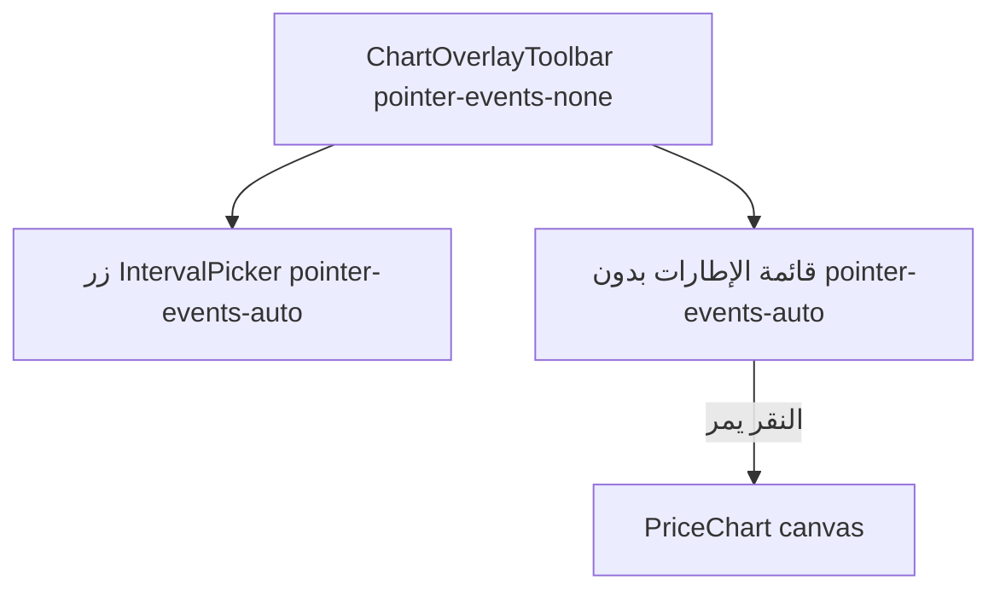
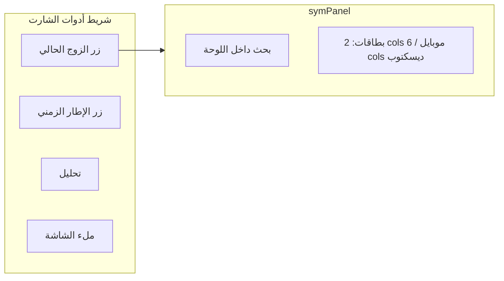

# تحسين منتقي الأزواج وإصلاح الإطار الزمني

## تشخيص المشاكل

### 1. شريط البحث في مكان خاطئ
في [`ChartOverlayToolbar.tsx`](web/src/components/market/ChartOverlayToolbar.tsx) يظهر حقل البحث **فوق الشارت** عند `openAssets` (سطور 45–57)، بينما المطلوب نقله إلى **داخل لوحة اختيار الأزواج** فقط.

### 2. اختيار الزوج عبر `<select>` بدل البطاقات
الوضع الحالي: قائمة منسدلة HTML صغيرة (`max-w-[7rem]`) — لا تطابق طلب البطاقات الشبكية.

مرجع تصميم جاهز في المشروع: شبكة بطاقات في [`SignalsWizardClient.tsx`](web/src/components/SignalsWizardClient.tsx) (`grid-cols-2` + بحث + أسعار حية عبر `useBinanceLivePrices`).

### 3. منتقي الوقت لا يعمل (السبب الجذري)
[`IntervalPicker.tsx`](web/src/components/market/IntervalPicker.tsx) مضمّن داخل شريط أدوات الشارت الذي يحمل `pointer-events-none`:

```44:44:web/src/components/market/ChartOverlayToolbar.tsx
    <div className="pointer-events-none absolute inset-x-2 top-2 z-10 flex flex-wrap items-center gap-1.5">
```

- زر الفتح فقط يحمل `pointer-events-auto` (سطر 101 في IntervalPicker).
- **القائمة المنبثقة وأزرار الإطارات** و**bottom sheet على الموبايل** لا يحملون `pointer-events-auto` — النقرات تمر عبرها إلى الشارت.
- على الديسكتوب: القائمة `absolute` داخل [`MarketClient.tsx`](web/src/components/MarketClient.tsx) حيث الحاوية `overflow-hidden` — قد تُقصّ القائمة بصرياً حتى لو فُتحت.



**الحل:** `pointer-events-auto` على جذر المنتقي + عرض القائمة عبر `createPortal` إلى `document.body` مع موضع `fixed` محسوب من زر التشغيل (نفس أسلوب bottom sheet الموجود على الموبايل).

---

## التصميم المستهدف



| السطح | سلوك لوحة الأزواج |
|--------|-------------------|
| موبايل (`< lg`) | bottom sheet من الأسفل (مثل IntervalPicker) |
| ديسكتوب | popover مثبت عبر portal تحت زر الزوج |
| البحث | داخل اللوحة فقط — يُزال من الشارت |
| الشبكة | `grid-cols-2 lg:grid-cols-6 gap-1.5` |
| البطاقة | اسم الأساس (BTC)، USDT، تمييز الزوج النشط، نسبة 24س اختيارية |

---

## خطة التنفيذ

### A. مكوّن جديد: `SymbolPicker.tsx`
المسار: [`web/src/components/market/SymbolPicker.tsx`](web/src/components/market/SymbolPicker.tsx)

- زر تشغيل صغير بنفس نمط `CTRL` (مثل IntervalPicker) يعرض `symbol`.
- عند الفتح:
  - **موبايل:** backdrop + bottom sheet.
  - **ديسكتوب:** portal + `position: fixed` من `getBoundingClientRect`.
- أعلى اللوحة: حقل بحث مع أيقونة `Search`.
  - `openAssets=true`: يمرّر `onSearchChange` لـ MarketClient (debounce موجود).
  - `openAssets=false`: فلترة محلية على `allowedAssets` بدون API.
- شبكة بطاقات مضغوطة (`text-xs`, `py-2 px-2`):
  - `grid-cols-2 lg:grid-cols-6`
  - حالة نشطة: `border-primary bg-primary/10`
- عند اختيار زوج: `onChange(symbol)` + إغلاق اللوحة.
- أسعار حية اختيارية للبطاقات الظاهرة عبر `useBinanceLivePrices(symbols)` (نفس نمط الإشارات) — بدون توسيع النطاق.

### B. تحديث `ChartOverlayToolbar.tsx`
- **حذف** كتلة البحث (`Search` input، سطور 45–57) وprops: `search`, `onSearchChange`.
- **استبدال** `<select>` بـ `<SymbolPicker>`.
- الإبقاء على `loadingInstruments` spinner داخل SymbolPicker عند التحميل.

### C. تحديث `MarketClient.tsx`
- الإبقاء على state `search` + `fetchInstruments` — لكن ربطهما بـ SymbolPicker فقط.
- عند فتح اللوحة لأول مرة (`onOpen`): استدعاء `fetchInstruments("")` إذا كانت `instruments` فارغة.
- تمرير `pickerOptions` كما هو (من API أو `allowedAssets`).
- **اختياري وموصى به:** إعادة تسمية `setInterval` إلى `setMarketInterval` لتجنب التباس مع `window.setInterval`.

### D. إصلاح `IntervalPicker.tsx`
1. إضافة `pointer-events-auto` على الجذر: `className="relative pointer-events-auto"`.
2. نقل قائمة الديسكتوب إلى `createPortal(..., document.body)` مع:
   - `position: fixed`
   - `top/left` من موضع الزر (تحديث عند `resize`/`scroll` أثناء الفتح).
   - `z-index` أعلى من الشارت (مثلاً `z-[60]`).
3. التأكد أن backdrop وbottom sheet على الموبايل يحملان `pointer-events-auto`.
4. إغلاق عند النقر خارج اللوحة (mousedown) — موجود ويُحافظ عليه.

### E. التحقق
- `npm run build` في `web/`
- اختبار يدوي:
  - فتح منتقي الزوج → بحث داخل اللوحة → بطاقتان/صف على موبايل، 6 على ديسكتوب
  - تغيير الإطار (`1m`, `4h`, `1d`) → الشارت يعيد تحميل الشموع (`PriceChart` يعتمد على `interval` في useEffect)
  - لا يوجد حقل بحث فوق الشارت

---

## الملفات المتأثرة

| ملف | التغيير |
|-----|---------|
| [`SymbolPicker.tsx`](web/src/components/market/SymbolPicker.tsx) | **جديد** — بطاقات + بحث + portal/sheet |
| [`ChartOverlayToolbar.tsx`](web/src/components/market/ChartOverlayToolbar.tsx) | إزالة بحث الشارت، ربط SymbolPicker |
| [`IntervalPicker.tsx`](web/src/components/market/IntervalPicker.tsx) | إصلاح pointer-events + portal |
| [`MarketClient.tsx`](web/src/components/MarketClient.tsx) | توصيل SymbolPicker وجلب أولي للأزواج |

لا حاجة لتعديل [`PriceChart.tsx`](web/src/components/PriceChart.tsx) أو API — منطق `interval`/`symbol` موجود ويعمل بعد إصلاح التفاعل.
