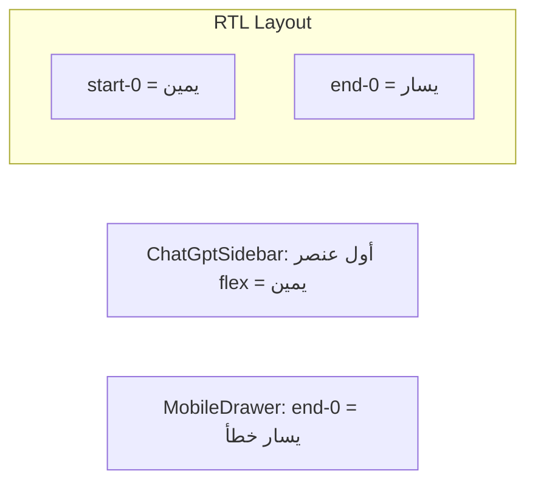

# إصلاح واجهة السوق وقائمة الموبايل

## تشخيص المشاكل

### واجهة السوق (من الصور والكود الحالي)
- شريط الأدوات في [`MarketClient.tsx`](web/src/components/MarketClient.tsx) موضوع داخل `PageLayout.actions` فيتفكك عبر `flex-wrap`: العنوان يميناً والأزرار يساراً بشكل عشوائي.
- **لوحة تفاصيل التوصية** (`absolute inset-x-2 top-2`) تغطي أعلى الشارت وتخفي الرسم — سبب رئيسي لعدم الوضوح.
- لا يوجد **شريط سعر حي** للزوج المختار (السعر + نسبة 24س) رغم وجود [`/api/market/tickers`](web/src/app/api/market/tickers/route.ts) المستخدمة في الإشارات.
- ازدواجية بصرية: بطاقة التوصية في الأسفل + لوحة علوية بنفس المحتوى عند النقر.
- زر **تحليل** بنفس أسلوب `bg-primary` يتنافس بصرياً مع فترات الشارت دون تسلسل هرمي واضح.

### قائمة الموبايل (السبب الجذري)
الموقع يستخدم `dir="rtl"` في [`layout.tsx`](web/src/app/layout.tsx). في RTL:
- `start-0` = **اليمين** (بداية السطر)
- `end-0` = **اليسار** (نهاية السطر)

[`MobileDrawer.tsx`](web/src/components/ui/shell/MobileDrawer.tsx) يستخدم `end-0` — فيفتح القائمة من **اليسار** وليس اليمين كما في [`ChatGptSidebar`](web/src/components/ui/shell/ChatGptSidebar.tsx) على سطح المكتب.



---

## الحل المقترح

### 1. إصلاح قائمة الموبايل (أولوية عالية)

**ملف:** [`MobileDrawer.tsx`](web/src/components/ui/shell/MobileDrawer.tsx)

| التغيير | التفاصيل |
|---------|----------|
| الموضع | `end-0` → `start-0` (يمين في RTL) |
| الحدود | `border-s` → `border-e` (حد داخلي بين القائمة والمحتوى) |
| الحركة | الإبقاء على `translate-x-full` عند الإغلاق و`translate-x-0` عند الفتح (انزلاق من اليمين للداخل) |
| تحسينات UX | `role="dialog"` + `aria-modal`، قفل scroll للـ `body` عند الفتح، `overscroll-behavior: contain` |
| الأيقونة | الإبقاء على `PanelRightClose` لمطابقة سطح المكتب |

**ملف:** [`AppShell.tsx`](web/src/components/AppShell.tsx) — لا تغييرات جوهرية؛ التحقق فقط أن زر الهامبرغر يفتح الدرج بعد الإصلاح.

---

### 2. إعادة هيكلة صفحة السوق

**ملف رئيسي:** [`MarketClient.tsx`](web/src/components/MarketClient.tsx)

**هيكل جديد (chart-first):**

```
┌──────────────────────────────────────────┐
│ BTCUSDT  61,234.00  +1.24% ▲   [تحليل] │  ← شريط الزوج الحي
├──────────────────────────────────────────┤
│ [ابحث…]  │ 15m │ 1h │ 4h │ 1d │ 1w │   │  ← فترات كـ segmented control
├──────────────────────────────────────────┤
│  ┌──────────── chart ──────────┐ ┌panel┐ │  ← desktop: لوحة جانبية
│  │                             │ │توصية│ │
│  └─────────────────────────────┘ └────┘ │
├──────────────────────────────────────────┤
│ آخر توصيات → بطاقات أفقية              │
└──────────────────────────────────────────┘
```

**مكوّنات جديدة (داخل `web/src/components/market/`):**
- `MarketTickerBar.tsx` — يجلب `/api/market/tickers?symbols=BTCUSDT` عند تغيير الرمز؛ يعرض السعر + التغيّر 24س بألوان أخضر/أحمر (نفس أسلوب بطاقات الإشارات).
- `MarketIntervalTabs.tsx` — مجموعة فترات موحّدة داخل `rounded-xl border` واحد (بدل أزرار منفصلة).
- `MarketRecPanel.tsx` — لوحة تفاصيل التوصية (دخول / SL / TP / النص) **بجانب الشارت** على `lg+`، و**bottom sheet** على الموبايل (انزلاق من الأسفل، لا تغطي الشارت من الأعلى).

**تسلسل هرمي للأزرار:**
- فترات الشارت: `bg-secondary` / النشط `bg-foreground text-background` (محايد)
- **تحليل**: `border border-primary/40 text-primary` أو أيقونة فقط على الموبايل — إجراء ثانوي واضح وليس زراً ضخماً أزرق

**إزالة التداخل:**
- حذف الـ overlay العلوي الحالي (`absolute top-2`)
- عند النقر على بطاقة توصية: فتح `MarketRecPanel` + رسم المستويات على الشارت (المنطق الحالي `overlaysFromRecommendation` يبقى)
- لوحة تحليل AI تبقى في الأسفل (`bottom-2`) أو تندمج في اللوحة الجانبية عند التحليل النشط

**تنظيف التخطيط:**
- إزالة استخدام `PageLayout` كـ hack (العنوان + `hidden span`)
- استبداله بـ header مدمج: عنوان مختصر + `MarketTickerBar` في صف واحد على الديسكتوب، عمودين على الموبايل
- إزالة padding الزائد من `page-shell` على صفحة السوق عبر عدم استخدام `PageLayout` هناك

---

### 3. تحسينات بصرية إضافية (ui-ux-pro-max)

| المبدأ | التطبيق |
|--------|---------|
| Touch 44px | كل الأزرار `h-11 min-h-[44px]` |
| Visual hierarchy | السعر أكبر من الفترات؛ التوصيات أصغر في الشريط السفلي |
| لا لون وحده | إضافة `TrendingUp/Down` بجانب نسبة التغيّر |
| Reduced motion | `motion-reduce:transition-none` على الدرج والـ bottom sheet |
| Chart clarity | الشارت يأخذ `flex-1 min-h-0` بدون overlays تغطي 40%+ منه |

---

### 4. ملفات متأثرة

| ملف | إجراء |
|-----|-------|
| [`MobileDrawer.tsx`](web/src/components/ui/shell/MobileDrawer.tsx) | إصلاح RTL + scroll lock + a11y |
| [`MarketClient.tsx`](web/src/components/MarketClient.tsx) | إعادة هيكلة كاملة |
| `web/src/components/market/MarketTickerBar.tsx` | جديد |
| `web/src/components/market/MarketIntervalTabs.tsx` | جديد |
| `web/src/components/market/MarketRecPanel.tsx` | جديد |
| [`globals.css`](web/src/app/globals.css) | اختياري: class `.market-segment` للفترات |

---

### 5. التحقق

- `npm run build` في `web/`
- اختبار يدوي:
  - موبايل 375px: القائمة تنزلق من **اليمين**؛ تفاصيل التوصية bottom sheet
  - ديسكتوب: لوحة توصية يمين الشارت (لا تغطي الشموع)
  - النقر على توصية يرسم entry/SL/TP على الشارت
- نشر VPS بعد الموافقة (نفس `vps-git-sync.mjs`)
