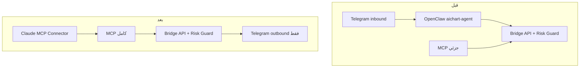

# MCP صلاحيات كاملة + إزالة OpenClaw من VPS

## الهدف

1. **Claude عبر MCP** يملك وصولاً لجميع عمليات Bridge (`/api/agent/*`) على **Binance** و **MT5** — ليس «تجاوز Risk Guard».
2. **حذف OpenClaw** من VPS (`aichart-agent`, `~/.openclaw`, npm global, nginx `/openclaw`) مع تحرير مساحة القرص.
3. **Telegram:** محادثة تفاعلية OpenClaw تُوقَف؛ **إشعارات outbound** (تنفيذ، موافقات، kill switch) تبقى عبر [`web/src/lib/telegram.ts`](web/src/lib/telegram.ts).



---

## ما يعنيه «صلاحيات كاملة» (وما لا يعنيه)

| يُضاف | يبقى محظوراً |
|--------|----------------|
| كل أدوات Bridge عبر MCP | تجاوز **Risk Guard** ([`riskGuard.ts`](web/src/lib/riskGuard.ts)) |
| ربط Binance API من Claude | سحب أموال Binance (Withdraw) |
| أوامر MT5 متقدمة (pending/partial/chart) | إدارة VPS (pm2/docker) |
| kill switch، demo/live، active market | لوحة Admin بدون OAuth |

---

## المرحلة 1 — فجوات MCP الحالية

[`mcp/src/tools/index.ts`](mcp/src/tools/index.ts) يغطي ~30 أداة. **Bridge routes موجودة لكن بدون MCP:**

| API موجود | أداة MCP مقترحة |
|-----------|-----------------|
| `POST /api/agent/kill-switch` | `set_kill_switch` |
| `POST/GET /api/agent/binance/connect` | `connect_binance`, `verify_binance` |
| `POST /api/agent/chart/binance-capture` | `capture_binance_chart` |
| `GET /api/agent/approval/pending` | `get_pending_approvals` |
| `POST /api/agent/maintenance` | `run_trade_maintenance` |
| `POST /api/agent/chart/snapshot` | `capture_chart_snapshot` |
| `GET /api/agent/chart/[id]` | `get_recommendation_chart` |
| `POST /api/agent/telegram/menu` | `send_telegram_menu` |
| `GET /api/agent/model` | `get_agent_capabilities` (اختياري) |

**Routes جديدة مطلوبة** (لأن `/api/mt/*` و `/api/binance` تستخدم `requireUser` وليس `requireAgentAuth`):

| Route جديد | الغرض |
|------------|--------|
| `POST/DELETE /api/agent/mt/connect` | ربط MetaApi/mt5local (server+login+password) |
| `GET /api/agent/mt/status` | حالة MT5 |
| `DELETE /api/agent/binance` | فصل Binance |
| `PATCH /api/agent/settings` | `active_market`, `futures_enabled` (حقول محدودة) |

---

## المرحلة 2 — توسيع MCP (Binance أوسع + MT5 كامل)

### 2a) إعادة هيكلة الأدوات

تقسيم [`mcp/src/tools/index.ts`](mcp/src/tools/index.ts) إلى:

- `mcp/src/tools/core.ts` — risk, portfolio, trades, approvals, mode, env
- `mcp/src/tools/binance.ts` — connect, verify, chart, futures, open/close
- `mcp/src/tools/mt5.ts` — live, diagnostics, pending, partial, chart, terminal
- `mcp/src/tools/market.ts` — snapshot, scan, context, price

### 2b) أدوات Binance (أولوية أعلى)

| أداة | ملاحظة |
|------|--------|
| `connect_binance` | env + apiKey + apiSecret + futuresRequired |
| `verify_binance` | verify_only بدون حفظ |
| `disconnect_binance` | DELETE |
| `capture_binance_chart` | يرجع `chart_url_telegram` |
| `get_futures_*` | موجود — توثيق أوضح في descriptions |
| `open_trade` | **توسيع الوصف** ليشمل: `market_type: futures`, `leverage`, `order_type: limit`, `limit_price` (مدعوم في [`trade/open/route.ts`](web/src/app/api/agent/trade/open/route.ts)) |

**اختياري (Phase 2b+):** Spot limit orders — غير مدعوم في `trade/open` حالياً (Limit فقط لـ Futures). إن أردت parity كامل: توسيع schema في `trade/open` + `binanceAdapter`.

### 2c) أدوات MT5 (EA v3)

الموجود يغطي معظم EA v3. إضافات:

| أداة | API |
|------|-----|
| `connect_mt5` / `disconnect_mt5` | routes جديدة أعلاه |
| `get_mt5_status` | status |
| `set_kill_switch` | kill-switch (user + close_open_trades) |

**MetaApi backend:** `open_trade` يعمل؛ أدوات EA (pending/chart) **تتطلب `FOREX_BACKEND=ea`**. يُذكر في `get_agent_capabilities` و descriptions.

### 2d) تحديث قواعد Claude

- [`agent/workspace/AGENTS.md`](agent/workspace/AGENTS.md): إزالة قيود OpenClaw (`curl` فقط، workspace sandbox) — استبدالها بـ «استخدم أدوات MCP مباشرة».
- MCP resource `aichart://trading-rules` يقرأ نفس الملف — يتحدث تلقائياً.
- [`docs/MCP_CLAUDE_SETUP.md`](docs/MCP_CLAUDE_SETUP.md): قائمة أدوات كاملة + أمثلة لكل فئة.

---

## المرحلة 3 — hardening الكود بعد إزالة OpenClaw

### 3a) [`web/src/lib/openclawModelSync.ts`](web/src/lib/openclawModelSync.ts)

- إضافة `OPENCLAW_ENABLED=0` (أو auto-detect: لا `openclaw.json` → no-op `{ ok: true, skipped: true }`).
- [`admin/config/route.ts`](web/src/app/api/admin/config/route.ts) لا يُرجع `ok: false` عند غياب OpenClaw.

### 3b) متغيرات [`web/.env.example`](web/.env.example)

```env
OPENCLAW_ENABLED=0
# OPENCLAW_AUTO_RESTART=0   # legacy — لا تُستخدم
```

### 3c) واجهة Admin

- [`OpenClawConsoleClient.tsx`](web/src/components/agent/OpenClawConsoleClient.tsx): إخفاء أو banner «OpenClaw معطّل — Claude MCP» عند `OPENCLAW_ENABLED=0`.

### 3d) سكربتات النشر

تعديل [`infra/vps-deploy-now.sh`](infra/vps-deploy-now.sh) و [`infra/vps-instructions-deploy.sh`](infra/vps-instructions-deploy.sh): **لا** `pm2 restart aichart-agent` عند `OPENCLAW_ENABLED=0`.

---

## المرحلة 4 — إزالة OpenClaw من VPS (بدون أثر)

إنشاء [`infra/vps-openclaw-decommission.sh`](infra/vps-openclaw-decommission.sh) — توسيع [`docs/OPENCLAW_DECOMMISSION.md`](docs/OPENCLAW_DECOMMISSION.md):

```bash
# 1) إيقاف الخدمة
pm2 stop aichart-agent 2>/dev/null || true
pm2 delete aichart-agent 2>/dev/null || true

# 2) قياس الحجم قبل الحذف
du -sh /root/.openclaw /tmp/openclaw 2>/dev/null

# 3) مسح البيانات (sessions/jsonl = الأكبر)
rm -rf /root/.openclaw
rm -rf /tmp/openclaw

# 4) إزالة الحزمة العالمية + cache
npm uninstall -g openclaw 2>/dev/null || true
npm cache clean --force 2>/dev/null || true

# 5) pm2 logs القديمة
rm -f /root/.pm2/logs/aichart-agent-*.log

# 6) nginx — إزالة include aichart-openclaw.conf
# 7) web/.env: OPENCLAW_ENABLED=0, OPENCLAW_AUTO_RESTART=0
# 8) docker (إن وُجد): docker compose down openclaw + volume openclaw-state
# 9) pm2 save && df -h
```

**ما لا يُمس:**

| يبقى | السبب |
|------|--------|
| `aichart-web`, `aichart-mcp` | المنصة + MCP |
| [`agent/workspace/`](agent/workspace/) في git | قواعد MCP + SKILL |
| Telegram outbound + cron | [`monitorRunner.ts`](web/src/lib/monitorRunner.ts) |
| EA v3 على MT5 Windows | تنفيذ فوركس |

**تأثيرات متوقعة (مقبولة):**

- لا رد تلقائي على رسائل Telegram — Claude MCP فقط.
- لا معالجة `[EVENT:…]` عبر OpenClaw — مراجعة صفقات يدوياً من Claude أو cron ميكانيكي.
- لا تحديث `MEMORY.md` في workspace OpenClaw — دروس AiChart DB (`get_trade_lessons`) تبقى.

---

## المرحلة 5 — نشر وتحقق

```bash
# على VPS بعد merge
cd /opt/aichart
bash infra/vps-mcp-deploy.sh          # MCP جديد
bash infra/vps-openclaw-decommission.sh
pm2 restart aichart-web --update-env
```

**Checklist:**

1. `curl https://aichart.lork.cloud/health` — OK
2. Claude Connector → OAuth → `get_risk_status` — OK
3. `get_live_account` → `quoteAgeMs < 5000` (EA)
4. `connect_binance` / `verify_binance` (testnet)
5. `open_pending_order` على EURUSD (EA)
6. `set_kill_switch` on/off
7. `du -sh /root/.openclaw` → غير موجود
8. `pm2 list` — لا `aichart-agent`
9. Admin config save — `agentModelSync.skipped: true`

---

## ترتيب التنفيذ المقترح

1. Bridge routes جديدة (`mt/connect`, `settings`, `binance` DELETE)
2. MCP tools + refactor + AGENTS.md
3. `OPENCLAW_ENABLED` no-op + deploy scripts
4. `vps-openclaw-decommission.sh` + تشغيل على VPS
5. تحديث docs + graphify update
