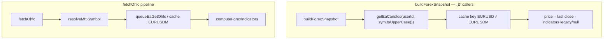

# خطة إصلاح MCP Legacy Tools (محدّثة — §1 فقط)

## السياق

اختبار MCP v1.1.0 كشف مسارات legacy. **البندان 2 و 3 بدون تغيير** (poll `capture_mt5_chart` 30s، رسائل `get_recommendation_chart`). **خارج النطاق:** quote-staleness، `get_forex_indicators`، idempotency، confidence 80%.

---

## 1) [عالي] `get_market_snapshot` + كل مسارات forex snapshot

### التشخيص — عدم تطابق الرمز (مؤكّد من الكود)




| المسار                    | الملف                                                                                                | الاستدعاء                                                                                          | نفس العلة؟ |
| ------------------------- | ---------------------------------------------------------------------------------------------------- | -------------------------------------------------------------------------------------------------- | ---------- |
| MCP `get_market_snapshot` | `[web/src/lib/markets/index.ts](web/src/lib/markets/index.ts)` L69                                   | `buildForexSnapshot(userId, resolved.symbol, …)`                                                   | **نعم**    |
| تحليل السوق (LLM)         | `[web/src/lib/marketAnalyze.ts](web/src/lib/marketAnalyze.ts)` L188–195                              | `sym = symbol.toUpperCase()` ثم `buildForexSnapshot(userId, sym, …)` — **بدون** `resolveMt5Symbol` | **نعم**    |
| مراقبة 24/7               | `[web/src/lib/monitor.ts](web/src/lib/monitor.ts)` L93                                               | `buildForexSnapshot(userId, symbol, …)` مباشرة                                                     | **نعم**    |
| cron monitor              | `[web/src/lib/monitorRunner.ts](web/src/lib/monitorRunner.ts)` L80                                   | `scanForexSymbol` → نفس `buildForexSnapshot`                                                       | **نعم**    |
| API scan                  | `[web/src/app/api/agent/market/scan/route.ts](web/src/app/api/agent/market/scan/route.ts)` L55       | `scanForexSymbol`                                                                                  | **نعم**    |
| تقييم صفقة مفتوحة         | `[web/src/app/api/agent/trade/evaluate/route.ts](web/src/app/api/agent/trade/evaluate/route.ts)` L50 | `buildForexSnapshot(userId, trade.symbol, …)`                                                      | **نعم**    |
| agent.ts                  | `[web/src/lib/agent.ts](web/src/lib/agent.ts)` L284                                                  | `getUnifiedSnapshot`                                                                               | **نعم**    |


**لا يوجد مسار forex snapshot «سليم» منفصل** — `intentRevalidate.ts` لا يستدعي `buildForexSnapshot` (الملخص السابق كان مبالغاً فيه).

### سلوك الإنتاج الحالي (قبل الإصلاح)

1. **استعلام canonical `EURUSD`** (قوائم المراقبة الافتراضية في `[allowedAssets.ts](web/src/lib/allowedAssets.ts)` L152: `FOREX_SCAN_FALLBACK = ["EURUSD", …]`):
  - `getEaCandles(userId, "EURUSD", tf)` → **cache miss** (المخزّن `EURUSDM` من EA)
  - `buildForexSnapshot` → شموع فارغة، `rsi14/macd: null`، `summary`: «لا تتوفر بيانات شموع…»
  - `scoreOpportunity` → غالباً score 0 → **لا مرشّح مراقبة** (فشل صامت)
2. **استعلام broker suffix `EURUSDm`** (أو ما يُحلّ إلى `EURUSDM`):
  - cache **hit** لكن السعر = آخر **close** شمعة (قديم) وليس live mid
  - مؤشرات من `[snapshotFromCandles](web/src/lib/market.ts)` + `[indicators.ts](web/src/lib/indicators.ts)` القديم — **ليست** `computeForexIndicators`
3. **عائق إضافي في المراقبة** (منفصل عن snapshot لكن مرتبط):
  - `[forexScanReady](web/src/lib/monitorRunner.ts)` L52–55 يطابق `symbol.toUpperCase()` **حرفياً** مع heartbeat
  - `EURUSD` ≠ `EURUSDM` → حتى لو وُجد مرشّح، **يُتخطّى wake** (`continue` L177)
  - يُصلَح ضمن نفس PR: استخدام `resolveMt5Symbol` أو `forexCanonicalKey` للمطابقة

**النتيجة للمستخدم:** MCP snapshot خاطئ/قديم؛ التحليل الآلي (`runMarketAnalyze`) على فوركس يعمل على بيانات ناقصة أو قديمة؛ المراقبة الآلية إما صامتة أو (نادراً) على close قديم — **أوسع من أداة MCP واحدة**.

### عيب إضافي: `high24h` / `low24h` = 24 شمعة وليس 24 ساعة

الكود الحالي في `[snapshotFromCandles](web/src/lib/market.ts)` L71–72:

```typescript
high24h: highs.length ? Math.max(...highs.slice(-24)) : 0,
low24h: lows.length ? Math.min(...lows.slice(-24)) : 0,
```


| الفريم | `slice(-24)` يعني | صحيح لـ 24h؟  |
| ------ | ----------------- | ------------- |
| 1h     | 24 ساعة           | نعم (تقريباً) |
| 4h     | 4 أيام            | **لا**        |
| 1d     | 24 يوم            | **لا**        |


crypto عبر `[buildSnapshot](web/src/lib/market.ts)` يستخدم Binance `get24hStats` — **صحيح**. الفوركس فقط معطوب.

**ملاحظة:** `buildForexSnapshot` الحالي **يُسقِط** حقل `time` من الشموع — لا يمكن إصلاح 24h دون الانتقال إلى `[fetchOhlc](web/src/lib/ohlc/fetchOhlc.ts)` الذي يحافظ على `OhlcCandle.time`.

---

### قرار التصميم — لا thin wrapper

**لا** نُبقي `buildForexSnapshot` كغلاف شكلي على منطق قديم.

**نعم** نُعيد كتابة `[buildForexSnapshot](web/src/lib/market.ts)` لاستخدام pipeline موحّد، فيستفيد **كل** caller تلقائياً:

```typescript
// shared forex snapshot (conceptual — market.ts or markets/forexSnapshot.ts)
async function buildForexSnapshot(userId, symbol, interval) {
  const ohlc = await fetchOhlc({ userId, symbol, interval, market: "forex", limit: 200 });
  const indicators = computeForexIndicators(ohlc.symbol, ohlc.interval, ohlc.candles, ohlc.source);
  const { price } = await getUnifiedPrice(symbol, "forex", userId);
  const range24h = await computeForex24hRange(userId, ohlc.symbol, interval, ohlc.candles);

  return mapToMarketSnapshot({ ohlc, indicators, price, range24h });
}
```

`[getUnifiedSnapshot](web/src/lib/markets/index.ts)` يستدعي نفس `buildForexSnapshot` (أو helper مشترك) — **مصدر واحد**.

---

### حساب `high24h` / `low24h` — 24 ساعة بالطابع الزمني

**دالة جديدة** (مثلاً `computeForex24hRange` في `[web/src/lib/markets/forex24h.ts](web/src/lib/markets/forex24h.ts)` أو داخل `market.ts`):

```typescript
const MS_24H = 86_400_000;
const cutoff = anchorMs - MS_24H; // anchorMs = Date.now() أو time آخر شمعة

function highLowFromWindow(candles: OhlcCandle[], cutoffMs: number) {
  const window = candles.filter((c) => c.time >= cutoffMs);
  if (window.length === 0) return { high24h: null, low24h: null, approximate: true };
  return {
    high24h: Math.max(...window.map((c) => c.high)),
    low24h: Math.min(...window.map((c) => c.low)),
    approximate: false,
  };
}
```

**اختيار الشموع حسب الفريم** (يستخدم `[barDurationSec](web/src/lib/intervals.ts)` L43):


| `barDurationSec(interval)` | المصدر                                                                                            |
| -------------------------- | ------------------------------------------------------------------------------------------------- |
| ≤ 3600 (1h أو أصغر)        | فلترة شموع الـ OHLC الرئيسية (`ohlc.candles`) بـ `time >= cutoff`                                 |
| > 3600 (4h, 1d, …)         | **fetch إضافي** `fetchOhlc({ interval: "1h", limit: 30, … })` لحساب 24h فقط — لا نعتمد على 24 bar |


**Fallback:** إذا فشل fetch الـ 1h الإضافي → استخدم شموع الفريم الرئيسي مع `extra.highLow24hApproximate: true` + تحذير في `summary` أو `extra.ohlcWarning`.

`**change24hPct` (فوركس):** يبقى `0` في هذه الجولة **أو** يُحسب اختيارياً من close أقرب شمعة عند `cutoff` مقابل `price` الحي — يُذكر في `extra` إن وُجد. (crypto unchanged.)

---

### ملفات التعديل (§1)


| ملف                                                                  | التغيير                                                                                                                        |
| -------------------------------------------------------------------- | ------------------------------------------------------------------------------------------------------------------------------ |
| `[web/src/lib/market.ts](web/src/lib/market.ts)`                     | إعادة كتابة `buildForexSnapshot`؛ إبقاء `snapshotFromCandles` لـ crypto-only أو deprecate لفرع forex                           |
| `[web/src/lib/markets/index.ts](web/src/lib/markets/index.ts)`       | فرع forex يعتمد على `buildForexSnapshot` المُصلَح (أو helper مشترك)                                                            |
| `[web/src/lib/markets/forex24h.ts](web/src/lib/markets/forex24h.ts)` | **جديد** — `computeForex24hRange` + توثيق القرار                                                                               |
| `[web/src/lib/monitorRunner.ts](web/src/lib/monitorRunner.ts)`       | `forexScanReady`: مطابقة عبر `resolveMt5Symbol` / `forexCanonicalKey`                                                          |
| tests                                                                | `[web/src/lib/markets/__tests__/](web/src/lib/markets/)` — mock timestamps: 4h interval لا يعطي 4 أيام؛ 1h fetch supplementary |


**Regression crypto:** `buildSnapshot` + Binance `get24hStats` — **بدون لمس**.

---

### اختبار §1


| سيناريو                                  | التوقع                                                                                   |
| ---------------------------------------- | ---------------------------------------------------------------------------------------- |
| `get_market_snapshot(EURUSD, forex, 1h)` | `price` ≈ `get_market_price`؛ `extra.rsi14` non-null؛ `high24h/low24h` من آخر 86400000ms |
| نفس الرمز `interval=4h`                  | `high24h/low24h` من شموع 1h (ليس 96h)                                                    |
| `runMarketAnalyze` forex EURUSD          | نفس pipeline — RSI/summary غير فارغ                                                      |
| `scanForexSymbol` + monitor cron         | مرشّح أو null صحيح؛ `forexScanReady` يمر مع EURUSD/EURUSDm                               |
| `BTCUSDT` crypto                         | unchanged                                                                                |


---

### نتيجة الإصلاح — ما يُبلّغ للمستخدم

- إصلاح **MCP `get_market_snapshot`** + **التحليل الآلي** + **المراقبة 24/7** + **تقييم الصفقات** — كلها كانت على مسار forex snapshot legacy.
- قبل الإصلاح: مراقبة فوركس canonical غالباً **صامتة** (cache miss)؛ MCP مع suffix broker **سعر close قديم**؛ `high24h` على 4h/1d **مدّة خاطئة**.

---

## 2) [متوسط] `capture_mt5_chart` — **بدون تغيير**

- Poll 30s لـ `draw_and_capture` في `[mcp/src/tools/mt5.ts](mcp/src/tools/mt5.ts)`
- تفويض اختياري للحالات البسيطة → `capture_chart_snapshot`
- توثيق `[mt5Schemas.ts](mcp/src/tools/schemas/mt5Schemas.ts)` + `[AGENTS.md](agent/workspace/AGENTS.md)`

---

## 3) [منخفض] `get_recommendation_chart` — **بدون تغيير**

- رسالة 503 أوضح في `[chart/[id]/route.ts](web/src/app/api/agent/chart/[id]/route.ts)`
- اختياري: poll `/mt5` عند `chart_image_url` ينتهي بـ `/mt5`

---

## ترتيب التنفيذ

1. §1 — forex snapshot + 24h timestamp + `forexScanReady` + tests
2. §2 — capture poll + docs
3. §3 — rec chart errors
4. Deploy web + mcp + smoke

