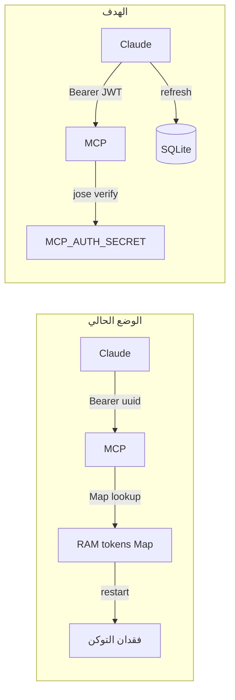

# خطة مصادقة MCP ثابتة (365 يوم + refresh)

## المشكلة الحالية

في [`mcp/src/auth/provider.ts`](mcp/src/auth/provider.ts):

```typescript
const TOKEN_TTL_MS = 60 * 60 * 1000;  // ساعة واحدة
private tokens = new Map<string, TokenRecord>();  // في الذاكرة
readonly clientsStore = new InMemoryClientsStore();  // في الذاكرة
async exchangeRefreshToken() { throw new Error("Refresh tokens not supported"); }
```

عند `pm2 restart aichart-mcp`:
- تُفقد **access tokens** و**OAuth clients** المسجّلة من Claude
- Claude يحتفظ بتوكن قديم → `verifyAccessToken` يفشل → `Error occurred during tool execution`



---

## الحل المعماري

| مكوّن | قبل | بعد |
|-------|-----|-----|
| Access token | UUID في Map، 1h | **JWT موقّع** بـ `jose` + `MCP_AUTH_SECRET`، **365 يوم** |
| Refresh token | غير مدعوم | UUID في **SQLite**، 365 يوم، rotation عند الاستخدام |
| OAuth clients | Map في الذاكرة | **SQLite** `mcp_oauth_clients` |
| Auth codes / pending | Map (15 دقيقة) | يبقى في الذاكرة (OK — تدفق قصير) |
| Session cookie (login) | 24h | **90 يوم** (تسهيل إعادة OAuth عند الحاجة) |

**ملاحظة:** `jose` موجود أصلاً في [`mcp/package.json`](mcp/package.json) — لا dependency جديدة للـ JWT.

---

## 1. Schema — جداول OAuth في قاعدة AiChart

إضافة migration في [`web/src/lib/db/sqlite.ts`](web/src/lib/db/sqlite.ts) (و [`pg.ts`](web/src/lib/db/pg.ts) للتوافق):

```sql
CREATE TABLE IF NOT EXISTS mcp_oauth_clients (
  client_id   TEXT PRIMARY KEY,
  client_json TEXT NOT NULL,
  created_at  TEXT NOT NULL DEFAULT (datetime('now'))
);

CREATE TABLE IF NOT EXISTS mcp_oauth_refresh_tokens (
  token_hash  TEXT PRIMARY KEY,
  client_id   TEXT NOT NULL,
  email       TEXT NOT NULL,
  scopes_json TEXT NOT NULL,
  expires_at  TEXT NOT NULL,
  revoked     INTEGER NOT NULL DEFAULT 0,
  created_at  TEXT NOT NULL DEFAULT (datetime('now'))
);
```

MCP يقرأ نفس `DB_PATH` من `web/.env` (يُصدَّر عبر [`infra/aichart-mcp.sh`](infra/aichart-mcp.sh)).

---

## 2. طبقة تخزين MCP

ملفات جديدة في `mcp/src/auth/`:

| ملف | الغرض |
|-----|--------|
| [`jwt.ts`](mcp/src/auth/jwt.ts) | `mintAccessToken()` / `verifyAccessTokenJwt()` — claims: `sub` (email), `client_id`, `scope`, `exp` (365d) |
| [`db.ts`](mcp/src/auth/db.ts) | فتح SQLite read-write، `ensureMcpOAuthSchema()`، helpers |
| [`clientStore.ts`](mcp/src/auth/clientStore.ts) | `SqliteClientsStore` يُImplement `OAuthRegisteredClientsStore` |

Dependency: `better-sqlite3` + `@types/better-sqlite3` في [`mcp/package.json`](mcp/package.json).

---

## 3. تعديل [`provider.ts`](mcp/src/auth/provider.ts)

### `exchangeAuthorizationCode`
- يُصدر **JWT** access token (365d) بدل `randomUUID()` + Map
- يُنشئ **refresh token** (random UUID) ويخزّنه في `mcp_oauth_refresh_tokens` (hash SHA-256)
- يرجع `refresh_token` + `expires_in: 31536000` في `OAuthTokens`

### `verifyAccessToken`
- يتحقق من JWT عبر `jose` + `MCP_AUTH_SECRET` — **لا Map lookup**
- يبقى صالحاً بعد restart طالما `exp` لم ينتهِ

### `exchangeRefreshToken` (جديد)
- يتحقق من refresh token في SQLite (غير revoked، غير منتهي)
- يُصدر access JWT جديد + refresh token جديد (rotation)
- يُبطل القديم (`revoked=1`)

### `clientsStore`
- استبدال `InMemoryClientsStore` بـ `SqliteClientsStore`

---

## 4. Config — [`mcp/src/config.ts`](mcp/src/config.ts)

```typescript
accessTokenTtlDays: Number(process.env.MCP_ACCESS_TOKEN_TTL_DAYS ?? "365"),
refreshTokenTtlDays: Number(process.env.MCP_ACCESS_TOKEN_TTL_DAYS ?? "365"),
dbPath: process.env.DB_PATH ?? "../web/data/aichart.db",
```

تحديث [`infra/aichart-mcp.sh`](infra/aichart-mcp.sh) لتصدير `DB_PATH` من `web/.env`.

---

## 5. توثيق + نشر

- [`docs/MCP_CLAUDE_SETUP.md`](docs/MCP_CLAUDE_SETUP.md): شرح أن OAuth **ثابت** بعد restart؛ إعادة ربط Claude **مرة واحدة** بعد التحديث
- [`web/.env.example`](web/.env.example): `MCP_ACCESS_TOKEN_TTL_DAYS=365`
- VPS: rebuild MCP + restart `aichart-mcp` + `aichart-web` (للـ migration)

---

## 6. اختبار

| السيناريو | المتوقع |
|-----------|---------|
| OAuth login → `tools/call` | 200 + نتيجة Bridge |
| `pm2 restart aichart-mcp` → نفس access token | **يعمل** (JWT stateless) |
| بعد 365 يوم | Claude يستخدم refresh token تلقائياً |
| `refresh_token` منتهي | يطلب OAuth من جديد |
| Bridge `AICHART_SERVICE_TOKEN` | بدون تغيير — منفصل عن OAuth Claude |

---

## مخاطر / قرارات

- **Tokens قديمة (UUID):** بعد النشر، Claude يحتاج **إعادة OAuth مرة واحدة** للحصول على JWT جديد
- **Concurrent SQLite:** MCP فقط يكتب جداول `mcp_oauth_*` — لا تعارض مع web
- **إلغاء الوصول:** endpoint اختياري لاحقاً `DELETE /oauth/revoke` — خارج النطاق الأول
