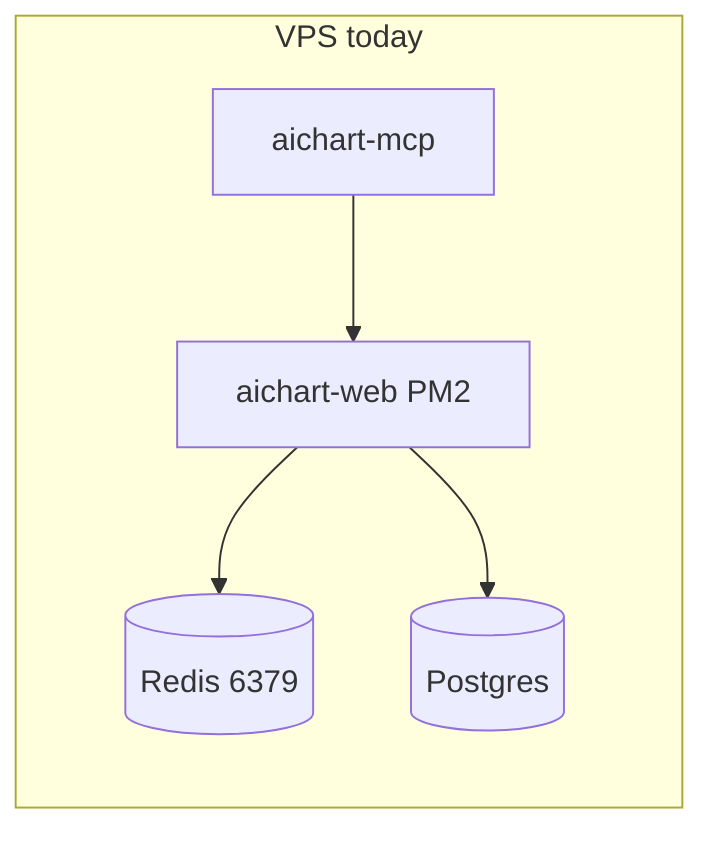
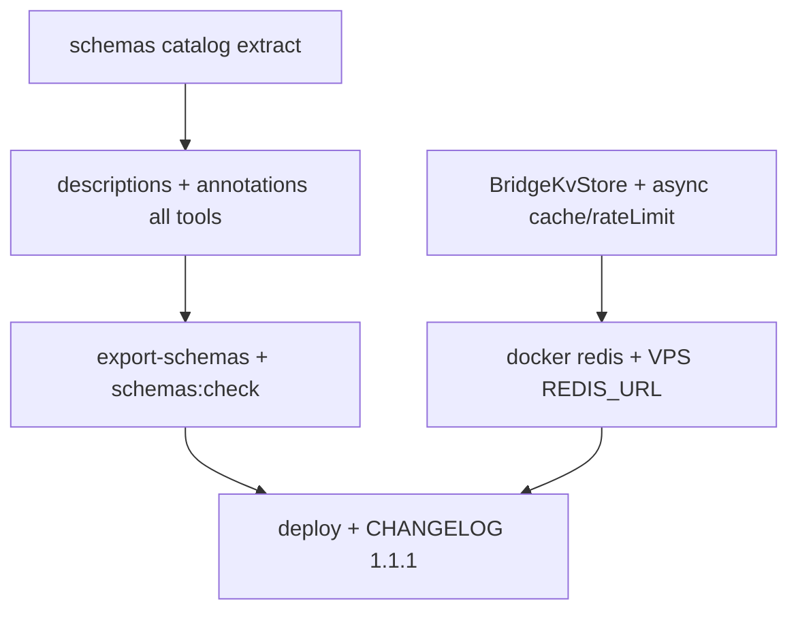

# MCP Polish — أوصاف، عقود JSON، Redis

## الوضع الحالي

- **~55 أداة** في [`mcp/src/tools/`](mcp/src/tools/) عبر 4 ملفات: `core.ts` (26)، `mt5.ts` (13)، `market.ts` (7)، `binance.ts` (9)
- **مُحدَّثة جزئياً:** ~10 أدوات لديها `withAnnotations` + أوصاف §0.11 (متى/لا/أثر/مثال) — الباقي أوصاف سطر واحد
- **لا `mcp/schemas/`** بعد — لم يُنفَّذ export
- **كاش:** [`web/src/lib/bridge/cache.ts`](web/src/lib/bridge/cache.ts) in-memory Map + hook `isRedisCacheConfigured()` بدون تنفيذ
- **Rate limit:** [`web/src/lib/bridge/rateLimit.ts`](web/src/lib/bridge/rateLimit.ts) in-memory — **يُكسر مع أكثر من instance web**
- **Idempotency:** Postgres بالفعل — لا يحتاج Redis
- **VPS:** PM2 (`aichart-web`, `aichart-mcp`) — اختيارك: **تفعيل Redis على VPS الآن**



---

## 1 — أوصاف و annotations لكل الأدوات

### نمط الوصف (§0.11 — كما في الأدوات الجديدة)

كل `description` عربي يتضمن:

1. **متى تستخدم** — سياق الجلسة
2. **متى لا** — بديل أو شرط (مثلاً quote قديم، confidence&lt;80)
3. **أثر جانبي** — read-only vs write/destructive
4. **مثال** — `symbol=…` أو معامل واحد

### annotations حسب النوع

| النوع | `readOnlyHint` | `destructiveHint` | `idempotentHint` |
|-------|----------------|-------------------|------------------|
| قراءة (portfolio, scan, status) | true | false | true |
| كتابة تداول (open/close/modify) | false | true | false/true* |
| ربط حسابات (connect/disconnect) | false | true | false |
| إعدادات (mode, kill-switch) | false | true | false |

\* `open_trade` → `IDEMPOTENT_WRITE` (موجود)

### تنفيذ

**أ)** توسيع [`mcp/src/tools/registry.ts`](mcp/src/tools/registry.ts):

```ts
export function toolConfig(opts: {
  description: string;
  inputSchema: z.ZodRawShape;
  annotations: ToolAnnotations;
}) { ... }
```

**ب)** تحديث الملفات الأربعة — إضافة `withAnnotations` لكل أداة + إعادة صياغة الوصف:

| ملف | أدوات بدون annotations تقريباً |
|-----|-------------------------------|
| [`binance.ts`](mcp/src/tools/binance.ts) | 9/9 |
| [`mt5.ts`](mcp/src/tools/mt5.ts) | 11/13 |
| [`core.ts`](mcp/src/tools/core.ts) | ~21/26 |
| [`market.ts`](mcp/src/tools/market.ts) | 4/7 |

**ج)** تحديث [`get_agent_capabilities`](web/src/app/api/agent/model/route.ts) — `featureFlags.redisCache: true` عند `REDIS_URL`

**د)** [`mcp/CHANGELOG.md`](mcp/CHANGELOG.md) → 1.1.1 — «تحسين أوصاف جميع الأدوات + annotations»

---

## 2 — لقطات عقود JSON + فحص CI

### استخراج schemas

إنشاء [`mcp/src/tools/schemas/`](mcp/src/tools/schemas/) — ملف لكل مجال:

- `coreSchemas.ts`, `marketSchemas.ts`, `binanceSchemas.ts`, `mt5Schemas.ts`
- كل أداة: `{ name, description, annotations, input: z.object({...}) }`
- ملف [`mcp/src/tools/schemas/index.ts`](mcp/src/tools/schemas/index.ts) — `TOOL_CATALOG: ToolDefinition[]`

**Refactor تدريجي:** ملفات `register*` تستورد من catalog بدل inline Zod — يضمن مصدر واحد للحقيقة.

### تصدير

- سكربت [`mcp/scripts/export-schemas.mts`](mcp/scripts/export-schemas.mts)
- يستخدم `z.toJSONSchema()` (Zod 4) أو `zod-to-json-schema` إن لزم
- يُنتج:
  - [`mcp/schemas/manifest.json`](mcp/schemas/manifest.json) — قائمة الأدوات + annotations + `mcpServerVersion`
  - [`mcp/schemas/tools/<name>.json`](mcp/schemas/tools/) — JSON Schema لكل أداة

### npm scripts

```json
"schemas:export": "tsx scripts/export-schemas.mts",
"schemas:check": "tsx scripts/export-schemas.mts --check"
```

`--check`: يُعيد توليد إلى temp ويقارن diff — fail إذا تغيّر schema بدون commit.

### اختبارات

- [`mcp/src/tools/__tests__/catalog.test.ts`](mcp/src/tools/__tests__/catalog.test.ts): عدد الأدوات = manifest، كل اسم فريد، descriptions غير فارغة
- اختياري: snapshot envelope codes في [`web/src/lib/bridge/errors.ts`](web/src/lib/bridge/errors.ts)

### CI

- إضافة خطوة في workflow موجود (أو script `infra/ci-check-schemas.sh`) — `npm run schemas:check` في `mcp/`

---

## 3 — كاش Redis (multi-instance)

### نطاق Redis (ليس idempotency — already Postgres)

| Module | مفتاح Redis | TTL |
|--------|-------------|-----|
| OHLC/quotes cache | `aichart:cache:{userId}:{resource}` | 5–45s حسب المورد |
| Rate limit | `aichart:rl:{userId}:{route}` | 60s sliding window |

اتباع [`conn-pooling`](Redis plugin): client واحد singleton (`ioredis`) مع `maxRetriesPerRequest`, timeouts.

### واجهة backend

[`web/src/lib/bridge/store.ts`](web/src/lib/bridge/store.ts) (جديد):

```ts
interface BridgeKvStore {
  get(key: string): Promise<string | null>;
  set(key: string, value: string, ttlMs: number): Promise<void>;
  del(key: string): Promise<void>;
  incrWindow(key: string, windowMs: number, limit: number): Promise<{ allowed: boolean; retryAfterMs: number }>;
}
```

- `MemoryKvStore` — السلوك الحالي
- `RedisKvStore` — `SET key value EX ttl` + sorted set أو INCR+EXPIRE لل rate limit

[`cache.ts`](web/src/lib/bridge/cache.ts) + [`rateLimit.ts`](web/src/lib/bridge/rateLimit.ts):

- `getBridgeStore()` — `REDIS_URL` → Redis else Memory
- **API async:** `getCachedAsync` / `setCachedAsync` / `checkWriteRateLimitAsync`
- تحديث [`fetchOhlc.ts`](web/src/lib/ohlc/fetchOhlc.ts) + [`withBridge.ts`](web/src/lib/bridge/withBridge.ts) لـ `await`

**Fallback:** إذا Redis down → log warn + fallback memory (single request) — لا crash

### infra

**[`infra/docker-compose.yml`](infra/docker-compose.yml)** — خدمة `redis`:

```yaml
redis:
  image: redis:7-alpine
  ports: ["127.0.0.1:6379:6379"]
  command: redis-server --maxmemory 128mb --maxmemory-policy allkeys-lru
  restart: unless-stopped
```

**[`web/.env.example`](web/.env.example):**

```
REDIS_URL=redis://127.0.0.1:6379/0
# REDIS_PASSWORD=  # optional
```

### VPS (اختيارك: تفعيل الآن)

1. `docker compose -f infra/docker-compose.yml up -d redis` على VPS (أو container منفصل إن web ليس docker)
2. إضافة `REDIS_URL=redis://127.0.0.1:6379/0` في `/opt/aichart/web/.env`
3. `npm install ioredis` في `web/`
4. deploy + `pm2 restart aichart-web`
5. smoke: طلبين متتاليين `get_ohlc` — الثاني `fromCache: true`؛ rate limit على `open_trade` write

**اختبار:** [`web/src/lib/bridge/__tests__/redisStore.test.ts`](web/src/lib/bridge/__tests__/redisStore.test.ts) — skip إذا لا `REDIS_URL` في CI؛ unit test للـ memory backend دائماً

---

## ترتيب التنفيذ



1. **Catalog/schemas** — مصدر واحد للأدوات (يُسهّل export + descriptions)
2. **Descriptions** — عربي + annotations على الكatalog
3. **JSON export + tests + CI check**
4. **Redis backend** + async migration
5. **VPS Redis + deploy + smoke**

---

## خارج النطاق

- EA v4 compile على MT5 (يدوي — [`ea/mt5/EA_COMMANDS_V4.md`](ea/mt5/EA_COMMANDS_V4.md))
- Redis cluster / read replicas — VPS واحد يكفي `redis:7-alpine` localhost
- Idempotency migration إلى Redis (Postgres كافٍ)

---

## معايير القبول

- كل أداة MCP: وصف §0.11 + `annotations` ثلاثية
- `npm run schemas:check` أخضر؛ `mcp/schemas/` committed
- `REDIS_URL` على VPS → cache مشترك بين restarts PM2؛ بدون URL → memory (سلوك سابق)
- `npm run test:bridge` + `npm run build` (web + mcp) أخضر
