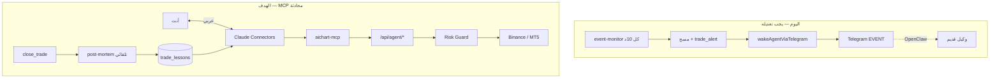

# خطة: التداول المحادثي عبر MCP (Claude يقرر معك)

## الوضع الحالي (الخبر الجيد)

**معظم ما طلبته موجود فعلاً** في [`mcp/`](mcp/) — Claude Connectors على `https://aichart.lork.cloud/mcp` يملك أدوات تغطي التدفق كاملاً:

| الحاجة | أداة MCP موجودة | API خلفها |
|--------|-----------------|-----------|
| هل ندخل؟ (تحليل) | `get_market_snapshot`, `get_market_context`, `scan_market` | `/api/agent/market/*` |
| دروس سابقة | `get_trade_lessons` | `/api/agent/memory/lessons` |
| تسجيل رأي + ثقة | `create_recommendation` (`rationale`, `confidence`) | `/api/agent/recommendation` |
| تنفيذ | `open_trade` (`rationale`, `confidence`, `approved_by_user`) | `/api/agent/trade/open` |
| إغلاق + تقييم | `evaluate_trade`, `close_trade`, `record_exit_decision` | `/api/agent/trade/*` |
| حماية | `get_risk_status`, Risk Guard | `/api/agent/risk/status` |
| تفاصيل الحساب | `get_portfolio`, `get_live_account`, `get_risk_status` | `/api/agent/portfolio`, `/live/account`, `/risk/status` |
| قواعد التشغيل | resource `aichart://trading-rules` | يقرأ [`agent/workspace/AGENTS.md`](agent/workspace/AGENTS.md) |

**التعلّم من الأخطاء** يعمل خلف الكواليس: عند إغلاق أي صفقة، [`web/src/lib/tradePostMortem.ts`](web/src/lib/tradePostMortem.ts) يكتب درساً عربياً + embedding في `trade_lessons` — ثم `get_trade_lessons` يسترجعه في التحليلات التالية.

**الفجوة الحقيقية:** القواعد والكron ما زالا مبنيّين على OpenClaw + استيقاظ تلقائي 24/7، وليس على **«نتحدث مع Claude ونقرر معاً»**.



---

## هوية الوكيل — موكّل عنك (إلزامي في AGENTS.md)

Claude **ليس مستشاراً** يقول «تدخل» أو «لا تدخل» — هو **وكيلك** ينفّذ قراركما المشترك ويتكلم بصيغة **«نحن»**:

| ممنوع | مطلوب |
|-------|--------|
| «تدخل الآن» / «لا تدخل» | «نقترح أن **ندخل**» / «**لا ندخل** الآن لأن…» |
| «افتح صفقة» | «**نفتح** صفقة على …» |
| «خسرت» | «**خسرنا** … — خطة التعويض: …» |

- Claude يملك **صلاحية** `open_trade` لكنه **موكّل** — لا ينفّذ إلا بعد اتفاقكما على: الزوج، المبلغ، SL/TP.
- عند الرفض: «**لن ندخل**» + السبب + بديل إن وُجد (زوج آخر أو انتظار).

---

## التدفق المحادثي المطلوب (Claude Project Instructions)

يُوثَّق في [`docs/MCP_CLAUDE_SETUP.md`](docs/MCP_CLAUDE_SETUP.md) و [`agent/workspace/AGENTS.md`](agent/workspace/AGENTS.md):

### 0) قراءة الحساب — قبل أي محادثة تداول

Claude **يجب** أن يعرف وضع الحساب كاملاً عبر (أو أداة موحّدة `get_account_overview`):

1. `get_risk_status` → وضع التداول، رأس المال الفعّال، `perTradeMaxUsd`، حدود خسارة اليوم/الشهر، الرافعة الافتراضية، `accountProfile` (منصة، demo/live، سبريد)
2. `get_portfolio` → أرصدة Binance/MT5، صفقات مفتوحة، PnL اليوم
3. `get_live_account` → quotes حية، مراكز futures/MT5، `quoteAgeMs`

**يذكر للمستخدم باختصار:** الرصيد، demo/live، الرافعة، الصفقات المفتوحة، خسارة/ربح اليوم، المبلغ الأقصى المسموح (`perTradeMaxUsd`).

### 1) حتى لو قلت «خذ صفقة» — لا تنفيذ مباشر

عند أي أمر عام («خذ صفقة»، «ادخل»، «نفّذ»):

1. **اسأل:** «على أي زوج **ندخل**؟» — لا تفترض رمزاً
2. `scan_market` على الرموز المسموحة (أو 2–3 مرشحين) + `get_market_snapshot` للزوج المختار
3. **قارن البدائل:** «فرصة أقوى على ETH من BTC» — اعرض خيارين إن وُجدت فرصة أفضل بزوج آخر
4. `get_trade_lessons` للرمز + `recent=1`
5. **ردك:** «**نقترح** …» أو «**لا ندخل** …» + الثقة % + 2–4 جمل

### 2) سؤال المبلغ — إلزامي قبل `open_trade`

- **لا** تستخدم `perTradeMaxUsd` تلقائياً كـ `notional`
- **اسأل دائماً:** «بكم **ندخل**؟ (USDT / هامش)»
- اعرض الحدود: «الحد الأقصى المسموح اليوم: X USDT — الرافعة Yx»
- `open_trade.notional` = **المبلغ الذي يحدده المشغّل** (ضمن حد Risk Guard)
- إن تجاوز الحد: انقل رفض Risk Guard حرفياً — لا تحاول بمبلغ أصغر للتحايل إلا بموافقة صريحة

### 3) عند الاتفاق على الدخول

1. `create_recommendation` — `rationale` (2–4 جمل «لماذا **ندخل**») + `confidence` + شارت
2. **لا** `open_trade` حتى: زوج محدد + مبلغ محدد + موافقة صريحة («نفّذ» / «موافق»)
3. `open_trade`: `approved_by_user: true`, `notional`, `rationale`, `confidence`, `recommendation_id`, `stop_loss`
4. **بعد النجاح:** «**دخلنا** … — السبب … — الثقة …% — المبلغ … — SL/TP …»

### 4) بعد خسارة — التعويض والتعلّم

Claude **لا ينتقم** (revenge trade). بعد `close_trade` أو عند سؤال «كيف نعوّض؟»:

1. `get_risk_status` → كم تبقّى من حد خسارة اليوم (`dailyLossLimitPct`, `todayRealizedPnlPct`)
2. `get_trade_lessons?recent=1` → ماذا أخطأنا
3. **خطة تعويض واقعية:**
   - إن قربنا حد الخسارة → «**لن نفتح** صفقات جديدة اليوم إلا بموافقتك الصريحة»
   - إن بقي هامش → «**ننتظر** فرصة ≥75% ثقة» أو «**ندخل** بحجم أصغر (X USDT)»
   - لا مضاعفة المبلغ للتعويض — Risk Guard يمنع ذلك
4. اذكر الدرس: «تعلّمنا أن …»

### 5) وضع التشغيل الموصى به

- **`direct`**: Claude يقترح بـ «ندخل»، أنت توافق + تحدد المبلغ، ثم ينفّذ
- **`approval`**: `request_approval` + أزرار تيليجرام
- **تجنّب `auto`** — يتعارض مع المحادثة والموكّلة

---

## التعديلات المطلوبة في الكود

### A) تعطيل المراقبة 24/7 (استيقاظ الوكيل)

**الملف:** [`web/src/lib/monitorRunner.ts`](web/src/lib/monitorRunner.ts)

- إضافة متغير بيئة `AGENT_WAKE_ENABLED=0` (أو `MCP_CONVERSATIONAL_MODE=1`)
- عند التعطيل:
  - **ابقِ** `runCronPostScan()` — صيانة OCO/journal ميكانيكية فقط
  - **أوقف** كل `wakeAgentViaTelegram` (`market_candidate`, `trade_alert`, `daily_loss_warn`)
- **الملف:** [`web/src/lib/dailySummary.ts`](web/src/lib/dailySummary.ts) — تخطّي wake `daily_memory`
- **الملف:** [`infra/vps-deploy-now.sh`](infra/vps-deploy-now.sh) أو cron docs — توثيق المتغير على VPS

> مراجعة الصفقات المفتوحة تصبح **عند طلبك في الشات**: «راجع صفقاتي» → `get_open_trades` → `evaluate_trade`

### B) تقوية أدوات MCP للمحادثة

**الملف:** [`mcp/src/tools/core.ts`](mcp/src/tools/core.ts)

| الأداة | التعديل |
|--------|---------|
| **`get_account_overview`** (جديد) | يجمع risk + portfolio + live في رد واحد: رصيد، رافعة، demo/live، PnL، حدود، `perTradeMaxUsd` |
| `create_recommendation` | «rationale = 2–4 جمل بصيغة نحن (لماذا **ندخل**)؛ confidence إلزامي» |
| `open_trade` | `rationale` + `notional` **مطلوبان** — «لا تستدعِ بدون مبلغ حدده المشغّل» |
| `get_trade_lessons` | إضافة `recent: boolean` → `?recent=1` |
| `scan_market` | «استخدم عند «خذ صفقة» لمقارنة فرص على عدة أزواج» |

**اختياري (API):** [`web/src/app/api/agent/trade/open/route.ts`](web/src/app/api/agent/trade/open/route.ts) — رفض `open_trade` بدون `notional` صريح عند MCP (حالياً يستخدم `per_trade_pct` من الإعدادات إن غاب).

### C) تحديث قواعد Claude (resource)

**الملف:** [`agent/workspace/AGENTS.md`](agent/workspace/AGENTS.md)

- **هوية موكّل:** صيغة «نحن / ندخل / لن ندخل» — ممنوع «تدخل / لا تدخل»
- **إلزامي:** سؤال الزوج + `scan_market` للبدائل حتى مع أمر «خذ صفقة»
- **إلزامي:** سؤال المبلغ قبل `open_trade` — لا `notional` تلقائي
- **إلزامي:** `get_account_overview` (أو الثلاثة) في بداية جلسة التداول
- **بعد خسارة:** خطة تعويض (حدود Risk Guard + دروس) — لا revenge
- **احذف/عطّل:** HEARTBEAT، `[EVENT:market_candidate]`
- **ثبّت:** لا `open_trade` بدون: زوج + مبلغ + موافقة صريحة

**الملف:** [`agent/workspace/HEARTBEAT.md`](agent/workspace/HEARTBEAT.md) — علامة «مُهمَل — MCP محادثة»

**الملف:** [`agent/workspace/skills/aichart-trading/SKILL.md`](agent/workspace/skills/aichart-trading/SKILL.md) — إضافة قسم MCP أعلى الملف (الأدوات بدل curl) أو الإشارة إلى `docs/MCP_CLAUDE_SETUP.md`

### D) توثيق Claude للمستخدم

**الملف:** [`docs/MCP_CLAUDE_SETUP.md`](docs/MCP_CLAUDE_SETUP.md)

- قسم **«Project Instructions»** جاهز للنسخ إلى Claude Project
- أمثلة prompts عربية:
  - «خذ صفقة» → Claude يسأل الزوج، يمسح البدائل، يعرض الحساب، يسأل المبلغ
  - «ندخل EURUSD — 50 USDT» → تحليل + توصية + تنفيذ بعد موافقة
  - «خسرنا — كيف نعوّض؟» → risk + lessons + خطة واقعية
- جدول: متى `create_recommendation` vs `open_trade`

---

## ما لا نحتاج بناءه من الصفر

- MCP Server + OAuth + nginx — **منشور**
- Bridge API + Risk Guard + committee + chart — **يعمل**
- post-mortem + semantic lessons — **يعمل** (Claude يقرأه عبر `get_trade_lessons`)
- `aichart://trading-rules` — **موجود** (يُحدَّث محتواه فقط)

---

## نشر بعد التنفيذ

1. **web:** deploy + `AGENT_WAKE_ENABLED=0` في `.env`
2. **mcp:** `bash infra/vps-mcp-deploy.sh` (أو rebuild pm2)
3. **Claude:** أعد فتح Connector إن تغيّرت أوصاف الأدوات؛ الصق Project Instructions الجديدة
4. **تحقق:** في الشات «حلّل BTCUSDT» — Claude يستدعي snapshot + lessons ويعطيك ثقة % بدون فتح صفقة

---

## مثال جلسة متوقعة

```
أنت:     خذ صفقة
Claude:  [get_account_overview]
         «رصيدنا 1200 USDT · ديمو · رافعة 3x · خسارة اليوم -2%.
          على أي زوج **ندخل**؟ (BTC / ETH / EURUSD …)»
أنت:     BTC أو ETH — أيهما أفضل؟
Claude:  [scan_market, get_market_snapshot×2, get_trade_lessons]
         «ETH أقوى (MACD +72%) من BTC (58%). **نقترح ETH**.
          بكم **ندخل**؟ الحد الأقصى المسموح 60 USDT.»
أنت:     40 USDT — نفّذ
Claude:  [create_recommendation + chart → open_trade notional:40, approved_by_user:true]
         «**دخلنا** ETHUSDT — 40 USDT — السبب: … — الثقة 72% — SL … TP …»

أنت:     خسرنا — كيف نعوّض؟
Claude:  [get_risk_status, get_trade_lessons recent]
         «خسرنا 8 USDT. تبقّى لنا 3% قبل حد اليوم. **لن نضاعف** المبلغ.
          **ننتظر** فرصة ≥75% أو **ندخل** 25 USDT فقط. تعلّمنا: لا دخول قبل كسر المقاومة.»
```
