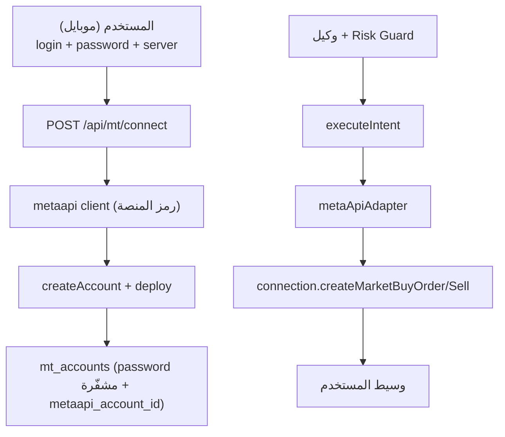

# دمج MetaApi لتداول الفوركس (تجربة موبايل فائقة السهولة)

## الفكرة الأساسية

المستخدم على الموبايل يدخل **3 حقول فقط** (رقم الحساب، كلمة المرور، السيرفر) + اختيار MT4/MT5، ويضغط «ربط». كل شيء يجري خلفياً عبر **رمز MetaApi الخاص بالمنصة** — لا تثبيت، لا VPS، لا EA عند المستخدم. المستخدم لا يرى MetaApi إطلاقاً.

## المتطلب المسبق (عليك أنت، مرة واحدة)
- إنشاء حساب MetaApi والحصول على **API Token** من `app.metaapi.cloud/token`.
- تخزينه كإعداد منصة `METAAPI_TOKEN` (+ `METAAPI_REGION` اختياري) عبر `platform_config` الحالي.
- المستخدمون النهائيون **لا** يسجّلون ولا يدفعون لـ MetaApi.

## ما يُعاد استخدامه كما هو (بنيناه سابقاً)
- `BrokerAdapter` و`executeIntent` و`riskGuard` و`tradeFlow` وواجهة `MarketTypeSelector`/الشارت/`SymbolPicker`.
- جسر EA (`eaAdapter`, `/api/ea/*`, ملفات MQL) يبقى **بديلاً** لمن يريد الاستضافة الذاتية.

---

## التغييرات التفصيلية

### 1. عميل MetaApi
- إضافة الحزمة: `npm i metaapi.cloud-sdk` داخل `web/`.
- ملف جديد [`web/src/lib/metaapi/client.ts`](web/src/lib/metaapi/client.ts):
  - `getMetaApi()` يبني `new MetaApi(token, { region })` من `platform_config`.
  - مساعدات: `provisionAccount`, `getRpcConnection(accountId)` مع تخزين مؤقت للاتصالات، `isConfigured()`.

### 2. تخزين حسابات MT
- جدول جديد `mt_accounts` (SQLite + Postgres + migrations في [`web/src/lib/db/sqlite.ts`](web/src/lib/db/sqlite.ts) و[`web/src/lib/db/pg.ts`](web/src/lib/db/pg.ts) و[`web/scripts/pg-schema.sql`](web/scripts/pg-schema.sql)):
  - `user_id, platform (mt4|mt5), server, login, password_enc, metaapi_account_id, region, state, balance, equity, updated_at`.
- دوال في [`web/src/lib/store.ts`](web/src/lib/store.ts): `saveMtAccount`, `getMtAccount`, `getMtAccountMeta`, `deleteMtAccount` (تشفير عبر `encryptSecret` الحالي).

### 3. واجهات API لربط MT
- [`web/src/app/api/mt/connect/route.ts`](web/src/app/api/mt/connect/route.ts):
  - `POST { platform, server, login, password }` → `createAccount({type:'cloud', login, password, server, platform})` → `deploy()` → خزّن `metaapi_account_id`. يعالج DRAFT/أخطاء الاتصال برسائل عربية واضحة.
  - `DELETE` → undeploy + remove من MetaApi + حذف الصف.
- [`web/src/app/api/mt/status/route.ts`](web/src/app/api/mt/status/route.ts): حالة (deployed/connected) + الرصيد للواجهة.
- (اختياري) [`web/src/app/api/mt/servers/route.ts`](web/src/app/api/mt/servers/route.ts): اقتراح أسماء سيرفرات شائعة لتسهيل الإدخال.

### 4. محوّل MetaApi
- ملف جديد [`web/src/lib/brokers/metaApiAdapter.ts`](web/src/lib/brokers/metaApiAdapter.ts) ينفّذ `BrokerAdapter`:
  - `isConnected`: الحساب deployed ومتزامن.
  - `placeOrder`: حساب اللوت عبر `connection.getSymbolSpecification` + `lotSizing` الحالي، ثم `createMarketBuyOrder/SellOrder(symbol, lots, sl, tp)` — **متزامن** (لا طابور/ack).
- تحديث [`web/src/lib/brokers/index.ts`](web/src/lib/brokers/index.ts): اختيار محوّل الفوركس حسب `FOREX_BACKEND` (افتراضي `metaapi` عند توفّر `METAAPI_TOKEN`، وإلا `mt_ea`).

### 5. بيانات السوق للفوركس عبر MetaApi
- تحديث [`web/src/app/api/market/klines/route.ts`](web/src/app/api/market/klines/route.ts): مسار الفوركس عند `metaapi` يجلب الشموع من MetaApi (historical candles) بدل cache الـ EA.
- [`web/src/app/api/market/forex-price/route.ts`](web/src/app/api/market/forex-price/route.ts): سعر حي عبر `connection.getSymbolPrice`.
- [`web/src/app/api/instruments/route.ts`](web/src/app/api/instruments/route.ts): رموز الفوركس من `connection.getSymbols` للحساب + القائمة الثابتة.

### 6. الواجهة (موبايل أولاً)
- مكوّن جديد [`web/src/components/settings/MtConnectCard.tsx`](web/src/components/settings/MtConnectCard.tsx): 3 حقول + اختيار MT4/MT5 + حالة الاتصال والرصيد. يحلّ محل `EaConnectCard` كواجهة افتراضية عند `metaapi` (ويبقى `EaConnectCard` متاحاً للوضع `ea`).
- ربط بسيط في [`web/src/components/SettingsClient.tsx`](web/src/components/SettingsClient.tsx) و[`web/src/components/OnboardingClient.tsx`](web/src/components/OnboardingClient.tsx) (خطوة ربط فوركس اختيارية بـ 3 حقول).
- شارة اتصال الفوركس في [`web/src/components/market/ChartOverlayToolbar.tsx`](web/src/components/market/ChartOverlayToolbar.tsx) تقرأ حالة MT الموحّدة.

### 7. الوكيل والمراقبة
- `userContext`/`persona` تذكر «MT متصل عبر MetaApi». المراقبة 24/7 للفوركس تستخدم اتصال MetaApi إن وُجد (لاحقاً، خارج MVP).

---

## ملاحظات تشغيل وقرارات

- **التكلفة:** اشتراك MetaApi (~$30/شهر) + لكل حساب نشط 24/7. تتراكم مع عدد المستخدمين — أكبر بند تشغيلي.
- **الجدوى:** تتوقف على قدرتك على التسجيل والدفع في MetaApi من موقعك. إن تعذّر → نفعّل `FOREX_BACKEND=ea` (الجسر الذاتي الجاهز).
- **الأمان/القانون:** كلمة مرور التداول مشفّرة وبلا صلاحية سحب؛ الأموال تبقى عند وسيط المستخدم (لا حفظ أموال). تبقى استشارة قانونية مستحسنة لخدمة تنفيذ آلي.
- **DRAFT flow (تحسين لاحق):** يمكن لاحقاً إنشاء حساب DRAFT ومنح المستخدم رابط MetaApi لإدخال كلمة المرور بنفسه (دون مرورها بخوادمنا) لرفع الأمان.

## خارج النطاق
- إدارة فواتير/اشتراكات المستخدمين، CopyFactory، Binance Futures.
- نقل المراقبة 24/7 للفوركس بالكامل (MVP يركّز على الربط + التنفيذ + الشارت).

## التحقق
- `tsc --noEmit` + `next build`.
- تجربة بحساب Demo: ربط (3 حقول) → ظهور online + الرصيد → توصية فوركس → تنفيذ متزامن → تسجيل الصفقة.
- التأكد أن الكريبتو (Binance) والـ EA fallback لم يتأثرا.
