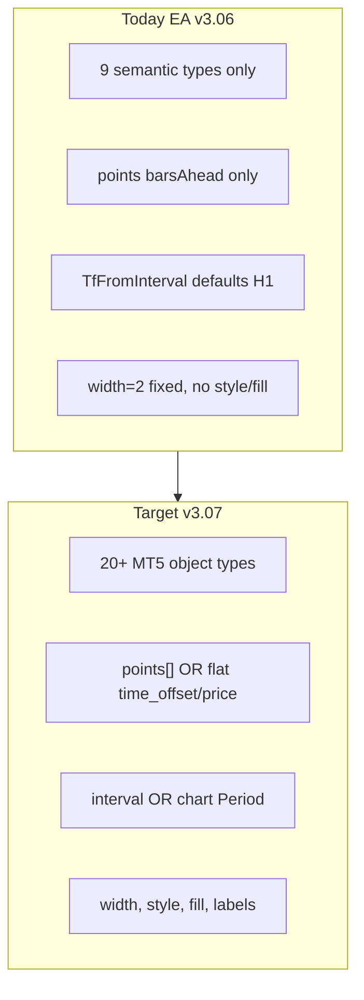
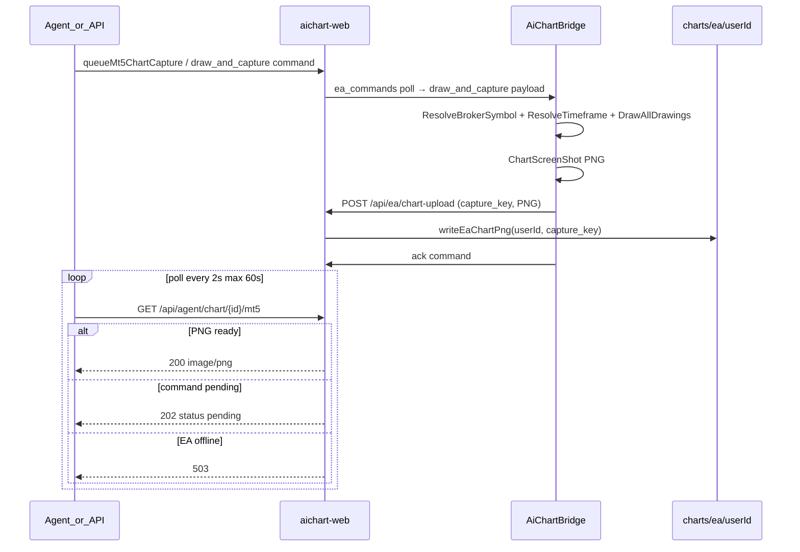

# AiChartBridge — Complete Chart Drawing System

## الوضع الحالي vs المطلوب



| مجال | [`ea/mt5/AiChartBridge.mq5`](ea/mt5/AiChartBridge.mq5) اليوم | البرومبت |
|------|---------------------------------------------------------------|----------|
| أنواع مدعومة | `price_line`, `trend_line`, `forecast_path`, `zone`, `channel`, `fib_retracement`, `baseline`, `marker`, `histogram_band` | + `vline`, `triangle`, `ellipse`, arrows متعددة, `fibo_fan/arc`, `pitchfork`, `expansion`, `gann_*`, `text`, `label`, `ray` |
| إحداثيات | `points[].barsAhead` + `BarsAheadToTime()` | + `time_offset`, `price`, `price2`, `time_offset2` |
| TF | `TfFromInterval()` → **`PERIOD_H1` fallback** (L1578) | `interval` صريح → وإلا **`Period()`** للشارت الحالي |
| JSON | `JsonStrVal` / `JsonNum` يدوي (لا `JSONObject`) | نفس الأسلوب — **لا نُدخل مكتبة JSON** |

**مهم:** الوكيل والويب يستخدمان [`ChartDrawing`](web/src/lib/chartDrawings.ts) بـ `points[]` و `confidence` — **لا نكسر هذا العقد**. EA يُضيف طبقة توافق + أنواع MT5-native جديدة.

---

## الجزء 0 — Symbol case (إلزامي في v3.07)

**لا `StringToUpper` على الرموز** — تم التحقق في v3.06 (لا يوجد في EA)، ويجب **الحفاظ** على ذلك في v3.07:

- [`ResolveBrokerSymbol()`](ea/mt5/AiChartBridge.mq5) يُستدعى في `DrawAndCapture` / `ClearChart` قبل أي `SymbolSelect` / `iTime`
- الرمز يُمرَّر للرسم بحالة الوسيط الأصلية (`EURUSDm` وليس `EURUSDM`)
- **Gate قبل merge:** `grep StringToUpper ea/mt5/*.mq5` → يجب أن يكون فارغاً

---

## الجزء 1 — EA: إطار زمني ذكي

استبدال `TfFromInterval` بـ `ResolveTimeframe(string interval)`:

```mql5
ENUM_TIMEFRAMES ResolveTimeframe(string interval)
{
   string iv = interval;
   StringTrimLeft(iv); StringTrimRight(iv);
   if(iv == "" || iv == "chart") return Period();  // NOT hardcoded H1

   // Binance-style (from web)
   if(iv == "1m")  return PERIOD_M1;
   if(iv == "5m")  return PERIOD_M5;
   if(iv == "15m") return PERIOD_M15;
   if(iv == "30m") return PERIOD_M30;
   if(iv == "1h")  return PERIOD_H1;
   if(iv == "4h")  return PERIOD_H4;
   if(iv == "1d")  return PERIOD_D1;
   if(iv == "1w")  return PERIOD_W1;

   // MT5-style (from user prompt)
   if(iv == "M1")  return PERIOD_M1;
   // ... M5, M15, M30, H1, H4, D1, W1, MN

   return Period();  // safe default = current chart
}
```

### 1.1 انتظار تحديث الشارت (بدل `Sleep(500)` الثابت)

`Sleep(500)` غير مضمون — استبداله بـ **`WaitForChartSymbolPeriod(sym, tf)`**:

```mql5
bool WaitForChartSymbolPeriod(string sym, ENUM_TIMEFRAMES tf)
{
   ChartSetSymbolPeriod(0, sym, tf);
   long chartId = ChartID();
   for(int attempt = 0; attempt < 20; attempt++)
   {
      if(ChartSymbol(chartId) == sym && ChartPeriod(chartId) == tf)
         return true;
      Sleep(100);
   }
   return (ChartSymbol(chartId) == sym);  // TF mismatch: log warn, proceed if symbol OK
}
```

في [`DrawAndCapture`](ea/mt5/AiChartBridge.mq5) و [`ClearChartCommand`](ea/mt5/AiChartBridge.mq5):
- استبدال `TfFromInterval` → `ResolveTimeframe`
- استبدال `EnsureChartSymbol` logic → `ResolveBrokerSymbol` + `WaitForChartSymbolPeriod`

---

## الجزء 2 — EA: محرك رسم موحّد `DrawMt5Object`

إعادة هيكلة قسم الرسم (~L1620–1790) إلى:

### 2.1 Helpers

| دالة | الغرض |
|------|--------|
| `LineStyleFromString(style)` | `solid` / `dashed` / `dotted` → `STYLE_*` |
| `ClampWidth(w)` | 1–5 |
| `TimeFromBarOffset(sym, tf, offset, unixOverride)` | يدمج `barsAhead`, `time_offset`, `time` unix — **مع validation** |
| `ReadDrawingCoords(drawingJson, sym, tf, ...)` | يقرأ **أولاً** `points[]`، ثم fallback لـ `price/time_offset/price2/time_offset2/price3/time_offset3` |
| `ApplyObjectLabel(name, label, fsize, clr)` | تسمية على كل الكائنات ما عدا `text`/`label` |

### 2.2 `TimeFromBarOffset` — معالجة `iTime() == 0`

`iTime()` يرجع 0 إذا لا بيانات للشمعة — **إلزامي**:

```mql5
datetime TimeFromBarOffset(string sym, ENUM_TIMEFRAMES tf, int barOffset, double unixOverride)
{
   if(unixOverride > 0) return (datetime)(long)unixOverride;

   datetime t = iTime(sym, tf, barOffset);
   if(t > 0) return t;

   // fallback chain
   t = iTime(sym, tf, 0);
   if(t > 0) return t;

   Print("AiChartBridge: iTime empty for ", sym, " tf=", tf, " offset=", barOffset);
   return TimeCurrent();
}
```

استخدم `sym` (المُ resolved) وليس `_Symbol` — مهم لـ Exness `EURUSDm`.

### 2.3 `DrawMt5Object(string name, string drawingJson, string sym, ENUM_TIMEFRAMES tf)`

Dispatcher واحد يغطي جدول البرومبت:

- **Lines:** `hline`, `vline`, `trend`/`trendline`, `ray`
- **Shapes:** `rectangle`/`zone`, `triangle`, `ellipse`
- **Arrows:** `arrow_down`/`arrow_sell`, `arrow_up`/`arrow_buy`, `arrow_stop`, `arrow_check`, `arrow_thumb_*`, `arrow` + `arrow_code`
- **Fib/Gann:** `fibo`/`fibonacci`, `fibo_fan`, `fibo_arc`, `expansion`, `pitchfork`, `gann_line`, `gann_fan`
- **Text:** `text`, `label` (corner + x/y)

كل فرع يقرأ: `color`, `width`, `style`, `label`, `fill`, `fill_color`, `font_size` من JSON (via `JsonStrVal`/`JsonNum`/`JsonBool`).

### 2.4 Legacy adapter (backward compatible)

| نوع الوكيل الحالي | تحويل MT5 |
|-------------------|-----------|
| `price_line`, `baseline` | `hline` |
| `trend_line`, `forecast_path` | `trend` segments (حلقة على points) |
| `zone`, `histogram_band` | `rectangle` + `fill=true` |
| `channel` | 2× `trend` |
| `fib_retracement` | `fibo` |
| `marker` | `arrow_up`/`arrow_down` حسب label (شراء/buy → up، بيع/sell → down) |

أنواع MT5-native في الجدول تمر مباشرة إذا `type` يطابق.

### 2.5 `JsonBool` helper

Parser بسيط لـ `"fill": true` في payload.

---

## الجزء 3 — تدفق screenshot + polling (موجود — يُختبر صراحة)



**Endpoints موجودة** (لا كود جديد مطلوب للـ polling):

| خطوة | ملف |
|------|-----|
| Queue command | [`web/src/lib/eaChartDraw.ts`](web/src/lib/eaChartDraw.ts) → `queueMt5ChartCapture` |
| EA upload | [`ea/mt5/AiChartBridge.mq5`](ea/mt5/AiChartBridge.mq5) → `HttpPostMultipart("/api/ea/chart-upload")` |
| Poll PNG | [`web/src/app/api/agent/chart/[id]/mt5/route.ts`](web/src/app/api/agent/chart/[id]/mt5/route.ts) → 202 pending / 200 PNG / 503 offline |
| Agent URL | `GET /api/agent/chart/{recommendation_id}/mt5` أو `snap_*` key |

**سلوك GET mt5:**
- `200` + `Content-Type: image/png` — جاهز
- `202` + `{ status: "pending" }` — EA يرسم أو لم يُرفع بعد
- `503` — EA offline

---

## الجزء 4 — Web / العقد (تغييرات صغيرة)

### 4.1 [`web/src/lib/chartDrawings.ts`](web/src/lib/chartDrawings.ts)

- توسيع `DrawingType` union بأنواع MT5-native **اختيارية**
- توسيع `ChartDrawing.meta`: `width`, `style`, `fill`, `fill_color`, `font_size`, `arrow_code`
- `validateChartDrawings`: لا ترفض الأنواع الجديدة

### 4.2 [`ea/shared/api-contract.json`](ea/shared/api-contract.json)

- جدول الأنواع الكامل + حقول flat
- توثيق `interval: ""` = chart timeframe
- توثيق polling: `GET /api/agent/chart/{capture_key}/mt5`

### 4.3 [`web/src/lib/chartDrawingLabels.ts`](web/src/lib/chartDrawingLabels.ts)

- labels/colors للأنواع الجديدة

**خارج النطاق:** توسيع [`chartDrawingEngine.ts`](web/src/lib/chartDrawingEngine.ts) (Binance) — EA-only أولاً.

---

## الجزء 5 — EA version + docs

- Bump → **v3.07**
- [`ea/mt5/CHANGELOG.md`](ea/mt5/CHANGELOG.md): chart drawing + timeframe + iTime fallback
- [`agent/workspace/AGENTS.md`](agent/workspace/AGENTS.md): الوكيل يبقى على semantic `chart_drawings`؛ poll `chart_url` MT5 كل 2ث حتى 200

---

## الجزء 6 — خطة الاختبار (محدّثة)

### 6.1 Compile + attach

1. MetaEditor compile → copy `.ex5` → reattach EA
2. `GET /api/agent/ea/query-terminal` → `ea_version: "3.07"`

### 6.2 Timeframe

- `draw_and_capture` مع `interval: ""` على شارت M15 → objects على M15 (ليس H1)

### 6.3 Legacy drawings

- payload: `price_line` + `zone` + `forecast_path` → ack + upload

### 6.4 Native MT5 types

- payload واحد لكل فئة: `hline`, `vline`, `fibo_fan`, `arrow_thumb_up`, `text`, `label`

### 6.5 Polling test (إلزامي)

```bash
# 1) Queue capture (via recommendation or eaChartDraw)
POST /api/agent/recommendation  # with chart_drawings + EA online
# or queueMt5ChartCapture path

# 2) Poll until ready (agent pattern from AGENTS.md)
GET /api/agent/chart/{recommendation_id}/mt5
# expect 202 × N then 200 + PNG bytes

# 3) Verify file on server
# data/charts/ea/{userId}/{capture_key}.png exists
```

Script: `infra/tmp-test-chart-draw.py` — queue + poll loop (2s interval, 60s max) + assert PNG magic bytes `\x89PNG`.

### 6.6 Symbol case gate

- `draw_and_capture` مع `symbol: EURUSD` على Exness → EA يرسم على `EURUSDm` (ResolveBrokerSymbol)
- ack failure must NOT say `EURUSDM`

---

## ملخص الملفات

| ملف | عمل |
|-----|-----|
| [`ea/mt5/AiChartBridge.mq5`](ea/mt5/AiChartBridge.mq5) | `ResolveTimeframe`, `WaitForChartSymbolPeriod`, `DrawMt5Object`, legacy adapter, `TimeFromBarOffset` validation |
| [`web/src/lib/chartDrawings.ts`](web/src/lib/chartDrawings.ts) | أنواع + meta |
| [`ea/shared/api-contract.json`](ea/shared/api-contract.json) | توثيق API + polling |
| [`web/src/lib/chartDrawingLabels.ts`](web/src/lib/chartDrawingLabels.ts) | legend labels |
| [`ea/mt5/CHANGELOG.md`](ea/mt5/CHANGELOG.md) | v3.07 |
| [`infra/tmp-test-chart-draw.py`](infra/tmp-test-chart-draw.py) | اختبار queue + poll (جديد) |

**تقدير الحجم:** ~250–350 سطر MQL5 في قسم الرسم + ~40 سطر helpers (timeframe wait, iTime fallback).
