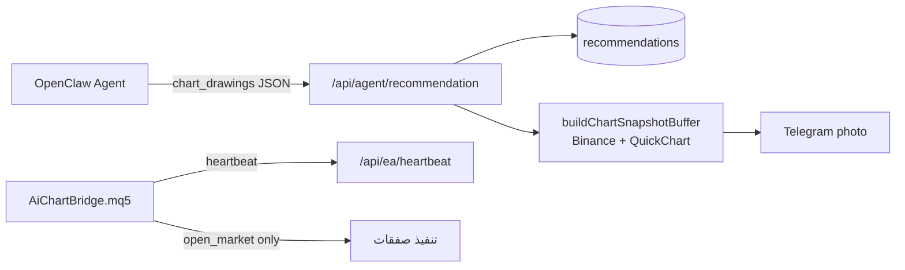
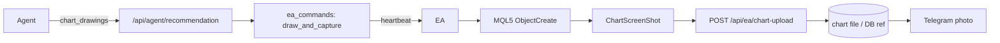

# الرسم على شارت MT5 (فوركس + كريبتو)

## الوضع الحالي



- الرسم موجود في [`web/src/lib/chartDrawings.ts`](web/src/lib/chartDrawings.ts) (9 أنواع) لكن يُعرض عبر **QuickChart** ([`web/src/lib/chartSnapshot.ts`](web/src/lib/chartSnapshot.ts)) أو **lightweight-charts** في المتصفح.
- الـ EA ([`ea/mt5/AiChartBridge.mq5`](ea/mt5/AiChartBridge.mq5)) ينفّذ `open_market` / `close_position` فقط — **لا** `ObjectCreate` ولا `ChartScreenShot`.
- مسارات التوصية [`/api/agent/chart/[id]`](web/src/app/api/agent/chart/[id]/route.ts) و[`/api/chart-image/[id]`](web/src/app/api/chart-image/[id]/route.ts) تستخدم Binance دائماً — غير مناسبة للفوركس ولا لرموز MT5 للكريبتو.

## الهدف (حسب اختيارك)

- رسم **أصلي على تيرمنال MT5** لرموز الوسيط (فوركس + كريبتو CFD مثل BTCUSD).
- Telegram يستلم **لقطة شاشة من MT5** وليس PNG المنصة.



---

## المرحلة 1 — عقد الـ EA والرسم في MQL5

### أوامر جديدة في [`ea/shared/api-contract.json`](ea/shared/api-contract.json)

| النوع | الغرض |
|--------|--------|
| `draw_and_capture` | مسح رسوم قديمة → رسم `chart_drawings` → `ChartScreenShot` → رفع PNG |
| `clear_chart` | حذف كل كائنات `AICHART_*` على الرمز/الإطار |

**Payload لـ `draw_and_capture`:**

```json
{
  "symbol": "EURUSD",
  "interval": "1h",
  "recommendation_id": 42,
  "entry": 1.0850,
  "stop_loss": 1.0800,
  "take_profit": 1.0950,
  "drawings": [ { "type": "zone", "confidence": 80, "points": [...] } ]
}
```

### توسيع [`ea/mt5/AiChartBridge.mq5`](ea/mt5/AiChartBridge.mq5)

- `ProcessCommands`: معالجة `draw_and_capture` و `clear_chart`.
- `ChartSetSymbolPeriod(0, symbol, TfFromInterval(interval))` قبل الرسم.
- تحويل `ChartDrawing` → كائنات MT5:

| AiChart type | MT5 object |
|--------------|------------|
| `price_line`, `baseline` | `OBJ_HLINE` |
| `trend_line`, `forecast_path` | `OBJ_TREND` (قطع متعددة للمسار) |
| `zone`, `histogram_band` | `OBJ_RECTANGLE` |
| `channel` | خطان `OBJ_TREND` |
| `fib_retracement` | `OBJ_FIBO` أو مستويات أفقية |
| `marker` | `OBJ_ARROW` |

- `barsAhead` → وقت الشمعة: استخدام آخر شمعة من `StreamSymbol` أو `iTime(symbol, tf, barsAhead)`.
- بادئة ثابتة `AICHART_{recId}_` لكل كائن؛ `clear_chart` يحذف بالبادئة.
- بعد الرسم: `ChartScreenShot(0, path, width, height)` ثم رفع الملف.

### رفع اللقطة

- مسار جديد: `POST /api/ea/chart-upload` (Bearer EA token، multipart PNG).
- يخزّن الملف تحت `data/charts/ea/{userId}/{recommendationId}.png` ويربطه بـ `recommendations.chart_image_url` أو عمود `mt5_chart_path`.

---

## المرحلة 2 — طبقة الخادم

### ملفات جديدة/معدّلة

| ملف | التغيير |
|-----|---------|
| [`web/src/lib/types.ts`](web/src/lib/types.ts) | `EaCommandType` + `draw_and_capture`, `clear_chart` |
| `web/src/lib/eaChartDraw.ts` (جديد) | تحويل interval، تطبيع الرمز، `queueMt5ChartCapture()` |
| `web/src/lib/mt5SymbolMap.ts` (جديد) | `BTCUSDT` → `BTCUSD` حسب رموز الـ EA في heartbeat |
| [`web/src/lib/eaStore.ts`](web/src/lib/eaStore.ts) | دعم أوامر الرسم + تتبع حالة اللقطة |
| `web/src/app/api/ea/chart-upload/route.ts` (جديد) | استقبال PNG من EA |

### ربط التوصيات

في [`web/src/app/api/agent/recommendation/route.ts`](web/src/app/api/agent/recommendation/route.ts):

1. حفظ التوصية + `chart_drawings` (كما اليوم).
2. إذا `FOREX_BACKEND=ea` والـ EA online → `queueMt5ChartCapture()` بدل QuickChart.
3. الرد: `chart_url: /api/agent/chart/{id}/mt5` (وليس `/api/agent/chart/{id}` القديم).

### endpoint حالة/تسليم الصورة

`GET /api/agent/chart/[id]/mt5`:

- `202` + `{ status: "pending" }` أثناء انتظار الـ EA.
- `200` + PNG عند جاهزية اللقطة.
- `503` إذا EA offline.

نفس المسار يُستخدم من Telegram عبر `curl` كما في [`agent/workspace/skills/aichart-trading/SKILL.md`](agent/workspace/skills/aichart-trading/SKILL.md).

### `POST /api/agent/chart/snapshot`

في [`web/src/app/api/agent/chart/snapshot/route.ts`](web/src/app/api/agent/chart/snapshot/route.ts): نفس مسار MT5 عند توفر EA؛ QuickChart يبقى **fallback** فقط إذا EA غير متصل.

---

## المرحلة 3 — الكريبتو عبر رموز MT5

- الاعتماد على رموز الوسيط من heartbeat (`symbols[]` في [`/api/ea/heartbeat`](web/src/app/api/ea/heartbeat/route.ts)).
- خريطة رموز: `BTCUSDT`/`ETHUSDT` → `BTCUSD`/`ETHUSD` (إعداد في لوحة الأدمن أو استنتاج تلقائي من قائمة الرموز).
- عند `active_market=crypto`: إن وُجد الرمز على MT5 → مسار `draw_and_capture`؛ وإلا رسالة واضحة للوكيل («الرمز غير متوفر على MT5»).
- تحديث [`agent/workspace/skills/aichart-trading/SKILL.md`](agent/workspace/skills/aichart-trading/SKILL.md) و[`agent/workspace/AGENTS.md`](agent/workspace/AGENTS.md): انتظار `chart_url` الجديد + poll بسيط (`curl` مع retry 3–5 مرات كل 2ث).

---

## المرحلة 4 — تحسينات مكمّلة (نفس PR أو follow-up صغير)

- إضافة `market` لجدول `recommendations` لتفادي خلط الفوركس/كريبتو عند تغيير `active_market`.
- توحيد [`/api/agent/chart/[id]`](web/src/app/api/agent/chart/[id]/route.ts) لاستخدام `buildChartSnapshotBufferForMarket` كـ fallback عند فشل MT5.
- EA: دعم رسم على رمز ≠ `StreamSymbol` (فتح/تبديل الشارت للرمز المطلوب في الأمر).

---

## اختبار مقترح

1. **فوركس:** توصية EURUSD H1 مع zone + خط اتجاه → ظهور الكائنات على MT5 → لقطة في Telegram.
2. **كريبتو:** BTCUSD على وسيط MT5 → نفس المسار.
3. **EA offline:** fallback QuickChart أو رسالة خطأ واضحة (لا صمت).
4. **Idempotency:** إعادة نفس `command id` لا يكرر الرسم.
5. **clear:** توصية جديدة تمسح `AICHART_*` السابقة على نفس الرمز.

---

## تقدير الجهد

| مرحلة | جهد تقريبي |
|--------|------------|
| EA MQL5 (رسم + screenshot + upload) | الأكبر — ~2–3 أيام |
| API + queue + poll | ~1 يوم |
| رموز كريبتو + skill/agent | ~نصف يوم |
| اختبار على Windows MT5 + VPS | ~نصف يوم |

**ملاحظة:** يتطلب إعادة compile الـ EA على MetaTrader المستخدم ونشره يدوياً على اللابتوب (كما EA الفوركس الحالي).
