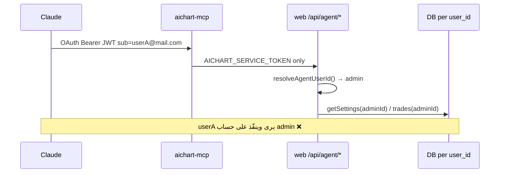
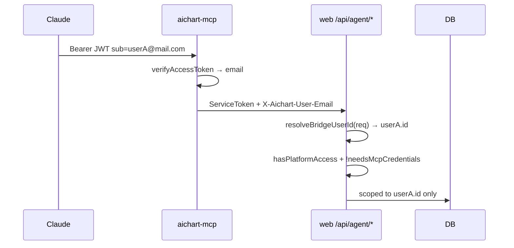

# عزل multi-user كامل لـ MCP والمنصة

## المشكلة الحالية



- [`resolveAgentUserId()`](web/src/lib/agentAuth.ts) يُرجع دائماً `admin` أو `AICHART_AGENT_USER_ID`.
- [`BridgeClient`](mcp/src/bridge/client.ts) يرسل توكن الخدمة فقط — بدون هوية المستخدم.
- ~**41** مساراً تحت [`web/src/app/api/agent/**`](web/src/app/api/agent) يستدعون `resolveAgentUserId()`.
- طبقة البيانات **جاهزة** للعزل (`user_id` في settings، binance، mt، ea، trades) — المشكلة في **طبقة المصادقة/التوجيه** فقط.
- فجوات ثانوية: APIs ويب كثيرة ما زالت `requireUser()` بدون `hasPlatformAccess`، و`/console` لا يُجبر على `/complete-profile`.

---

## الهدف



---

## 1) جسر MCP — تمرير هوية المستخدم

### أ) [`mcp/src/bridge/client.ts`](mcp/src/bridge/client.ts)

- Constructor: `new BridgeClient(cfg, actAsEmail?: string)`.
- في `headers()`: إذا وُجد `actAsEmail` أضف:
  - `X-Aichart-User-Email: email.toLowerCase()`
  - `X-Aichart-User-Sig: HMAC-SHA256(AICHART_SERVICE_TOKEN, email)` (hex) — يمنع تزوير الهوية حتى مع امتلاك التوكن من خارج MCP.
- Factory: `BridgeClient.forRequest(cfg, authInfo)` يستخرج `email` من `authInfo.extra.email` أو JWT `sub`.

### ب) [`mcp/src/index.ts`](mcp/src/index.ts)

- عند إنشاء جلسة MCP جديدة (`isInitializeRequest`):
  1. بعد `authMiddleware`، استخرج Bearer token من `Authorization`.
  2. `verifyAccessToken` → `email`.
  3. `const bridge = BridgeClient.forUser(cfg, email)`.
  4. `createAiChartMcpServer(bridge)` لكل جلسة (لا singleton مشترك).
- جلسات موجودة تحتفظ بـ bridge مربوط بالمستخدم — لا مشاركة بين Claude connectors مختلفين.

### ج) وضع بدون OAuth (authMode ≠ oauth)

- للاختبار المحلي فقط: بدون email → bridge يرفض أو يتطلب `AICHART_AGENT_USER_EMAIL` في env — **لا fallback صامت إلى admin** في الإنتاج.

---

## 2) Web — `resolveBridgeUserId` بدل `resolveAgentUserId`

### أ) توسيع [`web/src/lib/agentAuth.ts`](web/src/lib/agentAuth.ts)

```ts
// multi-user (الإنتاج — VPS AICHART_SINGLE_USER=0):
export async function resolveBridgeUserId(req: NextRequest): Promise<number>
```

| خطوة | الق rule |
|------|----------|
| 1 | `requireAgentAuth(req)` — توكن الخدمة إلزامي |
| 2 | قراءة `X-Aichart-User-Email` + `X-Aichart-User-Sig` |
| 3 | التحقق من HMAC |
| 4 | lookup `users WHERE email = ?` |
| 5 | `hasPlatformAccess(user)` — 403 pending/expired/suspended |
| 6 | `needsMcpCredentials(user)` — 403 needs_credentials |
| 7 | إرجاع `user.id` |

- **`AICHART_SINGLE_USER=1`**: مسار legacy — `resolveAgentUserId()` بدون header (للتطوير فقط؛ VPS يبقى `0`).
- **`AGENT_LAST_SEEN_FLAG`**: تحديث إلى `agent_last_seen:${userId}` + الإبقاء على المفتاح العام للتوافق مع لوحة admin.
- Deprecate `resolveAgentUserId()` في agent routes — استخدام `resolveBridgeUserId(req)` فقط.

### ب) استبدال mechanized في كل [`web/src/app/api/agent/**/route.ts`](web/src/app/api/agent)

- ~41 ملفاً: `const userId = await resolveBridgeUserId(req);`
- **`/api/agent/model`**: يبقى platform-wide (نموذج AI) — لا user scope، لا بيانات مستخدمين.
- **`/api/agent/maintenance`**: **scoped للمستخدم المنادي** (انظر §3).

---

## 3) صيانة الصفقات per-user

[`runCronPostScan()`](web/src/lib/cronPostScan.ts) يعالج **عدة** مستخدمين — مناسب للـ cron فقط.

- استخراج `runUserPostScan(userId): Promise<CronPostScanResult>` (OCO، futures، auto TP لمستخدم واحد).
- [`web/src/app/api/agent/maintenance/route.ts`](web/src/app/api/agent/maintenance/route.ts):
  - `userId = await resolveBridgeUserId(req)` ثم `runUserPostScan(userId)`.
- [`web/src/app/api/cron/monitor/route.ts`](web/src/app/api/cron/monitor/route.ts): بدون تغيير (cron عالمي بـ `CRON_SECRET`).

---

## 4) إحكام بوابة الويب (pending + MCP غير مكتمل)

### APIs — `requirePlatformAccess()` بدل `requireUser()` حيث التداول/البيانات الحساسة:

| المجموعة | أمثلة |
|----------|--------|
| Console/dashboard | `console/status`, `console/trades-active`, `agent-status` GET |
| اتصالات/تداول | `binance/*`, `mt/status`, `ea/status`, `settings`, `trades/*`, `kill-switch` (تم جزئياً) |
| تحليل/سوق | `market/*`, `chat`, `recommendations`, `instruments`, `onboarding` POST |

**تبقى `requireUser()` فقط لـ:**
- `/api/me/*`, `/api/me/credentials`, `/api/me/profile`
- `/api/auth/*`, `/api/geo/country`
- `/api/telegram/link` (ربط أثناء onboarding)

### UI guards

- [`web/src/app/console/layout.tsx`](web/src/app/console/layout.tsx): إن `needsMcpCredentials(user)` → `redirect("/complete-profile")` قبل `awaiting-approval` check.
- [`web/src/app/api/admin/mcp-auth/check-access/route.ts`](web/src/app/api/admin/mcp-auth/check-access/route.ts): نفس `needs_credentials` لـ `@telegram.user` كما في verify.

### اختياري (نفس الدفعة)

- `PATCH /api/me/password` لتغيير كلمة المرور بعد إكمال الملف.

---

## 5) تحقق العزل (E2E إلزامي)

| # | سيناريо | متوقع |
|---|---------|--------|
| 1 | userA + userB مفعّلان، Binance مختلف لكل منهما | MCP userA → `get_portfolio` يرجع رصيد A فقط |
| 2 | userA يستدعي `open_trade` | صفقة تُسجّل `user_id=A` لا B |
| 3 | user pending | MCP OAuth 403؛ `/api/agent/*` بدون header 400 |
| 4 | Telegram `@telegram.user` | MCP 403 needs_credentials؛ console redirect `/complete-profile` |
| 5 | userA يحاول تزوير email في header بدون sig | 401/403 |
| 6 | `run_trade_maintenance` لـ userA | يمس صفقات A فقط |
| 7 | Admin dashboard | يعرض بيانات admin session فقط (cookie) |

**اختبار يدوي سريع على VPS بعد النشر:**
```bash
# محاكاة bridge لـ userA (email + sig)
curl -X GET https://aichart.lork.cloud/api/agent/risk/status \
  -H "Authorization: Bearer $AICHART_SERVICE_TOKEN" \
  -H "X-Aichart-User-Email: userA@example.com" \
  -H "X-Aichart-User-Sig: ..."
```

---

## 6) نشر

1. `npm run build` — `web/` + `mcp/`
2. push → VPS `git pull` / reset + build
3. `pm2 restart aichart-web aichart-mcp --update-env`
4. تأكيد `AICHART_SINGLE_USER=0` على VPS

---

## ملفات رئيسية

| منطقة | ملفات |
|--------|--------|
| MCP bridge | [`mcp/src/bridge/client.ts`](mcp/src/bridge/client.ts), [`mcp/src/index.ts`](mcp/src/index.ts) |
| Web auth | [`web/src/lib/agentAuth.ts`](web/src/lib/agentAuth.ts), [`web/src/lib/api.ts`](web/src/lib/api.ts) |
| Agent routes | [`web/src/app/api/agent/**`](web/src/app/api/agent) (~41 route) |
| Maintenance | [`web/src/lib/cronPostScan.ts`](web/src/lib/cronPostScan.ts), [`web/src/app/api/agent/maintenance/route.ts`](web/src/app/api/agent/maintenance/route.ts) |
| Gates | [`web/src/app/console/layout.tsx`](web/src/app/console/layout.tsx), ~30 route تحت [`web/src/app/api`](web/src/app/api) |

---

## ملاحظة معمارية

بعد هذا التحديث تصبح المنصة **multi-tenant حقيقية** على مستوى التداول عبر MCP. Cron/Monitor يظلّان يمران على كل المستخدمين النشطين (by design). نموذج AI (`/api/agent/model`) يبقى مشتركاً على مستوى المنصة — لا يُسرب بيانات حسابات أخرى.
