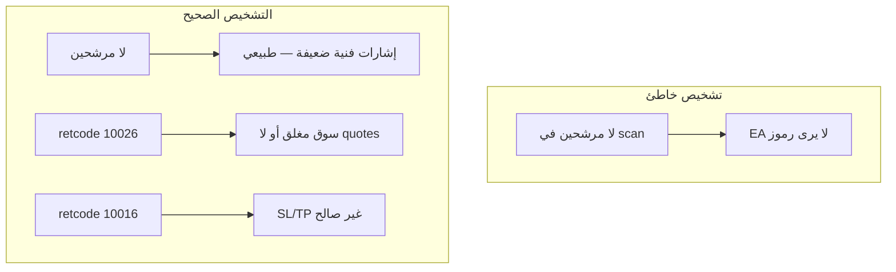
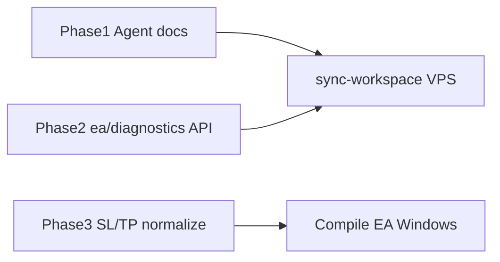

# تصحيح ما يقوله OpenClaw عن أخطاء EA والفوركس

## المشكلة الحالية

الوكيل (Black) يخلط بين أشياء مختلفة:

| ما يقوله الوكيل | الحقيقة في الكود |
|-----------------|------------------|
| «EA لا يقبل أي صيغة / Bridge غير مكتمل» | الاتصال يعمل؛ الرفض من **MT5/Liirat** بعد وصول الأمر ([`ExecuteMarket`](ea/mt5/AiChartBridge.mq5) يمرّر `retcode` فقط) |
| «10026 = رمز مرفوض من EA» | **10026 = OFF_QUOTES** (لا bid/ask أو سوق مغلق) — الرمز وُجد (`SymbolSelect` نجح) |
| «10016 = حجم/صيغة عامة» | **10016 = INVALID_STOPS** — غالباً SL/TP من التوصية غير مقبول عند Liirat |
| «لا مرشحين في المسح = EA لا يرى فوركس» | المسح ([`opportunityScan.ts`](web/src/lib/opportunityScan.ts)) فحص **فني** على `allowed_assets` — لا علاقة له بheartbeat الرموز |
| «TRXUSDT — انتظر مواصفات MT5» | TRXUSDT **كريبتو** → Binance؛ رسالة «مواصفات الرمز» ([`lotSizing.ts`](web/src/lib/brokers/lotSizing.ts)) تظهر فقط عند `market=forex` + `broker=mt_ea` |



---

## ما يجب أن يقوله OpenClaw (دليل الرد)

أضف قسم **«تشخيص MetaTrader — لا تخمّن»** في:
- [`agent/workspace/AGENTS.md`](agent/workspace/AGENTS.md)
- [`agent/workspace/skills/aichart-trading/SKILL.md`](agent/workspace/skills/aichart-trading/SKILL.md)
- ملف جديد مختصر: [`agent/workspace/EA_TROUBLESHOOTING.md`](agent/workspace/EA_TROUBLESHOOTING.md) (يُنسخ مع sync-workspace)

### قواعد صارمة للوكيل

1. **قبل أي تشخيص فوركس:** `GET /api/agent/portfolio` → تحقق من `forex.ea.online` و`account_login`.
2. **لا تربط** «لا مرشحين» باتصال EA — قل: «لا إشارة فنية كافية الآن» و`HEARTBEAT_OK`.
3. **عند فشل صفقة** انقل `reason` **حرفياً** من API؛ إن وُجد `retcode`:
   - `10026` → «لا سعر حي — تحقق: سوق مفتوح؟ الرمز في Market Watch؟ جرّب يدوياً في MT5»
   - `10016` → «وقف خسارة/جني ربح مرفوض — جرّب يدوياً **بدون SL/TP**؛ إن نجحت المشكلة من مستويات التوصية»
   - `10019` → «هامش غير كافٍ» (هنا فقط تُذكر الرافعة)
   - `symbol not found` → اسم الرمز لا يطابق MT5 (انسخ الاسم من Market Watch)
4. **لا تقل** «Bridge غير مكتمل» أو «المنفذ 3010» — EA يتصل بـ HTTPS فقط.
5. **TRXUSDT / BTCUSDT:** إذا `activeMarket=crypto` → Binance وليس MT5. إذا فوركس عبر MT5 → الرمز يجب أن يكون في قائمة heartbeat (مثل `EURUSD`، `BTCUSD`).
6. **«مواصفات الرمز غير متاحة»:** لا تعِد المحاولة بصمت 30–60ث أكثر من مرة؛ اطلب من المشغّل: EA online؟ الرمز في Market Watch؟ الاسم مطابق في `allowed_assets`؟
7. **خطوة إلزامية قبل دعم Liirat:** اسأل: «هل فتحت صفقة يدوية على نفس الرمز في MT5؟»

### نموذج رد صحيح (بدل رسائل Black)

> EA متصل (Liirat 116921). فشل التنفيذ: retcode **10016** = وقف خسارة/جني ربح غير مقبول عند الوسيط، وليس انقطاع الجسر.
> الخطوة التالية: افتح EURUSD يدوياً في MT5 **بدون SL/TP**. إن نجحت → نضبط مستويات التوصية. إن فشلت → تواصل مع Liirat لتفعيل التداول على الحساب.

---

## المرحلة 1 — توثيق الوكيل فقط (سريع)

| ملف | التغيير |
|-----|---------|
| `EA_TROUBLESHOOTING.md` | جدول retcodes + سيناريوهات + ممنوعات التشخيص |
| `SKILL.md` §أخطاء شائعة | توسيع: retcodes، مسح vs EA، crypto vs forex |
| `AGENTS.md` | قسم «فوركس / EA» يحيل للملف أعلاه |
| `HEARTBEAT.md` | توضيح: لا مرشحين ≠ EA offline |

بعد التعديل على VPS:
```bash
bash /opt/aichart/agent/scripts/sync-workspace.sh
pm2 restart aichart-agent
```

---

## المرحلة 2 — إثراء Bridge API (لتشخيص دقيق)

المشكلة: [`portfolio`](web/src/app/api/agent/portfolio/route.ts) يعيد `forex.ea` **بدون** قائمة الرموز — الوكيل يخمّن.

### 2.1 endpoint جديد `GET /api/agent/ea/diagnostics`

يرجع:
- `online`, `broker`, `account_login`, `last_heartbeat_at`
- `symbols[]` من `symbol_specs_json` (أول 40 رمزاً)
- `hasSymbol(symbol)` — هل EURUSD موجود بالاسم الدقيق
- `marketOpenHint` — اختياري: هل bid/ask > 0 لـ StreamSymbol
- `retcodeLegend` — خريطة 10016/10019/10026 بالعربية

مصدر البيانات: [`getEaConnection`](web/src/lib/eaStore.ts) + `parseEaSymbolSpecs`.

### 2.2 تحسين رسائل الفشل في [`eaAdapter.ts`](web/src/lib/brokers/eaAdapter.ts)

عند `status=failed` و`error` يحتوي `retcode`:
```text
رفض MetaTrader · retcode 10016 (وقف خسارة/جني ربح غير صالح عند الوسيط)
```
بدل نقل `retcode 10016` فقط.

### 2.3 تحديث SKILL

```bash
GET /api/agent/ea/diagnostics?symbol=EURUSD
```
قبل `POST /api/agent/trade/open` على الفوركس.

---

## المرحلة 3 — إصلاح جذر 10016 (كود المنصّة)

السبب المحتمل: [`eaAdapter`](web/src/lib/brokers/eaAdapter.ts) يمرّر `stop_loss`/`take_profit` من التوصية كما هي → [`ExecuteMarket`](ea/mt5/AiChartBridge.mq5) يرسلها لـ `trade.Buy/Sell` بدون تحقق.

### الحل المقترح

ملف [`web/src/lib/brokers/mt5Stops.ts`](web/src/lib/brokers/mt5Stops.ts):
- `normalizeMt5Stops(side, price, sl, tp, spec)` — يطبّق `SYMBOL_TRADE_STOPS_LEVEL` من spec إن وُجد في heartbeat (قد يتطلب توسيع `EaSymbolSpec` بـ `stops_level` من EA)
- إن SL/TP غير صالحين → إرسال `null` (0 في EA = بدون stops) مع تحذير في `reason`

توسيع heartbeat في [`AiChartBridge.mq5`](ea/mt5/AiChartBridge.mq5) `BuildSymbols()`:
- إضافة `stops_level`, `freeze_level` من `SymbolInfoInteger`

إعادة compile EA على Windows بعد التعديل.

---

## ترتيب التنفيذ



| المرحلة | الجهد | يحل |
|---------|-------|-----|
| 1 توثيق OpenClaw | ~1 ساعة | تشخيصات خاطئة فوراً |
| 2 API diagnostics | ~2–3 ساعات | الوكيل يتحقق من الرموز قبل التخمين |
| 3 SL/TP | ~4 ساعات + compile | retcode 10016 |

---

## معايير القبول

- عند retcode 10016/10026 الوكيل **لا يقول** Bridge معطّل أو EA لا يرى رموز.
- عند «لا مرشحين» في scan الوكيل يقول HEARTBEAT_OK دون ربط بـ EA.
- TRXUSDT مع `activeMarket=crypto` لا يُوجّه لـ «انتظر MT5 specs».
- `GET /api/agent/ea/diagnostics?symbol=EURUSD` يبيّن إن الرمز في heartbeat قبل فتح صفقة.
- (اختياري) صفقة فوركس بدون SL/TP من الوكيل تنجح عندما اليدوي ينجح.

---

## ما يبقى على المشغّل (Black لا يصلحه بالكود)

- تفعيل **Algo Trading** في MT5
- صفقة يدوية للتحقق من Liirat
- تطابق اسم الرمز حرفياً مع Market Watch
- دعم Liirat إن فشل التداول اليدوي أيضاً
