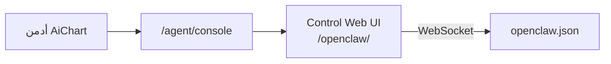

# دمج Control Web UI فقط (`/openclaw/`)

## النطاق

**فقط** واجهة OpenClaw في المتصفح (Control Web UI) بكل إعداداتها — **بدون** TUI ولا CLI ولا SSH.

يشمل Control UI رسمياً ([وثائق OpenClaw](https://docs.openclaw.ai/gateway/configuration)):
- تبويب **Config** (نموذج كامل من schema + Raw JSON)
- قنوات (مثل Telegram)، أدوات (`tools.exec`)، موافقات exec
- agents، plugins، skills، heartbeat، جلسات، doctor
- hot reload على `~/.openclaw/openclaw.json`

AiChart يوفّر **بوابة دخول** فقط — لا يعيد بناء شاشات الإعدادات في Next.js.

---

## الوضع الحالي

- OpenClaw على `127.0.0.1:18789` (loopback) — Control UI غير متاح من المتصفح خارج السيرفر.
- [`/agent`](web/src/app/agent/page.tsx): سجل نشاط فقط.
- إعدادات OpenClaw اليوم عبر SSH + سكربتات [`infra/vps-openclaw-*.sh`](infra/vps-openclaw-merge-config.sh).



---

## المرحلة 1 — إعداد OpenClaw

`~/.openclaw/openclaw.json`:

```json5
{
  gateway: {
    bind: "loopback",
    port: 18789,
    controlUi: {
      enabled: true,
      basePath: "/openclaw",
      allowedOrigins: ["https://aichart.lork.cloud"]
    },
    auth: {
      mode: "token",
      token: "<OPENCLAW_GATEWAY_TOKEN>"
    }
  }
}
```

سكربت جديد: [`infra/vps-openclaw-control-ui.sh`](infra/vps-openclaw-control-ui.sh) — يدمج مع [`infra/vps-openclaw-merge-config.sh`](infra/vps-openclaw-merge-config.sh) دون مسح إعدادات AiChart الموجودة.

ثم: `pm2 restart aichart-agent`.

---

## المرحلة 2 — nginx reverse proxy

ملف [`infra/nginx/aichart-openclaw.conf`](infra/nginx/aichart-openclaw.conf) داخل vhost `aichart.lork.cloud`:

```nginx
location /openclaw/ {
    proxy_pass http://127.0.0.1:18789/openclaw/;
    proxy_http_version 1.1;
    proxy_set_header Upgrade $http_upgrade;
    proxy_set_header Connection "upgrade";
    proxy_set_header Host $host;
    proxy_set_header X-Real-IP $remote_addr;
    proxy_set_header X-Forwarded-For $proxy_add_x_forwarded_for;
    proxy_set_header X-Forwarded-Proto $scheme;
    proxy_read_timeout 86400;
}
```

- المنفذ `18789` يبقى loopback — لا فتح في الجدار الناري.
- اختبار: `curl -I https://aichart.lork.cloud/openclaw/`

---

## المرحلة 3 — طبقة AiChart

### API أدمن

[`web/src/app/api/admin/openclaw-console/route.ts`](web/src/app/api/admin/openclaw-console/route.ts):
- `requireAdmin()`
- يرجع: `{ "webUiUrl": "https://aichart.lork.cloud/openclaw/?token=..." }`
- Token من `OPENCLAW_GATEWAY_TOKEN` في env — لا يُخزَّن في الواجهة بشكل دائم

### صفحة `/agent/console`

[`web/src/app/agent/console/page.tsx`](web/src/app/agent/console/page.tsx):
- أدمن فقط
- زر «فتح لوحة OpenClaw» (نفس التبويب)
- زر «فتح في تبويب جديد»
- ملاحظة: كل إعدادات OpenClaw من تبويب Config داخل اللوحة

### رابط من `/agent`

تعديل [`web/src/app/agent/page.tsx`](web/src/app/agent/page.tsx): بطاقة «إعدادات OpenClaw» → `/agent/console`

### env

[`web/.env.example`](web/.env.example):
```env
OPENCLAW_CONSOLE_URL=https://aichart.lork.cloud/openclaw/
OPENCLAW_GATEWAY_TOKEN=
```

---

## فصل المسؤوليات

| الإعدادات | أين |
|-----------|-----|
| مفاتيح المنصة (Anthropic، Binance، …) | AiChart `/admin/keys` |
| **كل إعدادات OpenClaw** | **Control Web UI** `/openclaw/` |
| تداول، Risk Guard، EA | AiChart `/settings` |

---

## الأمان

- **لا iframe** — صفحة كاملة على `/openclaw/` (OpenClaw يمنع التضمين).
- Token عبر API أدمن فقط.
- `token` auth + HTTPS — لا `trusted-proxy` على loopback.
- وصول: admin فقط من AiChart.

---

## خارج النطاق

- TUI / `openclaw tui` / CLI / SSH
- دمج `/chat` مع OpenClaw
- إعادة بناء نماذج Config في React

---

## ترتيب التنفيذ

1. `openclaw.json` + سكربت VPS
2. nginx + reload
3. API + `/agent/console` + زر `/agent`
4. `.env` على VPS + توثيق
5. اختبار Config tab و WebSocket

**تقدير:** ~2–3 ساعات.
