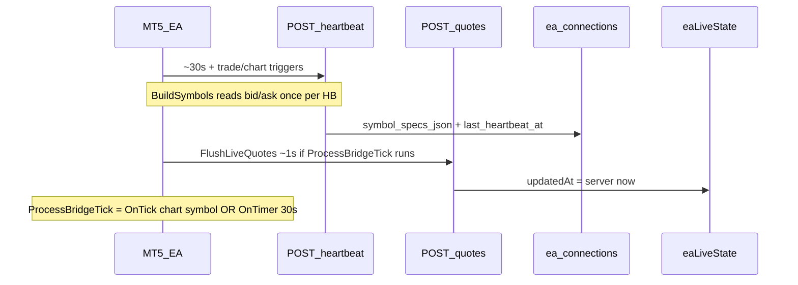

# خطة تحقيق وإصلاح Quote Staleness (EURUSDm) — v2

## 0) توضيح محتوى الـheartbeat (تحقق من الكود — قبل التنفيذ)

### ما يرسله EA

[`BuildHeartbeat()`](ea/mt5/AiChartBridge.mq5) يبني JSON فيه `symbols: BuildSymbols()` — **ليس مواصفات ثابتة فقط**.

[`BuildSymbols()`](ea/mt5/AiChartBridge.mq5) (lines 525–572) لكل رمز في Market Watch:

| الحقل | المصدر | طبيعته |
|-------|--------|--------|
| `bid`, `ask` | `SymbolInfoDouble(sym, SYMBOL_BID/ASK)` **لحظة بناء الـJSON** | قراءة حية من MT5 عند `SendHeartbeat()` |
| `digits`, `point`, `contract_size`, `tick_value`, `tick_size`, `min_lot`, … | `SymbolInfoInteger/Double` | مواصفات عقد (ثابتة نسبياً) |
| `stops_level`, `freeze_level`, `trade_execution`, `filling_mode`, `spread_points` | MT5 symbol info | specs + spread لحظي |

**لا يوجد cache محلي** لـ bid/ask بين heartbeats — كل `SendHeartbeat()` يعيد قراءة MT5.

### ما يخزّنه السيرفر

[`POST /api/ea/heartbeat`](web/src/app/api/ea/heartbeat/route.ts) → [`recordEaHeartbeat()`](web/src/lib/eaStore.ts):

- `symbol_specs_json` = `JSON.stringify(body.symbols)` — **يشمل bid/ask + specs**
- `last_heartbeat_at = datetime('now')` — وقت **استلام** السيرفر، وليس `tick_time`

[`EaSymbolSpec`](web/src/lib/types.ts) يعرّف `bid?` و `ask?` صراحةً كجزء من heartbeat specs.

### إجابة الأسئلة الثلاث

1. **هل `symbol_specs_json` فيه bid/ask حي؟**  
   **نعم** — bid/ask فعليان، يُقرآن من MT5 عند كل heartbeat. **لكن** مع مواصفات العقد (digits, point, contract_size, …).

2. **هل بنفس لحظة آخر tick؟**  
   **لا** — بنفس لحظة **آخر `SendHeartbeat()`** فقط. Cadence ~**30 ثانية** (`HeartbeatSeconds`) + triggers (trade sync debounced 2s، chart change، OnInit).  
   **ليس** tick stream — لا علاقة بـ `/api/ea/quotes`. في سوق هادئ، bid/ask في heartbeat قديم بمقدار **حتى ~30s** بين إرسالين (أو أقل إذا trade-sync أطلق HB).

3. **عمر السعر عند fallback حالياً:**  
   Bridge يحسب `quoteAgeMs = Date.now() - last_heartbeat_at` — يعني عمر **آخر heartbeat كحد أقصى**، وليس عمر tick MT5. bid/ask داخل JSON عُرِفا عند نفس اللحظة تقريباً (نفس request).

### قرار إصلاح #3 (bridge fallback)

| معيار المستخدم | الواقع |
|----------------|--------|
| bid/ask حي وفريش عند لحظة HB | حي **عند لحظة الإرسال** ✓ |
| مناسب كـ fallback تداول | **لا** ✗ — snapshot ~30s، **ليس** بديلاً للـquote stream (~1s). قد يُظهر `quoteAgeMs` صغيراً بينما السعر lag حقيقي عن السوق في فجوات quiet-tick |

**القرار: لا تنفّذ fallback تداول من heartbeat bid/ask.**

- إذا live stale ولا `/api/ea/quotes` حديث → **`STALE_QUOTE` صادق** (مع `retryAfterMs: 2000` الموجود).
- heartbeat يبقى لـ: specs، symbol list، positions، online detection — **ليس** لتسعير تنفيذ.
- **توثيق إلزامي قبل deploy:** سطر في [`ea/mt5/CHANGELOG.md`](ea/mt5/CHANGELOG.md) + تعليق على [`BuildSymbols()`](ea/mt5/AiChartBridge.mq5) و [`recordEaHeartbeat()`](web/src/lib/eaStore.ts) يوضح أن `symbol_specs_json.bid/ask` = snapshot per heartbeat (~30s)، not tick stream.

---

## التشخيص (ملخص)

### heartbeat ≠ quote push

**نمط الاختبار (8775→11352 stale + HB fresh):** HB حديث في DB؛ quote push توقف لأن `ProcessBridgeTick` لم يُستدعَ (سوق هادئ + `EventSetTimer(30)`).

### readiness vs live_quotes

نفس كاش live + نفس منطق العمر؛ الفرق في الاختبار = **توقيت** وليس مصدر منفصل. stale live entry **لا** fallback heartbeat في [`resolveForexQuoteSnapshot`](web/src/lib/bridge/forexPreflight.ts) — وهذا **يُبقى** (رفض صادق أفضل من سعر HB).

---

## نشر مرحلي (ثلاث deploys منفصلة)

**لا تجمع 2.1 + 2.2 + 2.3.** EURUSDm عليه صفقة live — كل مرحلة rollback مستقل.

### المرحلة 2.1 — Server metrics فقط

**محتوى:**
- [`web/src/lib/eaLiveState.ts`](web/src/lib/eaLiveState.ts): `lastTickGapMs`، histogram (0–1s, 1–3s, 3–5s, 5–10s, 10s+), ring buffer آخر 20 gap
- Expose: `GET /api/agent/ea/live-quotes?symbol=EURUSDm&metrics=1`
- Optional log: `EA_QUOTE_METRICS_LOG=1`
- **توثيق heartbeat payload** (§0) في CHANGELOG + code comments

**Deploy:** `git pull` web only → `npm install` → `npm run build` → `pm2 restart aichart-web`

**اختبار 2.1:**
- POST `/api/ea/quotes` (من EA الحالي) → metrics تتسجّل
- `get_trade_readiness` / `get_ea_live_quotes` — **سلوك readiness unchanged** (no regression)
- Rollback: revert web commit + restart pm2

---

### المرحلة 2.2 — Baseline verify (بدون إصلاح #3)

**محتوى:**
- [`infra/tmp-test-quote-freshness.py`](infra/tmp-test-quote-freshness.py): poll readiness كل 5s × 120s
- **لا تغيير** في [`forexPreflight.ts`](web/src/lib/bridge/forexPreflight.ts) fallback logic
- (اختياري) تحسين رسالة `STALE_QUOTE` metadata فقط — `source`, `lastQuoteGapMs` من metrics

**Deploy:** سكربت + أي metadata messaging — web restart إذا لزم

**اختبار 2.2:**
- تشغيل السكربت على production **قبل EA fix** — baseline histogram/gaps
- PASS = no regression (readiness gates unchanged؛ confidence 80% still works)
- يُوثَّق p50/p95 `quoteAgeMs` كخط أساس للمقارنة مع 2.3

---

### المرحلة 2.3 — EA v4.01

**محتوى:** [`ea/mt5/AiChartBridge.mq5`](ea/mt5/AiChartBridge.mq5)

- `EventSetTimer(1)` في `OnInit` + `ArmKeepaliveTimer` (بدل 30)
- `FlushChartSymbolQuote()` على كل `OnTick` لـ `Symbol()` (throttle 200–500ms)
- `FlushLiveQuotes()` batch يبقى كل `QuoteFlushSeconds`
- `g_quote_failures` logging
- CHANGELOG v4.01 + [`api-contract.json`](ea/shared/api-contract.json) notes

**Deploy:** compile `.ex5` على MT5 VPS → reattach EA على شارت EURUSDm

**اختبار 2.3 (≥2 دقيقة بعد reattach):**
- نفس `tmp-test-quote-freshness.py`
- **PASS:** p95 `quoteAgeMs` ≤ 3000ms؛ لا >5000ms لأكثر من pollين متتاليين
- metrics 2.1: histogram يتحول نحو bucket 0–1s
- Rollback: reattach EA v4.00 + `EventSetTimer(30)` restore

---

## ما لن نلمسه

- `staleThresholdMs` (5000)
- Risk Guard / `min_confidence=80`
- **fallback تداول من heartbeat bid/ask** (§0 قرار)

---

## النتيجة المتوقعة

| المرحلة | مخرجات |
|---------|--------|
| 0 + doc | heartbeat payload موثّق؛ قرار skip #3 مبرّر |
| 2.1 | baseline metrics + دليل فجوات tick |
| 2.2 | baseline readiness poll قبل EA fix |
| 2.3 | quoteAgeMs ≤ ~2–3s مستمر؛ STALE_QUOTE نادر وصادق |

**تقرير نهائي:** EA-side root cause + histogram قبل/بعد + تأكيد أن HB bid/ask لم يُستخدم للتسعير.

---

## 4) اكتشاف جديد — Experts tab (MT5 v4.01, 2026-06-18)

### ما يظهر في اللوج (من لقطة الشاشة)

| الوقت | رسالة | المعنى |
|-------|--------|--------|
| 02:04:45 | `chart symbol/period changed` | `OnChartEvent` — إعادة HB فوري |
| 02:04:50 → 02:08:10 | `batch quote push failed (250…320)` | **~320 فشل HTTP** لـ `POST /api/ea/quotes` (يُطبع كل 10 أخطاء) |
| 02:06:27 | `heartbeat failed (30)` | **30 فشل متتالي** لـ `POST /api/ea/heartbeat` |

### التفسير (ليس مجرد «سوق هادئ»)

هذا **انقطاع HTTP كامل** بين MT5 و`aichart.lork.cloud` — quotes **و** heartbeat معاً. طالما `HttpPost` يرجع `false`:

- لا يُحدَّث `eaLiveState` على السيرفر → `quoteAgeMs` ينمو → `STALE_QUOTE`
- v4.01 (`EventSetTimer(1)`) **يزيد عدد المحاولات** (كل 1s batch + chart tick) → عداد الفشل يرتفع أسرع **بدون** أن يكون السبب هو التimer نفسه

[`HttpPost`](ea/mt5/AiChartBridge.mq5) L1584–1605:

- `WebRequest == -1` → يطبع `GetLastError` + تذكير Allow WebRequest
- **HTTP 401/403/429/5xx** → يرجع `false` **بدون** طباعة رمز الحالة — فقط `batch quote push failed (N)`

### أسباب محتملة (بالترتيب)

1. **Allow WebRequest** — `https://aichart.lork.cloud` غير مضاف في MT5 → Tools → Options → Expert Advisors
2. **EaToken / ApiBase** خاطئ أو منتهي → 401 على كل POST
3. **شبكة VPS Windows** — انقطاع مؤقت أو firewall outbound
4. **حمل v4.01** — poll + batch كل 1s؛ قد يفاقم timeout (5s) لكن **لا يفسّر** فشل heartbeat (30) وحده

### إصلاح مقترح (v4.02 — أولوية)

**EA:** log HTTP status / GetLastError + backoff بعد 5 فشل متتالي + counters منفصلة batch/chart.

**يدوي فوري:** Allow WebRequest + تحقق EaToken → Remove/Reattach EA → فحص nginx logs وقت 02:04–02:08.

**العلاقة:** بدون إصلاح HTTP، v4.01 لا يحل stale quotes — يزيد فقط رسائل الفشل في Experts.
