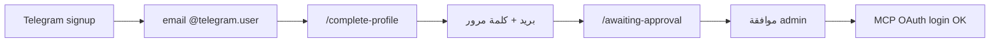

# بيانات MCP لمستخدمي Telegram + إصلاحات متبقية

## المشكلة

مستخدم Telegram جديد يُنشأ في [`upsertTelegramUser`](web/src/lib/store.ts) بـ:
- بريد اصطناعي: `username@telegram.user` أو `tg_{id}@telegram.user`
- `password_hash` عشوائي — **المستخدم لا يعرفه**

MCP OAuth يعتمد على [`POST /api/admin/mcp-auth/verify`](web/src/app/api/admin/mcp-auth/verify/route.ts) (**بريد + كلمة مرور**) → مستخدم Telegram **لا يستطيع** ربط Claude حتى يضبط بيانات دخول حقيقية.



---

## 1) كشف البريد الاصطناعي

ملف جديد [`web/src/lib/userCredentials.ts`](web/src/lib/userCredentials.ts):

```ts
export function isSyntheticTelegramEmail(email: string): boolean {
  return email.toLowerCase().endsWith("@telegram.user");
}
export function needsMcpCredentials(user: Pick<PublicUser, "email">): boolean {
  return isSyntheticTelegramEmail(user.email);
}
```

توسيع [`GET /api/me`](web/src/app/api/me/route.ts):

```json
{ "needs_mcp_credentials": true, ... }
```

---

## 2) API إكمال بيانات الدخول

**`PATCH /api/me/credentials`** — ملف جديد [`web/src/app/api/me/credentials/route.ts`](web/src/app/api/me/credentials/route.ts)

| قاعدة | التفاصيل |
|-------|----------|
| Auth | `requireUser()` فقط — **يعمل للمستخدم pending** |
| مسموح | فقط إذا `needsMcpCredentials(user)` |
| Body | `email`, `password`, `password_confirm` (min 8) |
| تحقق | بريد فريد، تطابق كلمة المرور |
| Store | `updateUserCredentials(userId, { email, password_hash })` في [`store.ts`](web/src/lib/store.ts) |
| Session | `setSession` بالبريد الجديد بعد النجاح |

رسالة MCP verify عند محاولة دخول ببريد `@telegram.user`: **403** + `"reason": "needs_credentials"` + نص عربي يوجّه لـ `/complete-profile`.

---

## 3) صفحة إلزامية `/complete-profile`

| ملف | الغرض |
|-----|--------|
| [`web/src/app/complete-profile/page.tsx`](web/src/app/complete-profile/page.tsx) | Server: auth + redirect إن لا حاجة |
| [`web/src/components/CompleteProfileClient.tsx`](web/src/components/CompleteProfileClient.tsx) | نموذج: بريد، كلمة مرور، تأكيد |

**السلوك:**
- غير مسجّل → `/login`
- لديه بريد حقيقي → `/awaiting-approval` أو `/console` حسب `hasPlatformAccess`
- يحتاج إكمال → عرض النموذج

**تعديل [`telegram/route.ts`](web/src/app/api/auth/telegram/route.ts):**
- مستخدم **جديد** (`isNew`) أو أي مستخدم `needsMcpCredentials` → `redirect: "/complete-profile"`
- غير ذلك → `/awaiting-approval` أو `/console` كما اليوم

**تعديل [`awaiting-approval/page.tsx`](web/src/app/awaiting-approval/page.tsx):**
- إن `needsMcpCredentials` → redirect `/complete-profile` (حماية مزدوجة)

---

## 4) تذكيرات في لوحة المستخدم (بعد الموافقة)

| ملف | تغيير |
|-----|--------|
| [`UserHomeClient.tsx`](web/src/components/user/UserHomeClient.tsx) | بطاقة **أولوية** «أكمل بيانات MCP»؛ **صلاحية بالأيام**؛ **رابط MCP قابل للنسخ** |
| [`UserAccountClient.tsx`](web/src/components/user/UserAccountClient.tsx) | قسم تعديل البريد/كلمة المرور — إخفاء `@telegram.user`؛ عرض الأيام المتبقية |
| [`console/mcp/page.tsx`](web/src/app/console/mcp/page.tsx) | تنبيه `/complete-profile`؛ **حقل MCP + زر نسخ** |
| [`AwaitingApprovalClient.tsx`](web/src/components/AwaitingApprovalClient.tsx) | لا يُعرض عادةً (redirect مسبق) — fallback نص إن وُجد |

---

## 5) إصلاحات متبقية (من التحقق السابق)

### أ) تقوية بوابة pending على APIs حساسة

استبدال `requireUser()` → `requirePlatformAccess()` في:

- [`web/src/app/api/binance/connect/route.ts`](web/src/app/api/binance/connect/route.ts)
- [`web/src/app/api/binance/verify/route.ts`](web/src/app/api/binance/verify/route.ts) (POST)
- [`web/src/app/api/mt/connect/route.ts`](web/src/app/api/mt/connect/route.ts)
- [`web/src/app/api/ea/token/route.ts`](web/src/app/api/ea/token/route.ts)
- [`web/src/app/api/kill-switch/route.ts`](web/src/app/api/kill-switch/route.ts)

**لا تغيير** على `/api/me/*` و`/api/me/credentials` — يجب أن تبقى متاحة للـ pending.

### ب) MCP رسالة أوضح

[`web/src/app/api/admin/mcp-auth/verify/route.ts`](web/src/app/api/admin/mcp-auth/verify/route.ts): إن البريد `@telegram.user` → `{ ok: false, reason: "needs_credentials" }`

(اختياري) [`mcp/src/auth/platformAccess.ts`](mcp/src/auth/platformAccess.ts) — ترجمة `needs_credentials` في صفحة OAuth login.

### ج) AdminUsersTable

[`AdminUsersTable.tsx`](web/src/components/admin/AdminUsersTable.tsx): عمود أو badge «Telegram — بريد MCP ناقص» إن `@telegram.user`.

### د) إصلاح كشف الدولة التلقائي + أسماء الدول في PhoneInput

**المشكلة الحالية:**

| السبب | التفاصيل |
|--------|----------|
| SSR بدون Cloudflare | [`detectCountryFromHeaders`](web/src/lib/geoCountry.ts) لا يجد `CF-IPCountry` على VPS المباشر → fallback `SA` دائماً |
| `Accept-Language: ar` | بدون `-EG`/`-SA` — لا region |
| عرض مختصر | [`PhoneInput.tsx`](web/src/components/PhoneInput.tsx) يعرض `<option>+966</option>` فقط — بدون اسم الدولة |
| Client متأخر | `UserAccountClient` يجلب `/api/geo/country` بعد mount — قد يبقى SA إن API يرجع SA |

**الإصلاح:**

1. **`PhoneInput.tsx` — أسماء الدول:**
   - كل `<option>`: **`{اسم} +{كود}`** مثل `مصر +20`، `السعودية +966`
   - استخدام `Intl.DisplayNames(['ar'], { type: 'region' })` لجميع الدول في [`libphonenumber-js`](web/package.json)
   - الإبقاء على `PRIORITY` + `LABELS` للدول العربية (أسماء أوضح)
   - توسيع عرض الـ select: `w-full` على الموبايل و desktop (`min-w-[12rem]`)

2. **كشف تلقائي يعمل فعلياً (client-first):**
   - عند mount في `PhoneInput`: `detectCountryFromBrowser()` فوراً (timezone `Intl` — يعمل على الموباile)
   - ثم `fetch('/api/geo/country')` مع header **`X-Timezone`** من `Intl.DateTimeFormat().resolvedOptions().timeZone`
   - تحديث [`GET /api/geo/country`](web/src/app/api/geo/country/route.ts): قراءة `X-Timezone` قبل fallback SA
   - SSR من [`signup/page.tsx`](web/src/app/signup/page.tsx) يبقى hint أولي — **العميل يُصحّح** بعد hydration

3. **توسيع [`geoCountry.ts`](web/src/lib/geoCountry.ts):**
   - خريطة timezone أوسع (أوروبا/آسيا الشائعة)
   - دالة `detectCountryFromRequest(headers, clientTz?: string)` موحّدة

4. **تحقق:**
   - موبايل بتوقيت `Africa/Cairo` → Egypt +20 محدد
   - القائمة تعرض «مصر +20» وليس «+20» فقط
   - `/complete-profile` و`/signup` و`/console/account` — نفس `PhoneInput`

### هـ) صلاحية الحساب بالأيام + نسخ رابط MCP

**1) الأيام المتبقية**

دالة في [`platformAccess.ts`](web/src/lib/platformAccess.ts) (أو `lib/accessDisplay.ts`):

```ts
formatAccessRemaining(access_expires_at: string | null): string
// "متبقي 3 أيام" | "متبقي يوم واحد" | "ينتهي اليوم" | "منتهٍ" | "—"
```

- حساب: `Math.ceil((expires - now) / 86400000)` — تقريب لأعلى
- **عرض للمستخدم:** [`UserHomeClient.tsx`](web/src/components/user/UserHomeClient.tsx) — «صلاحية: **متبقي 3 أيام**» (مع التاريخ بين قوسين اختياري `١٧ يوليو ٢٠٢٦`)
- [`UserAccountClient.tsx`](web/src/components/user/UserAccountClient.tsx) — نفس الصيغة
- **الأدmin:** [`AdminUsersTable.tsx`](web/src/components/admin/AdminUsersTable.tsx) — عمود «صلاحية حتى» يعرض التاريخ **+** `(متبقي N يوم)` للنشطين

**2) نسخ رابط MCP**

مكوّن صغير [`CopyField.tsx`](web/src/components/ui/CopyField.tsx) (client):

```
[ readonly input: https://aichart.lork.cloud/mcp ] [📋 نسخ]
```

- `navigator.clipboard.writeText` + feedback «تم النسخ» 2ث
- أيقونة: `Copy` / `Check` من lucide-react

**استخدام في:**
- [`UserHomeClient.tsx`](web/src/components/user/UserHomeClient.tsx) — بدل `<code>` الحالي
- [`console/mcp/page.tsx`](web/src/app/console/mcp/page.tsx) — بدل `<code>` في الخطوة 3

---

## 6) التحقق (E2E)

| # | سيناريو | متوقع |
|---|---------|--------|
| 1 | Telegram signup جديد | → `/complete-profile` |
| 2 | حفظ بريد+كلمة مرور | → `/awaiting-approval`، `/api/me` `needs_mcp_credentials: false` |
| 3 | `/login` بالبريد الجديد | 200 |
| 4 | pending + MCP OAuth | 403 pending (طبيعي) |
| 5 | بعد موافقة admin + MCP OAuth | 200 بالبريد/كلمة المرور الجديدين |
| 6 | pending + `POST /api/binance/connect` | 403 |
| 7 | PhoneInput موبايل (مصر/الإمارات) | timezone → دولة صحيحة + «اسم +كود» في القائمة |
| 8 | لوحة مستخدم — صلاحية | «متبقي N أيام» وليس تاريخاً فقط |
| 9 | زر نسخ MCP | ينسخ URL كاملاً + «تم النسخ» |
| 10 | `npm run build` + نشر VPS | pm2 restart |

---

## ملفات رئيسية

- جديد: `userCredentials.ts`, `/api/me/credentials`, `/complete-profile`, `CompleteProfileClient.tsx`, `CopyField.tsx`
- تعديل: `store.ts`, `telegram/route.ts`, `awaiting-approval/page.tsx`, `UserHomeClient`, `UserAccountClient`, `console/mcp/page.tsx`, `platformAccess.ts`, `mcp-auth/verify`, 5 API routes للـ platform access
- تعديل: [`PhoneInput.tsx`](web/src/components/PhoneInput.tsx), [`geoCountry.ts`](web/src/lib/geoCountry.ts), [`/api/geo/country`](web/src/app/api/geo/country/route.ts)
