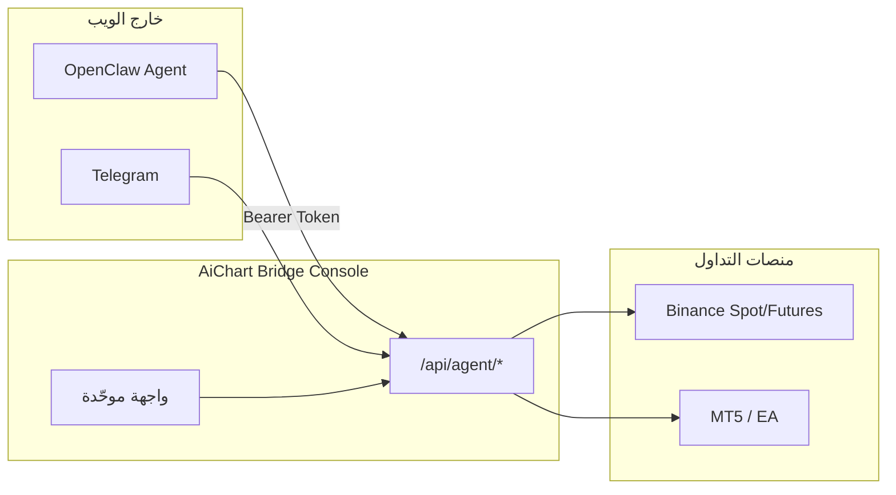
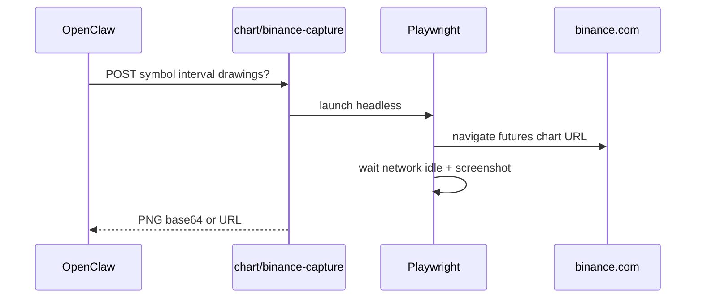

# مركز الجسر الموحّد — Admin + Platform

## الرؤية



- **الويب = جسر + تحكّم** فقط: اتصالات، مخاطر، مفاتيح، مراقبة الصفقات، حالة OpenClaw.
- **OpenClaw = الوكيل الوحيد** (دردشة، تحليل، توصيات، تنفيذ) — لا `/chat` ولا `/agent` ولا `/market` في القائمة.
- **كل الـ APIs الحالية تبقى** ([`/api/agent/*`](web/src/app/api/agent/trades/open/route.ts), admin config, cron, …) — إعادة تنظيم UI فقط + إضافات.

---

## 1. هيكل التطبيق الجديد (5 أقسام)

| القسم | المسار | المحتوى (دمج من) |
|--------|--------|-------------------|
| **نظرة عامة** | `/console` | [`DashboardClient`](web/src/components/DashboardClient.tsx) + [`AdminOverview`](web/src/components/admin/AdminOverview.tsx) + صفقات حية |
| **الصفقات** | `/console/trades` | [`TradesClient`](web/src/components/TradesClient.tsx) + futures positions summary |
| **الاتصالات** | `/console/connect` | Binance/MT5/Telegram من [`SettingsClient`](web/src/components/SettingsClient.tsx) integrations |
| **التداول والمخاطر** | `/console/risk` | trading tab + [`AdminLimits`](web/src/app/admin/limits/page.tsx) |
| **المنصة والمفاتيح** | `/console/platform` | [`AdminKeysPanel`](web/src/components/admin/AdminKeysPanel.tsx) + system/security/usage |

**تبويبات ثانوية** (drawer على الموبايل، sidebar فرعي على الديسكتوب):
- Kill Switch، وضع الوكيل، OpenClaw model sync، سجل التدقيق.

### لوحة «نظرة عامة» — محتوى إلزامي

- **بطاقات حالة**: OpenClaw (model ref / sync)، Binance (env + verify checklist)، MT5/EA (online/offline)، Telegram، `executionEnv` (demo/live).
- **جدول الصفقات الفعّالة** (مصدر: [`GET /api/agent/trades/open`](web/src/app/api/agent/trades/open/route.ts) + futures positions):
  - الرمز، المنصة (Spot / Futures / MT5)، الاتجاه، الرافعة، الهامش، PnL غير محقق، SL/TP، env.
- **نوافذ سريعة**: pending intents، kill switch، آخر audit (3 أسطر).

---

## 2. التصميم — بسيط، احترافي، بدون شرح بجانب كل حقل

### مكوّنات جديدة

- [`web/src/components/ui/InfoTip.tsx`](web/src/components/ui/InfoTip.tsx) — أيقونة `Info` صغيرة (16px) → `Popover` (desktop) / `Sheet` (mobile) يشرح **لماذا** هذا الخيار موجود.
- [`web/src/components/bridge/BridgeShell.tsx`](web/src/components/bridge/BridgeShell.tsx) — shell موحّد يحل [`AppShell`](web/src/components/AppShell.tsx) + [`AdminShell`](web/src/components/admin/AdminShell.tsx).
- [`web/src/components/bridge/StatusChip.tsx`](web/src/components/bridge/StatusChip.tsx) — ok / warn / error مضغوط.
- [`web/src/components/bridge/ActiveTradesTable.tsx`](web/src/components/bridge/ActiveTradesTable.tsx) — جدول responsive (cards على الموبايل).

### قواعد UI

- **Labels قصيرة** (كلمة–كلمتين) + `InfoTip` فقط للحقول غير البديهية (futures_enabled، max_leverage، AI_PROVIDER، IP restriction، …).
- **Desktop**: sidebar يمين 240px (RTL) + main max-width ~1200px، كثافة متوسطة.
- **Mobile**: bottom nav 4 tabs (نظرة | صفقات | اتصال | المزيد) + `MobileDrawer` للأقسام الثانوية.
- **Tokens**: توحيد على `--sidebar-*` الحالي؛ إزالة `#050505` المنفصل في AdminShell — مظهر واحد.

---

## 3. إعادة توجيه المسارات (بدون حذف APIs)

| مسار قديم | بعد الدمج |
|-----------|-----------|
| `/` | logged-in → `/console` |
| `/dashboard`, `/settings`, `/admin/*` | redirect → `/console/...` |
| `/chat`, `/market`, `/command`, `/agent`, `/signals`, `/reports`, `/plan` | redirect → `/console` + banner «الوكيل عبر OpenClaw» (اختياري 30 يوم) |
| `/register` | [`isSingleUserMode()`](web/src/lib/agentAuth.ts) → `/login` (موجود) |
| `/admin/users` | إخفاء في single-user؛ redirect `/console/platform` |

**لا حذف** لملفات [`MarketClient`](web/src/components/MarketClient.tsx) / [`agent.ts`](web/src/lib/agent.ts) — تبقى للـ API والاختبار؛ فقط إزالتها من التنقل.

---

## 4. دمج Admin + Settings (تقني)

1. **Layout واحد**: [`web/src/app/console/layout.tsx`](web/src/app/console/layout.tsx) — auth + `BridgeShell`.
2. **تفكيك [`SettingsClient`](web/src/components/SettingsClient.tsx)** (~1100 سطر) إلى:
   - `bridge/sections/BinanceSection.tsx`
   - `bridge/sections/MtSection.tsx`
   - `bridge/sections/TradingRiskSection.tsx`
   - `bridge/sections/AlertsSection.tsx`
   - `bridge/sections/ProfileSection.tsx` (minimal: theme + logout)
3. **تفكيك admin panels** إلى نفس الأقسام:
   - Keys → `PlatformSection`
   - Limits → `TradingRiskSection`
   - System/Security/Usage → `PlatformSection` (tabs داخلية)
4. **Navigation config**: [`web/src/components/bridge/bridgeNav.ts`](web/src/components/bridge/bridgeNav.ts) يحل [`adminNav.ts`](web/src/components/admin/adminNav.ts) + tabs في sidebar.

---

## 5. مشروع شخصي — single-user

- افتراض `AICHART_SINGLE_USER=1` (موجود).
- إخفاء: users table، quota marketing، onboarding wizard (redirect `/console` إذا `onboarding_done`).
- تبسيط login: صفحة واحدة بدون register link.
- [`web/src/app/page.tsx`](web/src/app/page.tsx): redirect مباشر للـ console.

---

## 6. لقطة شارت Binance حقيقية (Playwright) — اختيارك

### الهدف

OpenClaw (أو الواجهة) يطلب PNG من **واجهة Binance الفعلية** في أي وقت: قبل/بعد الرسم، بعد التحليل.

### التصميم



**ملفات جديدة:**
- [`web/src/lib/binanceChartCapture.ts`](web/src/lib/binanceChartCapture.ts) — Playwright: URL `https://www.binance.com/en/futures/{symbol}` أو spot، viewport ثابت، dark theme.
- [`web/src/app/api/agent/chart/binance-capture/route.ts`](web/src/app/api/agent/chart/binance-capture/route.ts) — `requireAgentAuth`، body: `{ symbol, interval?, market_type?, full_page? }`.
- [`web/src/app/api/chart/binance-capture/route.ts`](web/src/app/api/chart/binance-capture/route.ts) — نفس المنطق للواجهة (session user).

**Overlay للرسم/التحليل:**
- بعد screenshot: دمج [`chartDrawings`](web/src/lib/chartDrawings.ts) فوق PNG بـ `sharp` (موجود في المشروع أو إضافة dependency خفيفة).
- fallback: إن فشل Playwright (timeout/CAPTCHA) → [`buildChartSnapshotBufferForMarket`](web/src/lib/chartSnapshot.ts) الحالي + log warn.

**تشغيل:**
- `playwright` devDependency + `npx playwright install chromium` في CI/Docker.
- env `BINANCE_CAPTURE_ENABLED=1` — تعطيل على dev بدون chromium.
- timeout 25s، cache 60s per symbol (optional).

**توثيق OpenClaw:** تحديث [`SKILL.md`](agent/workspace/skills/aichart-trading/SKILL.md):
```bash
POST /api/agent/chart/binance-capture
{"symbol":"BTCUSDT","interval":"1h","chart_drawings":[...]}
```

---

## 7. الحفاظ على الوظائف (checklist)

- [ ] كل `/api/agent/*` بدون تغيير breaking
- [ ] `/api/admin/config` + model sync + OpenClaw script
- [ ] cron monitor / event-monitor / daily-summary
- [ ] Risk Guard + futures + verify Binance
- [ ] Telegram webhooks + approval buttons
- [ ] MT5 EA chart upload path ([`eaChartDraw.ts`](web/src/lib/eaChartDraw.ts)) — منفصل عن Binance capture

---

## 8. مراحل التنفيذ

### Phase A — Shell + redirects (أسبوع 1)
- `BridgeShell` + `bridgeNav` + 5 صفحات console
- redirects من admin/dashboard/settings
- `ActiveTradesTable` + status cards
- `InfoTip` component

### Phase B — دمج المحتوى (أسبوع 1–2)
- تفكيك SettingsClient + admin panels إلى sections
- إزالة النصوص التوضيحية الطويلة → InfoTip
- mobile bottom nav + desktop sidebar

### Phase C — Playwright capture (أسبوع 2)
- `binanceChartCapture.ts` + agent + UI routes
- fallback إلى chartSnapshot
- SKILL + HEARTBEAT update

### Phase D — polish + QA
- `npm run build`
- اختبار: ربط Binance → verify → صفقة testnet → OpenClaw `trades/open` → capture PNG
- graphify update

---

## 9. ملفات رئيسية للمس

| إنشاء | تعديل |
|--------|--------|
| `bridge/BridgeShell.tsx`, `bridgeNav.ts`, `InfoTip.tsx`, `ActiveTradesTable.tsx` | [`ChatGptSidebar.tsx`](web/src/components/ui/shell/ChatGptSidebar.tsx) — إزالة tabs القديمة أو deprecate |
| `app/console/**/page.tsx` | [`app/admin/layout.tsx`](web/src/app/admin/layout.tsx) → redirect |
| `binanceChartCapture.ts` | [`app/page.tsx`](web/src/app/page.tsx) |
| `api/agent/chart/binance-capture/route.ts` | [`middleware.ts`](web/src/middleware.ts) إن وُجد — redirects |

---

## مخاطر ومعالجتها

| مخاطر | معالجة |
|--------|--------|
| Binance CAPTCHA / geo block | fallback programmatic snapshot + log |
| Playwright حجم Docker | chromium فقط، optional enable |
| SettingsClient monolith | تفكيك تدريجي، لا big-bang delete |
| كسر bookmark قديم | redirects 308 لمدة انتقالية |
