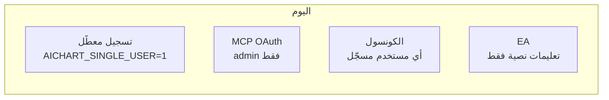
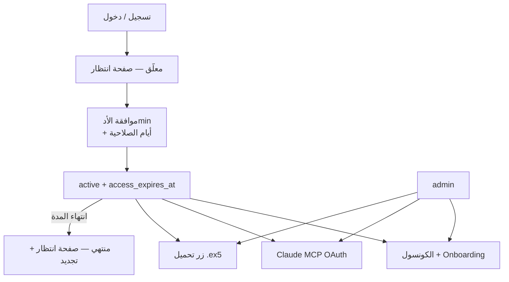

# موافقة الأدmin للمستخدمين + MCP + تحميل EA

## الوضع الحالي



- التسجيل معطّل افتراضياً ([`web/src/lib/agentAuth.ts`](web/src/lib/agentAuth.ts) — `AICHART_SINGLE_USER !== "0"`).
- MCP يتحقق من **admin فقط** في [`web/src/app/api/admin/mcp-auth/verify/route.ts`](web/src/app/api/admin/mcp-auth/verify/route.ts).
- `users.status` موجود (`pending`/`active`/`suspended`) لكن [`requireActiveUser()`](web/src/lib/api.ts) يُستخدم في مكان واحد فقط.
- [`AdminUsersTable`](web/src/components/admin/AdminUsersTable.tsx) يدعم `mode="full"` لكن يُعرض بـ `mode="limits"` فقط في [`/console/risk`](web/src/app/console/risk/page.tsx).
- [`ea/mt5/AiChartBridge.ex5`](ea/mt5/AiChartBridge.ex5) موجود محلياً — **لا endpoint ولا زر تحميل**.

## الهدف (حسب اختيارك)



- **لا حد لعدد المستخدمين** — لا فحص `COUNT(*)`.
- **الأدmin** دائماً بصلاحية كاملة (بدون انتهاء).
- **باقي الوظائف** (Risk Guard، `/api/agent/*`، cron، Telegram outbound) تبقى كما هي.

---

## 1) قاعدة البيانات — صلاحية زمنية

إضافة عمود على `users` في [`sqlite.ts`](web/src/lib/db/sqlite.ts) و [`pg.ts`](web/src/lib/db/pg.ts):

| عمود | النوع | المعنى |
|------|--------|--------|
| `access_expires_at` | TEXT / TIMESTAMPTZ nullable | نهاية صلاحية الموافقة؛ `NULL` للأدmin = بلا حد |

**Migration** عبر `PRAGMA table_info` / `ALTER TABLE` (نفس نمط [`migrate()`](web/src/lib/db/sqlite.ts)).

**دالة مركزية** في [`web/src/lib/platformAccess.ts`](web/src/lib/platformAccess.ts) (ملف جديد):

```ts
export function hasPlatformAccess(user: PublicUser & { access_expires_at?: string | null }): boolean
export type AccessBlockReason = "pending" | "suspended" | "expired"
export function getAccessBlockReason(user): AccessBlockReason | null
```

- `admin` → دائماً `true`
- `suspended` → محظور
- `pending` → محظور
- `active` + `access_expires_at > now()` → مسموح
- `active` + منتهي → `expired`

تحديث [`PublicUser`](web/src/lib/types.ts) و [`getPublicUser`](web/src/lib/store.ts) / [`getCurrentUser`](web/src/lib/auth.ts) لإرجاع `access_expires_at`.

---

## 2) تفعيل تسجيل الدخول للمستخدمين

- تغيير الافتراضي في [`web/.env.example`](web/.env.example): `AICHART_SINGLE_USER=0`.
- توثيق في [`docs/MCP_CLAUDE_SETUP.md`](docs/MCP_CLAUDE_SETUP.md) و [`agent/README.md`](agent/README.md).
- **على VPS:** ضبط `AICHART_SINGLE_USER=0` في `web/.env` عند النشر.
- صفحات [`/login`](web/src/app/login/page.tsx) و [`/register`](web/src/app/register/page.tsx) تعمل تلقائياً (`allowRegister={!singleUser}`).
- تسجيل Telegram ([`upsertTelegramUser`](web/src/lib/store.ts)) يبقى `status=pending` بدون `access_expires_at`.

---

## 3) قفل الكونسول حتى الموافقة

**صفحة جديدة** [`web/src/app/awaiting-approval/page.tsx`](web/src/app/awaiting-approval/page.tsx) + مكوّن client:
- حالات: «بانتظار موافقة الأدmin» / «انتهت صلاحيتك — تواصل للتجديد» / «حساب موقوف».
- زر تسجيل خروج فقط.

**تعديل [`web/src/app/console/layout.tsx`](web/src/app/console/layout.tsx):**

```ts
if (user.role !== "admin" && !hasPlatformAccess(user)) redirect("/awaiting-approval");
// ثم onboarding كما هو
```

نفس الفحص في [`/onboarding`](web/src/app/onboarding/page.tsx) — لا onboarding قبل الموافقة.

**[`web/src/app/api/me/route.ts`](web/src/app/api/me/route.ts):** إرجاع `platform_access: boolean` و `access_block_reason` للواجهة.

---

## 4) موافقة الأدmin — UI + API

**توسيع PATCH** [`web/src/app/api/admin/users/[id]/route.ts`](web/src/app/api/admin/users/[id]/route.ts):

```ts
access_days: z.number().int().min(1).max(3650).optional()
```

عند `status: "active"` + `access_days`:
- `access_expires_at = now + access_days` (افتراضي **30** إن لم يُمرَّر).
- عند **تجديد** مستخدم نشط: `max(now, current_expires) + access_days`.

عند `status: "pending"` أو `"suspended"`: `access_expires_at = NULL`.

**[`setUserStatus`](web/src/lib/store.ts)** → `setUserAccess(userId, { status, access_days? })`.

**تبويب مستخدمين** في [`PlatformSection.tsx`](web/src/components/bridge/sections/PlatformSection.tsx):
- تبويب `users` للأدmin فقط.
- [`AdminUsersTable`](web/src/components/admin/AdminUsersTable.tsx) بـ `mode="full"` + أعمدة:
  - **صلاحية حتى** (تاريخ)
  - **أيام** (input، افتراضي 30)
  - زر **موافقة/تجديد** يستدعي PATCH

إزالة/دمج عرض `mode="limits"` المكرر في [`/console/risk`](web/src/app/console/risk/page.tsx) أو الإبقاء على limits فقط هناك وusers في platform — لتجنب ازدواجية.

**Audit log:** `user_access_granted` / `user_access_renewed` عند الموافقة.

---

## 5) MCP — أي مستخدم مُوافَق (ليس admin فقط)

**[`web/src/app/api/admin/mcp-auth/verify/route.ts`](web/src/app/api/admin/mcp-auth/verify/route.ts)** (إعادة تسمية منطقية داخلياً، نفس المسار):

| الفحص | النتيجة |
|--------|---------|
| كلمة مرور خاطئة | `{ ok: false, reason: "invalid" }` |
| `pending` | `{ ok: false, reason: "pending" }` |
| `suspended` | `{ ok: false, reason: "suspended" }` |
| `expired` | `{ ok: false, reason: "expired" }` |
| مسموح | `{ ok: true, email, access_expires_at }` |

**[`mcp/src/auth/provider.ts`](mcp/src/auth/provider.ts):**
- `verifyAdmin` → `verifyPlatformUser` مع رسائل عربية حسب `reason`.
- عند إصدار JWT: TTL = `min(MCP_ACCESS_TOKEN_TTL_DAYS, أيام متبقية للصلاحية)`.

**[`mcp/src/auth/login.ts`](mcp/src/auth/login.ts):** تحديث النص من «حساب admin» إلى «حسابك في AiChart (بعد موافقة الأدmin)».

**تجديد/إبطال:** عند PATCH suspend/pending — اختياري v1: الاعتماد على انتهاء JWT القصير؛ v1.1: حذف refresh tokens من [`mcp/src/auth/refreshStore.ts`](mcp/src/auth/refreshStore.ts) بـ email (endpoint داخلي).

> **ملاحظة:** جسر `/api/agent/*` يبقى بـ `AICHART_SERVICE_TOKEN` — لا تغيير معماري per-user في هذه المرحلة (لا كسر للوظائف الحالية).

---

## 6) تحميل AiChartBridge.ex5

**Endpoint** [`web/src/app/api/ea/download/route.ts`](web/src/app/api/ea/download/route.ts):

- `requireUser()` + `requirePlatformAccess()` (helper جديد في [`api.ts`](web/src/lib/api.ts)).
- `platform=mt5` (افتراضي) — يخدم [`ea/mt5/AiChartBridge.ex5`](ea/mt5/AiChartBridge.ex5).
- `Content-Disposition: attachment; filename="AiChartBridge.ex5"`.
- مسار الملف: `path.join(process.cwd(), "../ea/mt5/AiChartBridge.ex5")` مع fallback env `EA_MT5_BINARY_PATH`.

**[`EaConnectCard.tsx`](web/src/components/settings/EaConnectCard.tsx):**
- prop `canDownloadEa: boolean`.
- زر «تحميل AiChartBridge.ex5» يظهر فقط عند `canDownloadEa`.
- رسالة للمعلّق: «يتاح التحميل بعد موافقة الأدmin».

**[`connect/page.tsx`](web/src/app/console/connect/page.tsx):** تمرير `hasPlatformAccess(user)`.

**الملف الثنائي:** التأكد من وجوده في repo أو في مسار النشر على VPS (`/opt/aichart/ea/mt5/`). إن كان `.gitignore` يستثنيه — إضافة استثناء أو نسخه في سكربت النشر [`infra/vps-mcp-full-deploy.sh`](infra/vps-mcp-full-deploy.sh).

---

## 7) ما لا يُغيَّر (حسب «بدون تعطيل أي وظائف»)

- الأدmin: كامل الصلاحيات دائماً.
- `/api/agent/*` + Risk Guard + cron OCO + Telegram outbound.
- وضع `AICHART_SINGLE_USER=1` يبقى مدعوماً للمشغّل الواحد.
- Chat/quota/settings للمستخدم المُوافَق — كما كانت بعد فتح الكونسول.

---

## 8) النشر والتحقق

1. Migration DB تلقائي عند `initDb()`.
2. VPS: `AICHART_SINGLE_USER=0` + rebuild web/mcp + `pm2 restart`.
3. اختبار يدوي:
   - تسجيل مستخدم → `/awaiting-approval`
   - موافقة 30 يوم → كونسول + MCP login + زر ex5
   - تجديد 7 أيام → تمديد التاريخ
   - انتهاء → إعادة توجيه awaiting + MCP يرفض
   - admin → بدون قيود

```powershell
py -m graphify update .
```
