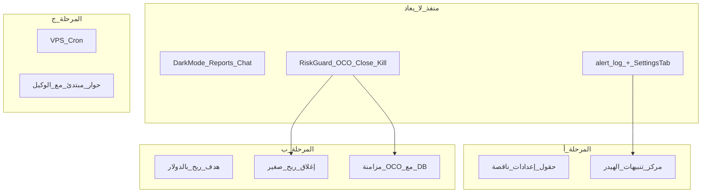
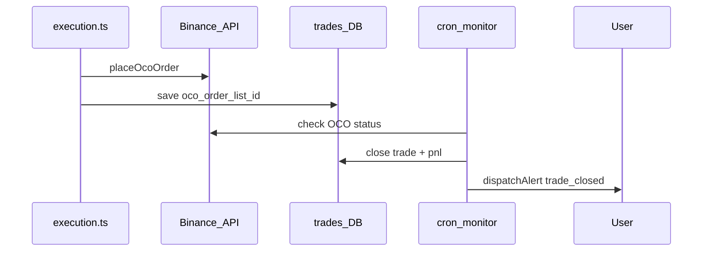

# خطة إكمال ما تبقى من اقتراحات AiChart

## ملاحظة مهمة عن الوضع الحالي

ملف [`Text Document جديد (2).txt`](Text%20Document%20جديد%20(2).txt) **فارغ (0 بايت)** — لا يمكن استخراج نص منه. المصدر المعتمد: فحص الكود + [`docs/SUGGESTIONS_FEASIBLE.md`](docs/SUGGESTIONS_FEASIBLE.md).

**ما ذكرتَ أنك نفّذته (صحيح):**
- **واجهة المستخدم:** الوضع الداكن، التقارير، تحليلات اللوحة، إدارة المحادثات (PRs #15–#18)
- **التنبيهات (جزئي):** جدول `alert_log`، تبويب «التنبيهات» في [`web/src/components/SettingsClient.tsx`](web/src/components/SettingsClient.tsx)، جرس في [`web/src/components/ui/shell/AppHeader.tsx`](web/src/components/ui/shell/AppHeader.tsx) يعرض **فقط** عدد الصفقات المعلّقة (`pendingIntents`)

**ما يظنّه المستند أنه «غير مُنفَّذ» لكنه موجود في الكود (لا نعيده):**

| # | البند | دليل سريع |
|---|--------|-----------|
| 1–2 | حد شهري + بيئة Binance | [`riskGuard.ts`](web/src/lib/riskGuard.ts), [`execution.ts`](web/src/lib/execution.ts) |
| 3–7, 9 | موافقة، محادثة، لوحة، مراقبة Top40، `/market` | مكوّنات UI + [`monitorRunner.ts`](web/src/lib/monitorRunner.ts) |
| 10–12 | إغلاق، OCO، Kill Switch | [`tradeClose.ts`](web/src/lib/tradeClose.ts), [`binance.ts`](web/src/lib/binance.ts) |

---

## المرحلة أ — إكمال UX والتنبيهات (أولوية فورية)

### أ.1 حقول الإعدادات الناقصة في «التداول والمخاطر»

**المشكلة:** [`TradingCard`](web/src/components/SettingsClient.tsx) يحفظ `max_open_trades`, `daily_profit_target_pct`, `daily_loss_limit_pct`, `monthly_loss_limit_pct` في طلب الحفظ (سطور ~743–746) لكن **لا يعرض حقول إدخال** — المستخدم لا يستطيع ضبط صفقات متعددة أو أهداف الربح/الخسارة إلا عبر Onboarding.

**التنفيذ:**
- إضافة 4 حقول رقمية في `TradingCard` مع تلميحات عربية قصيرة
- احترام `limits.max_open_trades_cap` من الأدمن (كما في [`/api/settings`](web/src/app/api/settings/route.ts))
- عرض تحذير إذا `max_open_trades` أعلى من سقف الأدمن

### أ.2 مركز تنبيهات في الهيدر (#14 الكامل)

**الوضع الحالي:** الجرس يظهر فقط عند `pendingIntents > 0` ويربط بـ `/trades` — لا يعرض `alert_log`.

**التنفيذ المقترح (بدون جدول `notifications` جديد — إعادة استخدام `alert_log`):**

1. **قاعدة البيانات:** عمود `read_at` (nullable) في `alert_log` — migrations في [`pg.ts`](web/src/lib/db/pg.ts) و [`sqlite.ts`](web/src/lib/db/sqlite.ts)
2. **API:**
   - توسيع [`/api/alerts`](web/src/app/api/alerts/route.ts): `PATCH` لتعليم كمقروء
   - توسيع [`/api/me`](web/src/app/api/me/route.ts): `unreadAlerts` بجانب `pendingIntents`
3. **UI:** مكوّن `NotificationPanel` (قائمة منسدلة من الجرس):
   - قسم «صفقات بانتظار الموافقة» (إن وُجدت)
   - قسم «آخر التنبيهات» من `alert_log` مع رابط «كل التنبيهات» → تبويب الإعدادات
   - polling كل ~60ث أو عند فتح اللوحة
4. **تحديث** [`AppHeader.tsx`](web/src/components/ui/shell/AppHeader.tsx): إظهار الجرس عند وجود `pendingIntents` **أو** `unreadAlerts`، شارة مجمّعة

---

## المرحلة ب — عمق التداول (هدف 1000$ وصفقات متعددة)

هذه المرحلة تلبي طلبك السابق عن **عدة صفقات + جني ربح صغير + هدف بالدولار** — غير موجودة اليوم إلا جزئياً (`max_open_trades` في DB بدون واجهة، هدف ربح **نسبة مئوية** فقط في [`riskGuard.ts`](web/src/lib/riskGuard.ts)).

### ب.1 هدف ربح بالدولار

- حقل جديد `daily_profit_target_usd` (REAL, default 0 = معطّل) في `trading_settings` + [`types.ts`](web/src/lib/types.ts) + validation في settings API
- دالة `todayRealizedPnlUsd()` في [`store.ts`](web/src/lib/store.ts) (مجموع `pnl` للصفقات المغلقة اليوم)
- فحص في `evaluateTrade`: إذا `todayRealizedPnlUsd >= daily_profit_target_usd` → منع صفقات جديدة (رسالة عربية واضحة)
- حقل في `TradingCard` بجانب هدف الربح %

### ب.2 إغلاق تلقائي على ربح صغير (اختياري قابل للتفعيل)

- إعداد `auto_take_profit_usd` (حد أدنى ربح غير محقق لكل صفقة مفتوحة، مثلاً 5$)
- دالة `scanOpenTradesForTakeProfit(userId)` في [`tradeClose.ts`](web/src/lib/tradeClose.ts):
  - لكل صفقة `open`: سعر حالي من Binance، حساب PnL غير محقق
  - إذا `unrealizedPnl >= auto_take_profit_usd` → `closeOneTrade` + `dispatchAlert`
- استدعاء من [`/api/cron/monitor`](web/src/app/api/cron/monitor/route.ts) **بعد** فحص الإشارات (أو cron فرعي كل 15 دقيقة لنفس المستخدمين النشطين)
- **قيود:** يعمل فقط لمن `can_execute` + Binance مربوط + الوضع `auto` (أو خيار صريح في الإعدادات)

### ب.3 مزامنة OCO مع حالة الصفقة

**المشكلة:** [`execution.ts`](web/src/lib/execution.ts) يرسل OCO لكن لا يخزّن `orderListId`؛ الصفقة تبقى `open` في DB حتى إغلاق يدوي.

**التنفيذ:**
- عمود `oco_order_list_id` في جدول `trades`
- حفظ القيمة بعد `placeOcoOrder` في `execution.ts`
- دالة `syncOcoFills(userId)`:
  - `GET /api/v3/orderList` أو فحص open orders لكل صفقة مفتوحة لها OCO
  - عند تنفيذ OCO → `updateTradeClosed` + تنبيه `trade_closed`
- ربطها بـ cron monitor (دفعة خفيفة، max N صفقات لكل دورة)

---

## المرحلة ج — تشغيل وOnboarding

### ج.1 Cron على VPS (#8)

- إضافة [`infra/aichart.cron`](infra/aichart.cron) جاهز (مستند من [`infra/crontab.example`](infra/crontab.example) + ما في [`web/scripts/vps-sync-build.mjs`](web/scripts/vps-sync-build.mjs))
- سكربت تحقق `web/scripts/vps-verify-cron.mjs`: SSH → فحص `/etc/cron.d/aichart` + اختبار `curl` لـ monitor مع `CRON_SECRET`
- تنفيذ يدوي على VPS عند الموافقة (تشغيلي — ليس كود تطبيق)

### ج.2 حوار المبتدئ مع الوكيل (#13 — إكمال)

**الوضع:** [`OnboardingClient.tsx`](web/src/components/OnboardingClient.tsx) خطوة «أهدافك» تعرض نصاً ثابتاً «اقتراح الوكيل» بدون استدعاء Claude.

**التنفيذ:**
- `POST /api/onboarding/suggest` — prompt مختصر يمرّر `maxCapital`, `dailyProfit`, `dailyLoss`, `tradingGoal` ويعيد JSON: `{ mode, style, per_trade_pct, max_open_trades, summary_ar }`
- استبدال الصندوق الثابت بزر «احصل على اقتراح الوكيل» + عرض النتيجة قبل الحفظ
- احترام حد الرصيد (`claude_usage`) — رسالة واضحة إن نفد الرصيد

---

## المرحلة د — توثيق ونشر

1. تحديث جدول الحالة في [`docs/SUGGESTIONS_FEASIBLE.md`](docs/SUGGESTIONS_FEASIBLE.md) ليعكس الواقع (11 منفذ، 2 جزئي → منفذ بعد المراحل أ–ج)
2. إضافة صف في القسم 8 يشير إلى أن `(2).txt` كان فارغاً والمصدر كان فحص الكود
3. بعد الدمج: `node web/scripts/vps-git-sync.mjs` للنشر على `aichart.lork.cloud`

---

## ترتيب التنفيذ والجهد التقريبي

| المرحلة | المخرجات | جهد |
|---------|----------|-----|
| **أ** | إعدادات كاملة + جرس تنبيهات حقيقي | 1–2 يوم |
| **ب** | هدف $ + إغلاق تلقائي + OCO sync | 2–3 أيام |
| **ج** | Cron VPS + اقتراح وكيل للمبتدئ | 1 يوم |
| **د** | توثيق + نشر | نصف يوم |

**خارج النطاق (مؤجل كما في المستند):** OpenClaw daemon، Futures، واتساب، هدف تراكمي 1000$ عبر عدة أشهر كمنطق استثماري منفصل (المرحلة ب تغطي هدف **يومي بالدولار** وإغلاق صفقات، وليس «محفظة تصل 1000$»).

---

## مخاطر يجب مراعاتها

- **إغلاق تلقائي:** قد يغلق صفقات قبل OCO على Binance — يتطلب فحصاً: لا إغلاق يدوي إذا OCO نشط لنفس الصفقة
- **Mainnet:** كل ما سبق يعتمد `creds.env` — التأكد من testnet أولاً
- **Rate limits:** مزامنة OCO + فحص أسعار لكل صفقة مفتوحة — تحديد batch size في cron
