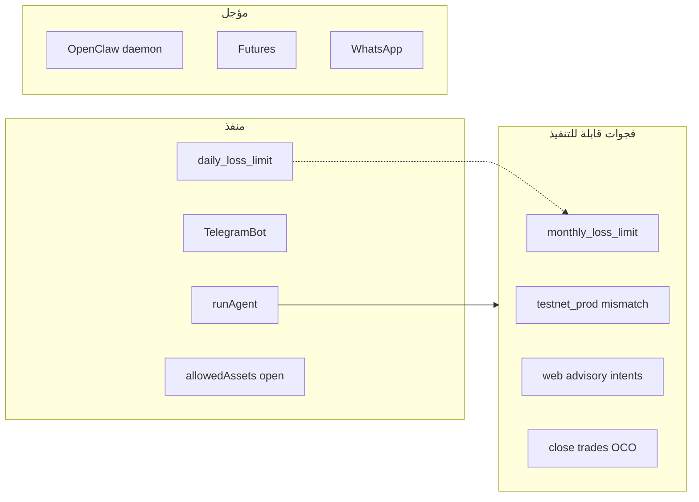

# خطة: ملف اقتراحات قابلة للتنفيذ

## الوضع الحالي

- الملف `[Text Document جديد.txt](Text Document جديد.txt)` **فارغ** — لا يمكن استخراج اقتراحات منه.
- سيتم إنشاء ملف جديد بديل يعتمد على:
  - `[docs/PLAN.md](docs/PLAN.md)` (الرؤية والمتطلبات)
  - `[docs/PROJECT_AR.md](docs/PROJECT_AR.md)` (ما هو مُنفَّذ فعلياً)
  - فحص الكود في `[web/src/](web/src/)`

## الملف المقترح

**المسار:** `[docs/SUGGESTIONS_FEASIBLE.md](docs/SUGGESTIONS_FEASIBLE.md)`

**الهيكل:**

1. **مقدمة** — مصدر الاقتراحات (تحليل فجوات + PLAN، وليس ملف AI الفارغ)
2. **جدول ملخص** — كل اقتراح مع: الأولوية، الجهد، الحالة الحالية، الملفات المتأثرة
3. **أقسام حسب الفئة:**
  - Risk Guard والتنفيذ
  - الوكيل والتحليل
  - تليجرام
  - الواجهة وUX
  - المراقبة 24/7 والـ Cron
  - البنية والنشر
4. **اقتراحات غير قابلة الآن** — مع سبب الرفض (مرجع PLAN «ما بعد الإطلاق»)

---

## الاقتراحات القابلة للتنفيذ (مستخرجة من الكود)

### أولوية عالية — إصلاحات واضحة (فجوة بين الإعدادات والسلوك)

| #   | الاقتراح                                             | الدليل في الكود                                                                                                                                                                                                                           | الملفات                                    |
| --- | ---------------------------------------------------- | ----------------------------------------------------------------------------------------------------------------------------------------------------------------------------------------------------------------------------------------- | ------------------------------------------ |
| 1   | **تفعيل حد الخسارة الشهري** `monthly_loss_limit_pct` | الحقل موجود في `[trading_settings](web/src/lib/db/pg.ts)` و`[types.ts](web/src/lib/types.ts)` لكن **غير مُطبَّق** في `[riskGuard.ts](web/src/lib/riskGuard.ts)` (يُطبَّق اليومي فقط)                                                      | `riskGuard.ts`, `store.ts` (حساب PnL شهري) |
| 2   | **توحيد بيئة Binance عند التنفيذ**                   | `[execution.ts](web/src/lib/execution.ts)` يستخدم `creds.env` للأمر لكن `getPrice` و`getSymbolFilters` مثبتان على `"prod"` (سطر 141–142) — خطر على Testnet                                                                                | `execution.ts`, `binance.ts`               |
| 3   | **خيار الموافقة في الإعدادات**                       | `approval` (manual/delegate) يُحفظ في `[SettingsClient.tsx](web/src/components/SettingsClient.tsx)` لكن **لا يوجد حقل UI** — متاح فقط في `[OnboardingClient.tsx](web/src/components/OnboardingClient.tsx)`                                | `SettingsClient.tsx`                       |
| 4   | **موافقة الصفقات من الويب في وضع advisory**          | تليجرام يمرّر `allowAdvisoryApproval: true` في `[telegramAgent.ts](web/src/lib/telegramAgent.ts)`؛ `[chat/route.ts](web/src/app/api/chat/route.ts)` يستدعي `processRecommendations` **بدون** هذا الخيار — لا intents في advisory من الويب | `tradeFlow.ts`, `chat/route.ts`            |

### أولوية متوسطة — تحسين تجربة (مذكورة في PLAN وناقصة جزئياً)

| #   | الاقتراح                                          | الدليل                                                                                                                                                                                   | الملفات                                                   |
| --- | ------------------------------------------------- | ---------------------------------------------------------------------------------------------------------------------------------------------------------------------------------------- | --------------------------------------------------------- |
| 5   | **أزرار موافقة/رفض داخل المحادثة**                | PLAN §7 يذكر أزرار في الدردشة؛ الموافقة موجودة في `[TradesClient.tsx](web/src/components/TradesClient.tsx)` فقط                                                                          | `ChatSquareClient.tsx`, مكوّن بطاقة intent                |
| 6   | **تنبيه على اللوحة بعدد النوايا المعلّقة**        | `userContext` يعرض العدد للوكيل؛ Dashboard لا يبرزها                                                                                                                                     | `DashboardClient.tsx`                                     |
| 7   | **تحديد نطاق المراقبة 24/7** عند الأزواج المفتوحة | `[monitorRunner.ts](web/src/lib/monitorRunner.ts)` يفحص **كل** أزواج USDT من `[resolveAllowedAssets](web/src/lib/allowedAssets.ts)` — مئات الرموز × cooldown 4س = ضغط API/وقت            | `monitorRunner.ts`, `binanceSymbols.ts` (top N حسب الحجم) |
| 8   | **جدولة Cron على VPS**                            | `[infra/crontab.example](infra/crontab.example)` موجود؛ يحتاج توثيق/تحقق أن monitor + daily-summary مفعّلان على `aichart.lork.cloud`                                                     | `docs/` + سكربت تحقق اختياري                              |
| 9   | **ربط `/market` بالتنقل الرئيسي**                 | الصفحة موجودة `[market/page.tsx](web/src/app/market/page.tsx)` لكن غير في `[AppShell](web/src/components/AppShell.tsx)` / `[MobileDrawer](web/src/components/ui/shell/MobileDrawer.tsx)` | `AppShell.tsx`, `MobileDrawer.tsx`                        |

### أولوية منخفضة — ميزات تداول أعمق (ممكنة لكن أوسع نطاقاً)

| #   | الاقتراح                              | الدليل                                                                                                 | الملفات                                     |
| --- | ------------------------------------- | ------------------------------------------------------------------------------------------------------ | ------------------------------------------- |
| 10  | **دورة حياة الصفقة (إغلاق + PnL)**    | `[recordTrade](web/src/lib/store.ts)` يفتح صفقة `status: open` فقط — لا مسار إغلاق تلقائي أو يدوي واضح | `store.ts`, `execution.ts`, API جديد        |
| 11  | **أوامر OCO لوقف الخسارة/الهدف**      | `stop_loss`/`take_profit` تُسجَّل في التوصية لكن التنفيذ **market فقط**                                | `binance.ts`, `execution.ts`                |
| 12  | **Kill Switch يغلق المراكز المفتوحة** | PLAN §5.d يذكر خيار إغلاق الكل؛ `[kill_switch](web/src/lib/riskGuard.ts)` يمنع فتح صفقات جديدة فقط     | `store.ts`, `execution.ts`, webhook تليجرام |
| 13  | **حوار المبتدئ الكامل**               | PLAN §4.3 — Onboarding يغطي جزءاً منه دون حوار الوكيل المقترح                                          | `OnboardingClient.tsx`, `persona.ts`        |
| 14  | **إشعارات داخل الموقع**               | PLAN §5.ه — تليجرام موجود؛ مركز إشعارات في الويب غير موجود                                             | جدول `notifications` + UI                   |

### غير قابلة للتنفيذ قريباً (توثيق فقط في الملف)

- **OpenClaw كـ daemon منفصل** — PLAN §3 يصفه؛ التنفيذ الفعلي: Claude مدمج في Next.js (`[agent.ts](web/src/lib/agent.ts)`) — ترحيل معماري كبير
- **Binance Futures** — PLAN «لاحقاً»
- **واتساب** — PLAN «لاحقاً»
- **باقات اشتراك آلية** — PLAN §2 صراحة «لا يوجد»
- **أخبار عاجلة تلقائية** — PLAN §8 بدون تنفيذ في الكود
- **Monorepo** (`apps/`, `agent/openclaw/`) — PLAN §10 هيكل مستهدف ≠ الهيكل الحالي (`web/` فقط)

---

## ما هو مُنفَّذ بالفعل (لا يُعاد اقتراحه)

يُوثَّق في الملف لتجنب التكرار:

- وكيل Claude + أدوات Binance + `record_recommendation`
- Risk Guard (يومي، kill switch، أصول مفتوحة من Binance)
- تليجرام: webhook، قائمة، تحليل نص/صورة، موافقة/رفض، زر رجوع
- PostgreSQL + نشر PM2
- معالج إشارات `/signals/new`، شارت `/market`
- ملخص يومي API (`[daily-summary/route.ts](web/src/app/api/cron/daily-summary/route.ts)`)

---

## مخطط الفجوات (مرجع في الملف)

---

## خطوات التنفيذ (توثيق فقط — حسب اختيارك)

1. إنشاء `[docs/SUGGESTIONS_FEASIBLE.md](docs/SUGGESTIONS_FEASIBLE.md)` بالعربية بالهيكل أعلاه
2. إضافة رابط في `[README.md](README.md)` بجانب رابط `PROJECT_AR.md`
3. (اختياري) الإشارة في الملف إلى أن `[Text Document جديد.txt](Text Document جديد.txt)` فارغ ويمكنك لصق اقتراحات AI لاحقاً في قسم «اقتراحات خارجية»

**لا تغييرات برمجية** في هذه المرحلة.

---

## للمستقبل (عند طلب التنفيذ)

إذا رغبت لاحقاً بالبرمجة، أنصح بالترتيب: **#2 → #1 → #3 → #4** (إصلاحات أمان/اتساق أولاً)، ثم **#5–#9** (UX)، ثم **#10–#14**.