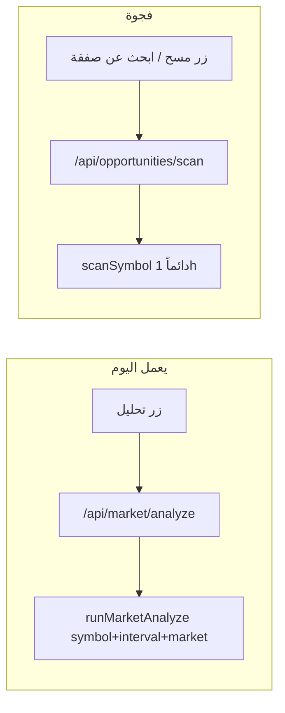

# ربط التحليل والتوصية بالعملة والوقت المختار

## الوضع الحالي (بعد تنفيذ الخطة السابقة)

| المسار | يتبع الزوج المختار؟ | يتبع الإطار الزمني؟ | يتبع السوق (crypto/forex)? |
|--------|---------------------|----------------------|----------------------------|
| زر **تحليل** في [`MarketClient.tsx`](web/src/components/MarketClient.tsx) | نعم (`symbol`) | نعم (`interval`) | نعم (`market`) |
| [`runMarketAnalyze`](web/src/lib/marketAnalyze.ts) | نعم | نعم + `profileForInterval` | نعم |
| زر **مسح** في الشارت | لا (كل watchlist) | لا (ثابت `1h`) | لا |
| **ابحث عن صفقة** في اللوحة [`OpportunityScanCard`](web/src/components/dashboard/OpportunityScanCard.tsx) | لا | لا (`DEFAULT_INTERVAL = "1h"` في [`opportunityScan.ts`](web/src/lib/opportunityScan.ts)) | لا |
| مسح دوري [`WaitingRoom`](web/src/components/dashboard/WaitingRoom.tsx) | لا | لا | لا |
| cron 24/7 [`monitorRunner.ts`](web/src/lib/monitorRunner.ts) | watchlist/top40 | `1h` فقط | crypto فقط |

**الخلاصة:** توقعك صحيح لزر **تحليل** فقط. مسارات **مسح / ابحث عن صفقة** لا تزال تعمل على إطار ثابت وبدون ربط بالزوج المعروض على الشارت.



---

## الهدف

عند اختيار **BTCUSDT + 15m** (أو **EURUSD + 4h** فوركس):

1. **تحليل** → توصية/صفقة على نفس الزوج والإطار (موجود).
2. **مسح** من الشارت → يفحص **نفس الزوج أولاً** على **نفس الإطار**، ثم (اختياري) بقية القائمة.
3. **ابحث عن صفقة** من اللوحة → يستخدم **إطار افتراضي من الإعدادات** أو آخر إطار استُخدم في الشارت.
4. التوصية المسجّلة تحمل `timeframe` مطابق للإطار، والشارت المُرسل يُرسم بنفس الإطار.

---

## التعديلات المقترحة

### 1. توسيع API المسح

في [`web/src/app/api/opportunities/scan/route.ts`](web/src/app/api/opportunities/scan/route.ts):

```ts
// body اختياري
symbol?: string      // إن وُجد: مسح/تحليل هذا الزوج أولاً
interval?: string    // افتراضي: settings.analysis_interval أو "1h"
market?: "crypto" | "forex"
focusOnly?: boolean  // true = زوج واحد فقط (لا مسح القائمة كاملة)
deep?: boolean
```

في [`web/src/lib/opportunityScan.ts`](web/src/lib/opportunityScan.ts):

- إزالة `DEFAULT_INTERVAL` الثابت؛ استخدام `opts.interval ?? settings.analysis_interval ?? "1h"`.
- إن `opts.symbol`: مسح هذا الزوج أولاً؛ إن `focusOnly` إيقاف المسح بعده.
- إن `market === "forex"`: استخدام `buildForexSnapshot` + مسح أزواج فوركس من watchlist (ليس `scanSymbol` crypto فقط).
- في `deep`: تمرير `interval` و`market` إلى `runAgent` و`processRecommendations`.

### 2. حقل إعداد: الإطار الافتراضي للمسح

- عمود `analysis_interval` في `trading_settings` (افتراضي `1h`) — أو إعادة استخدام آخر `interval` من جلسة الشارت عبر localStorage.
- في [`SettingsClient.tsx`](web/src/components/SettingsClient.tsx): قائمة منسدلة (15m / 1h / 4h / 1d) بجانب «مسح تلقائي».
- يُستخدم في اللوحة و`WaitingRoom` عند عدم تمرير `interval` من الشارت.

### 3. ربط واجهة الشارت

في [`MarketClient.tsx`](web/src/components/MarketClient.tsx):

- `handleQuickScan`: إرسال `{ symbol, interval, market, focusOnly: true }` — **مسح الزوج الحالي على الإطار الحالي**.
- خيار ثانٍ (أو نفس الزر مع checkbox): مسح كل القائمة على نفس الإطار `{ interval, market, deep: false }`.
- عرض تلميح في الشارت: «المسح على {symbol} · {interval}».

في [`ChartOverlayToolbar.tsx`](web/src/components/market/ChartOverlayToolbar.tsx): إظهار الإطار بجانب زر المسح (قراءة فقط).

### 4. ربط اللوحة والانتظار

- [`OpportunityScanCard`](web/src/components/dashboard/OpportunityScanCard.tsx): إرسال `interval` من الإعدادات؛ اختيار «مسح زوج محدد» بحقل رمز (أو آخر زوج من localStorage `aichart_last_symbol`).
- [`WaitingRoom.tsx`](web/src/components/dashboard/WaitingRoom.tsx): المسح الدوري يمرّر `interval` من `settings.analysis_interval`.

### 5. توحيد التوصية مع الإطار

- التحقق أن `record_recommendation` في [`agent.ts`](web/src/lib/agent.ts) يمرّر `timeframe` من الـ prompt (موجود في [`marketAnalyze`](web/src/lib/marketAnalyze.ts) L45).
- في المسح العميق: إضافة إلى prompt الوكيل: «سجّل التوصية على إطار {interval} للرمز {symbol}».
- [`notifyRecommendation`](web/src/lib/recommendationChart.ts): يستخدم `rec.timeframe` لصورة الشارت (موجود).

### 6. UX توضيحي

- في لوحة الانتظار ونتائج المسح: عرض **«الإطار: 15m · BTCUSDT»** على كل فرصة.
- في [`OpportunityScanCard`](web/src/components/dashboard/OpportunityScanCard.tsx): عرض `candidate.interval` بجانب كل نتيجة (الحقل موجود في `ScanResultItem` لكن غير معروض بشكل بارز).

---

## ما لا يُنفَّذ في هذه المرحلة (اختياري لاحقاً)

- مسح cron متعدد الأطر (15m + 1h + 4h) — مكلف؛ يكفي إطار واحد قابل للضبط.
- تحليل Claude متزامن لعدة أزواج على أطر مختلفة في طلب واحد.

---

## ترتيب التنفيذ

1. `analysis_interval` في DB + settings API/UI
2. توسيع `runOpportunityScan` + route بـ `symbol`, `interval`, `market`, `focusOnly`
3. ربط `MarketClient` مسح الشارت بالزوج والإطار الحالي
4. ربط اللوحة + WaitingRoom polling
5. عرض الإطار/الرمز في نتائج المسح
6. (اختياري) دعم فوركس في المسح عبر `buildForexSnapshot`

## التحقق اليدوي

- اختر ETHUSDT + 4h → **تحليل** → توصية بـ `timeframe: 4h` وشارت 4h.
- نفس الاختيار → **مسح** → فرصة تُحسب على 4h وليس 1h.
- اللوحة → **ابحث عن صفقة** مع إطار 15m في الإعدادات → النتائج كلها `interval: 15m`.
- فوركس EURUSD + 1h → تحليل ومسح focus يعملان (إن EA/MetaAPI متصل).
