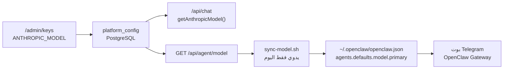

# مزامنة مودل الوكيل مع لوحة التحكم

## التشخيص




**السبب:** حفظ النموذج في `[web/src/app/api/admin/config/route.ts](web/src/app/api/admin/config/route.ts)` يكتب `ANTHROPIC_MODEL` في قاعدة البيانات فقط — **لا يستدعي** `[agent/scripts/sync-model.sh](agent/scripts/sync-model.sh)`.

الجسر موجود (`[web/src/app/api/agent/model/route.ts](web/src/app/api/agent/model/route.ts)`) لكنه يُستخدم يدوياً. سجلات Gateway على VPS أظهرت سابقاً:

`agent model: anthropic/claude-opus-4-8 (thinking=medium)`

بينما لوحة الأدمن قد تختار Sonnet أو غيره — لذلك Telegram يجيب بـ Opus ويُسرّب التفكير الداخلي بالإنجليزية (كما في لقطة الشاشة).

---

## الحل المقترح

### 1) مزامنة تلقائية عند حفظ النموذج

إنشاء وحدة `[web/src/lib/openclawModelSync.ts](web/src/lib/openclawModelSync.ts)`:

- تقرأ `getAnthropicModel()` → `anthropic/${model}`
- تعدّل `OPENCLAW_CONFIG` (افتراضي `/root/.openclaw/openclaw.json` عبر env)
- تضبط:
  - `agents.defaults.model.primary`
  - `agents.defaults.models[ref].params.cacheRetention = "long"`
  - `agents.defaults.thinkingDefault = "off"`
  - `agents.defaults.models[ref].params.thinking = "off"`
  - تحذف `agents.defaults.thinking` و`model.thinking` إن وُجدت (كما في `[infra/vps-openclaw-repair.sh](infra/vps-openclaw-repair.sh)`)
- تعيد تشغيل Gateway عبر `pm2 restart aichart-agent` عندما `OPENCLAW_AUTO_RESTART=1` (VPS)

تعديل `[web/src/app/api/admin/config/route.ts](web/src/app/api/admin/config/route.ts)`:

```typescript
if (patch.ANTHROPIC_MODEL !== undefined) {
  await syncOpenClawModelFromPlatform(); // لا يفشل الحفظ إن فشلت المزامنة — يُسجَّل تحذير
}
```

### 2) تحديث السكربت البديل (للنشر اليدوي / cron)

توسيع `[agent/scripts/sync-model.sh](agent/scripts/sync-model.sh)` بنفس منطق thinking=off حتى يبقى متسقاً مع الوحدة TypeScript.

إضافة سكربت VPS اختياري `[infra/vps-sync-model-cron.sh](infra/vps-sync-model-cron.sh)` (كل 5 دقائق) كشبكة أمان إن فشلت المزامنة عند الحفظ.

### 3) شفافية في لوحة الأدمن

- API جديد: `GET /api/admin/agent-model-status` — يقارن:
  - `platformModel` من `getAnthropicModel()`
  - `gatewayPrimary` من قراءة `openclaw.json`
  - `inSync: boolean`
- تعديل `[web/src/components/admin/AdminKeysPanel.tsx](web/src/components/admin/AdminKeysPanel.tsx)`: بعد الحفظ أو عند التحميل، عرض:
  - «الوكيل (Telegram): يستخدم X» أو تحذير «غير متزامن — اضغط حفظ مرة أخرى»

### 4) منع تسريب التفكير (طبقة إضافية)

سطر في `[agent/workspace/SOUL.md](agent/workspace/SOUL.md)`:

> لا تُخرج أبداً تفكيراً داخلياً أو إنجليزية meta — الرد للمستخدم عربي فقط.

(الإصلاح الأساسي: `thinking=off` في المزامنة.)

### 5) env

في `[web/.env.example](web/.env.example)`:

```env
OPENCLAW_CONFIG=/root/.openclaw/openclaw.json
OPENCLAW_AUTO_RESTART=1
```

### 6) إصلاح فوري على VPS (بعد الدمج)

```bash
cd /opt/aichart
bash infra/vps-openclaw-merge-config.sh   # baseline (مرة واحدة أو بعد doctor)
bash agent/scripts/sync-model.sh          # المودل من لوحة الأدمن
pm2 restart aichart-agent --update-env
```

التحقق: `pm2 logs aichart-agent --lines 5` يجب أن يظهر النموذج المختار من لوحة الأدمن مع `thinking=off`.

---

## هل نُضيف تعديل openclaw.json يدوياً؟ (الخطوات 4–5 التي ذكرتها)

**لا — لا أنصح بالتعديل اليدوي.** المحتوى الذي اقترحته **موجود أصلاً** في [`infra/vps-openclaw-merge-config.sh`](infra/vps-openclaw-merge-config.sh):

| ما تريد إضافته يدوياً | السكربت يفعله |
|----------------------|---------------|
| `contextPruning`, `heartbeat`, `tools.media.audio` | deepMerge دون مسح telegram/channels |
| `tools.exec` allowlist + ask on-miss | نفس القيم |
| `AICHART_API_URL` + `AICHART_SERVICE_TOKEN` في `~/.openclaw/.env` | upsert من `web/.env` |
| `exec-approvals.json` defaults + curl/wget allow-always | كتلة node في نهاية السكربت |

**لماذا لا يدوياً؟**

- سبق أن تلف `openclaw.json` بعد patch يدوي (مثلاً `thinking`) وأعاد تشغيل Gateway 140+ مرة.
- الدمج اليدوي يعرّض قناة Telegram و`controlUi` للحذف بالخطأ.
- السكربت **idempotent** — آمن للتكرار بعد `openclaw doctor`.

**تعارض مع الوضع الحالي على VPS:** سابقاً شُغّل [`infra/vps-openclaw-no-approval.sh`](infra/vps-openclaw-no-approval.sh) (`tools.exec.ask=off`, `security=full`) لأن موافقات exec انتهت مهلتها في Telegram. إعادة `ask: on-miss` من merge-config **قد تعيد** مشكلة «انتهت مهلة الموافقة». الخطة:

- **baseline** (heartbeat، transcribe، env): `vps-openclaw-merge-config.sh`
- **exec approvals**: يبقى `no-approval` ما لم تُفعَّل موافقات من Control UI أو Telegram client
- **model + thinking**: `sync-model.sh` / `openclawModelSync.ts` — لا يمسّ telegram ولا exec

لا حاجة لخطوة 5 منفصلة إن شغّلت merge-config؛ إن أردت فقط defaults بدون allowlist، يمكن من Control UI → Config → exec approvals.

---

## ما لن يُغيَّر

- مودل **جلسة** مؤقت في Control UI (`/openclaw/`) يبقى اختيارياً للأدمن — لكن **الافتراضي** لـ Telegram يأتي من لوحة AiChart.
- لا إعادة بناء نماذج Config في Next.js.

---

## تقدير

~1–1.5 ساعة (كود + نشر VPS + اختبار رسالة Telegram).