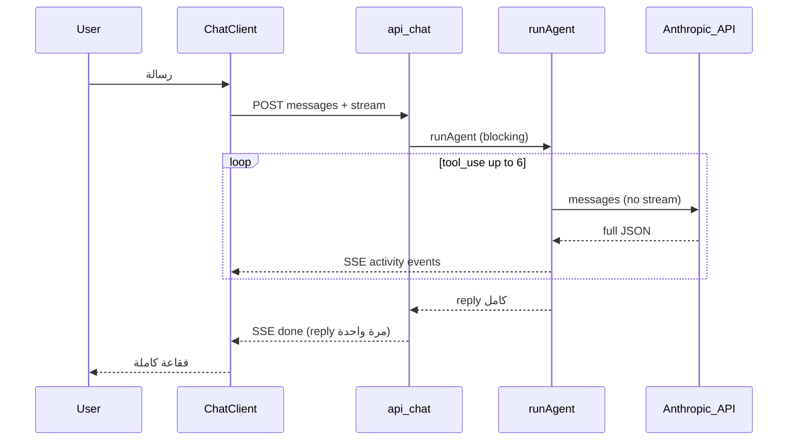
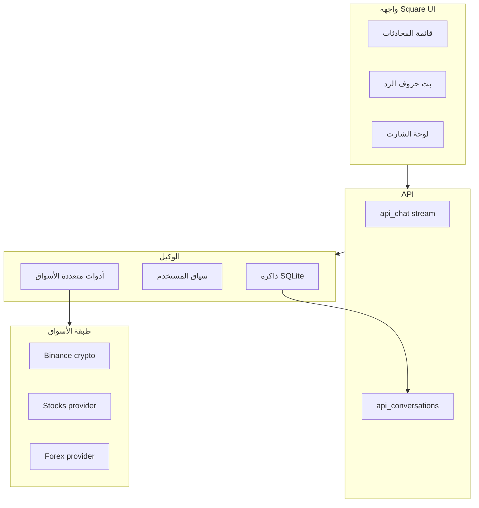
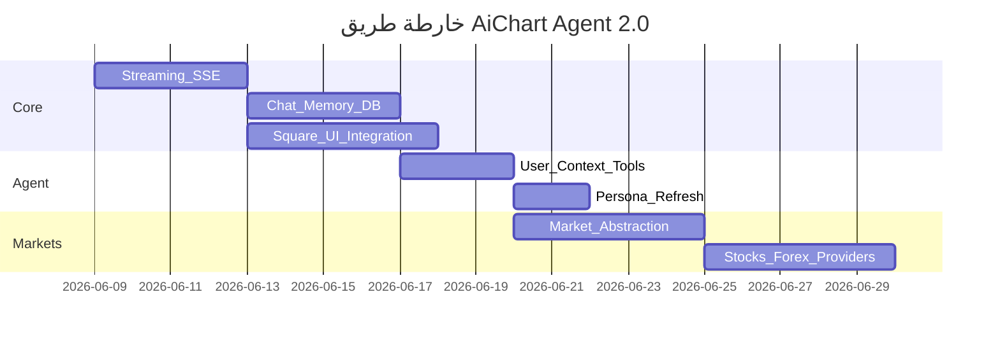

# خطة تطوير وكيل AiChart الذكي

## الوضع الحالي (ما يعمل وما ينقص)

**يعمل اليوم:**
- وكيل Claude مع حلقة أدوات (6 خطوات) في [`web/src/lib/agent.ts`](web/src/lib/agent.ts)
- بيانات Binance حية + Web3 signals + أرصدة الحساب
- SSE لنشاط الأدوات فقط (`activity` → `done`) في [`web/src/app/api/chat/route.ts`](web/src/app/api/chat/route.ts)
- المحادثة في ذاكرة React فقط — تُفقد عند التحديث

**ما يفسّر شكل الرد الحالي (كما في لقطاتك):**
- النص يصل **دفعة واحدة** بعد انتهاء `runAgent` — لا يوجد `stream: true` في [`web/src/lib/anthropic.ts`](web/src/lib/anthropic.ts)
- الـ persona في [`web/src/lib/persona.ts`](web/src/lib/persona.ts) طويلة ومُوجَّهة — فيظهر رد «قائمة قدرات» بدل محادثة طبيعية
- لا سياق تلقائي عن: اسم المستخدم، عدد الصفقات، ربط Binance، Telegram



---

## الرؤية المستهدفة



---

## المرحلة 1 — بث النص الحي (Streaming) — أولوية قصوى

**الهدف:** المستخدم يرى الحروف تُكتب مباشرة مثل ChatGPT.

### Backend
1. إضافة `callAnthropicStream()` في [`web/src/lib/anthropic.ts`](web/src/lib/anthropic.ts) مع `stream: true` ومعالجة أحداث `content_block_delta`.
2. تعديل [`web/src/lib/agent.ts`](web/src/lib/agent.ts):
   - أثناء حلقة الأدوات: استمر بـ non-stream + بث `activity` (كما الآن).
   - عند الرد النهائي (`stop_reason !== tool_use`): استخدم streaming وأرسل أحداث SSE جديدة:
     - `event: delta` → `{ text: "..." }`
     - `event: done` → `{ recommendations, intents, quota }` (بدون تكرار النص الكامل)
3. توسيع [`web/src/lib/sse.ts`](web/src/lib/sse.ts) و`consumeSse` لدعم `delta`.

### Frontend
- عند الإرسال: أضف فقاعة assistant فارغة فوراً، حدّث `content` مع كل `delta`.
- أثناء الأدوات: أظهر شريط النشاط فوق الفقاعة المتدفقة.

---

## المرحلة 2 — ذاكرة المحادثات (Persistence)

**الهدف:** ذاكرة حقيقية عبر الجلسات والأجهزة.

### قاعدة البيانات — [`web/src/lib/db.ts`](web/src/lib/db.ts)
```sql
conversations (id, user_id, title, created_at, updated_at, archived)
chat_messages (id, conversation_id, role, content, metadata_json, created_at)
```

### Store + API
- دوال في [`web/src/lib/store.ts`](web/src/lib/store.ts): `createConversation`, `listConversations`, `appendMessage`, `loadMessages`, `autoTitle` (من أول رسالة).
- مسارات جديدة:
  - `GET/POST /api/conversations`
  - `GET/DELETE /api/conversations/[id]`
  - `POST /api/conversations/[id]/messages` (اختياري — أو الحفظ داخل `/api/chat`)

### تعديل `/api/chat`
- يقبل `conversationId` اختياري.
- يحمّل آخر N رسالة من DB بدل الاعتماد على العميل فقط.
- يحفظ رسالة المستخدم + رد الوكيل بعد `done`.
- عند تجاوز ~30 رسالة: تلخيص تلقائي للقديم في `metadata` (جملة واحدة في system context) لتقليل التوكنز.

---

## المرحلة 3 — واجهة Square UI (استبدال `/chat`)

**المصدر:** [square-ui/templates/chat](https://github.com/ln-dev7/square-ui/tree/master/templates/chat)

**ملاحظة:** القالب UI فقط (mock data + zustand) — **لا يحتوي بث AI جاهز**؛ نربطه بـ API الحقيقي.

### ما يُنقل إلى المشروع
| من القالب | إلى AiChart |
|-----------|-------------|
| `components/chat/*` | `web/src/components/chat/square/*` |
| `components/ui/*` (avatar, button, …) | `web/src/components/ui/` (ما لا يتعارض) |
| `store/chat-store.ts` | `web/src/stores/chat-store.ts` — مربوط بـ `/api/conversations` |
| `hooks/*` | حسب الحاجة |

### تكامل مع AppShell
- [`web/src/app/chat/page.tsx`](web/src/app/chat/page.tsx): يبقى داخل `AppShell` كما اخترت.
- استبدال [`web/src/components/ChatClient.tsx`](web/src/components/ChatClient.tsx) بـ:
  - `ChatMain` (Square) + `ChatSidebar` (قائمة محادثات)
  - الإبقاء على [`ChartPreviewPanel`](web/src/components/ui/chart-preview-panel.tsx) كلوحة جانبية/قابلة للطي على الشاشات الكبيرة
- RTL عربي: عكس اتجاه sidebar والفقاعات مع الحفاظ على أسلوب Square.
- تبعيات جديدة: `@radix-ui/react-avatar`, `zustand`, `date-fns` (من `package.json` القالب).

### مكوّن الرسالة
- توسيع `chat-message.tsx` لدعم:
  - Markdown (مكتبة خفيفة مثل `react-markdown`)
  - حالة `streaming` (مؤشر وميض أثناء البث)
  - بطاقات توصية مضمّنة عند وجود `recommendations`

---

## المرحلة 4 — الوكيل يفهم الموقع والعميل

**الهدف:** عند سؤال «كم صفقة؟» أو «هل حسابي مربوط؟» — يجيب من بيانات حقيقية.

### سياق تلقائي في System Prompt
دالة جديدة `buildUserContext(userId)` في [`web/src/lib/persona.ts`](web/src/lib/persona.ts) تُحقن:
- البريد / اسم العرض (مشتق من email أو حقل `display_name` جديد لاحقاً)
- حالة Binance: مربوط؟ testnet/prod؟
- Telegram: مربوط؟
- إعدادات التداول (mode, style, allowed_assets)
- ملخص: عدد الصفقات، الصفقات المفتوحة، آخر 3 توصيات

### أدوات جديدة في [`web/src/lib/agent.ts`](web/src/lib/agent.ts)
| أداة | المصدر |
|------|--------|
| `get_user_profile` | `users` + `trading_settings` + `binance_accounts` |
| `get_trades_summary` | `listTrades`, `listIntents` من [`store.ts`](web/src/lib/store.ts) |
| `get_recommendations_history` | جدول `recommendations` |
| `update_trading_settings` (قراءة فقط أولاً) | لاحقاً: تغيير mode بموافقة صريحة |

### تحسين الشخصية
- تقصير الـ persona: أسلوب محادثة طبيعي، ردود قصيرة عند التحية، تفصيل عند طلب التحليل.
- إزالة «قائمة القدرات الثابتة» من الردود — تُذكر فقط عند السؤال المباشر.

---

## المرحلة 5 — أسواق متعددة (عملات + أسهم + فوركس) — كما طلبت

المشروع حالياً Binance-only. لدعم متعدد الأسواق من البداية:

### طبقة تجريد جديدة: `web/src/lib/markets/`
```
MarketProvider interface
├── BinanceProvider     (crypto spot — موجود)
├── StockProvider       (أسهم أمريكية/عالمية)
└── ForexProvider       (أزواج عملات fiat)
```

### مزوّدو البيانات المقترحون (مرحلة أولى عملية)
| السوق | المزوّد | ملاحظة |
|-------|---------|--------|
| Crypto | Binance API | موجود |
| Stocks | **Finnhub** (مجاني محدود) أو Alpha Vantage | يحتاج `FINNHUB_API_KEY` في `/admin/keys` |
| Forex | Finnhub FX أو Twelve Data | نفس المفتاح غالباً |

### أدوات موحّدة
- `resolve_symbol(query)` → يحدد النوع: `BTCUSDT` crypto، `AAPL` stock، `EURUSD` forex
- `get_market_snapshot(symbol, market)` — يستبدل/يوسّع الأداة الحالية
- `get_price(symbol, market)`
- تحديث `allowed_assets` لدعم أنواع متعددة أو فصل `allowed_markets`

### حدود واقعية
- الأسهم/الفوركس: **تحليل وتوصيات** في المرحلة الأولى؛ التنفيذ الفعلي يبقى عبر Binance crypto فقط حتى ربط وسيط أسهم لاحقاً.
- إضافة مفاتيح API الجديدة في [`platformConfig.ts`](web/src/lib/platformConfig.ts) ولوحة `/admin/keys`.

---

## المرحلة 6 — تجربة عالمية ومتميزة (Roadmap)

| محور | الإجراء |
|------|---------|
| **تنفيذ متعدد** | Futures Binance، ثم وسيط أسهم (Interactive Brokers / Alpaca) |
| **مراقبة 24/7** | ربط [`monitorRunner.ts`](web/src/lib/monitorRunner.ts) بنفس ذاكرة الوكيل |
| **تليجرام** | محادثة الوكيل عبر البوت (ليس أوامر فقط) |
| **OpenClaw** | كما في [`docs/PLAN.md`](docs/PLAN.md) — daemon منفصل للمراقبة الثقيلة |
| **i18n** | عربي + إنجليزي، واجهة LTR/RTL |
| **قاعدة بيانات** | ترحيل SQLite → PostgreSQL للإنتاج |
| **أمان** | Rate limits، تدقيق أدوات التنفيذ، فصل صلاحيات الأدمن |

---

## ترتيب التنفيذ المقترح



**الأسبوع 1:** المرحلة 1 + بداية 3 (واجهة Square مع بث حيّ)
**الأسبوع 2:** المرحلة 2 + 4 (ذاكرة + سياق المستخدم)
**الأسبوع 3–4:** المرحلة 5 (أسواق متعددة) + صقل UX

---

## الملفات الرئيسية المتأثرة

- [`web/src/lib/anthropic.ts`](web/src/lib/anthropic.ts) — streaming API
- [`web/src/lib/agent.ts`](web/src/lib/agent.ts) — بث الرد النهائي + أدوات جديدة
- [`web/src/app/api/chat/route.ts`](web/src/app/api/chat/route.ts) — أحداث `delta`
- [`web/src/lib/sse.ts`](web/src/lib/sse.ts) — parser موسّع
- [`web/src/components/ChatClient.tsx`](web/src/components/ChatClient.tsx) → استبدال بمكوّنات Square
- [`web/src/lib/db.ts`](web/src/lib/db.ts) — جداول المحادثات
- جديد: `web/src/lib/markets/*` — طبقة الأسواق
- [`web/src/lib/persona.ts`](web/src/lib/persona.ts) — سياق المستخدم + أسلوب محادثة

---

## معيار النجاح

1. التحية «مرحبا» → رد قصير طبيعي **مع بث حروف**، وليس قائمة قدرات طويلة.
2. تحديث الصفحة → المحادثة تبقى (من DB).
3. «كم صفقة نفّذت؟» / «هل Binance مربوط؟» → إجابة من بيانات حقيقية.
4. «حلّل AAPL» و«EURUSD» و«BTC» → بيانات من مزوّدي الأسواق المناسبين.
5. واجهة `/chat` تطابق أسلوب Square UI مع دعم RTL وشارت AiChart.
